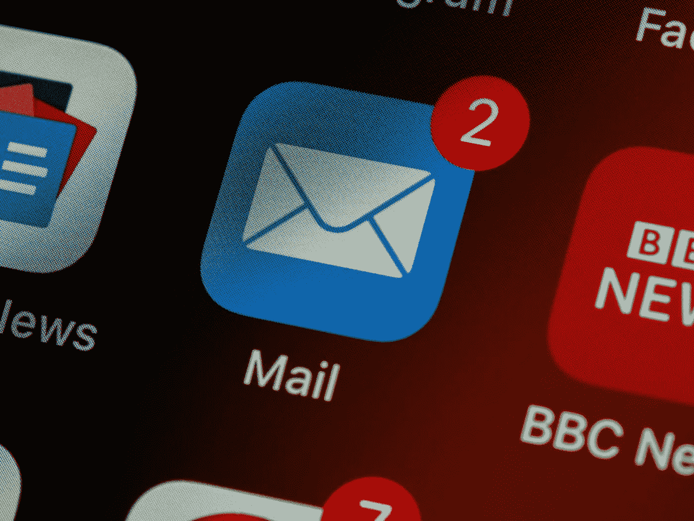
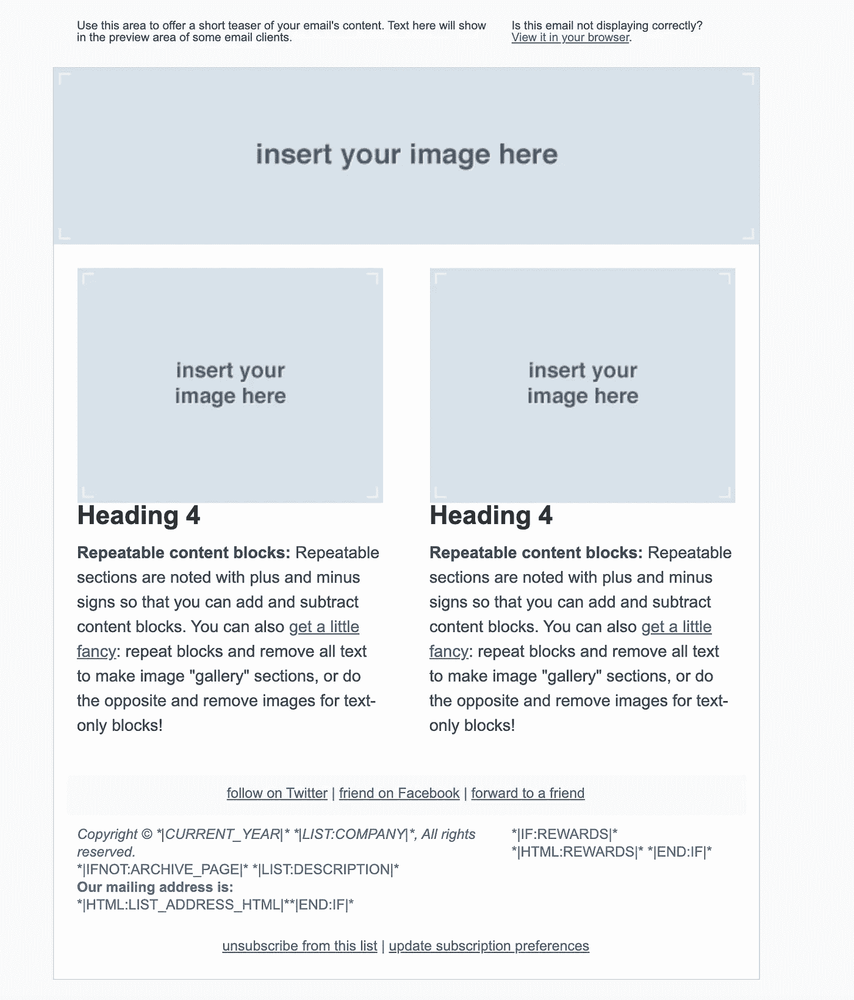

# 2020 年最佳免费 HTML 电子邮件模板

> 原文：<https://blog.devgenius.io/best-free-html-email-templates-in-2020-16079e292fd0?source=collection_archive---------4----------------------->

## 努力制作 HTML 版本的营销邮件？通过使用这些模板之一，让您的生活更轻松

布雷特·乔丹在 [Unsplash](https://unsplash.com/s/photos/email?utm_source=unsplash&utm_medium=referral&utm_content=creditCopyText) 上的照片

第一次做邮件模板，我以为会很简单。所以，我用基本的 HTML 制作它，直到它在 Gmail 上看起来很好。然后，我用 Outlook 试了一下。你预见到了，不是吗？从前景来看，情况很糟糕。作为一名优秀的千禧一代，我认为这种情况会持续下去。电子邮件已经存在这么久了，我告诉自己，这不应该太难。我错了。大错特错！电子邮件提供商就像浏览器和设备。

即使是一封简单的邮件，也很难让所有的邮件客户端都能很好地与之交互。**事实证明，不同的引擎被用来渲染 HTML 格式的电子邮件:**

> Apple Mail，Outlook for Mac，Android Mail 和 iOS Mail 使用 **WebKit** 。
> 
> Outlook 2000、2002 和 2003 使用 **Internet Explorer** 。
> 
> Outlook 2007，2010，2013 用的是**微软 Word** (对，Word！).
> 
> Web 客户端使用各自浏览器的引擎(例如，Safari 使用 WebKit，Chrome 使用 Blink)。
> 
> ([李门罗](https://www.smashingmagazine.com/2017/01/introduction-building-sending-html-email-for-web-developers/))

在某些时候，我确实放弃了。我需要一个简单的电子邮件和一个行动呼吁按钮，让我自己是一个矫枉过正。于是，我就去网上找模板。他们有很多，我不知道该相信哪一个！我浏览了又浏览，是时候改变策略了。所以，我上 Github 找模板。毕竟，这是我一直在寻找的代码。

大多数电子邮件服务提供商都提供免费的电子邮件模板。那些模板都很好，而且是最新的。

这是 MailChimp 模板邮件的一个例子。

他们能很好地处理所有的邮件，还提供了一些响应模板。您可能设计的大多数电子邮件都在这些存储库中，或者稍作修改:

*   https://github.com/mailchimp/Email-Blueprints
*   发送网格:[https://github.com/sendgrid/email-templates](https://github.com/sendgrid/email-templates)
*   https://github.com/mailgun/transactional-email-templates
*   邮戳:【https://github.com/wildbit/postmark-templates 
*   MailJet:[https://github . com/MailJet/MailJet-API v3-templating-samples/tree/master/samples](https://github.com/mailjet/mailjet-apiv3-templating-samples/tree/master/samples)
*   https://github.com/sendwithus/templates

还有几个[李门罗](https://medium.com/@leemunroe)做的不错的模板:[https://github.com/leemunroe/responsive-html-email-template](https://github.com/leemunroe/responsive-html-email-template)。

如果你决定走另一条路，不使用模板。构建自己的模板可能相当具有挑战性(但也是有益的)。如果你能胜任，坚持住！这两个资源应该可以帮到你:

 [## 为 Web 开发人员创建和发送 HTML 电子邮件的介绍——Smashing Magazine

### 电子邮件的设计和开发是一个野兽。电子邮件客户端供应商没有像网络浏览器供应商那样进步…

www.smashingmagazine.com](https://www.smashingmagazine.com/2017/01/introduction-building-sending-html-email-for-web-developers/)  [## 掌握 HTML 电子邮件— Envato Tuts+网页设计教程

### HTML 电子邮件的主题可以让最有经验的网页设计师的手掌变得湿漉漉的；这是黑客的雷区…

webdesign.tutsplus.com](https://webdesign.tutsplus.com/series/mastering-html-email--webdesign-17696)