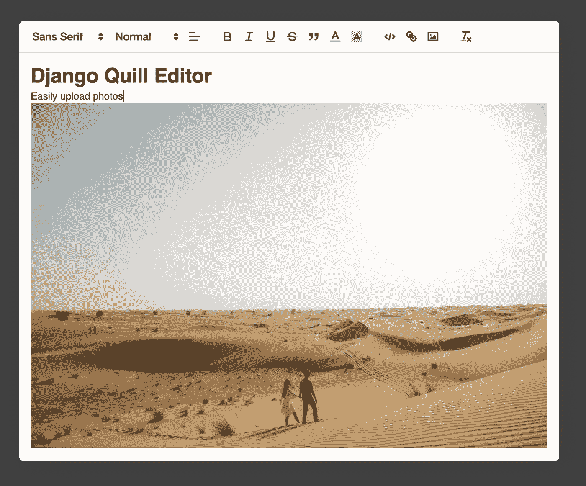
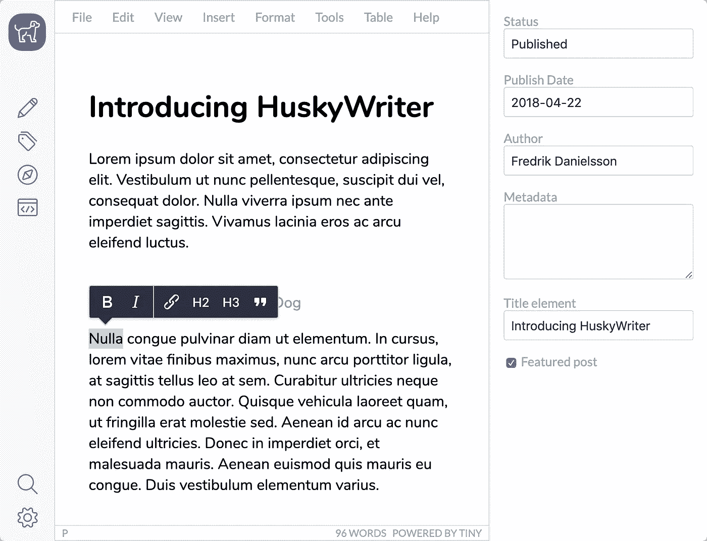
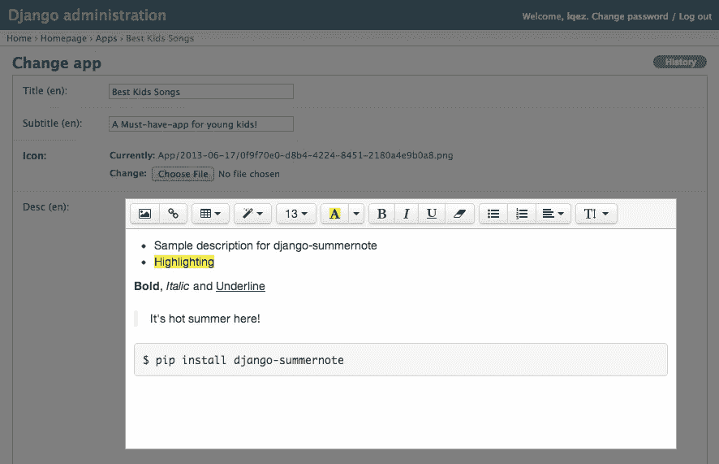
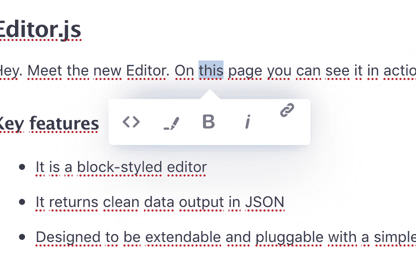
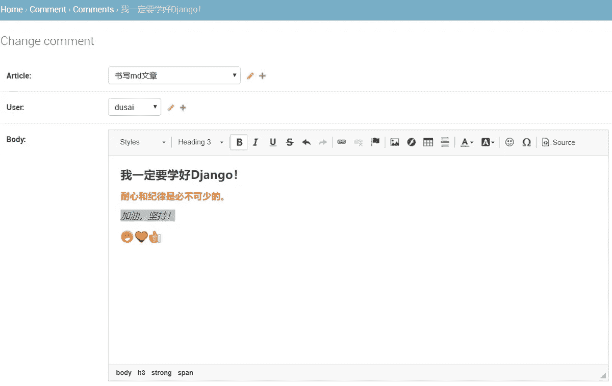
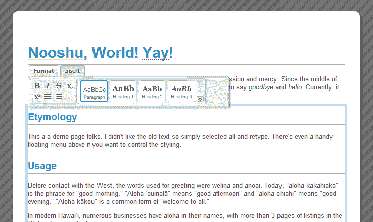

# 最佳免费所见即所得编辑器 Python Django 管理面板集成

> 原文：<https://blog.devgenius.io/best-free-wysiwyg-editor-python-django-admin-panel-integration-d9cb30da1dba?source=collection_archive---------1----------------------->

## 在这里，你会看到一个免费的现成可用的所见即所得编辑器列表，其中有很好的开源 Django 管理集成模块。

1.  羽毛笔 (BSD 3)
2.  TinyMCE (LGPL/GPL)
3.  夏季笔记(麻省理工学院)
4.  [编辑。JS](https://editorjs.io/) (阿帕奇)
5.  [CKeditor 5](https://ckeditor.com/ckeditor-5/) (LGPL/GPL)
6.  阿罗哈编辑器 (GPL)

# 1.quill——您强大的富文本编辑器。



## API 驱动的富文本编辑器

*   *专为开发者打造:*
    通过简单的 API 对编辑器的内容、变更和事件进行粒度访问。将 JSON 作为输入和输出始终如一地工作。
*   *跨平台:*
    支持所有现代浏览器。跨平台体验相同的一致行为和生成的 HTML。

| [Github](https://github.com/quilljs/quill) | [文档](https://quilljs.com/docs/quickstart/) | [互动游乐场](https://quilljs.com/playground/) | [Django 整合](https://pypi.org/project/django-quill-editor/) |

`**pip install django-quill-editor**`那么

```
# *settings.py*
**INSTALLED_APPS = (
    'django_quill',
)**# ***admin.py***
from django.contrib import admin
from .models import QuillPost@admin.register(QuillPost)
class QuillPostAdmin(admin.ModelAdmin):
    pass
```

# 2.tiny MCE——最先进的所见即所得 HTML 编辑器，旨在简化网站内容创建



## 按比例制造。
开源开发。
旨在创新。

*   *专为开发人员设计* :
    TinyMCE 5 专为开发人员打造，比以往任何时候都更容易、更简单、更快速地获得适合您的使用案例的编辑体验。
*   *支持内容创作者:*
    借助我们的生产力解决方案，在更短的时间内完成更多工作。

| [Github](https://github.com/tinymce/) | [文档](https://www.tiny.cloud/docs/) | [互动游乐场](https://www.tiny.cloud/) | [Django 集成](https://github.com/jazzband/django-tinymce) | [Django 3.0 安装指南](https://www.tiny.cloud/blog/django-tinymce/)

`**pip install django-tinymce**`那么

```
# *settings.py*
**INSTALLED_APPS = (** '**tinymce**'**,** **)**# ***urls.py***from django.urls import include
urlpatterns = [
    path('tinymce/', include('tinymce.urls')),
]# *USAGE* ***models.py***
from django.db import models
from tinymce.models import HTMLFieldclass MyModel(models.Model):
    content = HTMLField()
```

# 3.超级简单的所见即所得编辑器



## Summernote 是一个 JavaScript 库，可以帮助你在线创建所见即所得编辑器。

*   *安装简单:*
    只需下载并附上你的 js，css 与 bootstrap。
*   *集成:*
    与任意后端集成。
*   *定制:*
    通过初始化各种选项和模块进行定制。

| [Github](https://github.com/summernote/summernote) | [文档](https://summernote.org/getting-started/) | [互动游乐场](https://summernote.org/getting-started/) | [Django 集成](https://github.com/summernote/django-summernote) | [Django 3.0 安装指南](https://djangocentral.com/integrating-summernote-in-django/) | [视频安装指南](https://www.youtube.com/watch?v=MgjalTqQYkM)

`**pip install django-summernote**`那么

```
# *settings.py*
**INSTALLED_APPS = (** **'django_summernote',** **)** MEDIA_URL = '/media/'
MEDIA_ROOT = os.path.join(BASE_DIR, 'media/')
X_FRAME_OPTIONS = 'SAMEORIGIN'# ***urls.py***from django.urls import include
urlpatterns = [
    path('summernote/', include('django_summernote.urls')),
]# ***settings.py*** if DEBUG=True
if settings.DEBUG:
    urlpatterns += static(settings.MEDIA_URL, document_root=settings.MEDIA_ROOT)# *USAGE* ***admin.py***
from django_summernote.admin import SummernoteModelAdmin
from .models import Post

class PostAdmin(SummernoteModelAdmin):
    summernote_fields = ('content',)

admin.site.register(Post, PostAdmin)
```

# 4.EditorJS —下一代块样式编辑器



## 免费。用于娱乐。

*   *它是一个块样式的编辑器:*
    Editor.js 工作区由独立的块组成。它们中的每一个都是由 Plugin 提供的独立的 contenteditable 元素，并由编辑器的核心统一起来。
*   *清理 JSON 中的数据输出:*
    在后端清理、验证和处理是很有用的。

| [Github](https://github.com/codex-team/editor.js) | [文档](https://editorjs.io/base-concepts) | [互动游乐场](https://editorjs.io/) | [插件](https://github.com/editor-js) | [Django 集成](https://github.com/VLZH/django-editorjs) | [Django 3.0 安装指南](https://medium.com/analytics-vidhya/integrating-editorjs-with-django-7a30127d0771) | [视频安装指南](https://www.youtube.com/watch?v=8sKj0o3QIjM)

`**pip install django-editorjs**`那么

```
# *settings.py*
**INSTALLED_APPS = (
    'django-editorjs',
)**# *USAGE* ***models.py***
from django.db import models
from django_editorjs import EditorJsFieldclass Post(models.Model):
    title = models.CharField(max_length=255)
    body = EditorJsField() def __str__(self):
        return self.title
```

# 5.cke editor 5—智能所见即所得编辑器组件，具有协作编辑功能



## 明天的富文本编辑器，今天可用。

*   *一个所见即所得框架，多种用途:*
    cke editor 5 提供了每一种可以想象到的所见即所得编辑解决方案。
*   *现代最先进:*
    MVC 架构，自定义数据模型，虚拟 DOM。它是在 ES6 中从头开始写的。

| [Github](https://github.com/ckeditor/ckeditor5) | [文档](https://django-ckeditor.readthedocs.io/en/latest/) | [互动游乐场](https://ckeditor.com/ckeditor-5/demo/) | [Django 集成](https://github.com/django-ckeditor/django-ckeditor) | [Django 3.0 安装指南](https://overiq.com/django-1-10/integrating-ckeditor-in-django/) | [视频安装指南](https://www.youtube.com/watch?v=4DIcO1XZefg)

`**pip install django-ckeditor**`那么

```
# *settings.py*
**INSTALLED_APPS = (** **'ckeditor',** **)**# run
./manage.py collectstatic# rewrite the ***admin/base_site.html*** template if needed


<script>window.CKEDITOR_BASEPATH = '/static/ckeditor/ckeditor/';</script>
{{ block.super }}
# USAGE ***admin.py***
from django import forms
from django.contrib import admin
from ckeditor.widgets import CKEditorWidgetfrom post.models import Postclass PostAdminForm(forms.ModelForm):
    content = forms.CharField(widget=CKEditorWidget())
    class Meta:
        model = Postclass PostAdmin(admin.ModelAdmin):
    form = PostAdminFormadmin.site.register(Post, PostAdmin)
```

# 6.Aloha 编辑器——一种新的内容设计



## Aloha Editor 是一个 JavaScript 内容编辑库

*   "*所见即所得*":
    html 5 编辑器使得直接在门户上编辑网站成为可能。
*   *快速、简单的编辑:*
    视频、照片、图形、动画和文本是 Aloha Editor 的日常业务。

| [Github](https://github.com/alohaeditor/Aloha-Editor) | [文档](https://www.alohaeditor.org/guides/) | [插件](https://www.alohaeditor.org/guides/plugins.html) | [Django 官方集成](https://github.com/ntucker/django-aloha-edit) |

`**pip install django-aloha-edit**`那么

```
# *USAGE for HTMLField:*
from aloha.fields **import HTMLField****class MyModel(models.Model):
    content = HTMLField()**# *USAGE for widget:* from aloha.widgets **import AlohaWidget****class MyForm(forms.Form):
    content = forms.CharField(widget=AlohaWidget)** # Include the form media in your template somewhere in the head:**<head> {{ form.media }} </head>**
```