# 2021 年最佳 Web 开发前端框架

> 原文：<https://blog.devgenius.io/best-frontend-frameworks-of-2021-for-web-development-7a183652d81b?source=collection_archive---------0----------------------->

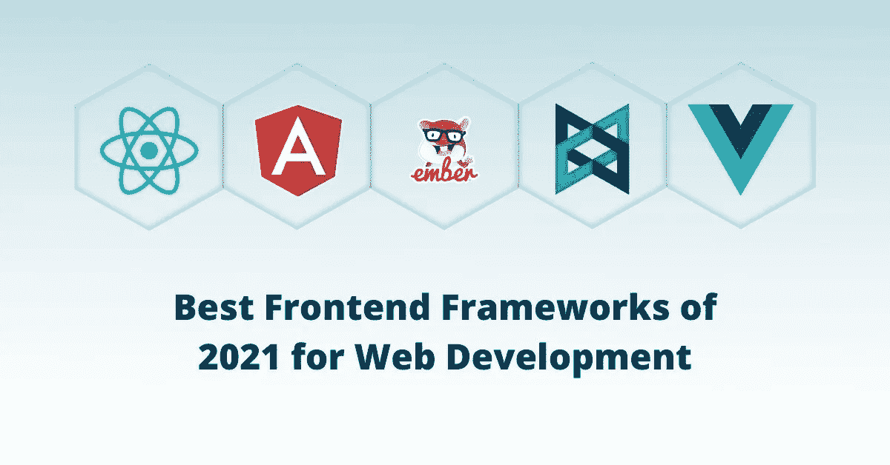

# 介绍

我们都生活在一个高度数字化的世界里。无论你的企业处于哪个领域，拥有一个活跃的在线形象已经成为一种常态，为你的企业开发一个网站是重中之重。你将为你的企业做出的最重要的决定之一就是为你的网站选择正确的框架。

在深入之前，我们先来了解一下 web 框架的含义？

# 什么是 Web 框架？

理解 web 框架需要什么的一个最简单的方法是把它想象成可以帮助你构建一个功能丰富的网站的几块积木。web 框架借助其内置的编程模块和工具来帮助软件产品的开发。

# Web 框架的类型

任何 web 应用程序都有两个主要功能。它们要么在客户端(前端框架)，要么在终端服务器端(后端框架)。

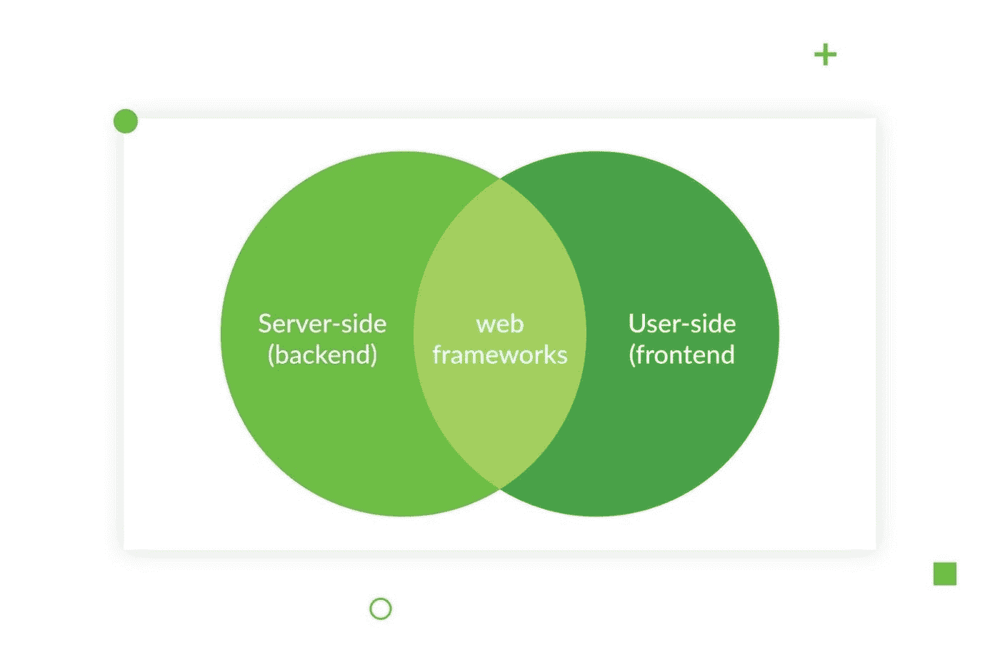

让我们更深入地理解这两种类型的框架。

# 前端框架

前端框架负责用户界面，它代表用户直接接触的网站或应用程序的可视部分。前端框架以预写代码和模块的形式提供构建模块，开发者可以在这些模块上创建网站。他们从事前端编程语言，如 JavaScript、HTML 和 CSS。

# 后端框架

后端框架是开发人员与之互动的网站或应用程序的不可见或看不见的领域。后端框架主要负责网站架构、用户授权、数据安全和 URL 路由程序的开发。他们使用 Python、Java、Ruby 等后端编程语言。Net 和 PHP。

# 选择正确的前端框架的重要性

为了我们的主题，让我们集中于找出最好的前端框架，以及为什么在选择一个框架时做出正确的选择具有如此大的价值。

# 对于用户来说

前端框架是网站固有的一部分。他们展示了从访问者登陆网站开始的整个用户旅程。客户，即我们的最终用户，永远是国王。在选择前端框架时，我们不能强调牢记用户体验的重要性。向用户提供无故障的无缝体验应该是首要任务，不管在幕后开发了什么复杂的代码和功能。

# 为了生意

当今客户的需求在不断增长。前端框架赋予网站如此多的基本方面以生命，例如网格布局、决定 UI/UX 组件、标准网站构建模块，包括特色图像、按钮、导航栏和侧边栏。您今天选择的前端框架将会伴随您很长一段时间，因此选择一个具有复杂技术的动态框架成为关键。

# 2021 年最佳前端框架

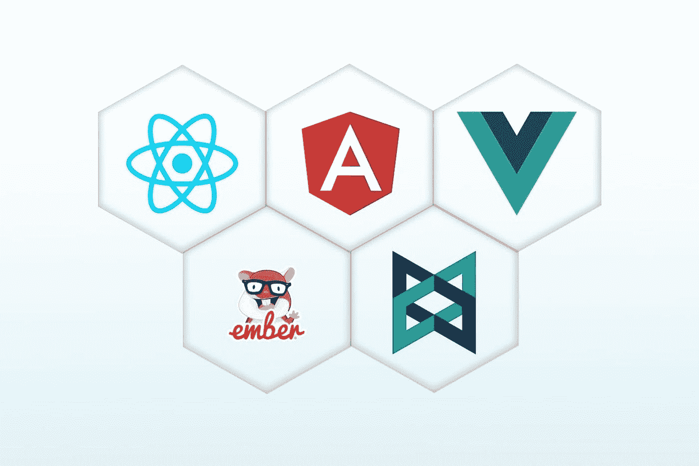

web 开发领域正在发生革命性的变化！所有这一切都要归功于无数的最佳前端框架，它们不仅为客户打造了卓越的用户体验，还通过有效的 [web 开发解决方案成功地迎合了企业的各种需求。](https://www.thirdrocktechkno.com/services/web-development/)

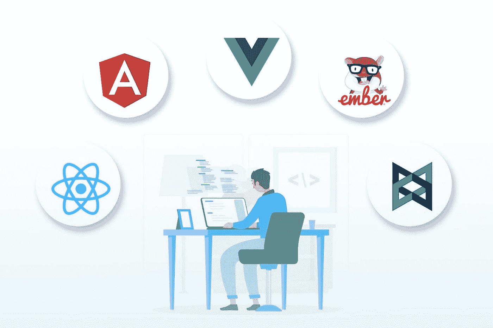

为您的开发需求选择正确的框架通常是一项艰巨的任务。别担心！我们会掩护你的。这个博客将启发你 2021 年最好的前端框架，并支持你做出正确的选择。

我们开始吧，好吗？

## [1。反应](https://reactjs.org/)——*脸书的创意*

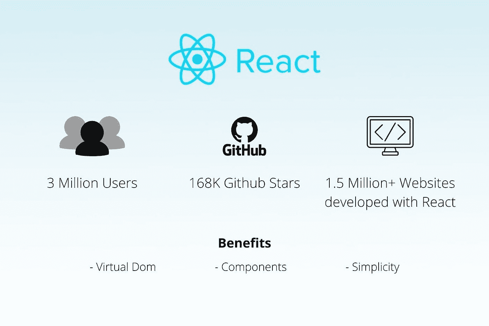

## 关于 React 你需要知道的一切

最初由脸书创建，现在是一个开源网络，React 是最受欢迎的前端框架 javascript 库之一，具有 JSX 语法，有助于开发超级响应和高度交互的网站。

## React 的可爱之处

*   虚拟 DOM 的使用增强了性能，为用户和开发人员提供了积极的体验，并确保了应用程序的快速呈现。
*   React 最好的特性之一就是它的组件。为了便于开发，复杂的组件可以分解成较小的组件。
*   React 使用简单，易于学习，并使动态 web 应用程序的开发一帆风顺。
*   React 通过重用代码的内置组件来帮助节省时间，这使得维护和开发应用程序更加容易。
*   React 开发工具非常方便，使开发人员的工作更加顺畅和简化。
*   React 提供了稳定的代码和优秀的 UX。其卓越的测试能力加快了开发周期。

## 缺点

*   React 在其框架中经历了持续的技术更新，这使得开发人员很难进行适当的文档编制。
*   许多初学者和新手开发人员发现很难理解 JSX 的复杂结构，从而减慢了整个学习曲线

## 使用反应时间

*   开发复杂页面
*   用户界面的开发
*   开发单页应用程序(SPAs)

## 避免在下列情况下使用 React

*   开发人员对 JavaScript 的知识有限
*   开发人员在使用 JSX 语法时会遇到麻烦

## 流行的使用案例

React 制作的热门网站有脸书、Airbnb、网飞、彭博、UberEats、Discord、Pinterest、Asana、Instagram、Reddit、Myntra、BBC。

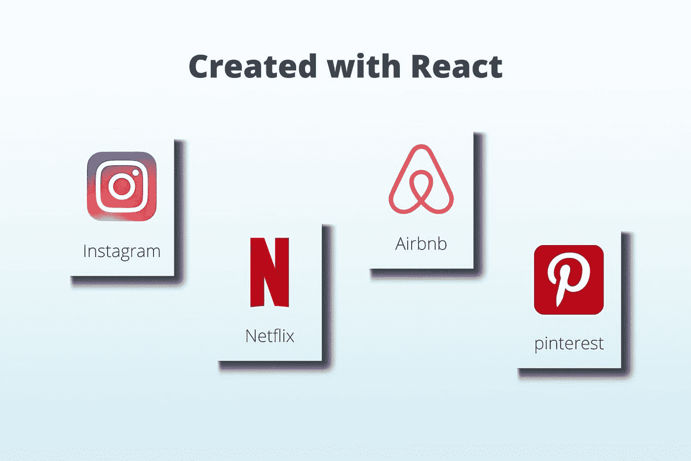

## [2。有角度的](https://angular.io/) —由谷歌开发

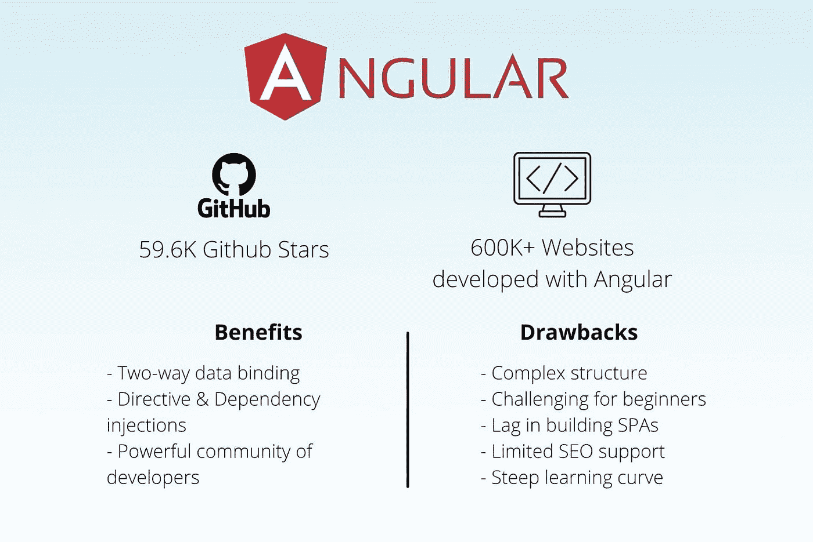

## 关于 Angular 你需要知道的一切

谷歌在 2010 年首次发布 AngularJS，为了跟上先进技术的需求，它继续接受了几次更新。2016 年部署的当前版本 Angular 2+恰好是唯一基于 TypeScript 的框架之一。Angular 是一个开源平台，以其独特的双向数据绑定特性脱颖而出，该特性可以在模型和视图之间即时同步，反之亦然。

**关于棱角分明的事情**

*   Angular 产生干净的代码，使处理错误和 bug 变得容易得多。它的双向数据绑定在很大程度上减少了开发时间，确保了每次的高性能。
*   Angular 的指令特性有助于用 HTML 创建丰富的动态内容，而依赖注入器使组件更容易测试、管理，并允许开发人员根据需要重用它们。
*   Angular 提供了快速的加载时间，并包括许多第三方集成，帮助开发人员增强网站的整体功能。
*   因为这个框架是由 Google 支持的，所以你可以很容易地依赖它。Angular 允许精心制作文档，并且总是与来自 Google 的更新保持同步。它拥有一个庞大的网络开发人员社区，在面临问题时，他们会互相寻求帮助。

## 缺点

*   Angular 是一种复杂的语言，因为它有许多独特的特性和现成的功能，需要付出大量的努力才能完全学会。
*   对于新开发人员和完全的初学者来说，理解它变得相当困难，使得学习曲线更加陡峭。
*   由于 Angular 复杂的代码结构和庞大的规模，单页面应用程序(spa)往往会滞后和性能不佳。
*   将遗留系统从 AngularJS 转移到 Angular 可能是一件非常耗时的事情。

## 使用角度当

*   构建基于大型企业的应用程序
*   创建动态 web 应用程序

## 在以下情况下避免使用角度

*   构建小规模的简单应用程序
*   构建范围有限的应用程序
*   与较小的团队合作
*   当搜索引擎优化是一个强有力的优先事项

## 流行的使用案例

用 Angular 制作的热门网站有福布斯、卫报、宝马、乐高、Upwork、PayPal、自由职业者等。

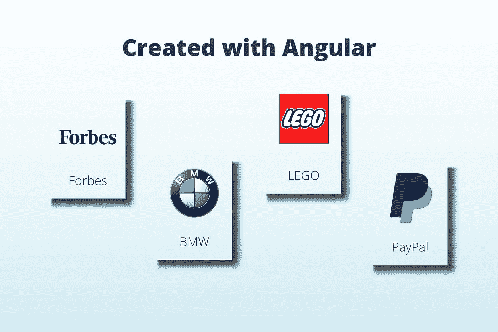

## [3。vue . js](https://vuejs.org/)——由尤雨溪创建，他也开发了 AngularJs

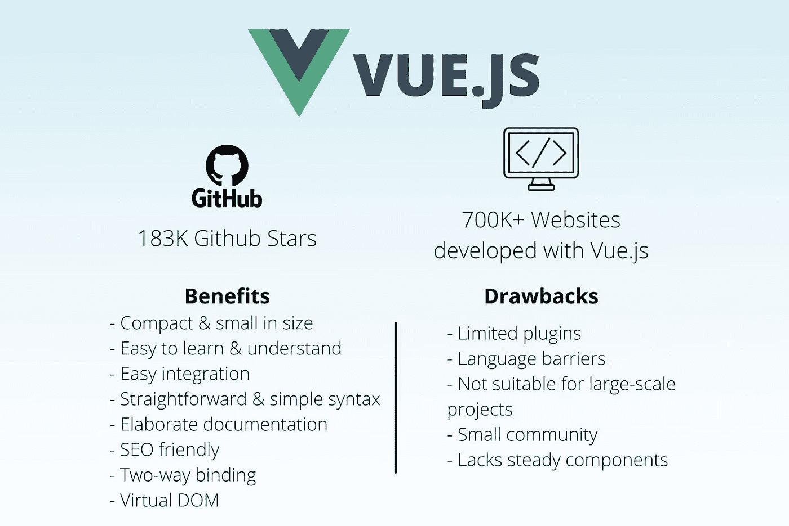

## 关于 Vue.js 你需要知道的一切

Vue.js 通常也称为 Vue，将在 2021 年在前端框架中变得非常流行。Vue 是一个非常简单、直接的工具，可以帮助你完成多项任务，构建渐进式网络和移动应用以及网络界面。

## Vue.js 的优点

*   Vue 的语法易于阅读和理解，易于安装和测试，从而使开发人员更容易快速掌握和使用它。
*   Vue 为学习者提供详尽的文档，使他们更容易处理复杂的操作。
*   它的双向数据绑定和虚拟 DOM 的存在增强了它开发复杂和简单应用程序的能力。

## 缺点

它的文档、组件和插件存在语言障碍，因为大部分都是用中文写的。Vue 也有有限的插件选项。

Vue 仍然是相当新的和不断增长的，因此有一个较小的开发人员社区，这有时可能是一个问题，当寻求支持。

Vue 为开发大型企业项目或与大型开发团队合作时提供有限的支持。

## 在以下情况下使用 Vue.js

*   从事小型项目
*   构建单页应用程序(spa)
*   从头开始创建设计结构

## 在以下情况下避免使用 Vue.js

*   从事大型项目
*   你需要开发者社区的支持

## 流行的使用案例

使用 Vue 的热门品牌有阿里巴巴、小米、9gag、路透社。

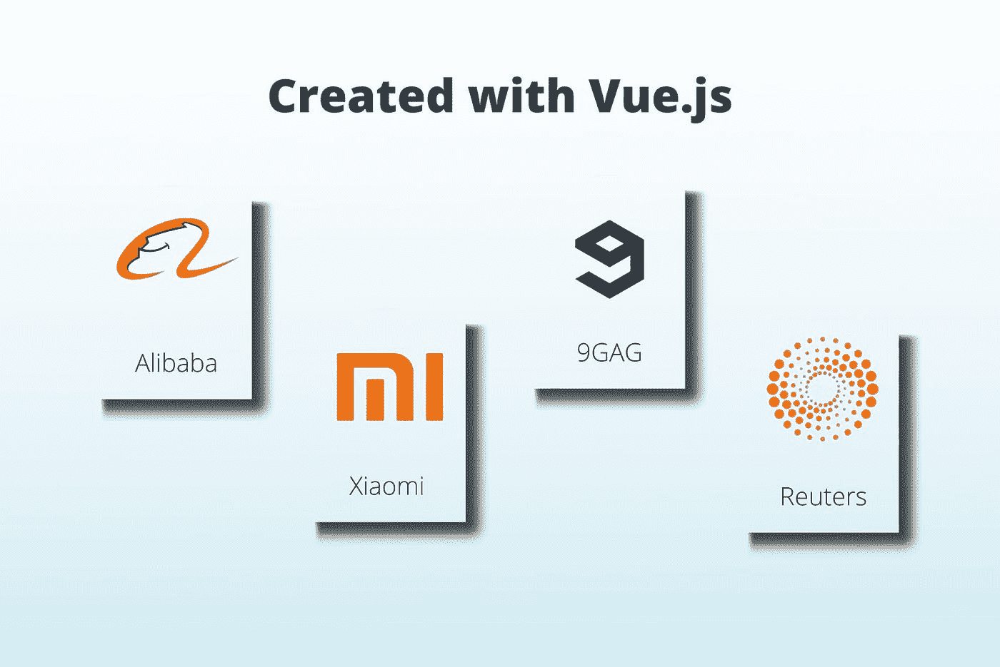

## [4。Ember.js](https://emberjs.com/) 由 jQuery 成员 Yehuda Katz 创建

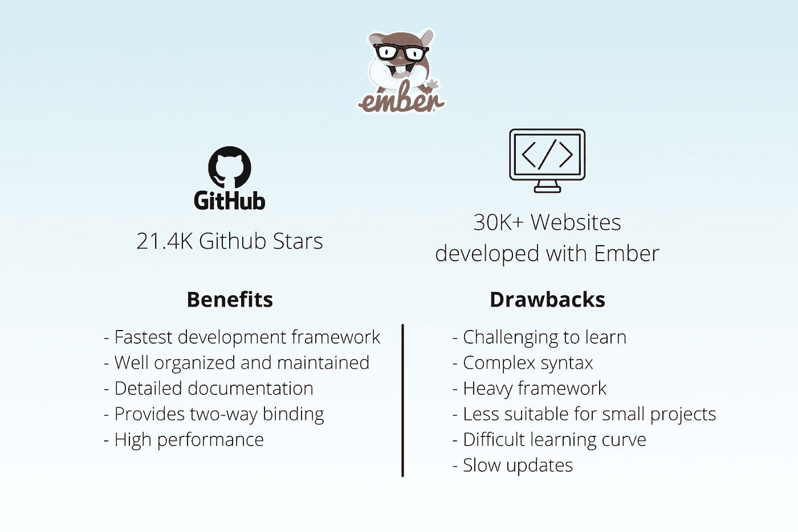

## 关于 Ember.js 你需要知道的一切

Ember 是另一个越来越受欢迎的前端框架，并迅速成为开发人员社区的最爱。Ember 也是一个基于 MVMM 架构的开源框架，提供了许多独特的特性。它拥有像 Angular 一样的双向绑定，是为移动和 web 应用程序开发无缝呈现所有设备的现代用户界面的最佳产品之一。

## Ember.js 的优点

*   Ember 秉承“约定胜于配置”的信念，因此为您配置了一切，让您可以直接深入项目并开始工作。
*   Ember 是当今最快的框架之一，因此它保证了高性能。
*   它得到了适当的管理，是一个组织良好和发展完善的框架，可以满足你的所有需求。
*   它最适合路由 URL，并且向后兼容，这意味着尽管有新的更新，旧版本的应用程序仍然可以完美地工作。

## 缺点

*   使用如此庞大的框架，开发小型项目和应用程序变得太复杂了。
*   语法非常复杂，很难学习和理解。
*   Ember 对开发者来说有一个陡峭的学习曲线。

## 使用 Ember.js 时

*   创建复杂的网站
*   创建功能丰富的单页应用程序(spa)
*   建设大型项目

## 在以下情况下避免使用 Ember.js

*   建设小型发展项目
*   构建基本用户界面
*   构建用户界面

## 流行的使用案例

用 Ember 设计的现实生活项目有 Apple Music、Linkedin、微软、雅虎！、Tinder、Playstation Now、对讲机、Square 等。

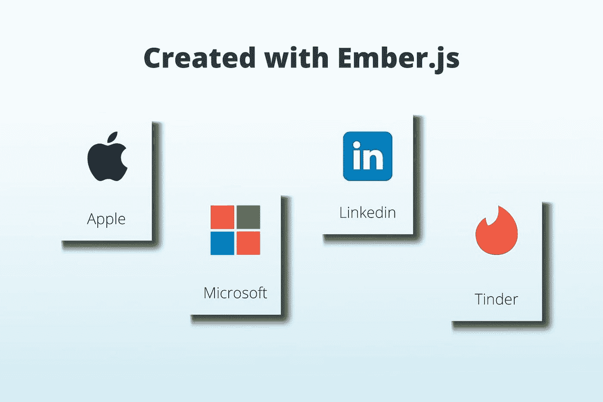

## [5。Backbone.js](https://backbonejs.org/) 由 Coffeescript 和下划线的作者 Jeremy Ashkenas 开发

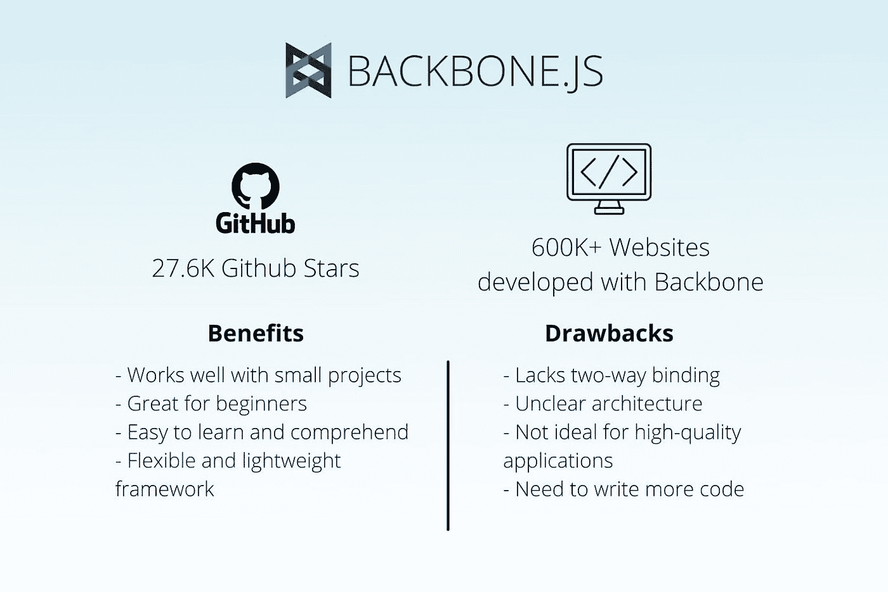

## 关于 Backbone.js 您需要知道的一切

基于 MVC 架构，Backbone.js 是一个轻量级框架，也是最简单的框架之一。它有助于创建完美的单页面应用程序(spa ),并为移动和 web 应用程序提供结构。

## Backbone.js 的优点

*   Backbone 很容易理解，尺寸紧凑，有一个轻量级的框架。
*   它非常适合初学者，因为它非常容易学习、理解和实现。
*   Backbone 允许您将数据存储在模型中，而不是存储在 DOM 中。
*   它非常适合小型项目的开发，因为它提供了非常灵活的框架和有组织的代码。

## 缺点

*   主干框架不提供双向绑定。
*   它没有一个定义良好的架构。
*   在创建高质量的应用程序时，这个框架可能不是最佳选择。
*   它不提供内置的即用型结构，还需要编写更多的代码，例如样板代码。

## 在以下情况下使用 Backbone.js

创建小而简单的单页 web 应用程序

## 流行的使用案例

用 Backbone.js 搭建的现实项目有 Trello、Tumblr、Foursquare、Soundcloud、Basecamp Calendar、Bitbucket 等。

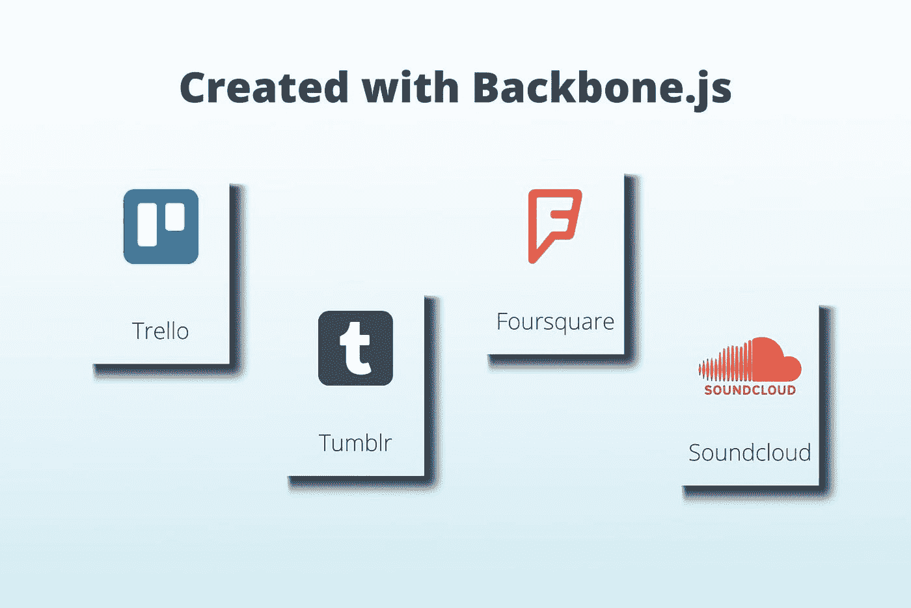

## 结论

所以，在这里。2021 年最佳前端框架，将帮助您为您的企业构建快速加载、浏览器兼容、功能丰富的网站。选择使用哪种前端框架完全取决于项目的范围和团队的规模。我们希望在这个博客的帮助下，我们已经简化了选择最佳前端框架的决策过程。

你还在等什么？去拿。设置。框架！