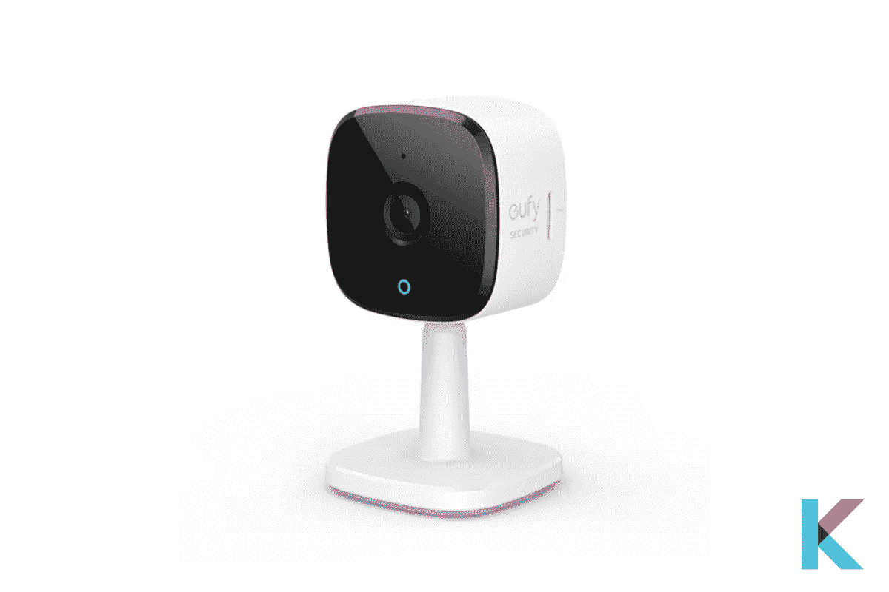

# 2022 年最佳 HomeKit 兼容智能家居设备

> 原文：<https://blog.devgenius.io/best-homekit-compatible-smart-home-devices-5ea6463664fd?source=collection_archive---------2----------------------->

有很多有用的设备可以与苹果 HomeKit 配对。特别是，如果你是苹果 HomeKit 的粉丝或者是苹果设备的骄傲拥有者，你会想知道最适合你家的 HomeKit 兼容智能设备。是的。你可以用你最喜欢的 Siri 语音助手来控制它们。因此，是时候开始寻找 2022 年最佳 HomeKit 兼容智能家居设备了。

你将从中学到什么；

*   什么是 HomeKit？
*   有哪些最好的 HomeKit 兼容设备？
*   最佳 HomeKit 兼容智能扬声器
*   最佳 HomeKit 兼容室内安全摄像机
*   最佳 HomeKit 兼容恒温器
*   最佳 HomeKit 兼容智能灯泡
*   最佳 HomeKit 兼容智能锁
*   最佳 HomeKit 兼容智能插头
*   最佳 HomeKit 兼容智能调光开关
*   最佳 HomeKit 兼容集线器
*   如何挑选最适合自己的 HomeKit 设备？
*   苹果 HomeKit 设备是如何工作的？
*   HomeKit 设备适合您吗？

# 什么是 HomeKit？

[HomeKit](https://kodmy.com/homekit/) 是苹果的智能家居界面。因此，您可以在一个家庭应用程序中与所有兼容的设备和电器进行通信。支持 HomeKit 的设备易于设置。你知道你需要做的只是快速扫描一个二维码，然后你就可以回复 Siri 的语音命令。此外，它在 HomeKit 设备和您的 iPad 或 iPhone 之间使用安全的直接连接。你不需要任何额外的集线器来让它在家里工作。如果您不在，您可以通过 Wi-Fi 访问您的 HomeKit 设备和一台 Apple 设备，如 HomePod、iPad、Apple TV 等。它作为一个家庭枢纽。

# 有哪些最好的 HomeKit 兼容设备？

所有智能家居类别都有许多支持 HomeKit 的设备。不仅仅是苹果的设备，还有许多其他不同品牌的设备。在家中拥有合适的 HomeKit 设备可以实现智能家居的极致便利。如果你喜欢用 HomeKit 来满足你的需求，那么这里有[最适合你家的 HomeKit 设备](https://original.newsbreak.com/@ishara-fernando-1590158/2469315098095-best-homekit-compatible-smart-home-devices-2022?s=influencer)。

# 最佳 HomeKit 兼容智能扬声器

## 苹果 HomePod 迷你

苹果 HomePod 迷你

苹果 HomePod 迷你是你最好的 HomeKit 兼容设备之一。它有一个像苹果一样吸引人的小设计。它有很好的音频，巨大的辐射器，计算音频，声波波形指南，等等。太棒了。它可以作为一个 Homekit hub。此外，它还可以进行立体声配对，并与 Apple TV 4K 连接。再进一步，就是更实惠的苹果智能音箱，声音很棒。如果你将两台 HomePod 迷你电脑配成立体声，它可以作为 Apple TV 的输出。

快一点！[以 108.98 美元](https://kodmy.com/store/product/apple-homepod-mini-space-gray/)从 Kodmy 获得苹果 HomePod mini MY5G2LL/A(太空灰)。

此外，你可以[花 108.98 美元](https://kodmy.com/store/product/homepod-mini-white/)从 Kodmy 那里买到 HomePod mini-White。

**最佳 HomeKit 兼容智能音箱的关键规格**

*   **尺寸:** 3.9 x 3.9 x 3.3 英寸
*   **重量:** 0.76 磅
*   **话筒:** 4
*   **颜色:**白色，太空灰
*   **发言人:** 1

**最佳 HomeKit 兼容智能音箱的利弊**

**优点**

*   出色的音频
*   精美设计
*   竞争价格
*   可以对多个扬声器进行分组

**缺点**

*   没有物理麦克风按钮
*   有限的儿童控制
*   少数流媒体音乐服务

# 最佳 HomeKit 兼容室内安全摄像机

## Eufy Solo indoorCam C24

Eufy Solo indoorCam C24

Eufy Solo indoorCam C24 是[最好的支持 HomeKit 的室内摄像机](https://kodmy.com/best-home-security-cameras/#Eufy-Solo-indoorCam-C24)，日夜都能拍摄 2K 分辨率的视频。所以，它捕捉清晰的图像。它提供了 125 度的视野。如果你想存储录像，它有一个 microSD 卡或网络连接存储(NAS)，可以在本地连续录制。除了苹果 HomeKit 之外，它还可以与谷歌助手和亚马逊 Alexa 配合使用。

相反，请查看我们对 eufy Security IndoorCam 和 Reolink Argus 3 Pro 的[爱洛婴儿监视器](https://kodmy.com/arlo-baby-monitor/)评测和[比较，选择最适合您的产品。](https://kodmy.com/compare/smart-security-cameras?modelList=eufy-security-indoorcam,reolink-argus-3-pro)

你可以从 Kodmy 买到更便宜的 Eufy Solo indoorCam。

**Eufy Solo C24 室内摄像机主要规格**

*   **尺寸:** 2.24 x 2.24 x 4.11 英寸
*   **重量:** 3.68 盎司
*   **视野:** 105 度
*   **分辨率:** 2K
*   **存储:**本地/云
*   **颜色:**白色/黑色
*   **连接:**无线网络

**Eufy Solo indoorCam C24 的利与弊**

**优点**

*   夏普 2K 视频
*   本地和云存储
*   智能运动检测
*   可与 Alexa、Siri 和谷歌助手配合使用

**缺点**

*   不支持 IFTTT
*   一些功能在 Apple HomeKit 中不可用

# 最佳 HomeKit 兼容恒温器

## 带语音控制的 Ecobee 智能恒温器

带语音控制的 Ecobee 智能恒温器

带有语音控制的 Ecobee 智能恒温器是 Echobee 的最新型号，带有新的远程传感器。它有吸引人的显示屏、用户界面、改进的扬声器、更好的触摸屏等等。除了与 HomeKit 配合使用，Ecobee 恒温器还可以与亚马逊 Alexa 配合使用。是的。你可以用你的声音或通过 Ecobee 应用程序来控制恒温器。然而，在安装 Echobee 时，它需要一个三线恒温器来供电。为此，您也可以使用适配器电缆。如果你想每年节省高达 26%的取暖和制冷费用，你可以使用这个智能伙伴。

快一点！[从 Kodmy](https://kodmy.com/store/product/ecobee-smartthermostat-with-voice-control/) 获得带语音控制的 Ecobee 智能恒温器。

## **声控 Ecobee 智能温控器关键规格**

*   **尺寸:** 4.29 x 4.29 x 1 英寸
*   **重量:** 1.85 磅
*   **款式:**智能温控器
*   **电池:**需要 1 个锂金属电池
*   **颜色:**黑色

## **带语音控制的 Ecobee 智能温控器的利弊**

**优点**

*   远程房间传感器
*   与 HomeKit 和 Alexa 配合使用
*   易于安装
*   双频 Wi-Fi

**缺点**

*   复杂的时间表
*   昂贵的

# 最佳 HomeKit 兼容智能灯泡

## 飞利浦 Hue 白色 LED 入门套件

飞利浦 Hue 白色 LED 入门套件

你想让照明更上一层楼吗？那么[飞利浦色调](https://kodmy.com/about-philips-hue/)是最好的 HomeKit 兼容智能灯泡，当你跳过颜色，专注于色调白色灯泡。不仅是颜色，它还有几个有用的特点。它可以与任何东西配合使用，尤其是与苹果 HomeKit 配对。此外，您可以通过智能手机或平板电脑创建自定义场景。此外，安装过程非常简单。首先，你必须在你选择的位置安装灯泡。然后下载应用程序并与 Hue hub 配对。

[购买飞利浦 Hue 白色 LED 智能按钮入门套件](https://kodmy.com/store/product/philips-hue-white-led-smart-button-starter-kit/)，可与 Kodmy 的 Alexa、谷歌助手和苹果 HomeKit 配合使用。

相反，如果你想选出最好的智能灯，你可以找到[智能灯泡最佳对比](https://kodmy.com/compare/smart-lights?modelList=lifx-mini-bulb,wyze-bulb)。

**飞利浦 Hue 白光 LED 启动套件关键规格**

*   **尺寸:** 4.3 x 2.4 x 2.4 英寸
*   **体重:** 7.2 盎司
*   **颜色:**白色
*   **瓦数:** 10 瓦
*   **灯类型:** LED

**飞利浦色相白光 LED 入门套件的利弊**

**优点**

*   可变暗的
*   综合应用
*   高度可定制
*   适用于许多智能家居系统

**缺点**

*   昂贵的
*   需要集线器

# 最佳 HomeKit 兼容智能锁

# 奥古斯特智能锁

奥古斯特智能锁

有时候你不能正确地记住你的前门是否锁了。不用再担心了。你可以很容易地向 Siri 询问你的门的状态。你可以用声音锁门或开门。所以，你不想晚上醒来。它有 Wi-Fi，当你不在家时，可以从你的 Android 或 iOS 设备远程访问。

它还包括一个改装的[八月锁](https://kodmy.com/smart-lock-for-smart-life/#August%20Wi-Fi%20Smart%20Lock)和一个门感应开关传感器。它可以与你最喜欢的语音助手配合使用，如 Siri、谷歌助手或亚马逊 Alexa。是的。你可以获得无限的用户代码。如果你喜欢跟踪谁来了又走，它让你接触到选定的人。

相反，如果你对最好的智能锁感兴趣，你可以在这里找到[最好的智能锁对比](https://kodmy.com/compare/smart-door-locks?modelList=august-smart-lock,wyze-lock)。

快一点！从亚马逊获得八月智能锁第四代。

此外，你现在可以[从 Kodmy](https://kodmy.com/store/product/august-wi-fi-4th-generation-smart-lock/) 购买 8 月 Wi-Fi 第四代智能锁。

## **八月智能锁钥匙规格**

*   **尺寸:**2.8×2.8×2.75 英寸
*   **重量:** 1.54 磅
*   **电池:** 4 节 AA
*   **颜色:**银色/哑光黑色
*   **材质:**金属

## **八月智能锁的利弊**

**优点**

*   内置 Wi-Fi
*   使用方便
*   更小的尺寸和流线型设计
*   适用于许多智能家居设备

**缺点**

*   昂贵的
*   电池寿命短

# 最佳 HomeKit 兼容智能插头

## Wemo W-Fi 智能插头

Wemo WiFi 智能插头

如果你想让你的哑电器变得“智能”，Wemo WiFi 智能插头是你最好的选择。它有一个物理交换机，因此您可以单击 Wemo 上的物理交换机。所以，你不想使用应用程序或语音来打开或关闭你的设备。当你不在家时，它可以使用 Away 模式立即打开或关闭灯。此外，它的价格大约是大多数 Homekit 兼容插头的一半。因此，这是一款适合您的经济型 HomeKit 兼容锁。

快一点！ [***现在从亚马逊获得 Wemo 智能插头***](https://amzn.to/3ulk3Nb) 。

## **Wemo W-Fi 智能插头关键规格**

*   **尺寸:** 1.34 x 2.05 x 1.81 英寸
*   **重量:** 1.92 盎司
*   **电气等级:** 120V~/15A/60Hz/1800W
*   电压: 120 伏

## **Wemo W-Fi 智能插头的利弊**

**优点**

*   有物理控制按钮
*   改善了占地面积
*   负担得起的
*   有效的安装过程

**缺点**

*   Wemo 应用程序的困难
*   高价

# 最佳 HomeKit 兼容智能调光开关

## Lutron Caseta 无线智能照明调光开关入门套件

Lutron Caseta 无线智能照明调光开关入门套件

Lutron Caseta 无线智能照明调光开关入门套件广泛兼容，是我们最喜欢的 HomeKit 调光开关。你是否懒得起床去开灯或关灯？这种灯开关调光器具有开/关和调光控制。此外，它还提供远程控制，可以从任何地方控制您的交换机。它包括两个遥控器和两个墙壁开关。一旦您将交换机和遥控器配对，即使您离线，它们也会继续配对。

如果你想了解其他智能灯开关调光器，你可以看看我们的[最佳智能灯开关调光器 2021](https://kodmy.com/smart-light-switch-dimmer/) 文章。

快一点！ [***从亚马逊***](https://amzn.to/3kSLUkw) 获取 Lutron Caseta 无线智能照明调光开关入门套件。

## **Lutron Caseta 无线智能照明调光开关的主要规格**

*   **尺寸:** 2 x 5.94 x 6.75 英寸
*   **重量:** 1.12 盎司
*   **颜色:**白色
*   电压: 120 伏
*   **瓦数:** 600 瓦

## **Lutron Caseta 无线智能照明调光开关的利弊**

**优点**

*   简单的安装过程
*   场景管理
*   包括地理围栏
*   即使网桥离线，遥控器和开关也能工作

**缺点**

*   操作所需的有线网桥
*   应用程序仅支持一个帐户

# 最佳 HomeKit 兼容集线器

## 4K 苹果电视

4K 苹果电视

苹果电视 4K 起到了桥梁的作用，因此当你离开家时，你可以远程控制任何支持 HomeKit 的设备。它内置了 Siri，支持 4K HDR 内容。如果你是苹果的客户，你可能会考虑购买一个家庭套件集线器，如 Apple TV、HomePod Mini 或 iPad。与 HomePod 迷你和 iPad 相比，4K 苹果电视在媒体流媒体方面做得很好。它提供与 Wi-Fi 和蓝牙智能设备的可靠通信。这是一个神奇的装置。您可以与所有智能设备通信，并将电视遥控器用作麦克风来命令 Siri 语音助手。此外，它是一款出色的设备，因为它内置了更多的存储设备、更快的处理器和用于更快联网的千兆以太网。

**苹果电视 4K 关键规格**

*   **尺寸** : 3.9 x 3.9 x 1.4 英寸
*   **重量** : 15 盎司
*   **端口** : HDMI 2.1，以太网
*   **处理器** : A12 仿生芯片，64 位架构

**苹果电视 4K 的利与弊**

**优点**

*   伟大的新遥控器
*   优秀的 4K·HDR
*   直观的主页主页
*   简单的 iOS 和 macOS
*   4K HDR 博彩公司

**缺点**

*   非常贵
*   对苹果产品的依赖

# 如何挑选最适合自己的 HomeKit 设备？

现在市面上有很多智能家居设备。因此，了解如何为您的家庭挑选最好的设备非常重要。如果你想购买最好的 Homekit 兼容设备，你应该在购买前考虑几个因素。以下是您可以用来挑选最佳设备的因素。

**设计:**这个设备和你现在的家搭配吗？是什么形状？够小吗？是否要确保它在您的其他设备上未被阻止？你不想在家里制造麻烦。你想让事情不那么复杂。所以，当你购买智能家居设备时，你要考虑它们的尺寸和设计。

**功能:**你想选择合适的设备吗？然后你想想它的特点。有时，相同的设备来自几个品牌。所以，你要考虑智能设备都有哪些功能？有一些特殊的功能，如客场模式。所以，你需要注意你的日常作息。然后，您可以选择最适合自己的设备。

价格:在购买之前，你要确保它能满足你的需求。最便宜的设备永远不是最好的。请记住，HomeKit 兼容设备比其他设备更昂贵。

# 苹果 HomeKit 设备是如何工作的？

如今，有许多智能家居设备可以集成到 Apple HomeKit 智能家居中。你想知道大多数智能设备通过蓝牙或 Wi-Fi 工作良好。但现在，你可以使用一个 HomeKit 集线器，如 HomePod 迷你作为第三个协议。它们增加了设备的可靠性。所以，你们可以很容易地互相交流。

在设置 Apple HomeKit 设备时，您需要扫描智能设备上的六位数 HomeKit 代码。之后，智能家居设备将被配对，它们将显示在您的 Apple Home 应用程序上。然后，您可以将您的智能设备添加到收藏夹。因此，您可以随时轻松访问它。此外，您可以将其分配给任何房间。

# HomeKit 设备适合您吗？

如果你对 HomeKit 感兴趣，你愿意并且能够使用苹果设备。HomeKit 专门针对苹果用户。你只需要使用一台 iPhone、Mac 或 iPad 和 Apple HomeKit 兼容的设备。然后，您可以轻松控制您的 HomeKit 系统。如果您想要使用与 HomeKit 兼容的智能家居设备，您需要选择支持 HomeKit 的智能家居设备。许多流行的智能家居设备都兼容 HomeKit，如智能锁、智能插头、智能恒温器、智能灯泡、智能调光开关等。然而，许多设备都兼容亚马逊 Alexa 和谷歌助手，而不是苹果 HomeKit。

# 我们的选择

Apple HomeKit 可以让你控制任何兼容的灯泡、相机、恒温器等等。你所要做的就是简单的敲击你的 iPhone，你就可以用你的声音来控制它。HomeKit 兼容设备一直在冲击你的智能设备市场。因此，您可以从任何智能设备类别中轻松选择[最佳 HomeKit 兼容设备](https://kodmy.com/homekit-compatible-smart-devices/)。

**查看更多** : [最好的 Alexa 兼容智能家居设备](https://kodmy.com/the-best-alexa-compatible-devices-in-2021/)。