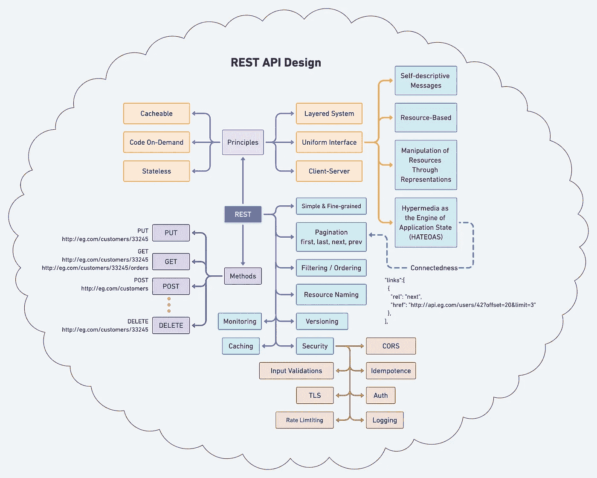
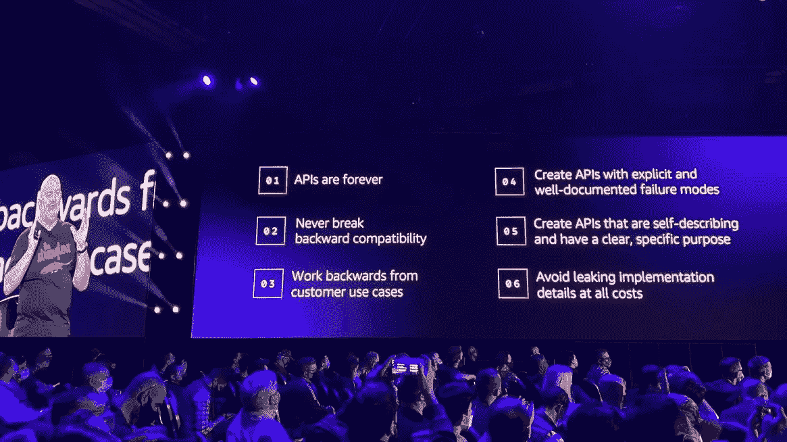

# REST API 设计的原则和最佳实践

> 原文：<https://blog.devgenius.io/best-practice-and-cheat-sheet-for-rest-api-design-6a6e12dfa89f?source=collection_archive---------0----------------------->

这篇关于最佳实践的文章面向那些对创建 RESTful Web 服务感兴趣的开发人员，这些服务提供了跨多个服务套件的高可靠性和一致性；遵循这些准则；服务的定位是供内部和外部客户快速、广泛、公开地采用。

下面是完整的图表，便于理解 REST API 的原理、方法和最佳实践。

现在，让我们从每个盒子的原理开始，详细阐述每个盒子。

## **六大原则/约束**

1.  **客户机-服务器**:关注点分离是客户机-服务器约束背后的原则。通过将用户界面问题从数据存储问题中分离出来，我们提高了跨多个平台的用户界面的可移植性，并通过简化服务器组件提高了可伸缩性。
2.  **无状态**:通信必须是无状态的，就像客户端-无状态-服务器(CSS)风格一样。从客户端到服务器的每个请求都必须包含理解请求所需的所有信息。因此，会话状态完全保存在客户端。
3.  **可缓存**:为了提高网络效率，我们增加了缓存约束，形成客户端缓存无状态服务器风格。缓存约束要求数据响应带有可缓存或不可缓存的隐式或显式标签的请求。如果一个响应是可缓存的，那么客户机缓存就有权为以后的等价请求重用该响应数据。
4.  **分层系统**:客户端通常无法判断它是直接连接到终端服务器，还是通过中介连接到终端服务器。中间服务器可以通过实现负载平衡和提供共享缓存来提高系统的可扩展性。各层还可以实施安全策略。
5.  **按需编码** : REST 允许通过下载和执行 applets 或脚本形式的代码来扩展客户端功能。通过减少需要预先实施的功能数量来简化客户端。它允许在部署提高系统可扩展性后下载特性。
6.  **统一接口**:通过将通用性的软件工程原理应用于组件接口，简化了整体系统架构，提高了交互的可视性。实现与它们提供的服务分离，这鼓励了独立的可演进性。REST 通过四个接口约束来定义:资源的标识、通过表示对资源的操作、自描述消息以及作为应用程序状态引擎的超媒体。
    **自描述性消息**:每条消息包含足够的信息来描述如何处理该消息。
    **基于资源的**:在请求中使用 URIs 作为资源标识符来标识各个资源。资源本身在概念上与返回给客户端的表示是分开的。
    **通过表示对资源的操作**:当客户端表示一个资源时，包括任何附加的元数据，它有足够的信息来修改或删除服务器上的资源，只要它有权限这样做。
    **作为应用状态引擎的超媒体(HATEOAS)** :客户端通过主体内容、查询字符串参数、请求头和被请求的 URI(资源名)传递状态。服务通过主体内容、响应代码和响应头向客户端提供状态。

## **最佳实践**

现在，让我们换一种方式来理解 REST 的基本最佳实践，这是每个工程师都应该知道的。

AWS re:发明 2021

1.  **保持简单和细粒度**:创建模拟系统底层应用程序域或系统数据库架构的 API。最终，您将需要聚合服务——利用多种底层资源来减少聊天的服务。
2.  **过滤&排序**:对于大型数据集，从带宽角度来看，限制返回的数据量至关重要。此外，我们可能希望指定响应中包含的资源的字段或属性，从而限制返回的数据量。我们最终想要查询特定的值并对返回的数据进行排序。
3.  版本控制:在 API 开发中，有很多方法可以破坏合同并对你的客户产生负面影响。如果您不确定更改的后果，最好谨慎行事，考虑版本控制。在决定新版本是否合适，或者对现有表示的修改是否充分和可接受时，有几个因素需要考虑。由于维护许多版本变得麻烦、复杂、容易出错且成本高昂，所以对于任何给定的资源，您应该支持不超过两个版本。
4.  **缓存**:缓存通过使系统中的层消除远程调用来检索请求的数据，从而增强了可伸缩性。服务通过在响应上设置头来提高缓存能力，例如`Cache-Control`、`Expires`、`Pragma`、`Last-Modified`等
5.  REST 的原则之一是连通性——通过超媒体链接。同时，没有它们，服务仍然是有帮助的。当链接在响应中返回时，API 变得更加自描述。对于在支持分页的响应中返回的集合，至少有“first”、“last”、“next”和“prev”链接是有益的。
6.  **资源命名**:当资源被很好地命名时，API 是直观且易于使用的。如果做得不好，同样的 API 会让人感觉笨拙，难以使用和理解。RESTful APIs 是面向消费者的。URIs 的名字和结构应该向这些消费者传达意义。通常很难知道数据边界应该是什么，但是随着对数据的理解，您很可能已经准备好尝试一下，以及将什么作为表示返回给您的客户是有意义的。为你的客户设计，而不是为你的数据设计。
    - **复数**:普遍接受的做法是在节点名中使用复数，以保持所有 HTTP 方法的 API URIs 一致。原因是“客户”是服务套件中的一个集合，ID(例如，33245)指的是集合中的一个客户。
7.  **监控**:确保添加各种监控来提高你的 API 的质量或性能。数据点可以是响应时间(P50、p90、P99)、状态代码(5XX、4XX 等。)、网络带宽等等。
8.  **安全** :
    - **授权/认证**:对服务的授权和对任何应用的授权没有区别。问这个问题，“这个主体在给定的资源上有请求的权限吗？”
    - **CORS** :在服务器上实现 CORS 很简单，只需在响应中发送一个额外的 HTTP 头，比如`Access-Control-Allow-Origin`、`Access-Control-Allow-Credentials`等
    - **TLS** :所有的认证都要使用 SSL。OAuth2 需要授权服务器和访问令牌凭据才能使用 TLS。
    - **等幂**:执行一次或多次都会产生相同结果的运算。根据应用的上下文，它可能有不同的含义。例如，对于有副作用的方法或子例程调用，这意味着修改后的状态在第一次调用后保持不变。
    - **输入验证**:验证服务器上的所有输入。接受“已知的”好的输入，拒绝坏的输入，防止 SQL 和 NoSQL 注入，将消息大小限制在字段的精确长度，服务应该只显示一般的错误消息，等等。
    - **速率限制:**是一种限制网络流量的策略。它限制了一个人在一定时间内重复一个动作的频率——例如，尝试登录一个账户。
    - **记录**:确保不要意外记录任何个人身份**信息** (PII)。

我结束了这次学习，我希望你今天学到了一些新东西。请与更多的同事或朋友分享。最后考虑成为[中等会员](https://zonito.medium.com/membership)，谢谢！

**参考文献**:

*   [REST API 教程](https://www.restapitutorial.com/)
*   [休息拱门](https://www.ics.uci.edu/~fielding/pubs/dissertation/rest_arch_style.htm)
*   [哈泰奥斯](http://roy.gbiv.com/untangled/2008/rest-apis-must-be-hypertext-driven)