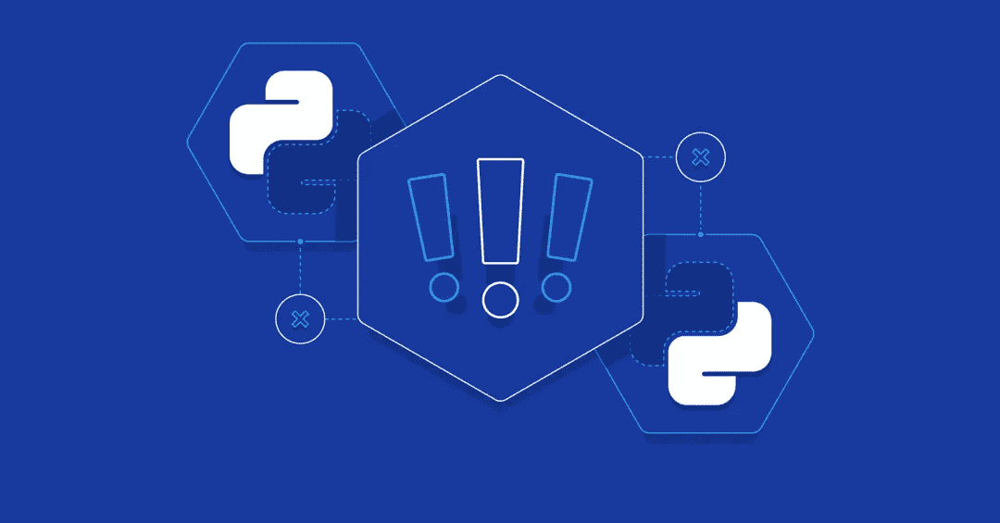
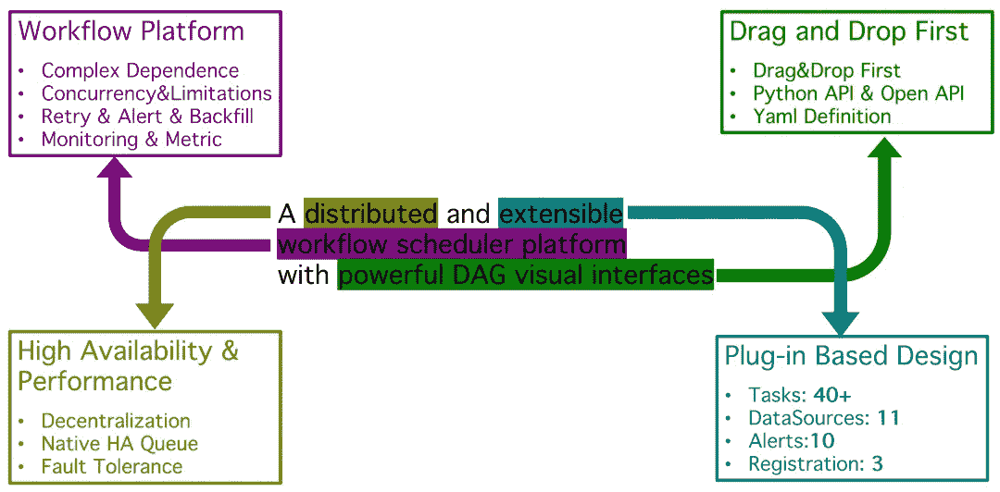
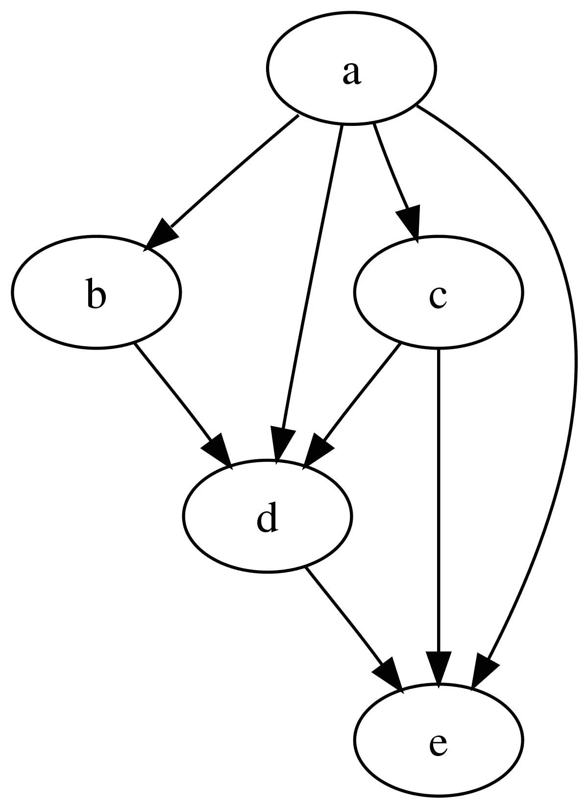

# 最佳实践| dolphin scheduler Python API CI/CD

> 原文：<https://blog.devgenius.io/best-practice-dolphinscheduler-python-api-ci-cd-fefaa0bad329?source=collection_archive---------5----------------------->



*作者钟佳杰，Apache DolphinScheduler PMC*

# DolphinScheduler 和 Python API 介绍

Apache DolphinScheduler 是一个分布式和可扩展的工作流调度平台，具有强大的 DAG 可视化界面。它帮助用户更容易建立和维护任何规模的工作流。



为了满足同一团队中具有不同偏好的所有用户的需求，DolphinScheduler 提供了多种创建工作流的方式。最流行的方法是通过 web UI，它通过简单的拖放创建工作流，并允许非工程师创建。如果您是一名工程师，并且喜欢以编程方式定义工作流，您可以考虑使用其 Python API 或 YAML 文件定义来创建工作流。

PyDolphinScheduler 是一个用于 Apache DolphinScheduler 的 Python API，它允许您通过 Python 代码定义工作流，也称为 workflow-as-codes。您可以在任何您喜欢的编辑器中编写 python 代码，就像使用其他 python 库一样，来创建 DolphinScheduler 的用户、环境、项目和工作流。更多实践例子可以参考[【dolphin scheduler 可以用 Python 脚本调度工作流！]](https://medium.com/codex/dolphinscheduler-can-schedule-workflows-with-python-scripts-a882fdd2d862) 了解更多详情。

# 一个简单的 Python API 示例

作为一个开箱即用的工具，Python API 有一个名为 tutorial 的例子，其中包括创建和运行我们第一个工作流的基本概念和最少代码，你可以在[https://github . com/Apache/dolphin scheduler-SDK-Python/blob/main/src/pydolphin scheduler/examples/tutorial . py](https://github.com/apache/dolphinscheduler-sdk-python/blob/main/src/pydolphinscheduler/examples/tutorial.py)上看到更详细的代码。DolphinScheduler 及其 Python API 的核心概念是 DAG，在 Python API 中也叫 workflow。更形象的说，就是下图所示的全貌。每个 DAG 包含多个节点和节点之间的连接，如名为 A、B、C 等的节点以及节点之间的链接。在 Python API 中，任务表示 DAG 的节点以及节点之间连接的依赖性。



# 如何触发 Python API 工作流

## 单人的

我们已经知道了 Python API 的基本概念，并且已经有了一个例子，那么我们如何触发它，让它运行并完成我们的工作呢？为了使它更 Python 化，您可以像运行其他 Python 脚本一样，通过终端用一个简单的命令来运行它。

```
python tutorial.py
```

PyDolphinScheduler 将帮助你设置所有的东西并创建一个新的工作流程，之后你可以在 DolphinScheduler web UI 中看到新的工作流程。

## 多个工作流程

如果我有多个包含多个工作流的文件，我该如何触发它们？是的，你可能已经想到了，你可以一个一个地触发它们，就像我们触发单个的一样。我们可以结束了

```
python workflow1.py
python workflow2.py
python workflow3.py
...
python workflowN.py
```

我们可以将上述所有命令添加到一个 bash 脚本中，之后，我们只需要执行 bash 脚本

```
bash <bash-script-contain-all>
```

这很有用，但是当一些工作流添加或删除时，我们也必须更改 bash 脚本，这意味着我们必须考虑同步更改我们的代码。否则，bash 脚本将会失败，或者我们的一些新工作流将不会被触发。

修复它的方法很简单，我们可以动态检测特定目录中的 Python 脚本，然后将现有脚本传递给 Python 解释器，我们可以像这样更改我们的脚本

```
for file in $(find . -name "*.py"); do
    python "$file"
done
```

这就是我们在任何规模下触发所有 DolphinScheduler Python API 工作流的最终脚本。但在现实中有一点不同，我的意思是几乎没有人通过手动触发来部署生产工作流。下一步我们将讨论如何在 CI 中触发我们的工作流

# GitHub 动作中的触发器

在本节中，我们将通过 CI 来触发我们的工作流，我们使用 GitHub Action 作为一个例子，并且相信其他 CI 工具几乎是相同的。

## 什么是 GitHub 动作

GitHub Actions 现在拥有世界一流的 CI/CD，可以轻松实现所有软件工作流程的自动化。直接从 GitHub 构建、测试和部署您的代码。按照您想要的方式进行代码审查、分支管理和问题分类。随着 GitHub 的流行和开源项目运动，GitHub Action 目前非常受欢迎。你可以在 [GitHub Action](https://github.com/features/actions) 文档中看到更多细节。这里是 GitHub Action 的 hello world:

```
name: GitHub Actions Demo
on:
  push:
    branches:
      - main
jobs:
  hello-world:
    runs-on: ubuntu-latest
    steps:
      - name: Run my very first GitHub Actions
        run: echo "🎉 Hello World."
```

您可以将它保存为 YAML 文件，并将其放在您的项目中，路径为

` . github/workflows/hello.yaml `告诉 github 你让她做什么。此后，每次你有一个 commit 并把它推送到名为 main 的分支时，我们名为‘hello . YAML’的配置文件就会被触发，它除了执行 bash 命令和 echo 之外什么也不做🎉你好世界。”GitHub 操作控制台。

## 组合 GitHub 动作来触发多个工作流

在上面的例子中，您可能已经意识到 GitHub Actions 可以运行 bash 命令。我们的工作流批处理触发脚本也是一个 bash 脚本。为了通过 GitHub 动作被触发，我们可以修改 GitHub 动作示例中的命令。

```
name: Execute Workflows
on:    
  push:
    branches:
      - main
jobs:
  execute:
    runs-on: ubuntu-latest
    steps:
      - name: Check out repository code
        uses: actions/checkout@v3
      - name: Execute
        run: |
          for file in $(find . -name "*.py"); do
            python "$file"
          done
```

它只能触发和部署工作流到运行主机的 GitHub Actions。我们的 DolphinScheduler 集群运行在自主机服务器上，或者可以像 AWS 一样服务，而不是 GitHub Actions，所以我们必须告诉 bash 脚本将我们的代码提交给 DolphinScheduler 集群，而不是 GitHub Actions 服务器。幸运的是，DolphinScheduler Python API 以三种方式提供了用户友好的配置更改。我建议您通过 bash 来更改它[,以便在 GitHub 操作期间更改环境变量](https://dolphinscheduler.apache.org/python/3.1.0/config.html#by-bash)

```
# Modify Java Gateway Address
export PYDS_JAVA_GATEWAY_ADDRESS="<YOUR-STATIC-IP-RUN-DOLPHINSCHEDULER-API-SERVER>"
export PYDS_JAVA_GATEWAY_PORT="<PORT-RUN-DOLPHINSCHEDULER-API-SERVER>"
```

github 动作支持 YAML 文件中的“env”语法，您可以在[GitHub-Actions:environment-variables](https://docs.github.com/en/actions/learn-github-actions/environment-variables)中看到更多细节，我们现在可以将 GitHub 动作配置更改为

```
name: Execute Workflows
on:
  push:
    branches:
      - main
jobs:
  execute:
    runs-on: ubuntu-latest
    steps:
      - name: Check out repository code
        uses: actions/checkout@v3
      - name: Execute
        env:
          PYDS_JAVA_GATEWAY_ADDRESS: <YOUR-STATIC-IP-RUN-DOLPHINSCHEDULER-API-SERVER>
          PYDS_JAVA_GATEWAY_PORT: <PORT-RUN-DOLPHINSCHEDULER-API-SERVER> 
        run: |
          for file in $(find . -name "*.py"); do
            python "$file"
          done
```

因此，每次我们的主分支有新的提交，无论是通过合并 PR 生成的还是从本地推送的，它都会触发并部署我们在 DolphinScheduler Python API 中定义的所有工作流，部署到您的 DolphinScheduler 集群部署的位置。

在未发布的版本中，我们为 DolphinScheduler Python API 添加了一个新的认证机制令牌，这意味着在下一个版本中，当我们试图从 Python API 连接到 DolphinScheduler 时，我们必须添加一个令牌，更多详细信息请参见[https://github . com/Apache/dolphin scheduler-SDK-Python/pull/13](https://github.com/apache/dolphinscheduler-sdk-python/pull/13)。此外，我们强烈建议我们的用户打开令牌认证，以确保我们的连接安全。就像其他配置一样，令牌也可以通过 bash 的环境变量[来改变。](https://dolphinscheduler.apache.org/python/3.1.0/config.html#by-bash)

但是当我们启用并打开令牌时，如何从 GitHub 中触发动作呢？在这种情况下，我们不得不使用 [GitHub 加密秘密](https://docs.github.com/en/actions/security-guides/encrypted-secrets)来寻求帮助。你可以按照链接中的步骤动作来创建你的第一个安全秘密，并记住你的秘密的名称。然后在 GitHub 操作配置中使用它

```
name: Execute Workflows
on:
  push:
    branches:
      - main
jobs:
  execute:
    runs-on: ubuntu-latest
    steps:
      - name: Check out repository code
        uses: actions/checkout@v3
      - name: Execute
        env:
          PYDS_JAVA_GATEWAY_ADDRESS: <YOUR-STATIC-IP-RUN-DOLPHINSCHEDULER-API-SERVER>
          PYDS_JAVA_GATEWAY_PORT: <PORT-RUN-DOLPHINSCHEDULER-API-SERVER>
          PYDS_JAVA_GATEWAY_AUTH_TOKEN: ${{ secrets.YOUR-SECRET-NAME }} 
        run: |
          for file in $(find . -name "*.py"); do
            python "$file"
          done
```

看到了吗？这并不复杂，就像在 GitHub 操作中使用普通的环境变量一样。这就是我们从 GitHub Actions 部署工作流所需要做的一切。

# 关于 CI

DolphinScheduler Python API 脚本是一个 Python 脚本，所以它是 Python 语言的 CI，可能包括 black、Pylint、flake8、sort、autoflake 等。如果您选择使用 Python API 而不是通过 web UI 来创建和维护工作流。我相信您已经有了自己喜欢的代码格式和风格检查工具。我决定在 CD 之后谈论 CI，因为它是可选部分。如果你有你喜欢的，你可以直接使用它，跳过这一节，但是如果你没有，我可以分享我更喜欢使用的和 Python API lint。

首先，我更喜欢使用[预提交](https://pre-commit.com)，它将在每次 Git 提交时运行，这很有用，因为我可以在将代码推送到远程之前检测到一些容易但经常被忽略的细节。预提交需要一个配置文件，我想分享一下 Python API 为自己使用的代码样式和 lint 代码，你可以在[https://github . com/Apache/dolphin scheduler-SDK-Python/blob/main/查看更多细节。pre-commit-config.yaml](https://github.com/apache/dolphinscheduler-sdk-python/blob/main/.pre-commit-config.yaml)

```
default_stages: [commit, push]
default_language_version:
  # force all python hooks to run python3
  python: python3
repos:
  # Python API Hooks
  - repo: https://github.com/pycqa/isort
    rev: 5.10.1
    hooks:
      - id: isort
        name: isort (python)
  - repo: https://github.com/psf/black
    rev: 22.3.0
    hooks:
      - id: black
  - repo: https://github.com/pycqa/flake8
    rev: 4.0.1
    hooks:
      - id: flake8
        additional_dependencies: [
          'flake8-docstrings>=1.6',
          'flake8-black>=0.2',
        ]
        # pre-commit run in the root, so we have to point out the full path of configuration
        args: [
          --config,
          .flake8
        ]
  - repo: https://github.com/pycqa/autoflake
    rev: v1.4
    hooks:
      - id: autoflake
        args: [
          --remove-all-unused-imports,
          --ignore-init-module-imports,
          --in-place
        ]
```

它不运行复杂的检查，所有这些都很容易知道，并保持预提交可以尽快完成。细节是:

*   [isort](https://github.com/PyCQA/isort) :自动排序 Python 导入
*   [黑色](https://github.com/psf/black):自动格式化 Python 代码
*   [autoflake](https://github.com/PyCQA/autoflake) :自动删除 pyflakes 报告的未使用的导入和变量
*   [flake8](https://github.com/PyCQA/flake8) :检测其他代码和文档

预提交用于本地检查，您也可以在 GitHub 操作中运行它，方法是在名为 execute 的现有作业之前添加一个新作业

```
name: Execute Workflows
on:
  push:
    branches:
      - main
  pull_request:
jobs:
  lint:
    runs-on: ubuntu-latest
    steps:
      - name: Check out repository code
        uses: actions/checkout@v3
      - name: Install Dependencies
        run: |
          python -m pip install --upgrade pre-commit
      - name: lint
        run: |
          pre-commit install
		  pre-commit run --all-files
  execute:
    runs-on: ubuntu-latest
    if: github.event_name == 'push'
    needs: lint
    steps:
      - name: Check out repository code
        uses: actions/checkout@v3
      - name: Execute
        env:
          PYDS_JAVA_GATEWAY_ADDRESS: <YOUR-STATIC-IP-RUN-DOLPHINSCHEDULER-API-SERVER>
          PYDS_JAVA_GATEWAY_PORT: <PORT-RUN-DOLPHINSCHEDULER-API-SERVER>
          PYDS_JAVA_GATEWAY_AUTH_TOKEN: ${{ secrets.YOUR-SECRET-NAME }} 
        run: |
          for file in $(find . -name "*.py"); do
            python "$file"
          done
```

你们中的一些人可能会注意到，除了添加一个新的作业，我们还在“on”下添加了“pull_request”节点，在“execute”作业下添加了“if”节点。因为代码 lint 检查应该测试 push 和 pull 请求事件，但是我们只想在 branch main 有新提交时执行工作流。如果我们为 pull requests 事件创建执行工作流，那么每个提交到 pull 请求都将被执行并部署到我们的生产环境中，即使 pull 请求没有被访问或没有准备好进行合并。所以我们必须设置一个条件来执行工作流。

# 概述

*   我们展示了什么是 DolphinScheduler 及其 Python API 和 GitHub 操作，如何通过 DolphinScheduler Python API 创建我们的第一个工作流，以及 GitHub 操作中的第一个工作流。
*   然后我们一步步展示如何基于 GitHub 动作创建 DolphinScheduler Python API 的 CI/CD。
*   最后，我们创建一个 GitHub Actions 来检测代码风格，并自动 lint 我们的 DolphinScheduler Python API 的工作流代码。

📌📌欢迎填写[本次调查](https://www.surveymonkey.com/r/7CHHWGW)来反馈您的用户体验或您对 Apache DolphinScheduler 的想法:)

[https://www.surveymonkey.com/r/7CHHWGW](https://www.surveymonkey.com/r/7CHHWGW)