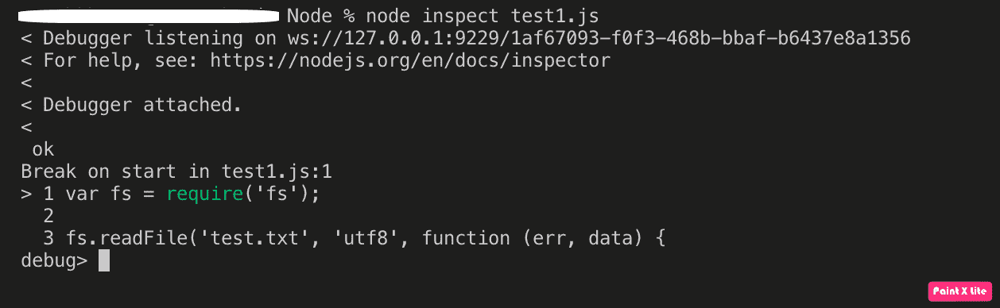
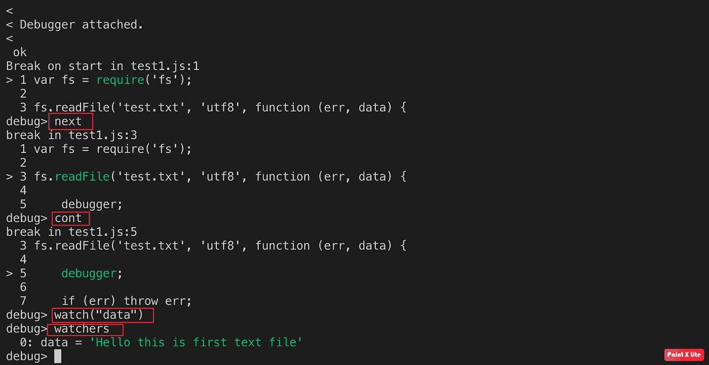
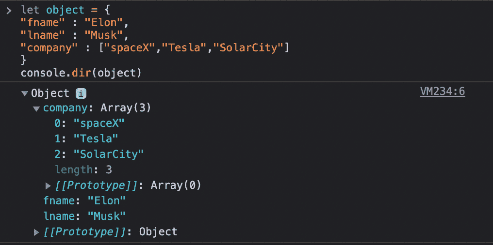
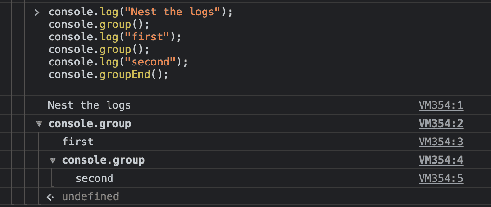
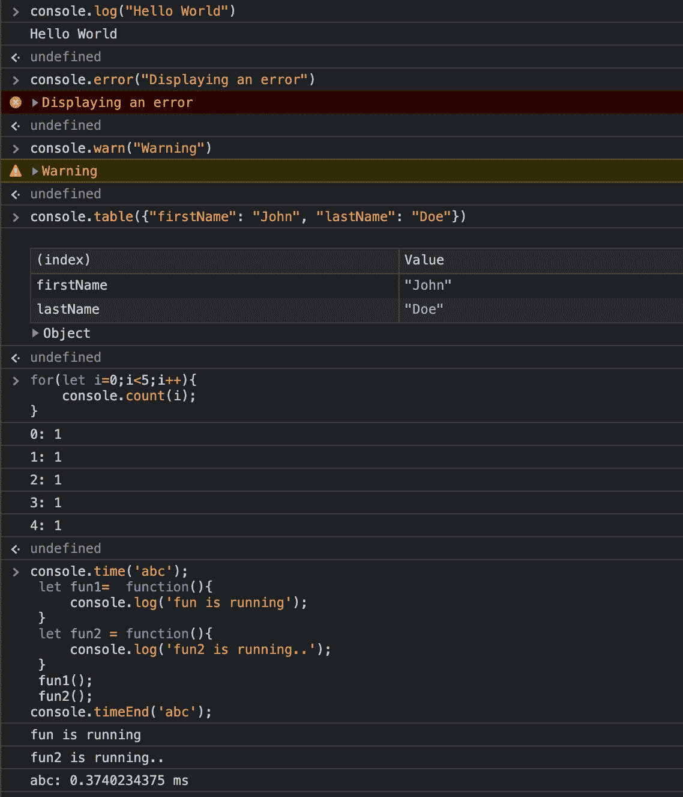
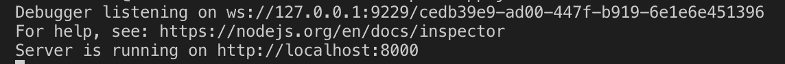
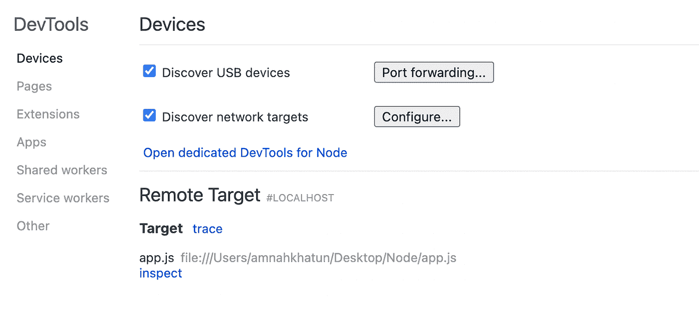
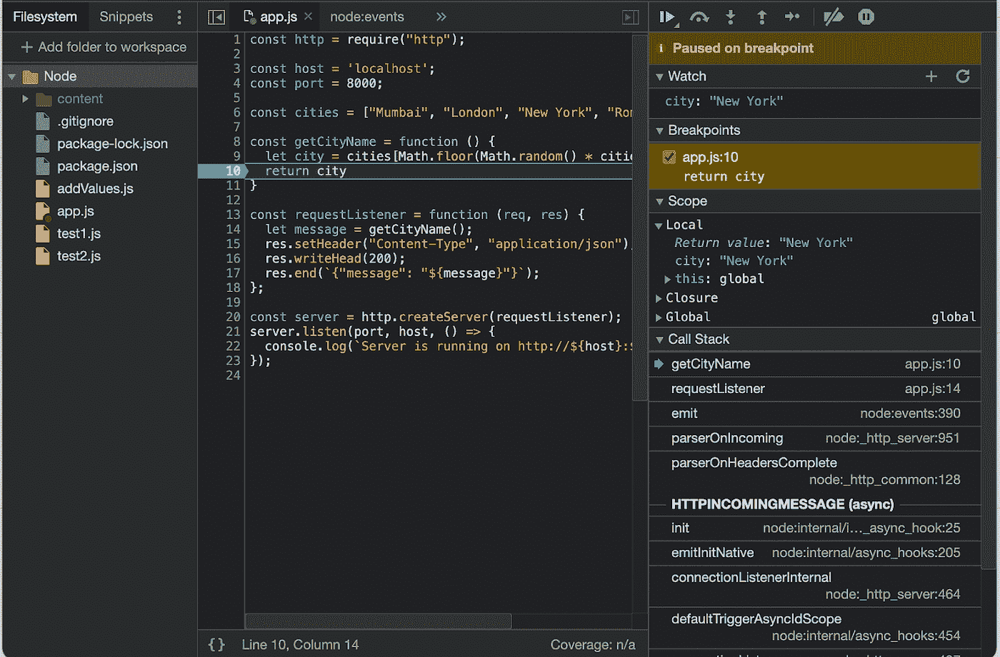

# Node.js 中调试的最佳实践

> 原文：<https://blog.devgenius.io/best-practices-for-debugging-in-node-js-fe113ed64050?source=collection_archive---------5----------------------->


克里斯汀·休姆在 [Unsplash](https://unsplash.com/s/photos/computer?utm_source=unsplash&utm_medium=referral&utm_content=creditCopyText) 上拍摄的照片

开发的一个重要部分是使应用程序没有 bug 和缺陷的能力。编写一个完美的应用程序几乎是不可能的，但是我们遵循 TDD(测试驱动开发)，它帮助我们在运行之前测试我们的代码。如果出现故障，我们可以很容易地跟踪错误并解决它。

修复 bugs 缺陷的艺术叫做调试。随着时间的推移，我们的应用程序会变得越来越复杂。在这种情况下，很难追溯到产生问题的那一行代码。为了解决这个问题，我们可以使用不同的调试技术。开发人员的一个常见做法是在程序运行时打印语句，即[***console . log()***](https://developer.mozilla.org/en-US/docs/Web/API/Console/log)或 ***console.debug()。虽然这是最简单的方法，但也是多余的。每当我们需要检查一些数据时，我们必须添加一个额外的语句。***

本文编译了调试 Node.js 应用程序的一些最佳实践。在这里，我们将熟悉除***console . log()***或***console . debug()****之外的不同工具和其他有用的方法。*

调试可以通过两种方式完成——在软件所在的机器上进行本地调试或远程调试。在[远程调试](https://lightrun.com/blog/remote-debugging/)中，您调试运行在不同于本地机器的环境中的应用程序。然而，在本文中，我们不会关注远程调试。

# 先决条件

*   Node.js 应该安装在您的本地环境中。在您的终端中键入 ***node -v*** 。如果安装了节点，您将看到节点版本，即 ***v16.13.0*** 。如果没有，可以去 Node.js 的官方[网站](https://nodejs.org/en/)看看。
*   你应该对 JavaScript 有一个基本的了解。
*   你应该熟悉 Chrome DevTools。

让我们来看看调试节点应用程序的不同方法。

*   使用内置 Node.js 调试器进行调试
*   使用控制台调试
*   使用 Chrome DevTools 调试 Chrome。

# 内置 Node.js 调试器

调试器为我们提供了一种查看程序内部的方法，而不会将它暴露给任何安全威胁。

```
*var fs = require(‘fs’);**fs.readFile(‘test.txt’,
‘utf8’, function (err, data
) {**debugger;**if (err) throw err;**});*
```

我们使用了一个调试器，它允许我们观察对象并添加断点。因此，我们可以逐行跟踪代码。

*   创建一个文件 test1.js(你可以随意命名你的文件)，运行 ***节点 inspect test1.js*** 。



终端应该是这样的:**调试器监听…**

**让我们看看在调试过程中可以使用的命令列表:**

```
cont or c: Continue executionnext or n: Step nextstep or s: Step inout or o: Step outpause: Pauses the codewatch: Add the expression or variable to watch.watcher: List the watchers with their values.
```



我们已经添加了要观察的数据。如您所见，我们正在获取内容: ***【您好这是第一个文本文件】*** 。

# 使用控制台调试

我们都知道 console.log。它被普遍使用，而且，我要说，被过度使用了。但是其他有用的方法在调试时也会派上用场。更好地显示对象属性的一些方法有:

*   ***console . dir()***以交互列表的方式显示控制台中指定对象的属性，方便开发者查看。



*   ***console . group()***通过像这样将所有日志嵌套在一起，创建一个新的控制台日志集合。



*   ***console . groupend()***用于退出当前组。

**其他一些有用的方法有:**

```
warn() — display warning messagetable(obj) — display arrays of objects in tabular formaterror(msg) — display an error messagecount(label) — displays the number of times the line has been executedtime(label) — to calculate the duration of an operationclear() — clears the consoletimeEnd(label) — stops the timer to give the total duration
```



[来源](https://medium.com/front-end-weekly/debug-like-a-pro-7749db57b4b1)

# 用 Chrome DevTools 调试 Node.js

Node.js 也使用 V8 JavaScript 引擎。所以，Chrome DevTools 中节点开发者的普遍选择。

让我们首先创建一个运行 HTTP 服务器并返回 JSON 响应的节点应用程序。该应用程序将返回一个带有城市名称的 JSON。我们将会有一系列的城市。我们将在端口 8000 上运行这个应用程序。您可以定义您的端口号。

让我们导入 HTTP 模块，这是创建 HTTP 服务器所需要的。函数的作用是:随机选择一个城市名并返回。

接下来，我们将添加请求监听器， **requestListener()** ，它处理 HTTP 请求。

在 app.js 中添加下面的代码，这里使用的代码编辑器是 VS 代码。你可以选择任何你觉得舒服的编辑器。还有，我用的是 VS code 提供的内置终端。

```
const http = require(“http”);const host = ‘localhost’;const port = 8000;const cities = [“Mumbai”, “London”, “New York”, “Rome”, “Tokyo”];const getCityName = function () {let city = cities[Math.floor(Math.random() * cities.length)];return city}const requestListener = function (req, res) {let message = getCityName();res.setHeader(“Content-Type”, “application/json”);res.writeHead(200);res.end(`{“message”: “${message}”}`);};const server = http.createServer(requestListener);server.listen(port, host, () => {console.log(`Server is running on [http://${host}:${post}`);](/${host}:${post}`);)});
```

到终端键入 ***节点— inspect app.js*** 。

*记住:在使用 CLI 时，使用****inspect****而不是****—inspect****。*



运行上面的命令后，您应该在终端中看到类似这样的内容。

现在，导航到谷歌浏览器，输入 ***chrome://inspect***



应该会出现上面的屏幕。点击远程目标下的检查。我们将能够用 Chrome 调试节点代码。导航到左侧的 Sources 选项卡。如果您的左侧是空的，导入您编写代码的工作区，并选择 app.js。

让我们通过添加断点开始调试。单击调试控制台中的数字 10。数字和右侧面板旁边会出现一个红点，表示添加了一个新断点。

接下来，添加一个观察表达式。在右侧，单击监视标题旁边的箭头，然后

点击+。在处理请求时，输入城市并按 Enter 观察其值。

接下来，打开一个新的浏览器窗口，导航到 [http://localhost:8000](http://localhost:8000) 。



这是 inspect 屏幕的屏幕，您可以在其中轻松调试您的应用程序。

# 结论

在本文中，我们学习了调试节点应用程序的不同方法，以及一些可以帮助我们成为更好的开发人员的最佳实践。我们创建了一个节点应用程序，并使用调试器、断点、DevTools 和观察器对其进行了调试。

开发人员必须知道的技能之一是如何更好地调试。我希望本文中提到的实践将帮助您成为一名更好的开发人员。

也可以参考 Node。JS 官方[文档](https://nodejs.org/en/docs/)了解更多关于节点调试的内容。