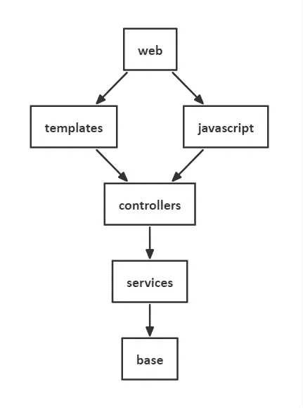
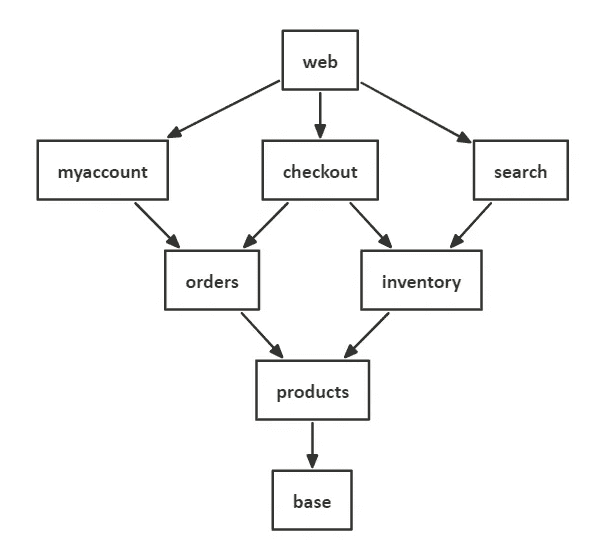

# Spring Boot 多模块项目的最佳实践

> 原文：<https://blog.devgenius.io/best-practices-for-multi-module-projects-with-spring-boot-28566174811f?source=collection_archive---------4----------------------->

现实世界中的大多数应用，从长远来看都会积累大量的特性和代码。**多模块项目是构建应用的好方法**,无需走复杂的微服务之路。以下五个建议可以帮助你更好地组织这样的 Spring Boot 项目。

## #1 找到合适的模块结构

总的来说，使用两个模块*【基础】*和*【web】*是 Spring Boot 应用程序的一个**好的起点。“基础”模块描述基本设置，例如数据库设置，并提供实用程序类。此处定义的标准适用于所有其他模块。在“web”中，所有模块被组合在一起，可执行的应用程序被构建——我们的可执行程序“fat jar”。**

中间模块**的结构应该更少技术性，更多领域驱动**。首先，这里有一个划分网店的反面例子。

▴ *技术结构不佳的例子*

虽然纯粹的**技术分离是可能的，但它提供的优势很少**:对于一个开发人员来说，要执行一个典型的任务(“向搜索添加一个过滤器”)，所有涉及的工件都必须从多个模块中收集。然而，使用领域驱动的细分，对于许多任务，定制将被限制在一个模块中。

▴ *领域驱动模块化的好例子*

当应用程序随着时间的推移而扩展时，很容易添加更多具有域驱动结构的模块，例如“blog”。对于技术分离，这没有什么意义，在某些时候**你会以一个大泥球**结束。

## #2 最大限度减少依赖性

每个模块应该**包含它需要提供自己的功能**的所有工件，以便最小化对其他模块的依赖性。这包括类、模板、依赖项、资源等等。

一个有趣的问题是 ORM 层是应该存储在一个中央模块中，还是分散在各个模块中。现在支持分离的人很多，所以实际上没有人反对。每个模块可以包含自己的 JPA 实体和 Flyway/liqui base changelog。当在一个模块中运行集成测试时，一个部分数据库模式将被创建，**基于当前的和所有被引用的模块**。

一个有用的支持分离模块的库是 [Springify Multiconfig](https://github.com/tleipzig/springify-multiconfig) 。它允许每个模块包含自己的`application-mc-xx.yml`文件来存储该模块的特定配置。如果没有这个库，整个配置必须在“基本”模块的`application.yml`中。

## #3 持续改进

糟糕的架构总比没有好，但是模块的最佳结构从一开始就不清楚。因为所有的依赖关系都在一个应用程序中，所以如果需要，可以通过一个拉请求来调整分区。对于微维修，通常需要广泛的多阶段程序。

质疑现状并从长远来看进一步改善现状总是值得的。

## #4 Gradle api 与实施

在开发模块的代码时，当前项目的直接和间接引用的模块总是可用的。当外部库被声明为依赖时，在 Gradle 中有两种可能性:使用`api`(以前的`compile`)库也是间接可见的，而使用`implementation`库只在当前模块中可用。换句话说，如果一个模块被引用，并且`implementation`、**中包含了一个库，那么它将被隐藏，不能在代码**中使用。

在最终的应用程序中，所有的依赖项再次以单一的“fat jar”结束，但是在构建过程中，无效的访问已经被阻止了。按照这种方法，开发期间可用的库应该保持更干净。

## #5 使用单独的测试罐

每个模块都有自己的测试来验证它包含的功能。然而，有时会创建测试数据或者提供构建在它们之上的模块所需的实用方法——例如，创建测试用户。

一般来说，测试**所需的类和数据不应该包含在随后在生产**中运行的应用中。对于 Maven、Gradle 和 Kotlin 脚本，有一种方法**为每个模块创建单独的测试 jar**。然后这些可以被测试代码专门引用。关于实现的更多背景，Maven 的[在这里，Gradle 的](https://bootify.io/multi-module/test-jars-for-maven-multi-module.html)[在这里](https://bootify.io/multi-module/test-jars-in-gradle-multi-module.html)。

## 结论

多模块项目现在正得到越来越多的关注，因为微服务在实践中面临许多挑战，额外的努力只有对较大的开发团队才是值得的。通过遵循最佳实践，**可以为现实世界开发出结构良好的应用程序**。如果以后你想转向微服务，可以将单个模块分解为独立的应用程序。

在 Bootify 的专业计划中，一个 **Spring Boot 应用可以通过多模块设置**进行初始化。“基础”和“web”模块是默认创建的，自定义模块可以在两者之间预先配置。支持 Maven、Gradle 以及 Kotlin 脚本。

[见**功能和定价**见](https://bootify.io/pricing.html)