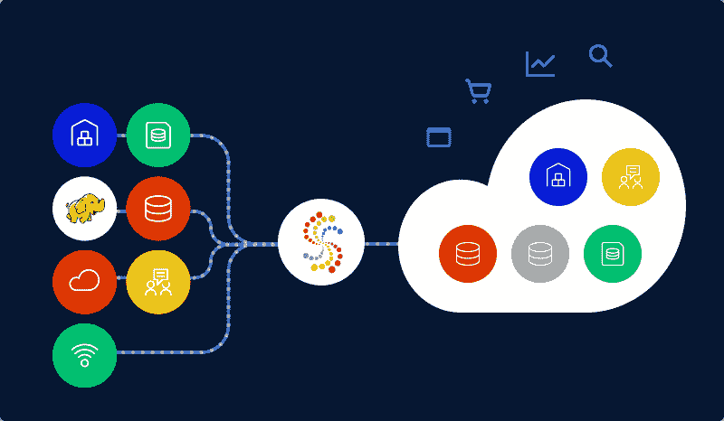

# 无缝数据接收的最佳实践

> 原文：<https://blog.devgenius.io/best-practices-for-seamless-data-ingestion-2182c63be9f3?source=collection_archive---------11----------------------->

[Unsplash 上](https://unsplash.com/photos/C6T6vr1sQI0)[窗口](https://unsplash.com/@windows)拍摄的照片

为了识别趋势、预测市场、规划未来需求、了解消费者和做出业务选择，组织现在非常依赖数据。但是，在一个位置快速访问公司数据是完成这些任务所必需的。在这种情况下，数据摄取非常有用。那是什么？为了找到隐藏在你的数据中的洞察力，并将其用于商业利益，它指的是从各种来源提取信息。

[将各种来源的原始数据传输到存储介质中，可以让组织内部的数据分析师和科学家访问、使用和评估这些数据。这个过程称为数据摄取。数据仓库、数据集市或仅仅是数据库可以作为存储介质，应用程序、数据库、电子表格或 web 抓取可以作为数据源。数据获取层是任何数据分析架构的基础。可以使用各种技术来获取数据，并且使用特定的模型和架构来创建获取层。](https://www.sciencedirect.com/topics/computer-science/data-transportation)

[来源](https://www.striim.com/blog/what-is-data-ingestion-and-why-this-technology-matters/)

# 什么是数据摄取？

数据接收是[数据生命周期管理](https://lakefs.io/what-is-data-lifecycle-management)的重要阶段之一。数据摄取是将来自许多来源的原始数据传输到存储介质中的过程，以便组织内部的数据分析师和科学家可以访问、利用和评估这些数据。虽然它的输入可能来自应用程序、数据库、电子表格或从互联网上搜集的原始 web 数据，但存储介质通常是数据仓库、数据集市或仅仅是数据库。数据获取层是任何数据分析架构的基础。接收数据有多种方式，接收层是使用特定的模型和架构创建的。

业务数据通常以多种来源和格式保存。例如，关系数据库存储产品信息，而 Salesforce.com 存储销售数据。由于这些数据来自不同的位置，因此必须使用易于使用的数据导入工具，以易于检查的形式进行清理和转换，以便做出决策。如果没有，你将会剩下彼此不兼容的拼图部分。

数据获取可以通过多种方式进行，例如实时、批量或基于业务需求使用两者的组合(称为 lambda 架构)。

# 数据摄取:好处

做出更好的决策、提供更好的客户服务和生产更好的产品的能力只是数据输入为每个公司提供的众多优势中的一部分。因此，在寻找提供数据摄取服务的企业时，应该进行彻底的研究。这是因为数据摄取过程有助于企业更好地了解受众的需求和行为，并保持其竞争力。

# 数据摄取:最佳实践

为了解决与数据导入相关的问题，我们编制了三个推荐做法来简化该过程:

# 预见挑战并做好准备

在分析数据之前，需要使数据可用。随着数据量的增长，这方面的工作变得越来越困难。因此，为项目的挑战做好准备对于项目的有效完成至关重要。

概述与您的特定用例挑战相关的障碍并为其制定计划将是数据策略的第一阶段。例如，确保您了解您可用的源系统的数据提取技术。作为一种选择，你可以雇佣外部人员或者雇佣一个无代码的数据集成平台。

# 工序自动化

随着数据量和复杂性的不断增长，您不能再依靠人工操作来管理如此大量的数据。为了节省时间，提高产量，并最大限度地减少体力劳动，考虑自动化整个过程。

例如，您可能希望整理保存在文件夹中的带分隔符的文件中的数据，并将其传输到 SQL server。每次有新文件存入文件夹时，都必须重复这一过程。可以通过利用数据摄取解决方案来优化整个摄取周期，该解决方案可以使用基于事件的触发器来自动化该过程。

此外，自动化提供了集成管理、安全和错误控制以及架构一致性的优势。所有这些最终都有助于减少数据处理时间。

# 人工智能

由于使用了人工智能原理，如统计算法和机器学习，不再需要人工参与摄入过程。随着人工干预，流程中的错误数量和频率会增加。人工智能(AI)用于简化程序，提高准确性，并完全消除这些错误。

# 自助服务

您的公司可能需要每周接收多个新数据源。此外，如果您的企业集中运营，它可能很难满足每个请求。通过自动化选择自助服务数据导入的流程，业务用户可以在 it 人员几乎不提供帮助的情况下控制 IT。

# 摘要

有效的摄取过程以快速、简单和可理解的方式从数据中提取有意义的见解。当使用数据摄取的最佳实践时，如使用人工智能、自动化、使该过程自助化、预测问题并正确准备，摄取过程通过使其快速、动态、流畅和准确而得到改进。