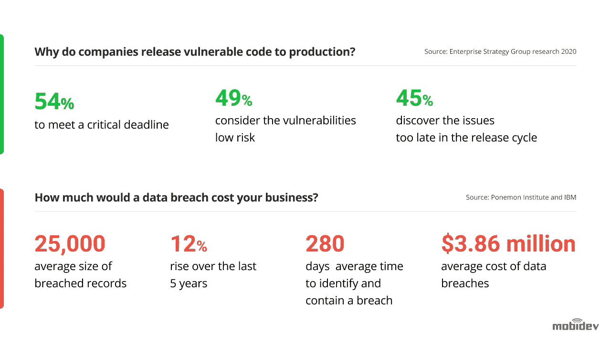
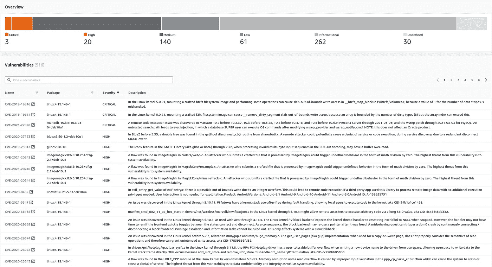

# 2021 年保护 Web 应用的最佳实践

> 原文：<https://blog.devgenius.io/best-practices-for-securing-web-applications-in-2021-96eac657e7d6?source=collection_archive---------0----------------------->

照片由[飞:D](https://unsplash.com/@flyd2069?utm_source=unsplash&utm_medium=referral&utm_content=creditCopyText) 在 [Unsplash](https://unsplash.com/@flyd2069?utm_source=unsplash&utm_medium=referral&utm_content=creditCopyText)

*作者安东·洛格维年科，* [*MobiDev*](https://mobidev.biz/) *网站团队负责人。*

对于许多公司来说，2020 年意味着转向基于云的企业系统中的远程工作，应用安全团队必须适应使用的变化和越来越多的挑战。

根据 2020 年威瑞森数据泄露调查报告，网络应用程序漏洞是 2019 年 43%的数据泄露的原因。令人惊讶的是，根据 Enterprise Strategy Group research 的调查，79%的组织有意将易受攻击的代码投入生产，同时认为他们自己的应用程序安全状况高于 7/10。

数据泄露的平均成本为[386 万美元](https://www.ibm.com/security/data-breach)，应用程序安全性肯定不是企业可以忽视的。这些数字正在上升，在过去的五年里上升了 12%。

与其他 IT 资产相比，web 应用程序尤其容易受到攻击，因为它们暴露在互联网中。许多针对 web 应用程序的攻击集中在通过 web 表单操纵用户输入，通过 API 操纵机器输入。

在本文中，我们将讨论 web 应用程序漏洞以及保护 web 应用程序免受恶意攻击和意外损坏的最佳实践。

# Web 应用程序漏洞

Web 应用程序漏洞是安全弱点，它允许威胁者操纵源代码、获得未经授权的访问、窃取数据或以其他方式干扰应用程序的正常运行。

OWASP 十大文档列出了 web 应用程序面临的最严重的安全风险。让我们来概述一些常见的攻击媒介:

*   SQL 注入-当攻击者使用恶意 SQL 代码操纵后端数据库时发生。结果可能包括未经授权的数据列表、表的丢弃(删除)和未经授权的管理访问。
*   跨站点脚本(XSS)-针对应用程序用户的攻击。它可以用来访问用户帐户、注入特洛伊木马或更改页面内容，以欺骗用户或破坏网站。另一个更危险的变种是当恶意代码持续注入应用程序时的存储 XSS。反射 XSS 是指恶意脚本从应用程序反射到用户的浏览器。
*   远程文件包含(RFI)——将文件远程注入 web 应用服务器。这可能导致应用程序中的恶意脚本和代码执行、web 服务器受损以及数据失窃。
*   跨站点请求伪造(Cross 可能导致不必要的资金转移、密码更改或数据窃取的攻击。涉及攻击者利用用户的打开会话，导致用户的浏览器在用户登录的站点上不知不觉地执行操作。

净化应用程序的输入和输出，并采用安全的编码实践，可以保护应用程序免受大多数漏洞的影响。然而，这还不够。Web 应用程序处于不断的开发过程中，安全测试必须融入开发生命周期的每个阶段，以便尽早识别和修复易受攻击的代码。

此外，大多数 web 应用程序使用第三方开源组件，这些组件本身也容易受到攻击，因此必须持续进行扫描。

# Web 应用程序安全技术和工具

> web 开发中最强大的安全技术是考虑所有的安全问题，甚至是最小的细节。Web 应用程序的安全性不仅与代码库有关，还与项目流程、数据存储、公司政策等有关。最后，如果您的 API 文档可以公开获得，或者超级管理员密码写在办公室的白板上，那么您的代码有多好和受保护并不重要。谢尔盖·伊万诺夫，MobiDev 的质量保证主管。

因此，首先应用程序的安全性来自于项目本身的安全性。但是当所有的过程都很完美的时候——下一步是什么？

要获得关于 web 应用程序安全性的信息，通常有两种主要方法。我们正在讨论静态和动态安全测试。它们不是相互排斥的，而是相互补充的。

这里有一些技术可以用来保护您的 web 应用程序免受攻击，并在攻击发生时做出响应。

# SAST

静态应用程序安全测试(SAST)解决方案扫描您的源代码中的漏洞和安全风险。许多 web 应用程序在开发的多个阶段集成了代码扫描——主要是在向代码库提交新代码时，以及在构建期间。

SAST 通常是基于规则的，扫描结果通常包括误报，因此您需要仔细分析和过滤结果，以识别真正的安全问题。

我们使用 SonarQube 静态分析工具来监控开发过程中可能引入的安全问题。建议将其与 CI/CD 管道集成，这样它将扫描每个提交/合并提交。SonarQube 具有良好的可视化表示，不仅检查安全性，还检查代码库的可维护性和可靠性。它支持 20 多种不同的编程语言，因此适用于大多数前端和后端框架。

# DAST

动态应用程序安全测试(DAST)，包括测试部署或运行的代码以发现漏洞。可以使用特殊工具手动和自动执行。

手动测试围绕着使用像 Burp Suite、Fiddler、Postman 这样的工具来使用应用程序 API。自动化 [DAST 工具向应用程序代码发送大量请求](https://www.neuralegion.com/blog/dast-dynamic-application-security-testing/)，包括意外和恶意输入，寻找漏洞。它分析结果并识别安全弱点。

经过深思熟虑的手工安全分析，我们使用 OwaspZap，一个开源的 web 应用程序安全扫描器，来加速回归测试。在创造力、根本原因分析或跳出框框思考的能力方面，扫描仪无法取代人类，但它们可以以快得多的速度和数量处理日常任务。

# 渗透测试

渗透测试是一种安全技术，它结合了动态扫描工具和人类安全专家来寻找 web 应用程序安全状态中的漏洞。

Pentesters 的行为就像真正的威胁行为者——利用漏洞、获得未经授权的访问、窃取数据和中断服务。然而，他们是根据与 web 应用程序所有者的合同，在商定的范围内这样做的，并且不会对组织造成真正的损害。

与 SAST 和 DAST 相比，这种技术执行起来更复杂，但可以识别自动化工具可能遗漏的其他风险。

# 外部数据表示(External Data Representation)

[扩展检测和响应(XDR)解决方案](https://www.cynet.com/xdr-security/understanding-xdr-security-concepts-features-and-use-cases/)是新一代安全平台，为安全团队提供一个界面，使他们能够检测和响应 IT 环境中存在的任何威胁。

XDR 从安全堆栈的所有层收集安全数据，包括 web 应用程序、网络、[私有云和公共云](https://cloud.netapp.com/blog/blg-cloud-security-architecture-for-iaas-paas-and-saas)以及端点。它应用高级分析和自动化来分析、分类和检测已知和未知威胁。最重要的是，它直接与安全工具集成，可以实时自动响应威胁。

# 2021 年的 Web 应用安全最佳实践

这里有一些可以用来提高 web 应用程序安全性的最佳实践。

# 认证和访问控制

虽然看起来很明显，但是许多 web 应用程序并没有实现基本的访问控制措施。确保你遵循这些原则:

*   实施强密码——使用安全的密码恢复，设置合理的密码过期和轮换策略，最好使用多因素身份验证。
*   在访问敏感功能或执行交易时，强制进行重新身份验证。
*   使用最小特权原则(POLP)，只给每个用户提供他们在系统中扮演角色所需的特权。
*   使用 SSL 和加密，确保密码和凭据始终加密，无论是静态还是传输中。
*   监控用户帐户并锁定用户，或者在检测到可疑活动时请求更改密码。

对于必须额外提供数据安全性并严格遵守 GDPR 法案或 T2 HIPAA 法案的企业来说，需要一种先进的解决方案。

# 避免安全错误配置

无论您使用的是 CMS 还是 web 开发框架，都有许多错误配置的可能性。注意以下问题:

*   始终设置强管理员密码并更改默认用户名
*   保护包含配置或敏感内容的文件和目录
*   如果不需要不必要地打开端口，就不要让它们保持打开状态
*   定期更新到所有软件库、插件和框架本身的最新稳定版本
*   定期扫描您的所有软件包，查找安全漏洞
*   敬请关注影响您的软件和基础架构的安全漏洞和更新
*   使用安全的通信和网络协议
*   确保数字证书是最新的

我们在每次 PHP composer 更新后使用本地 PHP 安全检查器。这有助于我们防止使用具有已知漏洞的库。通常，定期更新到最新的稳定版本可以解决许多安全问题。

根据 2020 年开源安全和风险分析报告，开源库和组件在软件开发中的使用几乎无处不在，大约 99%的应用程序至少有一个开源组件。

一些行业，如零售、医疗保健和教育，在 2020 年的收入呈指数增长，这主要是由于 COVID 期间消费者行为和社交互动的变化。由于这些行业在其应用程序中使用了更多的开源软件，因此它们拥有最多的漏洞和高风险漏洞。确定哪些开源组件是安全的应该是任何应用程序安全组的主要关注点。

# 异常管理

异常是 web 应用程序安全性中经常被忽视的一个方面。向用户显示长堆栈跟踪的异常或错误是很常见的——这些信息对攻击者来说非常有价值。除了向用户显示一条错误消息，解释发生了什么错误以及他们可以做些什么来解决问题之外，您不应该向用户显示任何其他内容。

确保您为每个用户操作的“快乐”和“不快乐”场景规划 web 应用程序。预见所有可能的错误，并用有意义的异常来处理它们。这将防止攻击者利用边缘情况导致意外行为。

# 小心管理容器

许多 web 应用运行在容器上，使用 [Docker](https://www.docker.com/) 。如果管理不当，容器会产生重大的安全问题。请注意以下安全准则:

*   可信映像——在创建容器时，始终使用可信基础映像，并在使用之前扫描映像的漏洞(甚至是您自己的映像)。
*   使用机密——将凭证或其他敏感信息直接保存在容器映像中是一种非常糟糕的做法，因为从该映像创建的任何容器都可以公开使用这些信息。相反，使用 Docker 或 Kubernetes 中的 secrets 机制来存储敏感信息。
*   永远不要授予超级用户访问权限——拥有系统超级用户访问权限的容器也会在容器受损时授予攻击者超级用户访问权限。总是在你的图像中定义一个用户，并且避免使用像 Kubernetes 中的“特权容器”这样的选项。
*   网络分段——确保容器只能在真正需要时访问其他系统。在受保护的子网中运行容器，除非绝对必要，否则避免将它们暴露在互联网上。

[亚马逊弹性容器注册](https://aws.amazon.com/ecr/) (ECR)服务为 Docker 图片提供安全扫描。这是一个非常有用的功能，可以了解您的私有 Docker 映像中有哪些潜在的安全问题。

# 质量保证和测试

安全性测试对于 web 应用程序的安全性至关重要。遵循以下最佳实践:

*   使用静态和动态扫描——在开发过程中使用静态应用程序安全测试(SAST)和在生产过程中使用动态应用程序安全测试(DAST)来扫描源代码中的漏洞。
*   使用渗透测试——您可以使用轻量级渗透测试即服务(PTaaS)解决方案，或用于大规模应用程序，以及由经过认证的道德黑客进行的定期全面渗透测试。
*   采用 CI/CD——每当您更新应用程序时，通过自动化测试过程运行您的代码，并自动部署它，以确保您不会由于安装问题而引入安全风险。
*   考虑合规性-世界上大多数组织都受欧盟 GDPR 法规的约束。处理信用卡数据的应用程序遵循 PCI/DSS 标准。检查是否有影响您的应用程序的其他合规性标准或法规，并实施必要的措施。

**在大多数情况下，我们通常的 CI/CD 部署流程包括以下 5 个步骤:**

1.  扫描源代码中的代码样式冲突
2.  扫描使用的第三方库的安全问题
3.  运行单元测试
4.  为部署准备新的源代码。
5.  创建新的 Docker 映像并将其部署到选定的环境中。运行 web 应用程序所需的所有敏感凭据都存储在 CI/CD 的安全存储中。

如果这些步骤中的任何一步失败，部署都将停止。这保证了稳定的更新和稳定、安全的环境。

*带安全清单的完整文章最初发表于*[*https://mobidev . biz*](https://mobidev.biz/blog/best-practices-to-secure-web-applications-from-vulnerabilities)*基于 mobi dev 技术研究。*