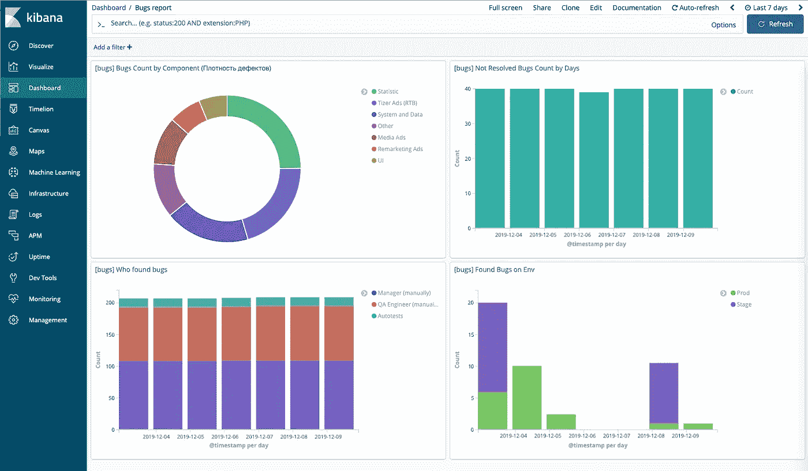

# 软件工程最佳实践。第二部分。速度指标。

> 原文：<https://blog.devgenius.io/best-practices-of-software-engineering-part-2-velocity-metrics-692c401acb4b?source=collection_archive---------1----------------------->

这是“软件工程最佳实践”系列的第二篇文章。在这篇文章中，我将讨论度量标准。如果你没有读过之前关于目标的文章，你可以在这里做。

软件开发很难评估，为了有效地管理开发，你需要一些特殊的才能。很可能，我们所有人都遇到过这样的问题，比如改变发布日期，失败的冲刺，以及不断下降的产品质量。

为了能够改进某事，首先，我们需要测量它。下面，我将解释我们在项目中使用的指标。这些指标基于我们从 Git 和吉拉获得的数据。他们帮助我们评估团队和每个开发人员的效率。

通常，所有失败的 sprints 和延迟的发布都与团队中不正确或不适当的过程有关，或者可能与完全或部分忽略一些过程有关。下面是一个有助于发现问题的指标列表。我从我的列表中去掉了一些众所周知的指标，比如“燃尽图”、“累积流程图”等等。：

# 过程度量

*   **添加到活动冲刺中的任务数量**
    *在冲刺开始后添加了多少任务，在冲刺开始后丢弃了多少任务。数量或百分比或两者兼而有之。也可以用故事点来衡量。
    度量的目的:显示项目策略或 sprint 制定得有多好。通常，它指向业务分析或项目经理的工作不足。*
*   **端到端上市时间(提前期)** *显示从创建任务到实际执行的时间。
    指标的目的:显示开发团队对业务需求的反应时间。*
*   **虫子的平均寿命。**
    *修复所有 bug 花费的总时间除以 bug 总数。您可以用系统、sprints 或系统模块的平均值来计算这些指标。
    度量的目的:显示处理一个缺陷平均需要多长时间:它的注册、复制和修复。该指标将允许您评估测试所需的时间，并找到软件中最困难和最有问题的领域。
    通常，缺陷的寿命是从其创建(创建状态)到关闭(关闭状态)的总时间，减去所有可能的延迟(推迟或保持状态)。一些 bug 追踪器允许你为一个单独的 sprint 或者发布计算和下载这些信息。因此，您可以轻松地自动收集数据，以便在报告或分析中使用。另外，缺陷的平均寿命可以为每个模块和功能单独计算，或者为团队中的每个 QA 工程师和开发人员计算。因此，有一种方法可以识别模块复杂性或开发团队中的薄弱成员。如果您的项目需要快速修复 bug，您还可以设置一个 SLA 来进行错误纠正。*
*   **任务保持时间(任务停机时间)**
    *任务处于“等待”状态的时间，例如:处于“准备评审”或“准备测试”状态。
    指标的目的:显示任务在哪些状态下花费时间等待操作。该指标将有助于发现瓶颈并做出改变，以缩短“端到端上市时间”。*
*   **手工测试时间(MTT)**
    *手工测试版本或功能所花费的时间，以工时为单位。
    指标的目的:确定手工测试的成本。它将帮助您决定什么时候您应该从手动测试切换到一些特定测试、测试集或者先决条件的自动化。*
*   **部署成本** *将版本部署到生产服务器上花费了多少时间。
    指标的目的:显示单次部署的成本或平均部署成本。这个指标可以在你方便的任何单位考虑。例如:您可以简单地计算在一个部署上花费的时间(以小时为单位),或者显示单个 sprint 在部署上花费的时间百分比。您还可以计算每次部署的货币成本。
    为了查看部署的真实成本，您还需要添加修复与生产环境中的部署相关的缺陷所花费的时间。此外，您可以统计已发布任务的数量，并计算每个任务的平均部署成本。*
*   修复缺陷的平均成本。
    *一个团队处理所有缺陷时产生的总成本与发布或冲刺阶段缺陷总数的比率。
    指标的目的:显示所有者检测和修复每个缺陷的成本。这将使计算减少错误数量的好处成为可能，并有助于理解您接下来的步骤。这里当然没有正确的价值观，一切都将由具体情况决定。*

# 产品质量

*   **迭代过程中发现的问题数量。** *度量的目的:显示动态中 bug 的数量。
    缺陷数量增加的原因可能很多，而且都可能来自不同的领域。比如:可能是开发者的资质问题，可能是管理层给团队的压力，也可能是技术债的积累等等。*
*   **在生产服务器上发现问题率。** *在生产服务器上部署后检测到的错误总数除以在测试期间和在生产服务器上部署后软件中检测到的错误总数。
    度量的目的:展示测试的质量和缺陷检测的有效性——有多少被过滤掉了，有多少被传递到生产服务器。
    在测试过程中被遗漏的错误的允许百分比将取决于许多因素。但是，在我看来，如果系数是> 0.1，这个就不好了。这意味着每十个缺陷中就有一个没有被检测出来，这可能会成为最终用户的一个问题。*
*   **缺陷密度。**
    *在规定的开发/运行期内软件/组件中检测到的确认缺陷数除以软件/组件的大小。
    度量的目的:突出软件/组件的哪个部分最有问题。这些信息将有助于评估和规划本模块的工作以及风险分析。单个模块中大量缺陷的原因可能是不同的:质量需求差、开发人员资质、技术复杂性等等。在任何情况下，这个度量都会指向问题区域。*
*   **每次请求的注释计数** *指标的目的:显示“代码评审”的质量
    这不是一个非常准确的指标。然而，很多时候，“代码审查”只是为了做做样子。使用这个度量，您可以训练团队更仔细地审查代码。它可以帮助您避免尚未准备好进行测试的任务。*
*   **技术债** *遗憾的是，我们手动采集这个指标。
    该指标的目的:展示技术债务的大概数额，并了解其货币价值。
    计算技术:在编码过程中，每个程序员都有义务在遇到技术债务候选人的代码中做笔记。每季度一次，我们会召开一次会议，程序员会检查整个代码，并写出所有与技术债务相关的任务。例如:我们检查了我们的代码，发现了 160 个问题。在一次特殊的会议中，我们以故事点的形式评估 20%的任务(你可以用你喜欢的任何单位来评估)，然后将结果乘以 5。*

# 单个指标

*   **已关闭票证(CT)**
    *问题跟踪系统中开发人员的活动，有多少任务脱离了“进行中”状态，和/或已关闭任务或故事点的数量。
    度量的目的:了解开发人员的平均速度。*
*   **首次接受率(FTAR)**
    *从评审或测试中返回的任务数除以所有关闭的任务。可以单独计算，也可以团队计算。
    指标的目的:了解开发团队中存在哪些问题。也许，一些开发人员缺乏资格，对任务的理解，或者没有足够的时间。此外，这种度量可能表明规范中不明确的需求，因此，它可能会导致开发人员或 QA 对任务的误解*
*   **每个开发人员的缺陷数**
    *特定开发人员代码中的缺陷数。
    指标的目的:强调开发团队中可能存在的困难，哪些专家缺乏经验、知识、时间或需要帮助。
    举个例子:如果所有缺陷的 50%都是一个开发人员造成的，而团队中有 5 个开发人员，那么显然是有问题的。这并不表明这个程序员工作很差，但它表明你需要了解这种情况的原因。在其他事物中，度量可以是开发和维护模块或系统的特定困难的指示器。*

所有这些指标的关键特征是相同的:所有这些都应该自动工作。对于自动化，我们的团队有脚本，从吉拉获取我们感兴趣的所有指标，并将它们放入 [ELK](https://www.elastic.co/what-is/elk-stack) 。因此，我们可以在 [Kibana](https://en.wikipedia.org/wiki/Kibana) 中构建任何我们需要的图表。此外，不要忘记所有的指标和图表都应该在一个地方可用，因为如果您不得不遍历服务和页面来评估一个参数，您迟早会停止这样做。

在下面的截图中，是一个页面的例子，显示了最近 7 天的新缺陷的状态。在这里，您可以看到哪些部分包含最多的缺陷，它们是如何在环境中分布的，谁发现了它们等等。

如果我们可以测量，我们就可以改善任何事情。我向您展示了我在项目中使用的度量标准，我希望其中一些能够帮助您发现问题并改进您的过程。所有这些可能对你没用，但其中一些肯定有用。你只需要选择能帮助你回答一些业务问题的指标。你不需要为了做度量而做度量。

## 软件工程的最佳实践

1.  [目标](https://medium.com/@kirillmedvednykov/best-practices-of-software-engineering-part-1-goals-4457a907e756)
2.  [速度指标](https://medium.com/@kirillmedvednykov/best-practices-of-software-engineering-part-2-velocity-metrics-692c401acb4b)
3.  [自动测试](https://medium.com/@kirillmedvednykov/best-practices-of-software-engineering-part-3-autotests-d74c13086742)
4.  [自动化](https://medium.com/@kirillmedvednykov/best-practices-of-software-engineering-part-4-automation-eaf795b9a8d8)
5.  [代码质量](https://medium.com/dev-genius/best-practices-of-software-engineering-part-5-code-quality-164e9c87d6db)