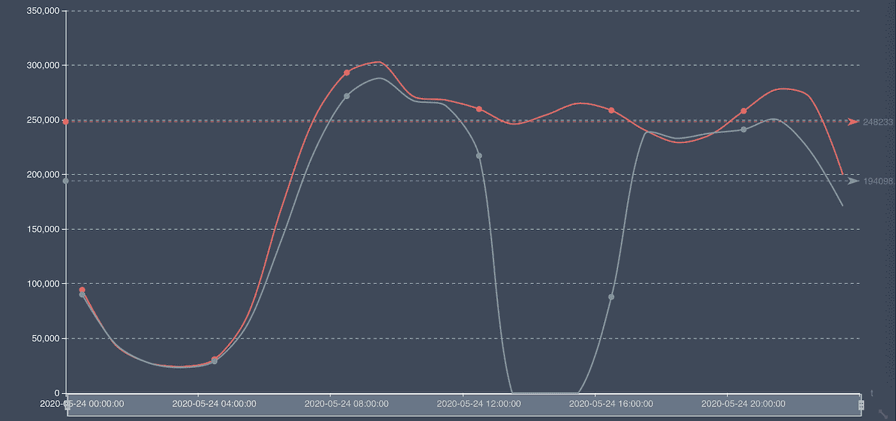
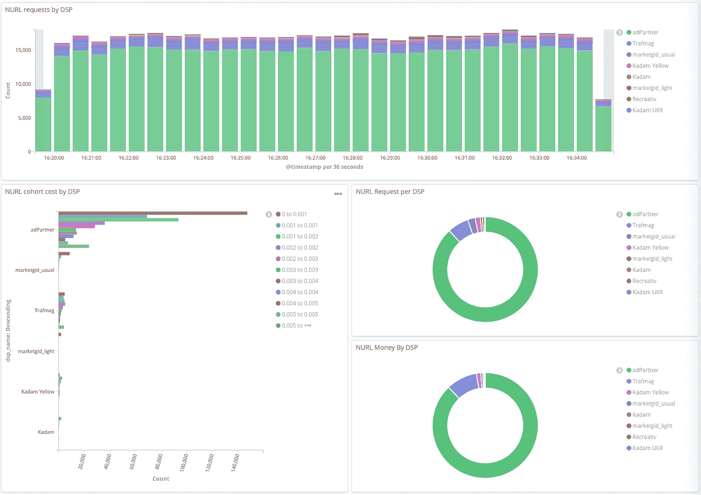
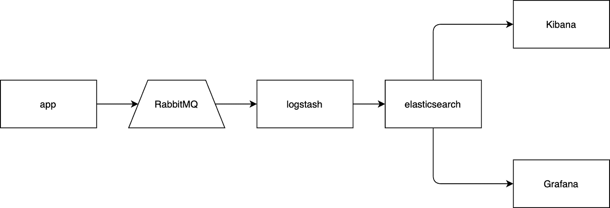
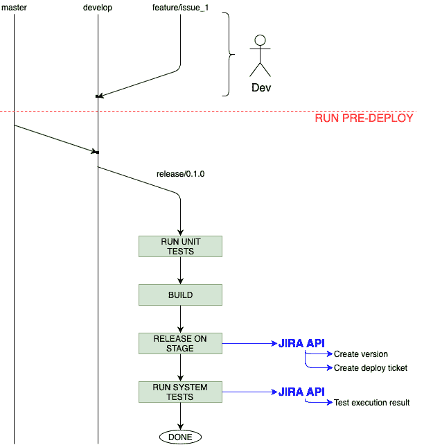
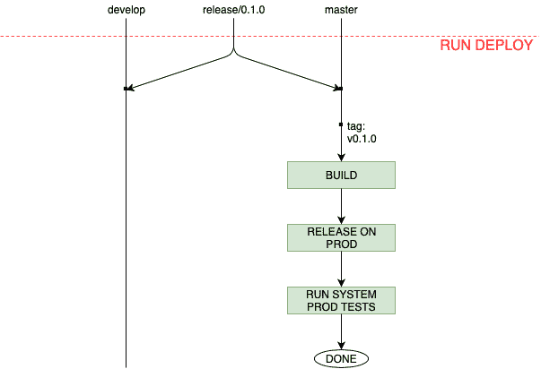

# 软件工程最佳实践。第四部分。自动化。

> 原文：<https://blog.devgenius.io/best-practices-of-software-engineering-part-4-automation-eaf795b9a8d8?source=collection_archive---------24----------------------->

这是我最感兴趣的部分。首先实现起来不难，其次确实有助于摆脱枯燥的工作。自动化可以显著减少团队在测试、评审和发布产品上浪费的时间。此外，它将使你避免日常工作中常见的人为错误。在这篇文章中，我将告诉你我们的过程自动化的方法和内容。

重要的是:当你选择自动化什么和如何自动化时，你应该以常识和必要性为指导。例如:对于一些小的项目，在生产服务器上运行“git pull”来发布项目的新版本，可能是足够好的自动化。

下面是几个我喜欢在开发流程中自动化的例子，以及为什么。

# 1.错误监控

一旦您的项目规模增大，查看日志、检查错误、累计错误数量以及尝试分析夜间发生的事情以及这些事情是否很关键就变得很不方便。

为了解决这个问题，使用了错误聚集系统(软件错误跟踪器)。这些服务允许您监控错误、对错误进行分组、指派负责人来修复错误、接收新事件的通知以及特定时间段内的事件报告。

在互联网上，你可以找到许多这样的服务。比如: [Sentry](https://sentry.io/) 可以作为付费服务，也可以免费安装在你的服务器上。对于特别懒的人来说，只需几分钟就可以用“Docker”配置好这款产品。

# 2.服务器监控

一般来说，每个系统都有最低限度的监控，比如 CPU 使用率、磁盘 I/O、内存使用率、网络流量等参数都是一直被监控的，至少 AWS 和 DigitalOcean 有。这里唯一的问题是，当一个事件发生时，这些参数并没有回答这个问题:到底哪里出了问题？

可惜我不能说你要监测哪些参数才能回答这个问题。这取决于你的目标和项目。在我们的项目中，我们观察 30 多种不同的参数，比如每秒 MySQL 更新查询的数量、MySQL slave 延迟、GO 守护进程内存使用、Celery 中已处理任务的数量、缓存使用、Cassandra 表大小等等。

以下是一些要点，良好的监控可以帮助您:

*   首先，良好的监控将有助于预测问题。并且，您将有机会在用户知道之前及时对问题做出响应。
*   有了监控，回答这个或那个问题从何而来的问题就容易多了。
*   通过监控，您可以长期跟踪各方面的趋势，从而告诉我们:未来有什么在等着我们，我们何时必须扩张，以及我们需要做什么来优化我们的支出。

如果你使用硬件服务器，Zabbix 监控系统可能是最受欢迎的。开箱即用，它已经可以监测服务器上的许多指标，为此，它足以安装 zabbix-代理的服务器上，你想监测。还可以通过 API 向 Zabbix 发送任何参数，这允许您监视任何东西。

当您刚刚开始设置您的监控系统时，重要的是要明白您不会立即添加所有重要的参数，这是因为您不知道将来您会在哪里有弱点。因此，在事件发生后，总结出问题所在并向您的监控添加新指标是非常重要的。有时，它可能是一个非常奇怪的指标，例如:我们添加了“域到期”指标，它显示了离域到期日期还有多少天，并设置了一个触发器，它将在到期日期前一个月开始每周通知我们。我们在一次忘记为我们的一个域名付费的事件后添加了它。

监控系统应满足哪些要求:

*   提供向监控快速添加新指标的能力。如果添加一个新的指标需要很长时间，没有人会去做。因此，你的监控对你没有任何好处。
*   能够创建仪表板。如果为了评估一个资源的操作，你需要浏览几页，那么很可能你不会看到错误或者根本不会去做。仪表板的价值是在一个页面上显示对系统至关重要的一切。或者，你可以看到一些图表或数字之间的关系，这有助于你更好地了解你的系统。
*   通知系统。应该可以配置触发器来响应异常的系统参数，并向您发送通知，如电子邮件、公司聊天中的消息或 sms。

# 3.业务绩效监控

这一点在思想上类似于系统监控，但是它应该遵循其他参数，即对于您的项目很重要的业务指标。这可能是:用户的页面访问，今天的收入，投资回报率等。

以下是一些例子:

在这张图表上，您可以看到与昨天相比，今天每小时发送的电子邮件的统计数据。在正常情况下，我们有两条相似的线。但是在本例中，您可以看到从中午 12 点到下午 4 点，我们遇到了问题，电子邮件没有发送。

此工具栏显示了合作伙伴销售广告流量的统计数据。如果某个合作伙伴开始购买更多的流量，或者从列表中消失，我们可以实时看到这一点，我们应该注意这一点，并进行调查，以找出是否一切正常。

业务监控系统的要求:

*   轻松添加新跟踪参数的能力
*   统计数据应该在实时模式下更新
*   经理能够轻松创建仪表板

简而言之，我会告诉你我们是如何在我们的项目中毫不费力地实现这个系统的。这个系统的基础是[麋鹿](https://www.elastic.co/what-is/elk-stack)栈。该解决方案不仅允许实时收集数据，还允许拥有一个分析工具，这为经理们自己做一些分析工作提供了机会。此外，该解决方案易于扩展，因为该技术采用集群模式。

我们使用[基巴纳](https://www.elastic.co/kibana)和[格拉夫纳](https://grafana.com)进行数据可视化。他们每个人都有自己的优势。例如，Grafana 不仅可以处理来自 [ElasticSearch](https://www.elastic.co) 的数据，还可以处理不同的数据库或 REST API。当来自不同来源的指标应该在同一页面上时，这对于构建全球仪表板非常重要。

数据流看起来像这样:

1.  最初，应用程序将带有必要参数的消息发送到消息队列，这使您不必浪费时间立即处理这些数据。
2.  [Logstash](https://www.elastic.co/logstash) 从队列中取出消息，经过处理后，将它们扔进 ElasticSearch。之后，您就可以处理数据了。
3.  当你在 Kibana 或 Grafana 中访问一个报告页面时，他们会从 ElasticSearch 中获取数据并为你可视化。

此外，这个系统有时被用来代替一个错误追踪器，但在我看来，它不能成为一个成熟的软件错误追踪器。但是，我们仍然会将应用程序中的一些我们知道并希望监控的错误发送给 ELK。

# 4.发布自动化

当您的项目增长时，您肯定会面临长时间发布的问题。发布过程会变得越来越复杂，花费的时间也越来越多。过程的复杂还会加入人的因素，即由于粗心导致的错误会越来越多。

出于这个原因，监控这样的指标是非常重要的:在一个发布上花费了多少时间([部署成本](https://medium.com/@kirillmedvednykov/best-practices-of-software-engineering-part-2-velocity-metrics-692c401acb4b))，在发布上花费了多少冲刺时间，以及修复与部署相关的问题所花费的时间。当您需要关注发布自动化时，这些指标将会对您有所帮助。

例如，您不仅可以自动将新的构建部署到生产服务器，还可以自动组装发布本身。从削减发布分支和合并所有必要的分支开始，为将来的工作在吉拉创建发布/问题，并运行各种测试。使用像 [Jenkins](https://www.jenkins.io) 或 [Bitbucket](https://bitbucket.org/) 或 [Gitlab](https://about.gitlab.com) 等解决方案可以非常容易地创建这样的脚本。

下图描述了发布的准备工作，显示了可以自动化的基本步骤。负责新版本部署的开发人员只需将所有必须部署的分支合并到一个分支(在图中是“开发”分支)，并运行特定的“预部署”任务，该任务将执行团队的所有日常工作。在我们的项目中，我们使用[这种](https://nvie.com/posts/a-successful-git-branching-model/)方法进行分支命名和流，因此，在图中我使用了来自上述文章中的[的名称。](https://nvie.com/posts/a-successful-git-branching-model/)

1.  将“主”分支合并到“开发”中，然后创建“发布”分支。它允许我们避免这样的情况:develop 没有提交，但是 master 有。当然，如果你使用正确的 git-flow，这是不会发生的，我们就是这样做的。但是，还是发生了。
2.  “预部署”任务的下一步是单元和功能测试。除了系统测试，我们所有的测试都应该在运行。
3.  然后它构建将要发布的 Debian 包。
4.  Debian 包部署在测试服务器上进行回归测试。构建完成后，脚本在吉拉创建一个版本和一个发布问题，以便在将来的这个问题中链接测试执行结果。这有助于节省手动操作的时间。
5.  接下来，“预部署”任务运行包含 E2E 场景的系统测试。在这个例子中，测试将他们的工作结果发送给吉拉，并将它们写入“TestExecution”问题，并将其链接到发布问题。它允许我们在一个地方看到发布的状态，并看到一个总体的图片，如果有必要，我们还可以修改以前的发布，并看到所有的状态。这对于调查事故非常有用。

如果其中一个步骤失败，我们会停止“预部署”任务，并通知团队出现了问题，发布还没有准备好。在相反的情况下，QA 工程师开始他们的工作，他们可以手动进行一些测试或者重新检查一些他们认为重要的功能。而且，如果 QA 将我们的部署问题转移到“准备部署”状态，我们可以继续发布。为此，我们有一个不同的任务，如下图所示。

1.  将发布分支中的代码合并到开发和主分支中，这样两个分支都是最新的。
2.  用发布版本推送一个 git 标签。
3.  为发布构建一个 Debian 包。
4.  在所有服务器上部署新版本。
5.  运行系统测试(E2E 场景)，特别适合在真实项目中运行。
6.  质量保证工程师验证发布。

重要的是要注意:自动化的复杂性和行动的顺序主要取决于您团队中的开发过程。而且，我在示例中展示的步骤可能对您的项目没有用处。

# 5.环境同步

一个常见的问题是，当一个新版本在阶段服务器上运行良好，而在生产服务器上却不能运行。原因在于开发、测试和生产服务器之间的环境差异。

保持所有服务器在相同的状态下同步是一项非常困难的任务，尤其是当您有多个环境时，例如:生产、生产前、阶段 01、阶段 02、qa、开发等。我可以很有信心地说，手动做这个不太现实。为了做到这一点，我们使用诸如 [Ansible](https://www.ansible.com) 或 [Puppet](https://puppet.com) 这样的工具。它们允许我们制作在所有服务器上同等执行的剧本。

通常情况下，项目托管在几个服务器上，拥有一个项目的几个完整副本进行开发可能会非常昂贵。但是，至少生产前环境应该是生产环境的完整副本。

# 6.工具之间的链接

一个更有利可图的事情是将不同的工具集成到一个基础设施中，这将有助于加速开发过程。例如，最常见的问题之一是缺少项目文档，解决这个问题并不像看起来那么简单。文档迟早会过时，没有时间或意愿去纠正或更新它。通过将 git 提交链接到进行该提交的任务，这个问题得到了部分解决。为此，将每个注释中的任务号添加到提交中就足够了。当开发人员需要了解为什么要实现此功能或为什么需要某段代码时，他可以找到更改这部分代码的提交，并通过此提交的链接在问题跟踪器中打开影响这段代码的任务。并且，如果在任务中有足够的描述，问题的图片应该是清楚的。

链接示例:

*   每次提交的注释应该是来自问题跟踪器的指定数量的问题。如果你使用 Bitbucket 和吉拉，你可以很容易地[链接它](https://confluence.atlassian.com/bitbucket/connect-bitbucket-cloud-to-jira-software-cloud-814190686.html)。它会帮助你找到任何你需要知道的关于这个任务的信息。此外，它可以解决文档问题，就像我之前写的那样。
*   当然，如果你使用 REST APIs，你可以在 Zabbix 和 Sentry 中为每个新版本创建一个新版本。这个解决方案帮助您看到系统行为中的异常，检测缺陷，并了解它们是在哪个版本之后发生的。

# 7.低级 IT 基础设施自动化

在我看来，这个主题与 DevOps 团队的关系比与开发团队的关系更大，但是它非常重要，我不想完全跳过它。

我所说的低级自动化是指设置和管理服务器、虚拟机、服务等。这样做的目的是将时间从日常事务中解放出来，不是为了娱乐和放松，而是为了解决将导致项目成功的问题。自动化将有助于解决以下问题:

*   通过自动配置额外的服务器或虚拟设备，快速提高系统性能
*   各种服务的安装和配置:从 web 服务器到数据库和各种其他服务
*   减少 DevOps 团队的“人为错误”等错误
*   在最低级别提高整个 IT 基础架构的全球 SLA:从硬件到运行服务
*   通过自动化定期重复的手动工作来提高 DevOps 团队的速度。自动化并以最短的时间用作未来周期的模板

为了在我们的项目中实现最大程度的自动化，我们使用特殊的软件，如 Ansible 和 Puppet。这些是构建重复性基础设施所需的配置管理系统( [SCM](https://en.wikipedia.org/wiki/Software_configuration_management) )。

Ansible 易于使用，具有无代理架构(不需要在目标系统上安装代理或客户端)和类似 YAML 的 DSL，用 Python 编写，易于通过模块扩展。通常管理 Linux 配置。

Puppet 有一个客户端-服务器架构(定期轮询服务器，以对网络管理员所做的配置进行更改)，用 Ruby 编写，有一个类似 Ruby 的 DSL。此应用程序允许您集中管理安装在多台计算机上的软件的配置。

在互联网上，您可以找到关于这些产品的更多信息，以及对这些工具优缺点的解释。我们在项目中使用了这两种方法。

*“我们没时间磨锯了，我们要去砍柴”*。我不记得我是在何时何地听到这句话的，但它指出我们必须提高自动化流程的效率。

## 软件工程的最佳实践

1.  [目标](https://medium.com/@kirillmedvednykov/best-practices-of-software-engineering-part-1-goals-4457a907e756)
2.  [速度指标](https://medium.com/@kirillmedvednykov/best-practices-of-software-engineering-part-2-velocity-metrics-692c401acb4b)
3.  [自动测试](https://medium.com/@kirillmedvednykov/best-practices-of-software-engineering-part-3-autotests-d74c13086742)
4.  [自动化](https://medium.com/@kirillmedvednykov/best-practices-of-software-engineering-part-4-automation-eaf795b9a8d8)
5.  [代码质量](https://medium.com/dev-genius/best-practices-of-software-engineering-part-5-code-quality-164e9c87d6db)