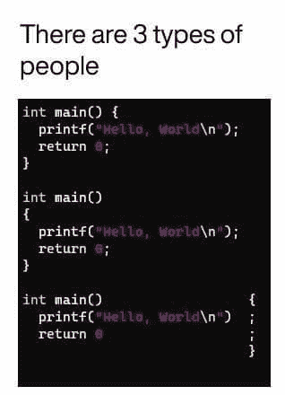

# 2021 年最佳编程幽默汇编

> 原文：<https://blog.devgenius.io/best-programming-humor-compilations-2021-623473bfb0d?source=collection_archive---------1----------------------->

## 编程迷因可以减轻你的压力

卡罗琳·赫尔南德斯在 [Unsplash](https://unsplash.com?utm_source=medium&utm_medium=referral) 上的照片

你听过“笑是压力最好的良药”吗？

但是怎么做呢？心情不好的时候怎么笑或者微笑？

今天，我试着整理一些我在网上和脸书发现的让我笑逐颜开的**笑话/迷因**，希望它也能让你笑逐颜开…

> 开始了…准备好你的第一剂…

# 我还没想到土豆的这种深层次的激励信息…

[https://www . Facebook . com/JavaScript js/photos/a . 1387402908063976/2154381918032734/](https://www.facebook.com/javascriptJS/photos/a.1387402908063976/2154381918032734/)

# 乍一看，对我来说是一样的..然后发现括号是如何处理的…太旧了，可能因为我们现在已经格式化了…

[https://www.facebook.com/groups/programming.jokes](https://www.facebook.com/groups/programming.jokes)

# 当我的学长要求编写单元测试时…我相信我的程序也是这样做的…

[https://www.monkeyuser.com/](https://www.monkeyuser.com/)

# 语法错误，我们这里不这样做… python

来源:[https://www.facebook.com/programminggeeks.in](https://www.facebook.com/programminggeeks.in)

# 当你想象编程术语在我脑海中的样子…

[https://www.monkeyuser.com/](https://www.monkeyuser.com/)

# 可能需要两者的同等比例来平衡行业…

[https://www.facebook.com/techindustan/](https://www.facebook.com/techindustan/)

# 电影(三个白痴)中关于工资的一段很好的对话，非常适合软件行业…

[https://www.thecoderpedia.com/blog/programming-memes](https://www.thecoderpedia.com/blog/programming-memes)

# 谁能定义什么是最好的开发者？对我来说，大概是这样的…

[https://www.monkeyuser.com/](https://www.monkeyuser.com/)

# 当你和很多人打交道时…一切都是公平的…甚至谎言也是…哈哈

[https://www . Facebook . com/JavaScript js/photos/a . 1387402908063976/2150614578409468/](https://www.facebook.com/javascriptJS/photos/a.1387402908063976/2150614578409468/)

# 最糟糕的时刻是当你的学长要求一起审查我的代码，因为他什么也不懂…

[https://www.facebook.com/ProgrammersCreateLife](https://www.facebook.com/ProgrammersCreateLife)

# 奖励时间:

# 我不需要你…让我放下你，伙计…

[https://www . Reddit . com/r/programmer humor/comments/oo 16 aa/im _ sorry _ dear _ data/](https://www.reddit.com/r/ProgrammerHumor/comments/oo16aa/im_sorry_dear_data/)

# 不要教我写了什么…哈哈

[https://www . Reddit . com/r/programmer humor/comments/oo 4 TTU/worlded _ Obama/](https://www.reddit.com/r/ProgrammerHumor/comments/oo4ttu/perplexed_obama/)

# 需要经历几个阶段？

[https://www.monkeyuser.com/2017/code-review-stages/?sc=true&dir = random](https://www.monkeyuser.com/2017/code-review-stages/?sc=true&dir=random)

# 希望我的周期到达那里…但是如何？

[https://www.monkeyuser.com/2017/testing-vs-prod-env/?sc =真&dir =随机](https://www.monkeyuser.com/2017/testing-vs-prod-env/?sc=true&dir=random)

# 我靠编程挣钱…

[https://www.facebook.com/photo/?fbid=349251050087280&set = GM . 1262598024177843](https://www.facebook.com/photo/?fbid=349251050087280&set=gm.1262598024177843)

# 一切皆有可能…

[https://www . Facebook . com/techwithcodex/photos/a . 137007467972178/331986501807606/](https://www.facebook.com/techwithcodex/photos/a.137007467972178/331986501807606/)

# 不要和我有眼神接触..我是最棒的…哈哈

[https://Twitter . com/MayaShavin/status/1414659230833971205/photo/1](https://twitter.com/MayaShavin/status/1414659230833971205/photo/1)

# 没有布尔怎么有主见？

[https://Twitter . com/realColinMac/status/1375360353442295811/photo/1](https://twitter.com/realColinMac/status/1375360353442295811/photo/1)

# 同辈压力？他会让我们的周末变得很糟糕…

[https://imgur.com/t/funny/Mk5F6E1](https://imgur.com/t/funny/Mk5F6E1)

# 不要试图问愚蠢的问题…这里的完美答案…

[https://programmer humor . io/programming-memes/actual-photo-the-stack overflow-hiring-process/](https://programmerhumor.io/programming-memes/actual-photo-of-the-stackoverflow-hiring-process/)

# 哇！新定义…满栈表示我已经满了… LOL

[https://programmer humor . io/programming-memes/I-love-me-a-good-full-stack-of-煎饼-%f0%9f%a5%9e/](https://programmerhumor.io/programming-memes/i-love-me-a-good-full-stack-of-pancakes-%f0%9f%a5%9e/)

# 我们不知道我们到底想要什么…但我们希望尽快——客户

【https://programmerhumor.io/programming-memes/yes-now/ 号

# 这个图像可以制造很多迷因…让我们用编程一…

[https://programmer Hume . io/programming-memes/legacy-code-comments/](https://programmerhumor.io/programming-memes/legacy-code-comments/)

# 让我们通过添加注释使我的代码更具可读性吧

[https://programmer humor . io/programming-memes/more-like-commenting-whole-code/](https://programmerhumor.io/programming-memes/more-like-commenting-whole-code/)

# 我的代码是我做的研究…它是工作，这就够了…

[https://www.facebook.com/photo/?fbid=515368519672176&set = GM . 2881890155411868](https://www.facebook.com/photo/?fbid=515368519672176&set=gm.2881890155411868)

# 让我们重构变量名和方法名…这就足够了，因为逻辑可以是相同的

[https://www.facebook.com/photo/?fbid=912219536303209&set = GM . 2881823462085204](https://www.facebook.com/photo/?fbid=912219536303209&set=gm.2881823462085204)

# 是啊。我也忘了办公室的衣服…

[https://www . Facebook . com/JavaScript js/photos/2204497796354479/](https://www.facebook.com/javascriptJS/photos/2204497796354479/)

# 我爱你，我的朋友…你做得很好…

[https://www.facebook.com/ICT.LK99/photos/a . 109557074287643/295998745643474/](https://www.facebook.com/ICT.LK99/photos/a.109557074287643/295998745643474/)

# 周五的一些动力？

[https://www . Facebook . com/jokesvala/photos/a . 2339158462775928/6317562231602178/](https://www.facebook.com/jokesvala/photos/a.2339158462775928/6317562231602178/)

# 说真的，不知何故这是真的…

[https://www . Facebook . com/jokesvala/photos/a . 2330223400336101/6283562938335441/](https://www.facebook.com/jokesvala/photos/a.2330223400336101/6283562938335441/)

# 他们嫉妒我的幸福

[https://www . Reddit . com/r/programmer humor/comments/oiiwi 3/there _ goes _ away _ one _ more _ Sunday/](https://www.reddit.com/r/ProgrammerHumor/comments/oiiwi3/there_goes_away_one_more_sunday/)

# 不正确，但是让我们想想…

[https://www . Reddit . com/r/programmer humor/comments/oinxee/the _ truth _ can _ hurt _ something/](https://www.reddit.com/r/ProgrammerHumor/comments/oinxee/the_truth_can_hurt_sometimes/)

# 我到底做了什么来解决这个问题…也许什么也没做…

[https://www . Reddit . com/r/programmer humor/comments/oimbw 6/things _ that _ magically _ work _ but _ you _ dont _ know _ why/](https://www.reddit.com/r/ProgrammerHumor/comments/oimbw6/things_that_magically_work_but_you_dont_know_why/)

# 你需要学习交易…来处理 API

[https://www . Reddit . com/r/programmer humor/comments/oh H9 NV/200 _ ok/](https://www.reddit.com/r/ProgrammerHumor/comments/ohh9nv/200_ok/)

# 还有谁会因为认为警告有助于节省时间而忽视警告呢？

[https://www . Reddit . com/r/programmer humor/comments/ofe exz/inner _ peace/](https://www.reddit.com/r/ProgrammerHumor/comments/ofeexz/inner_peace/)

# 单元测试意味着增加覆盖率……(有时)

[https://www.reddit.com/r/ProgrammerHumor/](https://www.reddit.com/r/ProgrammerHumor/)

# 人工智能出错

[https://www . Reddit . com/r/programmer humor/comments/ojf 2 eu/ai/](https://www.reddit.com/r/ProgrammerHumor/comments/ojf2eu/ai/)

# 重新编译…我怎么总是忘记？

[https://www . Reddit . com/r/programmer humor/comments/ojdicf/it _ happen _ more _ once/](https://www.reddit.com/r/ProgrammerHumor/comments/ojdicf/it_happened_more_than_once/)

# 一些噩梦…还是现实？

[https://www.monkeyuser.com/2019/great-expectations/?sc=true&dir = random](https://www.monkeyuser.com/2019/great-expectations/?sc=true&dir=random)

# 你错过了以前的搞笑炸弹吗？看看这里，爆发你的快乐…

 [## 日常的编程笑话

### 最佳编程迷因汇编(第八部分)

javascript.plainenglish.io](https://javascript.plainenglish.io/daily-dose-of-programming-jokes-23033e597df5)  [## 日常的编程笑话

### 最佳编程迷因汇编(第七部分)

javascript.plainenglish.io](https://javascript.plainenglish.io/daily-dose-of-programming-jokes-4bf75727f36d)  [## 25 个以上的 StackOverflow 编程迷因，所有开发人员都可以涉及到

### 编程幽默可以通过刷新你的情绪来减轻你的压力

javascript.plainenglish.io](https://javascript.plainenglish.io/25-more-stackoverflow-programming-jokes-that-all-devs-can-relate-to-ebc2f9c11ca3)  [## 11 个能让你心情愉快的编程迷因

### 2021 年最佳编程迷因

javascript.plainenglish.io](https://javascript.plainenglish.io/11-programming-memes-that-will-lighten-up-your-mood-e165be3513ea)  [## 2021 年最佳编程幽默汇编

### 编程迷因可以减轻你的压力

blog.devgenius.io](/best-programming-humor-compilations-2021-623473bfb0d)  [## 有趣的编程迷因会让你笑死

### 编笑话来点亮你的周五

blog.devgenius.io](/funny-programming-memes-that-will-make-you-die-laughing-1ccd8e139040)