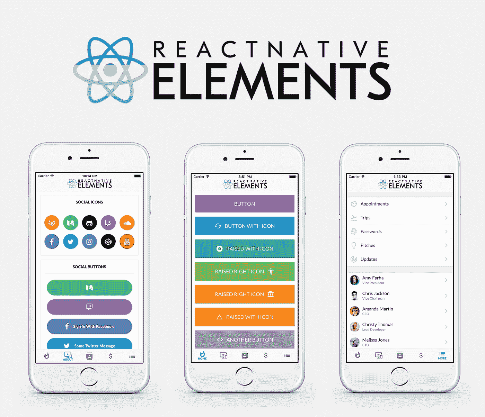

# 在您的下一个项目中使用的最佳反应本机组件库

> 原文：<https://blog.devgenius.io/best-react-native-component-libraries-to-use-in-your-next-project-6f8bad39371f?source=collection_archive---------3----------------------->

## 2021 年最佳 5 个组件库

反应自然

在 ReactJS 和 React Native 中使用组件库可以在开发过程中产生巨大的差异，尤其是如果您的应用程序具有复杂的 UI。今天我们将讨论我个人推荐的最好的 React 本地组件库，重要的是要提到这些建议没有任何特定的顺序。

# 1.反应原生元素:

React Native Elements 是一个跨平台的组件库，在不同平台(Android、IOS、Web)上保持一致的设计，这是一个完全用 Javascript 构建的易于使用的库，值得一提的是，它完全支持 Expo。React Native Elements 是超级可定制的，它是一个 100%由社区构建的社区驱动的项目，这个库是我迄今为止最喜欢的一个，我强烈推荐给任何正在搜索组件库的人使用: [link](https://reactnativeelements.com/) 。

反应本地元素

# 2.反应原生纸:

React Native Paper 是 React Native 的一个可定制和可生产的组件集合，遵循谷歌的材料设计指南，它也完全支持 expo，真正重要的是，它对所有组件都有明暗主题支持，所以，如果你想遵循谷歌材料设计模式，并且你正在寻找一个组件库来帮助你以简单有效的方式做到这一点，那么 React Native Paper 是最合适的解决方案:[链接](https://callstack.github.io/react-native-paper/)。

反应原生纸

# 3.NativeBase:

NativeBase 是 React Native(和 Vue Native)的另一个跨平台组件库，它有许多跨平台、易于使用的库，像其他两个库一样，NativeBase 完全支持 expo，他们很快将发布 NativeBase 3.0，我以前在我的一个 React Native 项目中使用过这个库，我真的鼓励任何人尝试一下:[链接](https://nativebase.io/)。

反应本机 NativeBase

# 4.React 原生 UI 小猫:

当谈到在 React Native 中构建 UI 时，React Native UI Kitten 是一个很好的解决方案，值得一提的是 React Native UI Kitten 是一个 UI 框架(不是库)，但你可以在任何现有的代码库中使用它，你所要做的就是遵循[手册安装指南](https://akveo.github.io/react-native-ui-kitten/docs/guides/getting-started#manual-installation)，否则，它是 React Native 的一个非常酷的组件库，你真的应该尝试一下:[链接](https://akveo.github.io/react-native-ui-kitten/#/home)。

React 原生 UI 小猫

# 5.戏弄者:

Teaset 是另一个你绝对应该检查的 React 原生组件库，它有许多有趣的 UI 组件，将丰富你潜在的应用程序 UI，到目前为止它在 GitHub 上有 2，8K 颗星，背后有一个很棒的社区，所以你真的需要检查一下:[链接](https://github.com/rilyu/teaset)。

戏弄者

最终，我希望这篇短文能赢得您的赞赏，并感谢您的关注。