# 2021 年最佳智能灯光开关调光器

> 原文：<https://blog.devgenius.io/best-smart-light-switch-dimmer-for-2021-80dd2e4d4a0c?source=collection_archive---------1----------------------->

如果你有智能照明解决方案，智能灯开关和调光器会更适合你的家。当然，这是一个伟大的时间来填补你的家与你的新智能之一。有许多好处，如智能照明和调光控制，语音控制，自动化和场景，应用程序控制，运动控制，智能灯泡和插头控制，以及定时器控制。以下是你需要了解的 2021 年最佳智能灯光开关调光器。

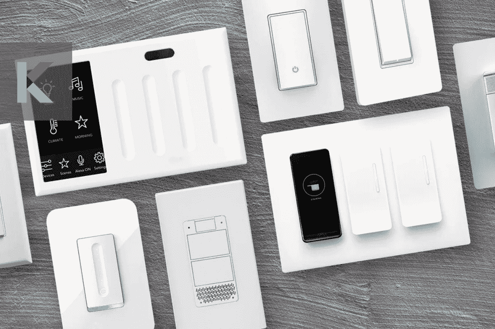

***在这篇文章中，你会发现:***

*   有哪些最好的智能灯光开关调光器？
*   最佳整体智能灯光开关调光器— GE C-Smart 运动传感器灯光开关调光器
*   最佳 3 路智能照明开关调光器— Lutron Caseta 智能照明调光器开关入门套件
*   最经济实惠的智能灯光开关调光器— TP-Link Kasa 智能调光器开关
*   最佳 Zigbee 智能开关调光器— Jasco Enbrighten Zigbee in-wall 智能调光器
*   Google Home 最佳智能灯开关——WeMo Wi-Fi 灯开关调光器
*   Alexa 最佳智能照明开关——Leviton Decora 智能调光开关
*   最佳色调智能灯开关——飞利浦色调智能调光开关
*   智能灯开关的特性比较
*   如何安装智能灯光开关调光器？
*   如何选择智能调光器？
*   智能灯开关的价格、品牌和颜色对比
*   智能调光器值得吗？

# 有哪些最好的智能灯光开关调光器？

## 最佳整体智能灯光开关调光器— GE C-Smart 运动传感器灯光开关调光器

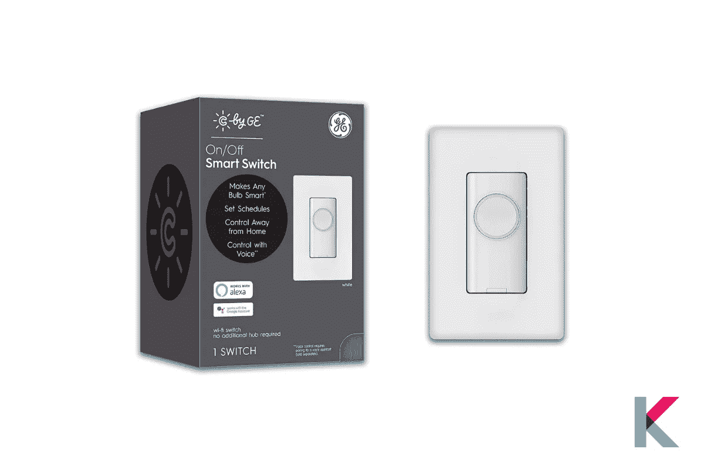

GE C-Smart 运动传感器灯光开关调光器

GE C-Smart 运动传感器灯光开关调光器是最好的带 Wi-Fi 和运动传感器的调光开关。你喜欢用智能开关升级你的家吗？那么这是你最好的选择。它允许你通过简单的触摸、语音助手或 Cync 移动应用程序来控制灯光。它还集成了 Alexa 和 Google Home。

环境光检测和运动传感器根据室内的运动量或自然光来关闭或打开灯泡，从而实现节能和免提控制。当与你的智能设备配对时，它可以让你的灯泡兼容亚马逊 Alexa 和谷歌 Home。不需要集线器，但安装需要中性线。

快一点！ [***从亚马逊***](https://amzn.to/3zLKCME) 获得 GE C-Smart 运动感应灯开关调光器。

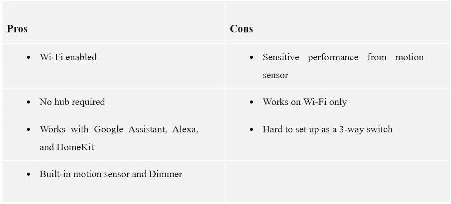

## 最佳 3 路智能照明开关调光器— Lutron Caseta 智能照明调光器开关入门套件

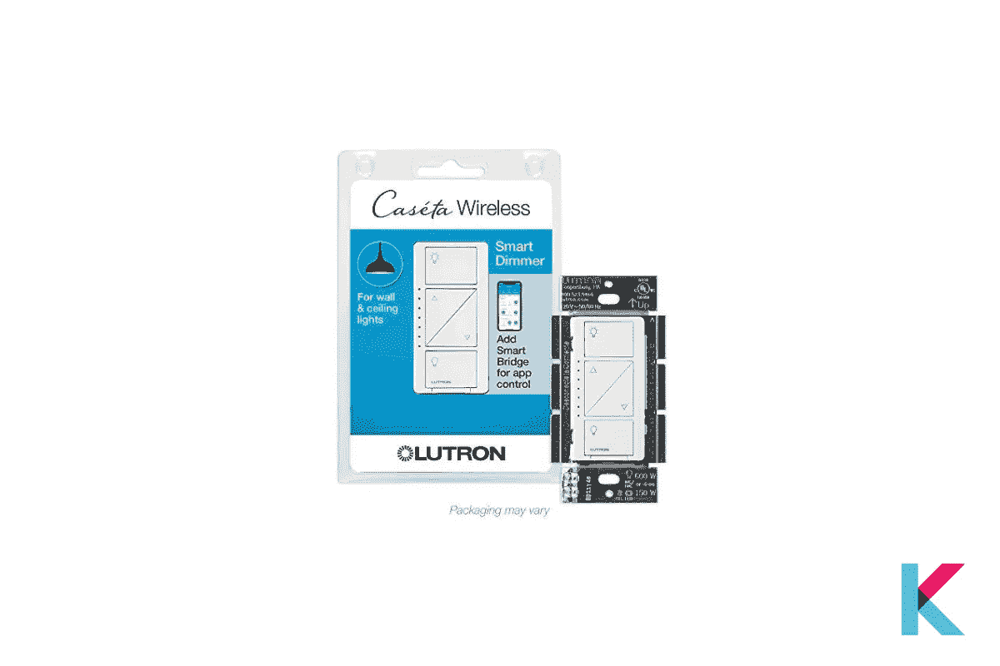

Lutron Caseta 智能照明调光开关入门套件

Lutron Caseta 智能照明调光开关入门套件可与众多智能家居设备配合使用，如扬声器、恒温器、吊扇和电动智能窗帘。它可以让你随意开灯或关灯，让你出门在外时看起来像在家一样。此外，您可以通过语音、Lutron 应用程序或从墙上控制这个开关调光器。

只需轻触一个按钮，您就可以轻松安排灯光来激活场景或在设定的时间进行更改。它不像其他[智能调光开关](https://kodmy.com/smart-light-switch-dimmer/)，它可以在任何家庭中工作，因为它不需要中性线。然而，它有点贵，但 Caseta dimmer 可以与你最喜欢的语音助手配合使用，如[苹果 HomeKit](https://kodmy.com/homekit/) 、[亚马逊 Alexa](https://kodmy.com/the-best-alexa-compatible-devices-in-2021/) 、谷歌助手，以及 Sonos、SmartThings 和许多其他流行的智能家居系统。

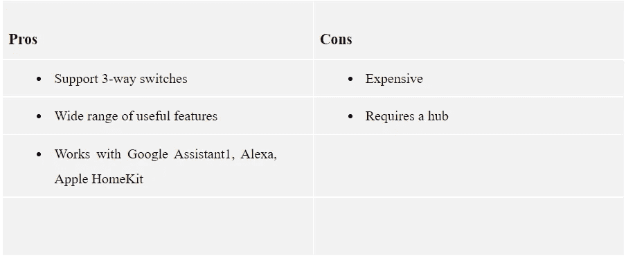

## 最经济实惠的智能灯光开关调光器— TP-Link Kasa 智能调光器开关

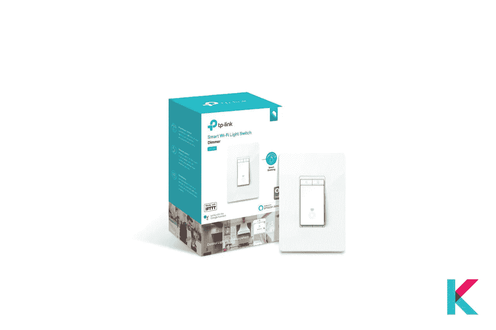

TP-Link Kasa 智能变光开关

TP-Link Kasa 智能调光开关是最便宜的智能开关，具有奇妙的功能。不用担心你的口袋？使用它，你可以轻松地将你的家改造成智能家居。它包括三个按钮，用于开、关和调光。还有，Kasa 智能开关支持谷歌助手、亚马逊 Alexa、IFTT、微软 Cortana 进行语音控制。您还可以使用 Android 和 IOS 应用程序从任何地方控制您的交换机。

它有一些有趣的功能，如调光控制和调度。这款连接 Wi-Fi 的智能开关易于安装，因为它只需要一根中性线。所以，不需要一个枢纽。

快一点！ [***从亚马逊***](https://amzn.to/3kD4TPZ) 获得 TP-Link Kasa 智能调光开关。

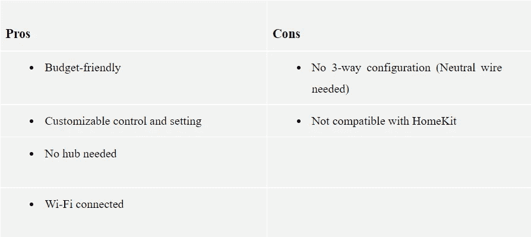

## 最佳 Zigbee 智能开关调光器— Jasco Enbrighten Zigbee in-wall 智能调光器

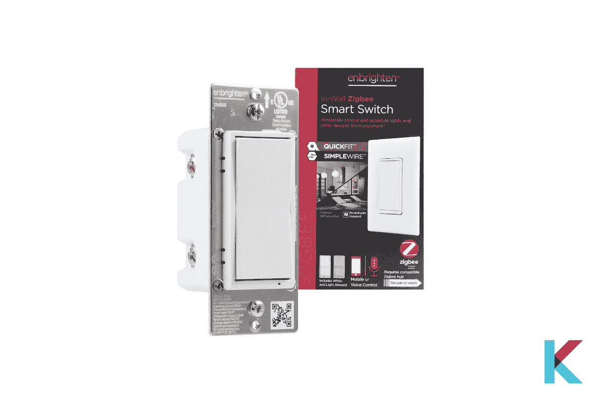

Jasco Enbrighten Zigbee 墙内智能调光器

Jasco Enbrighten Zigbee in-wall 智能调光器是著名的具有 Zigbee 连接功能的智能调光器。你可以用 Echo Show 10，Echo Studio，或者第一代和第二代 Echo Plus 轻松控制它。当通过兼容的 Zigbee hub 连接时，其他谷歌助手和 Alexa 产品也可以用于语音控制。

当与多达四个附加开关配对时，它支持 3 路和多开关配置。它可以与可调光的节能灯、发光二极管、卤素灯和白炽灯泡一起使用。它需要用硬连线连接进行墙内安装。此外，它还具有可靠、安全的家庭自动化功能，支持 Zigbee 3.0 和众所周知的网络密钥。

快一点！[立即从亚马逊获得 Jasco Enbrighten Zigbee 墙内智能调光器](https://amzn.to/3AVOj3y)。

你还可以从沃尔玛花 52.57 美元买到 enbrien Zigbee In-Wall 智能调光器。

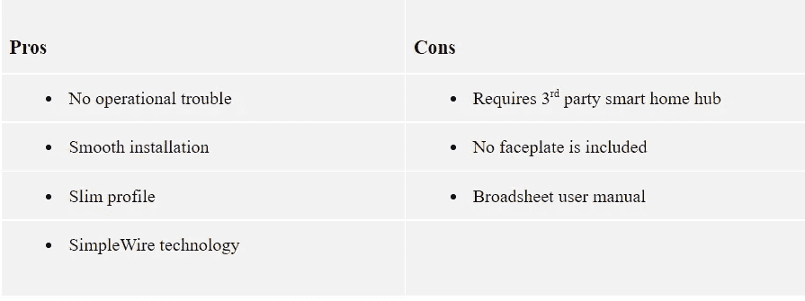

## Google Home 最佳智能灯开关——WeMo Wi-Fi 灯开关调光器

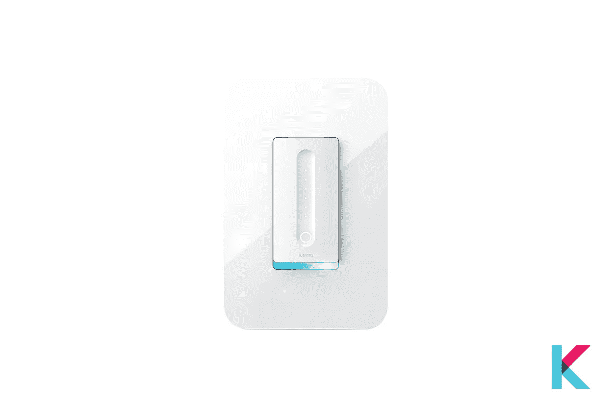

WeMo Wi-Fi 灯光开关调光器

WeMo Wi-Fi 灯光开关调光器是一款价格实惠的智能开关调光器。它最适合谷歌助手，也适用于 Alexa 和苹果 HomeKit。您可以使用语音、墙壁和 WeMo 应用程序从任何地方控制和调暗灯光。它不需要集线器或订阅，但你需要一个中性线。是的。您可以轻松设置日程和计时器。

它有一些奇妙的功能，如夜间模式。您可以随意设置 WeMo 调光器。它保护眼睛免受强光伤害。此外，它与任何单向连接灯开关。不仅调光开关看起来很酷，它著名的 LED 状态灯，而且最好的特点之一是它可以与任何灯泡一起工作，闪烁最小。它是英国和澳大利亚最好的智能灯光开关调光器。

如果您想比较 WeMo Wi-Fi 灯光开关调光器和其他智能开关调光器，您可以查看 [WeMo Wi-Fi 灯光开关调光器功能比较 2021](https://kodmy.com/compare/smart-switches-and-dimmers?modelList=wemo-dimmer-light-switch,kasa-smart-dimmer-switch) 。

快一点！ [***从亚马逊***](https://amzn.to/3o1XETY) 获得 Wemo Wi-Fi 灯光开关调光器。

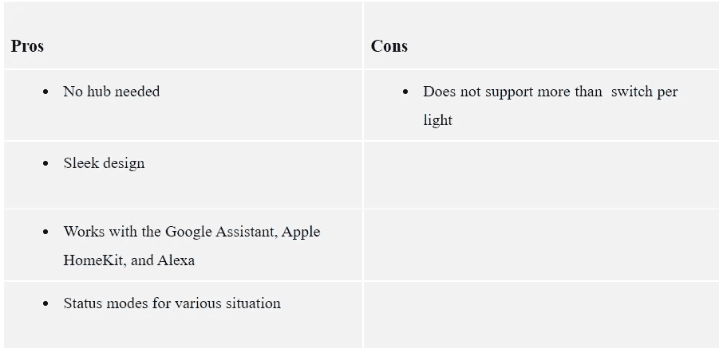

## Alexa 最佳智能照明开关——Leviton Decora 智能调光开关

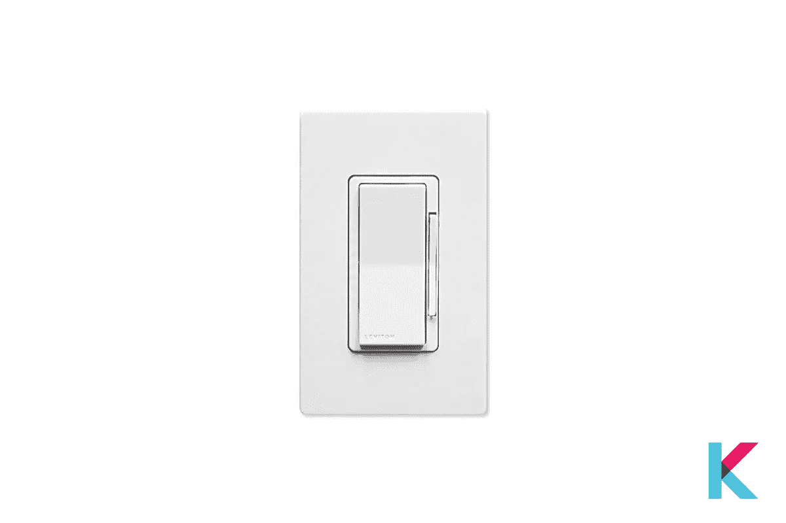

Leviton Decora 智能调光开关

Leviton Decora 智能调光开关采用 Z-Wave 技术设计，主要用于增加通信范围。它不需要无线网络。这款 Leviton 调光开关具有双向反馈功能，并且支持场景。它由支持 Z-wave 的安全系统、网关和集线器支持。

它有一个简单干净的摇滚风格。它允许用户按下底部关闭或顶部打开。它有六种颜色的墙板，适合你的家居装饰。您可以使用语音或通过应用程序控制灯光自动变暗或打开/关闭。还有一件重要的事情要记住，你需要单独的 Z-Wave 支持中心，如 SmartThings 或 Wink。

快一点！ [***从亚马逊*** 获得采用 Z-Wave 技术的 Leviton DZ6HD-1BZ Decora 智能 600W 调光器。](https://amzn.to/3zAm4WV)

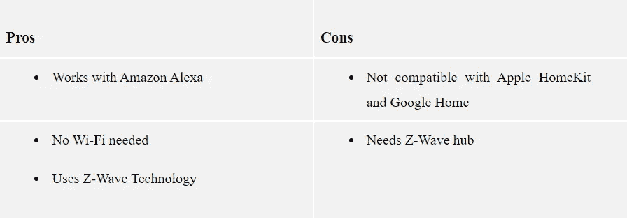

## 苹果 HomeKit 最佳智能灯开关——罗格朗 Tru——通用智能调光开关

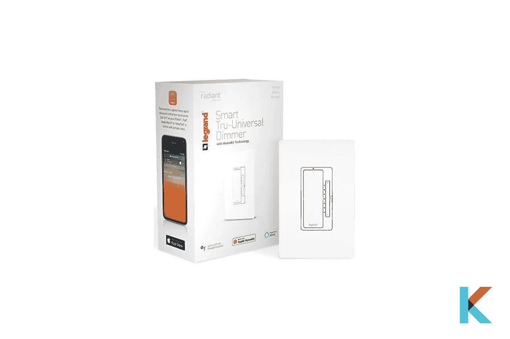

LeGrand Tru-通用智能调光开关

LeGrand Tru-Universal Smart Dimmer Switch 包含了可直接连接到 Wi-Fi 网络的奇妙功能。这是你家最好的苹果 homekit 调光开关，也兼容谷歌 Home 和亚马逊 Alexa。您可以控制每一个标准灯泡，自动检测，并与 CFL，LED，白炽灯，卤素灯和 EFL 灯泡校准。

你可以简单地用中性线安装开关调光器。你可以在 iPhone 上下载 IOS 应用，然后连接 Wi-Fi。此外，它便于您创建场景、组、时间表和调光器。

快一点！ [***从亚马逊***](https://amzn.to/2WntqiV) 获得新款罗格朗 Tru-Universal 智能调光开关。

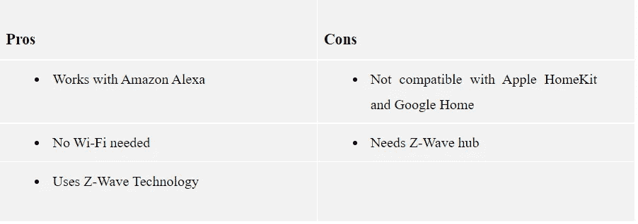

## 最佳色调智能灯开关——飞利浦色调智能调光开关

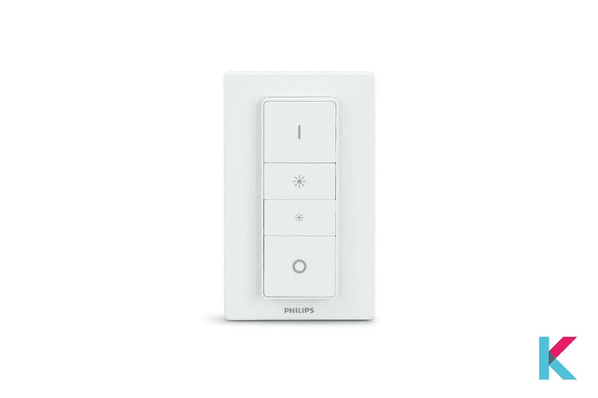

飞利浦 Hue 智能调光开关

飞利浦 Hue 智能调光开关是拥有飞利浦 Hue 智能灯的人的最佳选择。您可以在舒适的沙发或床上轻松控制灯光。这是一款电池供电的无线开关调光器，带有一个遥控器，可以平滑地调节飞利浦灯泡的颜色和亮度，并关闭它们。

这个开关调光器可以通过 Google Home、亚马逊 Alexa、苹果 HomeKit 进行语音控制。您可以使用语音、智能手机或遥控器创建计时器、日程安排和自定义场景。当您将此调光开关与飞利浦 Hue hub 配合使用时，它可用于控制您的任何 Hue 智能设备。

快一点！ [**从亚马逊**](https://amzn.to/3ASnnlx) 获得飞利浦 Hue 智能调光开关。

你还可以从沃尔玛花 98.80 美元获得飞利浦 Hue Smart 可调光 LED 智能灯配方套件。

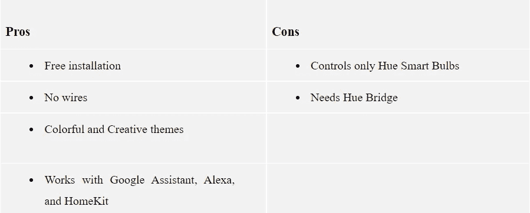

# 智能灯开关的特性比较

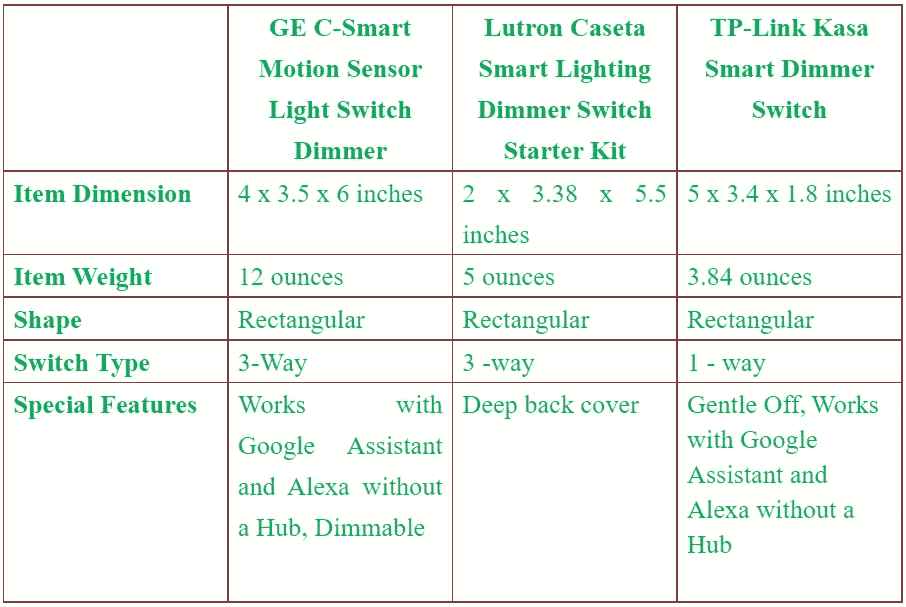

# 如何安装智能灯光开关调光器？

首先，你要选择最好的调光开关，可以是单开关、三向调光器、CFL 和 LED 开关调光器。之后，你必须检查热线。你可以关掉电源，仔细检查盒子里的电线。有时，许多设备和电线塞进一个盒子里会导致危险的过热、火灾和短路。所以你可以使用普通的金属盒尺寸。之后，你要确保盒子足够大。如果你有一个钢盒子，测量它的宽度、深度和高度，以确定盒子的体积。

在连接智能开关调光器之前，您可以测试接地情况。新的开关调光器有一个绿色接地螺钉或绿色接地线，您必须将它们连接到您的接地源。接下来，你可以安装你的调光器和接地夹。下一步，夹住线端，剥去新的线端。之后，连接绞合的开关线。最后，你可以为你的调光开关安装一个盖板，并用螺丝固定在盒子上。

# 如何选择智能调光器？

在为家里选择智能调光开关之前，你需要做出正确的决定。这里是你在选择最好的时候需要知道的。

**中性线要求**:除了线路、地线和负载线之外，许多智能开关调光器还需要中性线。你要确保在你要安装调光开关的地方有一根中性线。

**单极或多极**:如果你想要控制的灯光连接到一个开关，那么你将需要一个单极智能开关调光器。如果您希望控制一个以上的开关，那么您将需要一个多极智能开关。

**控制协议**:一些智能开关调光器连接到你的蓝牙，由一个应用程序控制。Lutron Clear Connect 是一种流行的无线协议。此外，您可以使用 Wi-Fi、Z-wave 和 Zigbee 技术进行控制。

**开关机制**:一些带语音指令的智能开关调光器。有一些开关机制，如摇杆，肘节，或触摸。

**接线**:有几种类型的电气连接，如倒扣、引线和端子。你应该考虑新的开关调光器如何适应现有的电气盒。

# 智能灯开关的价格、品牌和颜色对比

# 智能调光器值得吗？

[智能灯光开关调光器](https://kodmy.com/smart-light-switch-dimmer/)取代了传统的墙壁开关，你可以手动开关，也可以通过语音或应用程序进行控制。你想买一个智能灯开关来控制多盏灯。所以你可以省下你的钱。智能开关调光器消除了传统开关关闭时控制智能灯泡的问题。此外，您可以将智能开关调光器用于任何插座和照明设备。但是，比正常的贵。但是，考虑到它们的优点，这是一件值得做的事情。

***我们挑***

如上所述，如果你想要最好的智能灯光开关调光器，你可以随心所欲地选择这款智能开关。你可以用智能开关和[智能照明](https://kodmy.com/the-best-smart-lighting-2021/)来配置你的家。大多数智能调光开关都可以与亚马逊 Alexa 和谷歌 home 配合使用。更重要的一点是，并非所有智能开关都具有调光功能。但是，智能灯光开关调光器通常会让你多花点钱。你可以控制灯光的亮度。所以，值得为你的智能家居选择。在本文中，您了解了智能灯光开关调光器 google home、Alexa、Apple HomeKit 等等。

如果你对[2021 年](https://kodmy.com/best-smart-wi-fi-routers/)**[最佳智能 Wi-Fi 路由器和](https://kodmy.com/best-smart-air-purifiers/)2021 年最佳智能空气净化器感兴趣，你可能会在这里寻找。**