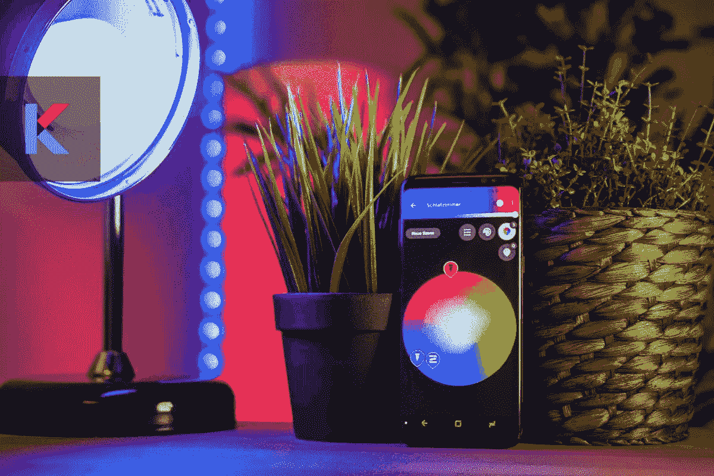
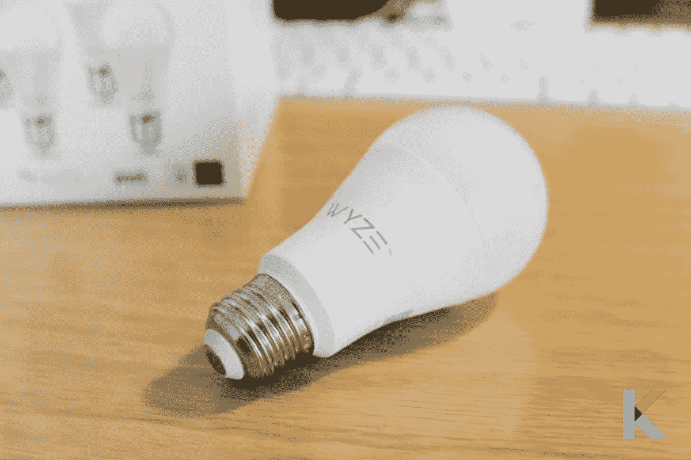
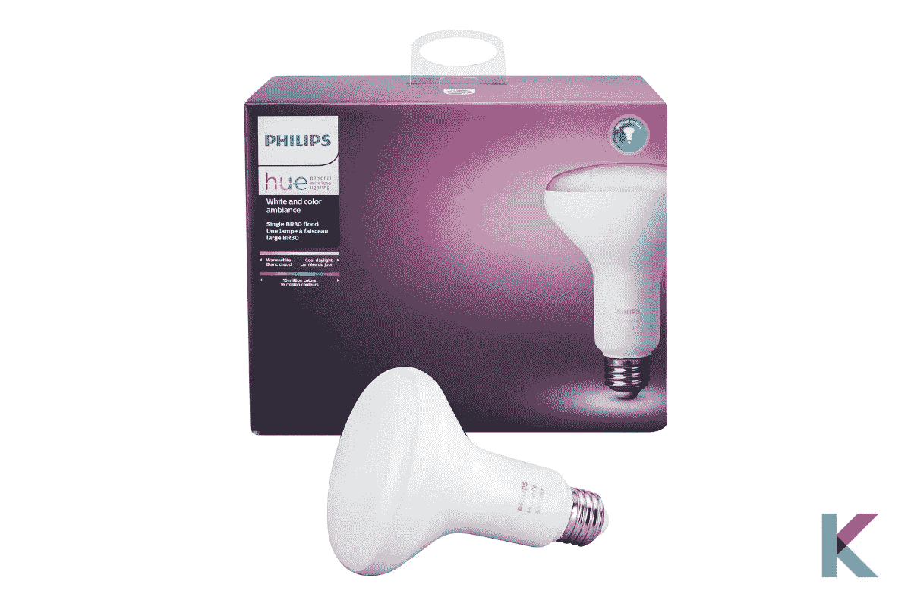
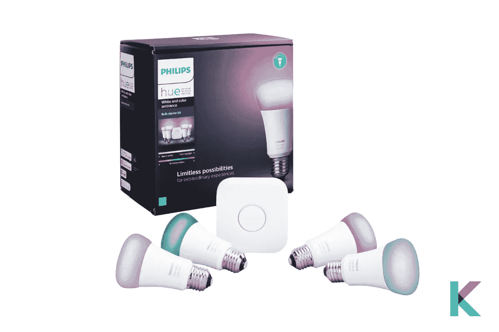
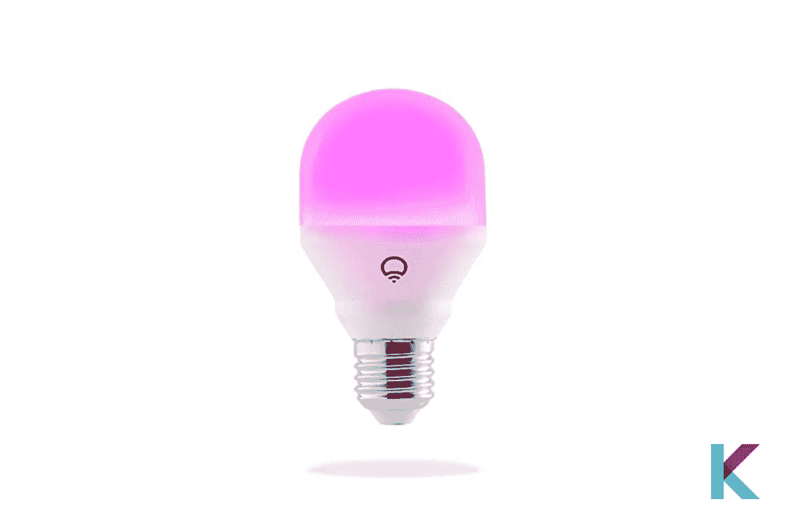
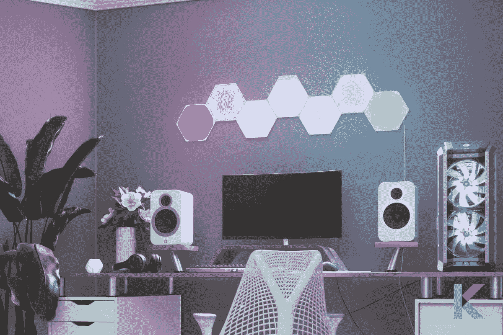
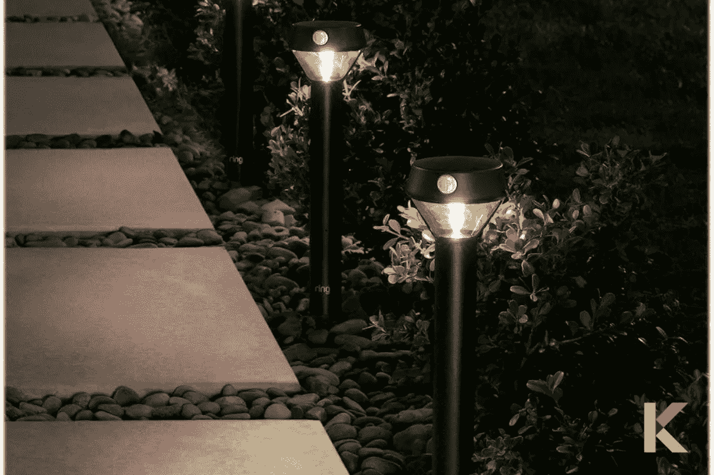
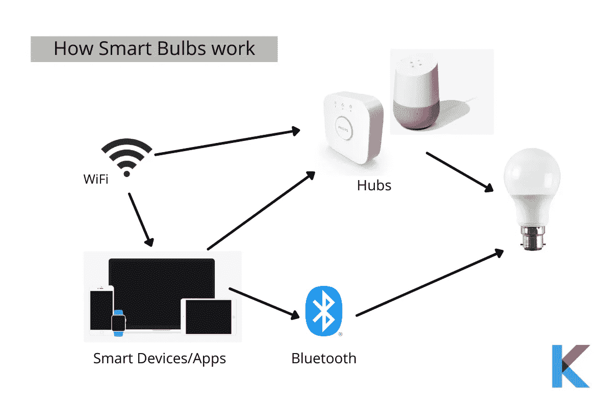
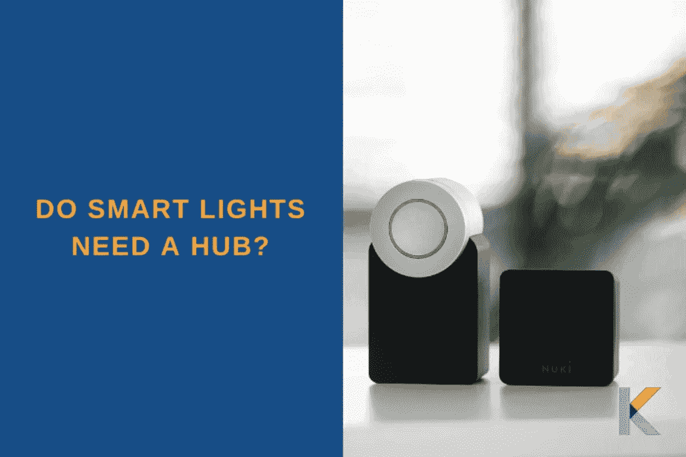

# 最佳智能照明 2021

> 原文：<https://blog.devgenius.io/best-smart-lighting-762b0430ea8c?source=collection_archive---------4----------------------->

是时候放弃你的传统 LED 灯了。现在你可以用你的声音或其他智能设备点亮你的家。如今，到处都有很多智能灯。你将有比以往更多的选择。所以，你必须为你的家选择最好的智能灯泡。以下是选择最佳智能照明 2021 需要了解的内容。

# 你将从中学到什么；

有哪些最好的智能灯泡？

*   最佳白光 LED 智能灯泡— Wyze 灯泡
*   *最佳智能 BR30 泛光灯-飞利浦色相白色和彩色泛光灯 LED*
*   *最佳智能灯泡套件——飞利浦色调白色和色彩氛围*
*   *最佳变色智能灯泡——Lifx 迷你 LED*
*   *最佳变色光板——纳米叶形状——六边形*
*   *最佳户外智能灯——环形太阳能路灯*
*   *最佳智能灯条— Lifx Z 多色灯条*

智能灯泡是如何工作的？

如何选择最好的智能灯泡？

智能灯需要集线器吗？

# 有哪些最好的智能灯泡？

# 最佳白光 LED 智能灯泡

*   **Wyze 灯泡**

Wyze 灯泡

Wyze 灯泡是 Wyze Labs 的白色 LED 灯泡，也是最便宜的智能灯泡之一。它有 9.5 瓦，产生高达 800 流明。我们可以使用 Wyze 应用程序和我们的声音来调暗这个灯泡。它可以直接连接到 2.4 Hz 的 WiFi 网络。此外，你不需要任何额外的集线器来使用或控制它们。您可以使用这个免费的 Wyze 应用程序轻松快速地进行设置。

Wyze Sense 的接触和运动传感器允许您根据运动控制灯光系统。您可以与 IFTTT 集成，将您的[智能家居设备](https://kodmy.com/homekit-compatible-smart-devices/)连接到 Wyze 灯泡。是的。你可以使用谷歌助手和 [Alexa](https://kodmy.com/alexa-echo-dot/) 例程设置打开和关闭自定义日程。当然啦！群组控制是其中一个奇妙的功能。它可以将多个灯泡添加到一个组中，然后您可以使用快捷键同时控制所有 Wyze 设备。

***利弊***

*   它非常实惠
*   它有假期模式
*   易于安装
*   它可以与第三方智能设备和其他 Wyze 产品配合使用
*   它支持谷歌和 Alexa 语音助手
*   不需要集线器
*   功能齐全的应用程序

***弊***

*   它不支持苹果 HomeKit
*   它有一些初始设置问题

如果你喜欢将这款 Wyze 灯泡与其他灯泡进行对比，你可以找到[最佳智能 Wyze 灯泡功能对比 2021](https://kodmy.com/compare/smart-lights?modelList=wyze-bulb,lifx-mini-bulb) 。

快一点！ [**现在从亚马逊获得彩色 Wyze 灯泡**](https://amzn.to/2XU0UGn) 。

# 最佳智能 BR30 泛光灯

*   **飞利浦色相白色和彩色泛光灯 LED**

飞利浦色调白色和彩色氛围 BR30 LED 智能泛光灯

飞利浦 Hue 白色和彩色氛围 BR30 LED 智能泛光灯是最好的带 Alexa 语音控制的泛光灯。它还可以与苹果 HomeKit 和谷歌助手配合使用。您可以将它与现有的 Nestor Samsung Smart Things 系统配合使用，实现家庭自动化。此外，对于聪明的用户来说，它是负担得起的和高效的。它同时使用蓝牙和 Zigbee。因此，你可以跳过色相桥，直接将其与智能手机或智能助理配对。

***优点***

*   它具有智能和调光功能
*   它可以使用色调应用程序进行控制
*   它有一套新的运动传感器和开关
*   它可以与 Alexa、谷歌助手和 HomeKit 配合使用
*   它在一个灯泡内提供了数千种颜色选择。

***缺点***

*   它不便宜，你还需要一个枢纽。这增加了额外的成本。
*   你想要一座桥。所以这是另一个你需要保持连接的设备。

如果你想将这款飞利浦 Hue White 和 Color Ambiance BR30 LED 智能泛光灯与其他灯泡进行比较，你可以找到[最佳色调智能泛光灯功能对比 2021](https://kodmy.com/compare/smart-lights?modelList=philips-hue-led-smart-flood-light,lifx-mini-bulb) 。

快一点！ [***从亚马逊***](https://amzn.to/3kBmUyq) 获得飞利浦色相白 A21 高流明智能灯泡。

# 最佳智能灯泡套件

*   **飞利浦色调白色和彩色氛围入门套件**

**飞利浦色调白色和彩色氛围入门套件**

这个初学者工具包包括两个或四个可调光的彩色灯泡和一个集线器。它几乎可以与所有其他智能家居设备和智能家居系统兼容。它可以与 Google Assistant、Alexa、IFTTT、Smart things 等集成。如果你喜欢白色智能灯泡，它可以为你的智能家居增添一份精彩。

***优点***

*   这很容易设置
*   它有惊人的色彩效果
*   广泛的第三方集成

***缺点***

*   它需要一座桥
*   它很贵

如果您喜欢将这款飞利浦色调入门套件与其他灯泡进行比较，您可以找到[最佳色调智能灯光入门套件功能比较 2021](https://kodmy.com/compare/smart-lights?modelList=philips-hue-a19-kit,lifx-mini-bulb) 。

快一点！ [**现在从亚马逊获得** **飞利浦色相白色和彩色 LED 智能按键入门套件**](https://www.amazon.com/gp/product/B07XH4KDR5/ref=as_li_tl?ie=UTF8&camp=1789&creative=9325&creativeASIN=B07XH4KDR5&linkCode=as2&tag=kodmy-20&linkId=4eefd05eb1d08d488ad32ce908ee18e8) **。**

# 最佳变色智能灯泡

*   **Lifx 迷你 LED**

Lifx 迷你 LED

Lifx Mini LED 智能灯泡是鸡蛋大小最好的变色智能灯。它非常小，并且连接了 WiFi。所以，你不需要一个桥或者集线器来连接。它还支持苹果 HomeKit。它非常容易与您的 Alexa、谷歌助手和苹果 HomeKit 集成。但是，很难将它们连接到您的网络。

此外，使用 Lifx 应用程序导航和控制所有 Lifx 智能灯非常简单。您可以创建时间表，并为每个时间表选择亮度、颜色和淡化持续时间。

***优点***

*   它不需要集线器
*   它可以与亚马逊 Alexa、苹果 HomeKit、谷歌助手配合使用
*   它适合一盏小灯
*   它还包括许多智能功能

***缺点***

*   它很贵
*   这些灯泡很难安装。

如果你喜欢将这款 Lifx 迷你智能灯与其他灯泡进行比较，你可以找到[最佳 Lifx 智能灯泡功能对比 2021](https://kodmy.com/compare/smart-lights?modelList=lifx-mini-bulb,wyze-bulb) 。

快一点！ [**现在从亚马逊拿到 Lifx 智能灯泡**](https://www.amazon.com/gp/product/B073168GYG/ref=as_li_tl?ie=UTF8&camp=1789&creative=9325&creativeASIN=B073168GYG&linkCode=as2&tag=kodmy-20&linkId=5e8869877ec15d011d160b732b71cd17) 。

# 最佳变色灯板

*   **纳米叶形状——六边形**

**纳米叶形状——六边形**

它以互动、引人注目的模块化灯板和新的造型线条而闻名。这是一个很好的智能小工具，六边形更好。它还集成了亚马逊 Alexa、苹果 HomeKit 和谷歌助手。然而，不用说，它并不便宜。但是，这些六边形面板可以在设置情绪方面发挥惊人的作用。

如果你想用变色的 WiFi 智能照明面板给你的墙壁上色，那么是时候选择 Nanoleaf 的三角形极光面板了。它们有一个内置的麦克风，可以让它们有节奏地播放动画。它还支持语音命令的照明控制。

***优点***

*   它很容易使用
*   它有各种智能功能

***缺点***

*   它很贵
*   灯不去角落

# 最佳户外智能灯

*   **环形 Pathlight 太阳能**

环形路径灯

如果你想照亮你的道路，环形道路灯是最好的太阳能道路灯，它在走道上发出高达 80 流明的白光。您可以连接 Ring Bridge 以允许在 Ring 应用程序中进行可自定义的智能控制，并与其他 Ring 设备同步，如 Ring Smart Lights、Ring doorbells 和支持 Alexa 的设备。

此外，当连接到环形桥时，您可以使用环形应用程序获得移动通知、自定设置和设定日程安排。它也很容易设置和 Alexa 的作品。你可以将你的智能灯分组。这样你就可以提醒你的智能家居周围发生了什么。这是一个特殊的事情，你要考虑的是，电池寿命完全取决于有多少阳光，它得到了一天。

***优点***

*   它可以与 Alexa 和谷歌助手集成
*   这是一种运动激活的户外照明设备
*   它是由太阳能驱动的

***缺点***

*   有点贵
*   它需要一个环形桥

# 最佳智能灯带

*   **Lifx Z 多色灯条**

说到变色灯条，Lifx 是最受欢迎的。它能一次印出不同的颜色。它也给你更多的空间来创建动画效果和自定义场景。甚至飞利浦 Hue 也不能一次显示一种以上的颜色。有点贵。

你不必担心安装过程。使用该应用程序很容易设置。这些条插入墙壁，使用严格的粘合剂，让您可以将它们准确地放置在您想要的位置。是的。它内置在 Lifx 云和 WiFi 中。它可以调节和调光，有 1500 万种颜色和从暖到冷的全系列白色。通过思考最适合你家的长度，它可以调整到你喜欢的长度。

***优点***

*   它可以设置在不同的区域
*   它是明亮和多彩的
*   它可以与各种智能家居生态系统配合使用
*   易于设置

***弊***

*   这只是偶尔的反应迟缓
*   这是一个有点问题的应用程序
*   它很贵

# 智能灯泡是如何工作的？

智能灯泡使用无线技术连接到智能手机，就像最好的智能家居设备一样。它允许你从一个应用程序控制灯光。许多灯泡使用蓝牙连接到您的智能手机。但是当你不在或在不同的房间时，这些类型的灯是无法控制的。

如果你想在外出时控制你的照明系统，你可以寻找像飞利浦 Hue 这样有集线器的灯。

# 如何选择最好的智能灯泡？

你在为选择最适合你的智能家居灯泡而烦恼吗？放松点。首先，你想了解你的空间，你想要的智能灯的数量，以及它们的电源。如果你需要一个桥来给你的智能灯泡供电，你必须花更多的钱。如果你家里有一把智能灯泡，你也许可以跳过桥。这是桥接灯泡相对于支持 WiFi 的灯泡最重要的优势。它往往更小，也更便宜。

当我们考虑智能灯的价格时，它们通常比传统灯更贵。但是它可以获得比你的钱更多的利益。

以下是一些需要考虑的事项:

*   白色或彩色
*   聪明
*   色温
*   显色性
*   景色
*   连通性
*   智能家居集成
*   寿命
*   安全性

# 智能灯需要集线器吗？

有一件重要的事情要记住。一些智能灯泡需要通过飞利浦 Hue Bridge 这样的集线器连接到智能手机。但是有些智能灯泡不需要集线器。它们通过 WiFi 和蓝牙直接连接到您的手机或其他设备。但是，你要记住，你被限制只能在蓝牙范围内控制。你不在的时候不能换灯。如果你想获得其他奇妙的功能，你必须多花一点钱。

***雄霸天下***

飞利浦 Hue 等智能照明值得。飞利浦 Hue 灯可以连接几乎所有的智能家居设备。它们明亮、易于安装，并且与智能家居系统兼容。它的构建也很好，有大量的应用程序可供使用。然而，价格是一个需要考虑的问题，当然也是一个很大的负面因素。但是，它永远不会让你走得更远，智能照明目前仍然价格昂贵。随着智能家居技术的出现，智能灯泡变得越来越受欢迎。所以价格会下降。

你可以阅读我们的文章来了解[关于飞利浦色相](https://kodmy.com/about-philips-hue/)的一切。