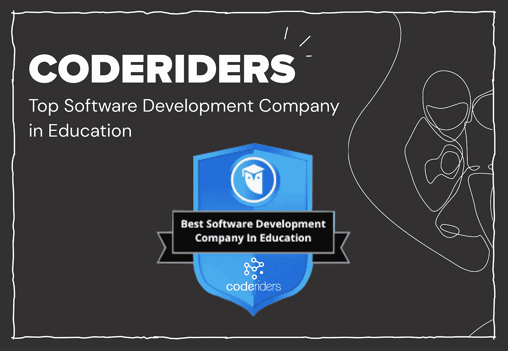
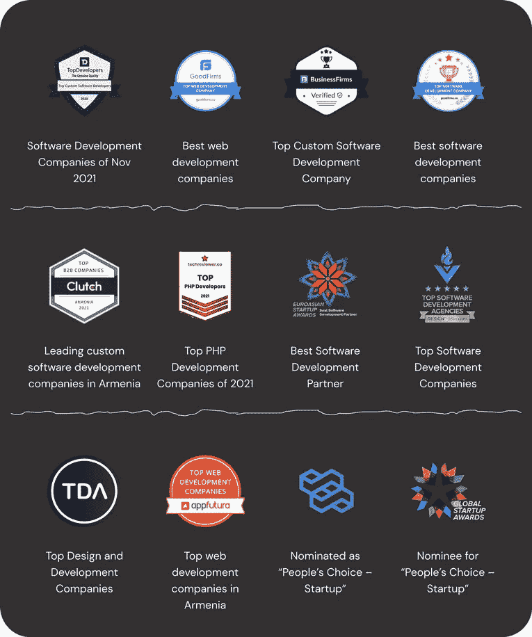
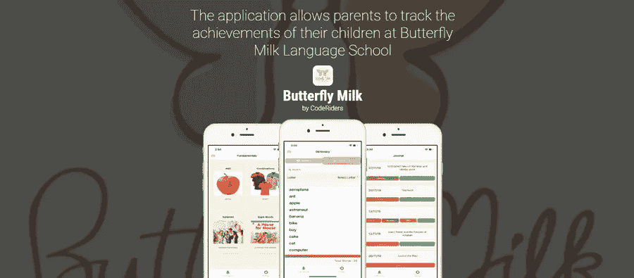

# 教育领域最佳软件公司:CodeRiders 包括在内

> 原文：<https://blog.devgenius.io/best-software-companies-in-education-coderiders-included-ab54f46b364f?source=collection_archive---------10----------------------->

你一直在寻找最好的教育软件开发公司或教育技术软件外包公司吗？我们建议您在线查看[。Degree.com 最新发布的全球教育领域最佳软件外包公司名单](https://www.onlinedegree.com/article/best-software-development-education/)。

这个列表是由有效的数据和对每个公司构建电子学习软件解决方案的经验和历史的仔细检查支持的。

[CodeRiders 软件外包公司](https://www.coderiders.am/)也被列入在线。Degree.com 的榜单。

【关于 Online.Degree.com 的 

在线。Degree.com 是一个由顶尖学者组成的团队，他们致力于让每个人都能获得免费教育，而不论其居住地点、社会条件、年龄、工作领域等。该公司通过提供免费在线课程，帮助学生减少大学债务，加快学习进程。该公司与一些久负盛名的领先学院和教育机构合作，例如:

*   孙郁婷帝国州立学院
*   南新罕布什尔大学
*   佛罗里达国立大学
*   印度技术
*   林恩大学
*   托马斯·爱迪生州立大学
*   大峡谷大学
*   诺里奇大学等等。

任何有兴趣扩展他们的知识和技能的人都可以从这些合格大学的各种课程中进行选择，并获得美国各地认证大学的学分。

人们获得的一些惊人的好处包括:

节省学费

从任何地点以任何速度进行在线学习

没有申请或入学考试。

【CodeRiders 是如何包含的？

众所周知，Online.Degree.com 是一个就教育相关事务提供咨询的合格机构。它与美国一些最好的学院和机构合作，受到许多人的信任。除了教育服务的主要范围之外，成为学生的好顾问也是至关重要的。该公司探索全球教育行业，紧跟热门话题，并决心在电子学习行业有所作为。该公司在对全球最佳电子学习公司的顺序研究中遇到了 CodeRiders。然后他们经历了 CodeRiders:

*   评论，
*   过去的奖项和认可，
*   软件开发案例研究，
*   我们的软件开发公司关于商业和软件开发主题的博客。

在最终决定将 CodeRiders 认证为全球顶级电子学习公司之一后，Online.Degree.com 联系了我们的业务开发团队并分享了这一消息。

**关于 CodeRiders 软件外包公司**

CodeRiders 是一家总部位于亚美尼亚的软件开发公司。它最初成立于 2013 年，当时是一所软件开发学校。短短一年，学校给了 800+校友。2014 年，CodeRiders 聘请其基础学生在 CodeRiders 软件开发公司工作。创始人 Artak Amirkhanyan 本身就是一名软件开发人员。他现在是该公司的代理首席技术官兼首席执行官。

联系 CodeRiders 团队！👇

 [## 软件开发公司-联系我们| CodeRiders

### 让我们谈谈您在定制软件开发、网页开发和设计、软件外包方面的业务需求…

www.coderiders.am](https://www.coderiders.am/contact-us) 

目前，CodeRiders 由 16 名技术爱好者组成，他们致力于在全球范围内构建尖端的软件解决方案。我们的客户来自几乎每个大洲的多个国家，例如:

*   北美(美国、加拿大)、
*   非洲(南非共和国、纳米比亚)、
*   欧洲(丹麦、德国、瑞典、瑞士、英国)、
*   澳大利亚，
*   香港。

我们的客户大多来自软件开发服务非常昂贵且人才短缺的国家。这些国家更喜欢外包给世界上最著名的技术中心，亚美尼亚就是其中之一。

**CodeRiders 的服务**

CodeRiders 提供以下服务:

*   网页开发与设计，
*   定制软件开发，
*   软件外包和 IT 咨询，
*   移动应用开发。

我们还专注于商业智能(BI)服务、物联网(IoT)服务、API 集成和实时解决方案。

**我们的技术堆栈包括但不限于:**

**后端开发** : PHP，Laravel 框架，Yii 框架，Symfony 框架，Zend 框架，Codelgniter 框架，Node.js，Express，Socket.io，C#。Net，Python，RESTful API，LinkedIn API，脸书 API，Twitter API，AWS。

**前端开发** : JavaScript，jQuery，Vue.js，Angular 2+，Ionic，Flutter，Dart，HTML5，CSS3，Bootstrap 3，4，React，React Native

**数据库** : MySQL、MongoDB、PostreSQL、SQLight。

**code riders 的电子学习项目:**

CodeRiders 与香港的创意英语学校 Butterfly Milk 合作。该客户的目标是将学校的管理流程数字化。我们不仅被要求自动完成蝴蝶奶的所有手工任务和整个学校管理系统，而且我们还需要建立所有的互动和创造性的功能。学生是小学生，因此我们的挑战是让学习过程变得有趣。我们提供了 1 名 web 开发人员、1 名移动应用程序开发人员和一名项目经理(PM)。我们的软件开发人员负责 web 开发和移动应用程序开发，而项目经理则负责平稳的软件开发生命周期(SDLC)T1。他们特别致力于:

*   数据库架构，
*   [网页开发](https://www.coderiders.am/services)，
*   [混合移动开发](https://www.coderiders.am/services/mobile-app-development)。

我们的 web 和移动应用程序开发人员同时工作，保持彼此之间以及与客户之间的透明沟通。他们能够在时间范围内交付无错误的代码。

一些关键的软件解决方案和服务包括:

*   为教师、学生和家长创建和实施一个网络平台，
*   一个通过拖放功能管理、编辑和添加课程到学校日历的功能，
*   为学生分配任务和发送学习资料的解决方案，
*   汽车解决方案通过将学生从一个班级转移到另一个班级来提升他们的水平
*   为每个学生做单独记录并向家长发送学生进度报告的可能性，
*   用于管理、编辑和在字典数据库中添加带有图像和发音的新单词的功能，
*   把字典里的单词和书联系起来的可能性，
*   在字典中添加同音异义词并将其分配给相应单词的功能，
*   为课程增加书籍和电影的可能性，
*   家长和老师都可以跟踪学生的进步，
*   跟踪每个学生借书和还书的可能性，
*   为学生定制游戏化测验，
*   数字化地创建和安排与父母的约会，
*   建立一个类似 Trello 的面板来管理内部任务。

同时，我们的混合移动应用程序开发人员为学生家长构建并实施了一个移动应用程序。这是一个学校管理移动应用程序，允许:

*   接收、检查并跟踪学生的作业，
*   允许家长将多个孩子链接到他们的帐户(如果有)并相应地管理他们的个人资料，
*   允许家长跟踪孩子当前借阅的书籍，
*   检查孩子的字典单词和孩子的发音，
*   给老师写笔记，安排和老师的约会，
*   允许学生玩各种类型的游戏化测验。

请立即留言！👇

 [## 软件开发公司-联系我们| CodeRiders

### 让我们谈谈您在定制软件开发、网页开发和设计、软件外包方面的业务需求…

www.coderiders.am](https://www.coderiders.am/contact-us) 

我们的软件开发人员已经完成了这个电子学习项目的第一阶段。它目前被搁置，并计划很快重新启动。之后，我们将转向该项目的第二阶段，为网络和移动应用程序添加更复杂的功能。该应用的测试版没有在 Apply store 和 Google Play Market 上发布。它对 IOS 和 Android 用户都适用。

您可以在 [CodeRiders 组合部分](https://www.coderiders.am/portfolio)查看其他案例研究。

**其他行业团队 CodeRiders 是专门**

*   健康技术或医疗保健软件解决方案，
*   媒体和娱乐软件解决方案，
*   金融和银行软件解决方案，
*   营销和分析软件解决方案，
*   房地产软件解决方案，
*   电子商务、批发和零售软件解决方案，
*   财富管理软件解决方案，
*   客户服务软件解决方案(CRM 系统)，
*   法律系统软件解决方案，
*   运输和物流软件解决方案。

**CodeRiders 还经营着一个博客**

我们报道全球 IT 行业、其趋势、最新新闻、软件开发和商业相关事宜。我们也偶尔与我们的专业软件开发人员分享采访。他们谈论他们的经验，分享他们对各种技术的看法，以及他们成为一名合格软件开发人员的旅程。

一些例子包括:

我们的高级软件开发人员，Albert Inspiryan 关于 PHP 的未来，即将到来的软件技术和他的最新项目的采访。

我们还采访了我们的高级软件开发人员 Babken Darbinyan，他谈到了 SQL。

我们将很快分享我们的前端开发人员 Garod Ajemian 对 Reatc.js 未来的想法。

**与 CodeRiders 合作的好处**

1.负担得起的价格和高质量的服务是相辅相成的，

2.专注的软件工程师更可靠，不像自由职业者或远程员工。他们在一家软件外包公司工作，尽管客户成为了他们的新雇主(如果比他们优秀的话)，公司还是要对他们的工作质量负责

3.可能增加新的软件开发人员或其他专家，如设计师、项目经理、质量保证专家等。来自同一个团队。来自同一家公司的员工已经有了合作的经验，

4.知识产权保护，没有安全风险，

5.如果需要，签署 NDA 的可能性，

6.清晰的交流。

探索 CodeRiders 博客上的更多文章。👇

 [## 定制软件开发公司博客| CodeRiders

### CodeRiders 软件公司 2021 年的 15 大成就距离 2021 年正式关闭还有几天，而…

www.coderiders.am](https://www.coderiders.am/blog)