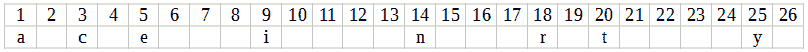

# 微软面试任务的最佳解决方案。具有唯一字符的串联字符串长度。

> 原文：<https://blog.devgenius.io/best-solutions-for-microsoft-interview-tasks-concatenated-string-length-with-unique-characters-bc1f4c5726c3?source=collection_archive---------5----------------------->


# 描述:

*   [https://leet code . com/problems/maximum-length-of-a-concatenated-string-with-unique-characters/](https://leetcode.com/problems/maximum-length-of-a-concatenated-string-with-unique-characters/)

# 解决方案:

我们有一组给定的字符串。我们必须找到这些字符串的所有可能的组合。我们有一个限制—我们不能组合具有相同字母的字符串，换句话说，我们只能组合具有唯一字母的字符串。很容易看出，如果两个字符串有相同的字母，我们需要发明一些快速检查的方法。很容易看出，任何结果字符串的长度都不能超过字母表的长度，在我们的例子中是 26 个字母。

我们可以制作一个映射，其中给定的字符串将是值，每个字符串将有一个排序的字母数组，该数组在该字符串中用作键。

例如，字符串“coco”、“dodo”、“interactive”的数组将具有如下映射外观:


比较排序后的字母并找出两个字符串中是否有共同的字母是很容易的。

但是也许有一种方法可以加速这种比较？

如果每个字母在结果字符串中只能出现一次，则最大结果字符串是字母表，长度为 26 个字母。我们可以将字母表反映到位集中。如果字符串中出现一个字母，则相应的位被设置为 1。

单词“interactive”作为一个比特集将看起来像这样:



26 位小于 CPU 的一个寄存器，所以在理想情况下，我们可以在一个 CPU 命令中比较两个位集。没有比这更快的了。

因此最终的算法应该是这样的:

1.  迭代输入字符串，跳过有重复字符的字符串。
2.  对于每个具有唯一字符的字符串，检查它是否与结果字符串具有相同的字符。
3.  如果它们有交叉字符，我们跳过它。
4.  如果没有，我们将这个新的组合追加到结果中。
5.  返回结果字符串的长度。

我们不应该直接处理琴弦。我们可以将它们转换成位集，并且只处理这些位。它大大减少了内存消耗，提高了程序的速度。

C++代码:

```
int solution(const vector<string>& v) { // We will keep in this vector bitmaps of used letters 
    // for the processed strings.
    // Add one empty bitset for comparison with the first 
    // processed string. It makes the algorithm a bit shorter
    vector<bitset<26>> char_bits_vector = {bitset<26>()};
    int result = 0; // for each string in the vector make a bitset where all 
    // bits corresponding to characters in alphabet are set.
    for (auto& str : v) {
        bitset<26> char_bits; // set bits corresponding to chars in the string.
        for (char c : str) { char_bits.set(c - 'a'); } // How many bits were set.
        int bit_num = char_bits.count(); // the string contains duplicate characters so 
        // don't process it
        if (bit_num < str.size()) continue;        // Check if current word has common letters with 
        // already processed strings
        for (int i = char_bits_vector.size() - 1; i >= 0; --i) {
            auto& c_b = char_bits_vector[i]; // if two bitsets have common 1 bits i.e. 
            // if two strings have common letters don't 
            // process current string
            if ((c_b & char_bits).any()) continue; // if current string has unique letters add 
            // to the vector a bitset where 
            // all bits corresponding to letters of the current 
            // string are set to 1.
            char_bits_vector.push_back(c_b | char_bits); // add length of the current string to the result
            result = max<int>(result, c_b.count() + bit_num); 
        }
    }
    return result;
}
```

你可以在这里找到包含完整项目的资源库:[https://github . com/jolly-fellow/Microsoft/tree/master/concatenated _ string _ length _ with _ unique _ characters](https://github.com/jolly-fellow/microsoft/tree/master/concatenated_string_length_with_unique_characters)

返回到[目录。](https://medium.com/@molchevsky/best-solutions-for-microsoft-interview-tasks-cae6b0f3ff86)