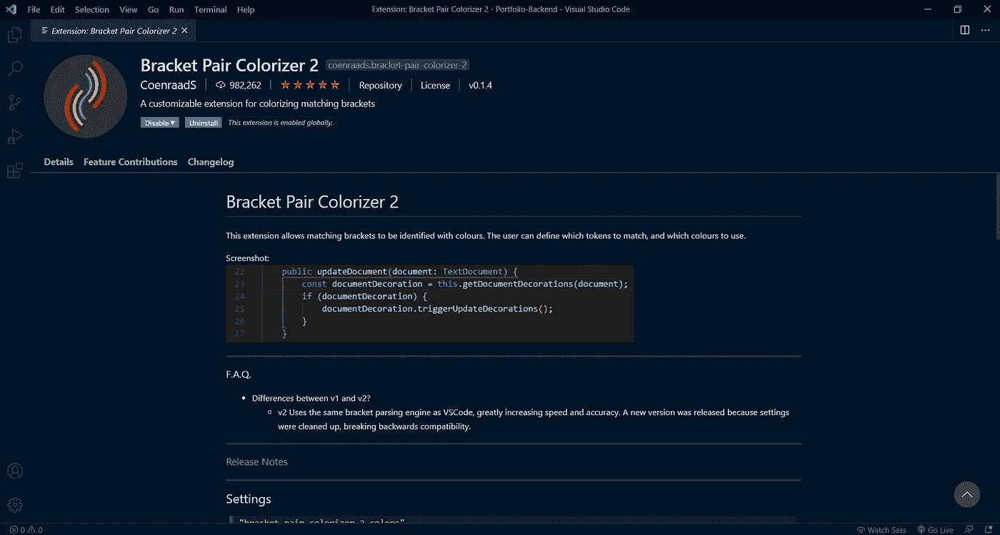

# Python/Django 的最佳 Visual Studio 代码扩展

> 原文：<https://blog.devgenius.io/best-visual-studio-code-extensions-for-python-django-af2fdbf7198a?source=collection_archive---------0----------------------->

## 将这些扩展整合到您的工作流程中，使其高效无缝。


照片由[克莱门特·H](https://unsplash.com/@clemhlrdt?utm_source=medium&utm_medium=referral)在 [Unsplash](https://unsplash.com?utm_source=medium&utm_medium=referral) 上拍摄

## 1. [Python(微软)](https://marketplace.visualstudio.com/items?itemName=ms-python.python)


如果您打算整天用 python 编码，这个扩展是必要的。它提供了以下功能:

*   智能感知:包括在您键入时自动完成的选项，让您节省时间。
*   林挺:它突出了与语法或风格相关的错误，最大限度地减少了校对的需要，并确保您的代码遵循标准化的编码实践。
*   Jupyter Notebook:这是这个扩展中我最喜欢的特性之一，因为它允许我在编辑器中使用 jupyter notebook 文件键入、运行和测试 python 代码，而不必运行终端或 anaconda。

安装:[https://marketplace.visualstudio.com/items?itemName=ms-python.python](https://marketplace.visualstudio.com/items?itemName=ms-python.python)

github:[https://github.com/microsoft/vscode-python](https://github.com/microsoft/vscode-python)

## 2.[皮林特](https://www.pylint.org/)


它具有与上面 Python 扩展提供的林挺相同的功能，但是它更强大，提供了更多的控制。根据 [Pylint](https://www.pylint.org/) 显示，它具有以下特点:

*   它根据编码标准检查代码，比如确保行长和变量名符合约定。
*   它检测错误并指出重复的代码。

要在 windows 中安装，只需在命令行或 VS 代码终端中键入以下命令:

```
pip install pylint
```

为其他平台安装:[https://www.pylint.org/](https://www.pylint.org/)

github:[https://github.com/PyCQA/pylint](https://github.com/PyCQA/pylint)

## 3.[贾内罗(斯科特·巴克曼)](https://marketplace.visualstudio.com/items?itemName=thebarkman.vscode-djaneiro)


Djaneiro 是另一个节省时间的扩展。它包括 Django 管理、表单和模板的代码片段。举个例子，

```
// Typing this:
fbool// Changes automatically to:
forms.BooleanField()// Or typing this:
for // Changes automatically to:
 
```

安装:[https://marketplace.visualstudio.com/items?itemName = the barkman . vs code-djaneiro](https://marketplace.visualstudio.com/items?itemName=thebarkman.vscode-djaneiro)

github:【https://github.com/ScottBarkman/vscode-djaneiro 

## 4.[括号对着色 2 (CoenraadS)](https://marketplace.visualstudio.com/items?itemName=CoenraadS.bracket-pair-colorizer-2)



顾名思义，这种扩展颜色代码匹配括号，使它更容易阅读和编辑您的代码。它不是 Python 或 Django 特有的，但它仍然是一个很好的补充，使编辑 Python 和 Django 文件更加流畅。

安装:[https://marketplace.visualstudio.com/items?itemName = Coen raads . bracket-pair-colorizer-2](https://marketplace.visualstudio.com/items?itemName=CoenraadS.bracket-pair-colorizer-2)

github:[https://github.com/CoenraadS/Bracket-Pair-Colorizer-2](https://github.com/CoenraadS/Bracket-Pair-Colorizer-2)

我希望这些扩展对您未来的项目有所帮助。如果你认为缺少了一个有价值的扩展，请在下面的回复部分分享它。