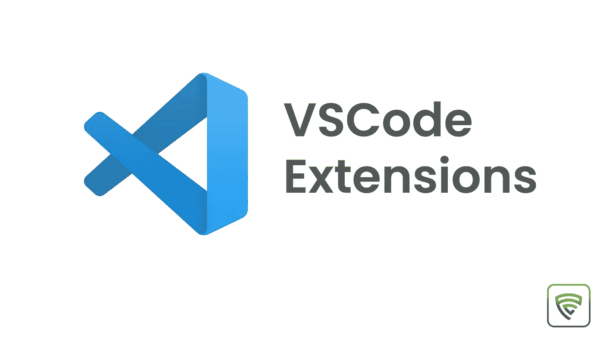
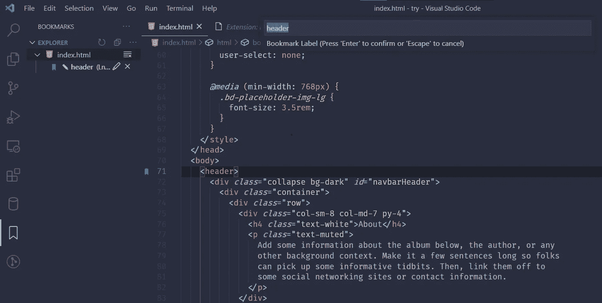
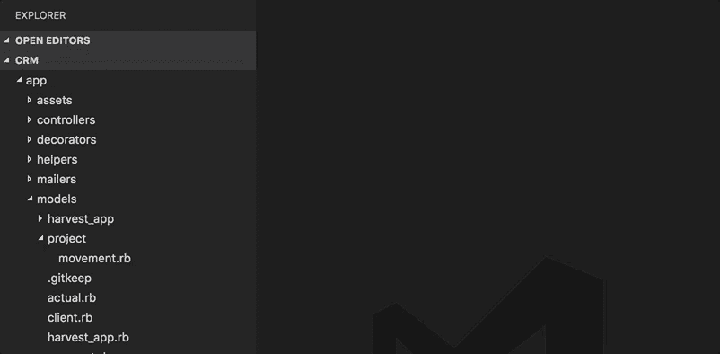
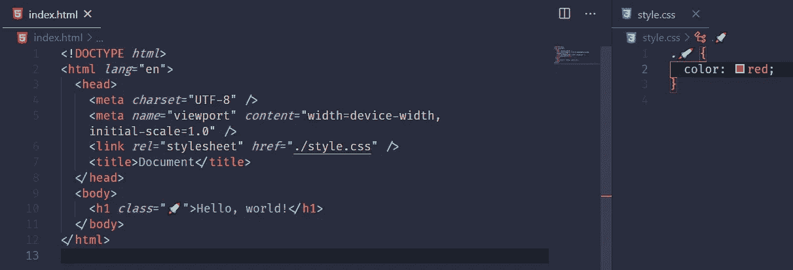
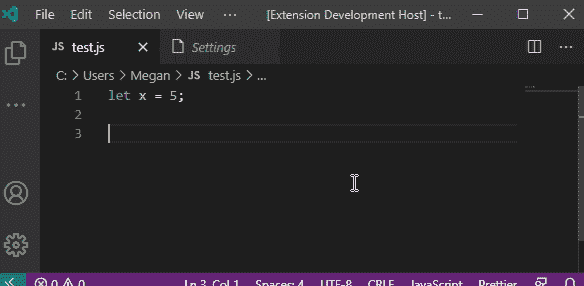

# 最佳 VSCode 扩展 2021

> 原文：<https://blog.devgenius.io/best-vscode-extensions-2021-7a964fafe9e8?source=collection_archive---------6----------------------->



与其他代码编辑器不同，VSCode 已经成为使用最广泛的代码编辑器，因为它提供的功能、集成的终端以及可定制的扩展。在这篇博客文章中，我们将讨论最好的 VSCode 扩展，让您的代码编辑器更上一层楼。

我不打算讨论任何常见的，如漂亮，括号对着色，Quokka.js 等...如果你没有安装前面提到的任何扩展，请随意安装它们，因为它们非常有用。

# 自动重命名标签

我称这个软件包为救命恩人，因为它提供的功能。它实际上完成了一个非常简单的任务，当我们重命名 HTML 文件中的开始标签时，它会自动重命名结束标签。看下面的 GIF 来理解这个包的能力。在这里找到这个扩展[的链接](https://marketplace.visualstudio.com/items?itemName=formulahendry.auto-rename-tag)


# 书签

这是第二个救命的扩展，这个扩展帮助你在某一行标记你的代码，这样我们以后可以引用它。使用命令“ctrl+alt+k”添加书签，这也是切换书签的相同命令。“ctrl+alt+l”是跳转到下一个书签的命令，“ctrl+alt+j”是跳转到上一个书签的命令。你也可以给你的书签添加一个标签。在这里找到这个扩展[的链接](https://marketplace.visualstudio.com/items?itemName=alefragnani.Bookmarks)



# REST 客户端

有了这个包，您可以在 VSCode 中发出 HTTP 请求。要使这个包工作，你需要保持文件的点扩展名为 http 或 rest，然后提及你想提出的请求的类型，给出 URL 并点击 send request 就这样，就这么简单。参见下图，了解如何提出帖子请求。如果这听起来很酷，找到链接[这里](https://marketplace.visualstudio.com/items?itemName=humao.rest-client)安装软件包。


# 高级-新建-文件

在 vscode 中创建一个新文件有点麻烦，因为我们必须用“ctrl+n”创建一个新文件，然后用点扩展名保存该文件，否则你可以用“ctrl+shift+E”快捷方式转到边栏中的 explorer 选项卡。如果你是一个键盘用户，那么很难创建一个新文件。

要设置这个包，您需要向 keybindings.json 文件添加一个命令。要添加命令，您需要在命令面板中键入 key bindings . JSON(ctrl+shift+p)和下面的 JS 对象。

```
{
  "key": "ctrl+n", // "cmd+n" on mac
  "command": "extension.advancedNewFile",
}
```

完成设置后，重新加载 VSCode 并键入刚刚添加的新 keybinding，然后您将看到可以添加新文件的所有文件夹，然后选择要在其中创建文件的文件夹，键入带有点扩展名的文件名，并单击 enter。配置这个扩展是一个漫长的过程，但是一旦你配置好了，你就可以轻松地创建新文件了。看看下面的 GIF 图，以便直观理解。在这里找到这个扩展[的链接](https://marketplace.visualstudio.com/items?itemName=patbenatar.advanced-new-file)



# 表情符号片段

我们可以添加表情符号作为 CSS 选择器。那么，为什么我们不能像下面提到的例子那样使用类名作为表情符号呢？如果你有兴趣在你的代码中使用表情符号，那么就在这里安装这个扩展[。](https://marketplace.visualstudio.com/items?itemName=devzstudio.emoji-snippets)

安装扩展后，重新加载 vscode，然后打开任何你想添加表情符号的文件，输入冒号，然后输入表情符号名，就像这样:rocket。



# 汽车进口— ES6，TS，JSX，TSX

这个包可以帮助你自动导入反应和角度组件。与这篇博文中提到的任何包相比，它非常容易使用。您只需在当前工作文件中使用该组件，它就会自动在顶部导入所需的文件。点击这里找到这个扩展[的链接](https://marketplace.visualstudio.com/items?itemName=NuclleaR.vscode-extension-auto-import)

# 模板字符串转换器

当您在字符串中添加模板文字时，这个包可以帮助您将引号转换成反斜线。视觉表现见下图 GIF。点击这里找到这个扩展[的链接](https://marketplace.visualstudio.com/items?itemName=meganrogge.template-string-converter)

