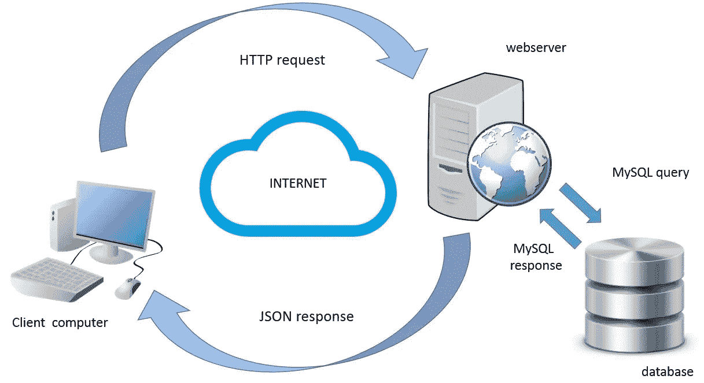
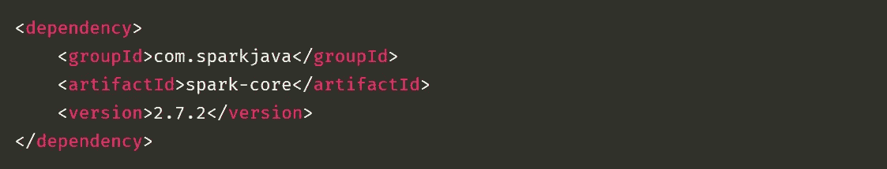
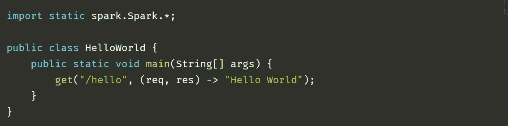
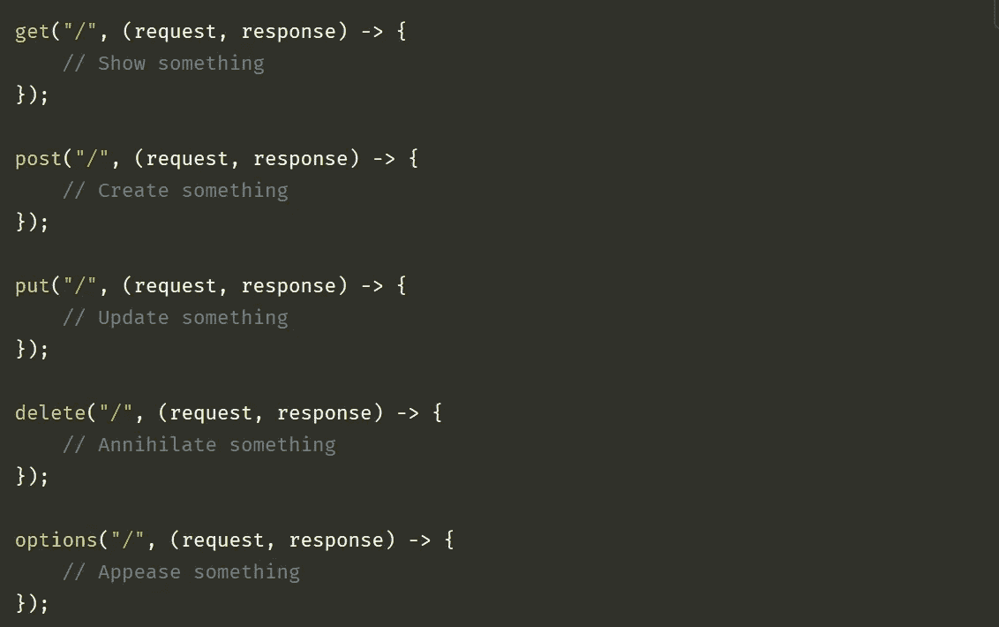

# 用 Java 实现 RESTful API 的最好方法？

> 原文：<https://blog.devgenius.io/best-way-to-implement-restful-api-in-java-d84b0bc69fe?source=collection_archive---------1----------------------->

Web 服务图表

当我们谈论 Java 作为一种编程语言时，我们听到的最大的批评之一是，Java 是一种冗长的语言，与 Python 或 React 等语言相比，我们需要编写多行代码来实现某项任务。

如果我告诉你，现在你可以使用 Java Spark Web Framework 用最少的代码用 Java 实现 RESTful APIs，那会怎么样？

在我之前实施的一个项目中，我必须实现一个 restful API 来公开数据，并由客户端应用程序(如网站或移动应用程序)使用。因为我的专业是 Java，所以我想用 Java 实现一些东西。我上网搜索 restful API 实现，在那里我找到了 Spark Web Framework。

## 什么是火花？

> Spark Framework 是一个为快速开发而构建的简单而富于表现力的 Java web framework DSL。

我以前用过一些 Java web 框架，比如 Struts 1 和 2，Oracle 的应用开发框架(ADF ), Pivotal Software 的 Spring 框架和 Java Servlets。因此，我对不同的 java web 框架实现有相当的了解。

火花是我必须学习的新事物。Spark 是用 Kotlin 和 Java 8 创建 web 应用程序的微框架。这是一个非常简单易用的框架，有助于 web 开发人员的快速开发。我最喜欢 spark 的一点是，你不必像在 servlet 中那样创建自己的 get 和 post 方法，而是可以使用 spark 库的内置函数来公开特定的 URL，如下图所示，并使用 URL:*http://localhost:port/hello*运行它。

POM.xml 中 Spark 的配置

使用 Spark API Lambda 表达式的 Hello world 示例代码。

更多 HTTP 方法示例

从上面的例子可以看出，用 Spark web framework 实现 RESTful APIs 是多么容易。不需要单独的 get 和 post 方法，也不需要像其他 Java web 框架那样不必要的继承类或实现接口。要获得完整的 Spark 文档，请访问其[Spark 文档官方网页](http://sparkjava.com/documentation#getting-started)。

之所以在这里提到 spark，是因为开发人员发现编写长行代码既困难又耗时。Web 服务无处不在，我们需要将它们与客户端应用程序或网站连接起来，以使其可用。

对于**数据安全和隐私**我们不能把所有东西都放在一个地方，因此需要在服务器端编程和客户端实现之间分离代码。在[我之前的一篇文章](https://medium.com/@ahmedahsankhan/why-all-the-developers-should-learn-and-understand-rest-soap-services-377c13388b5b)中，我提到了为什么每个开发人员都应该理解和知道 RESTful APIs 的概念，现在一旦你理解了它，你就应该尝试实现它，这就是 Spark Web Framework 发挥作用的地方。

如果您是 Java 的 web 开发人员，与其他 Java web 框架相比，Spark 可以帮助您用最少的样板文件以更省时的方式实现 web 应用程序。由于 Spark 是一个微框架和轻量级的，与其他框架相比，它只提供了少量的特性，但同时，它非常简单，您可以在很短的时间内创建您的 web 应用程序。

快乐阅读。

## 如果你喜欢这篇文章，请点击拍手👏按钮下面几下，以示支持！

更多文章，请访问 [**Nestedif**](http://Medium.com/Nestedif) 主页