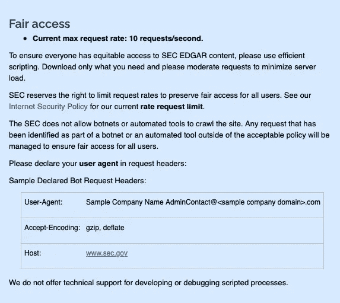
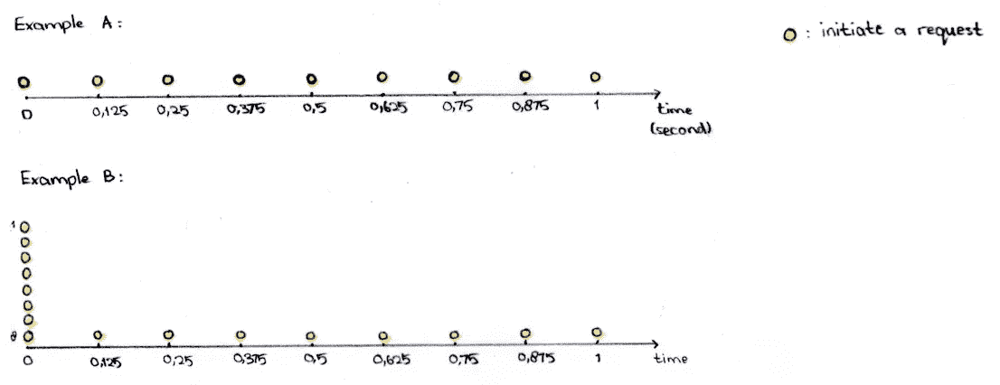
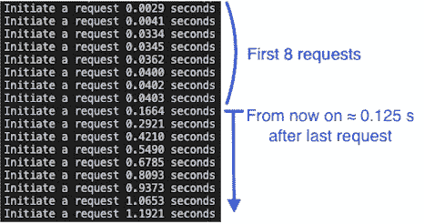
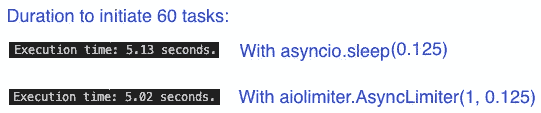

# 在 Python 中加速大量 HTTP 请求的最佳方式

> 原文：<https://blog.devgenius.io/best-way-to-speed-up-a-bulk-of-http-requests-in-python-4ec75badabed?source=collection_archive---------0----------------------->

## 如何尽可能快地抓取网页，而不被禁止使用 Asyncio？

图为[的轮滑](https://unsplash.com/@alternateskate?utm_source=medium&utm_medium=referral)在[的 Unsplash](https://unsplash.com?utm_source=medium&utm_medium=referral) 上

## 内容:

A.背景故事和一个用例

B.理论+ [本文范围](#e862)

C.[代码和解释](#df95)

D.参考

# A.背景故事和一个用例

我有一个编程项目，需要每天从[sec.gov](https://www.sec.gov/os/accessing-edgar-data)读取大量内幕交易(表格 4s ),并建立一个美国最成功的内幕人士的排名列表。因此，我需要建立一个 Python 脚本，可以有效地处理数百万个 URL 请求，删除不必要的表单 4，并将剩余的数据作为 Pandas DataFrame 进行评估。**在本文中，我将只专注于下载器编程部分。**

程序员需要考虑以下因素:

*   通过检查服务条款和 [robots.txt](https://www.sec.gov/robots.txt) 抓取特定网站的**合法性**(如:http://example.com/robots.txt)
*   **最大请求速率/限制**和所需的[报头](#02d9)。例如，[sec.gov](https://www.sec.gov/os/accessing-edgar-data)有自己的网页抓取器访问其网站的指南:

来源:[https://www.sec.gov/os/accessing-edgar-data](https://www.sec.gov/os/accessing-edgar-data)

# **B .理论**

## 本文的范围:

*   [B.1](#3505) 如何**使用`Asyncio`高效地创建一个脚本定期发出百万请求**？
*   [B.2](#4f50) 如何对**速率限制**请求使用`Aiolimiter`？
*   [B.3](#9da8) 如何**使用`asyncio.Semaphore`设置活动请求**的最大数量？为什么有必要？

## B.1 C **使用`Asyncio`创建一个脚本来有规律地**高效地发出百万个请求

## **为什么用** `**Asyncio**` **？**

在回答这个问题之前，读者应该先了解

a)CPU 绑定的任务*和 I/O 绑定的任务*之间的区别

Python 中的并发编程。

*我建议读者好好阅读下面这篇* [*写得好的文章*](https://leimao.github.io/blog/Python-Concurrency-High-Level/) *，因为它很好地解释了以上几点。因此，我在这里只写简短的总结和一些关于线程和异步的额外信息。*

 [## Python 中的多处理 VS 线程 VS 异步

### 在现代计算机编程中，经常需要并发来加速解决问题。在 Python 编程中…

雷猫. github.io](https://leimao.github.io/blog/Python-Concurrency-High-Level/) 

**a)CPU 受限和 I/O 受限任务之间的区别:**

**CPU 受限任务**:完成速度由你的处理器速度决定的一类任务。如果有两台计算机具有相同的 Python 安装和硬件规格(除了它的 CPU)，那么具有更快时钟频率 CPU 的计算机将更快地完成 CPU 受限的任务。

照片由[卡伊奥·吉哈罗](https://unsplash.com/@caioguijarro?utm_source=medium&utm_medium=referral)在 [Unsplash](https://unsplash.com?utm_source=medium&utm_medium=referral) 上拍摄:摩托车最终会超过自行车，尽管自行车开始得更早。

**I/O-Bound task** :一种任务，其完成速度取决于等待输入/输出操作完成的时间。例如，HTML-请求速度取决于您的网络、内存、服务器速度等。在 I/O 操作期间，您的 CPU 只会等待直到它完成。因此，升级您的 CPU 不会提高性能。HTML-Request 就属于这一类。

照片由 [Prasad Panchakshari](https://unsplash.com/@pkprasad1996?utm_source=medium&utm_medium=referral) 在 [Unsplash](https://unsplash.com?utm_source=medium&utm_medium=referral) 上拍摄:在交通堵塞的情况下，超级跑车不可能超越其他汽车。

**b)并发编程的概念:**

并发编程是一种计算形式，其中多个任务将同时执行。Python 有三个主要的并发编程库:`Multiprocessing,` `Threading`和`Asyncio`。

a.`Multiprocessing`模块**可以利用所有可用的 CPU 内核**并发执行不同的任务。它更适合执行 CPU 受限的任务，因为它能够充分利用 CPU。

b.`Threading`模块仅使用一个 CPU 内核，但它仍然可以通过为每个任务分配一个线程来同时执行多个任务。例如用于 5 个下载器的 5 个线程。操作系统(OS)将继续**为每个线程分配*相同的* CPU 时间，而不管线程是否准备好执行下一个任务**(例如，线程是否仍在等待来自 HTML-Request 的响应)。换句话说，每个线程都*保证*获得相同数量的资源，不管它是否准备好做下一个任务或者任务本身是否已经完成。除了在分配资源时不够灵活之外，使用线程时还有另一个额外的成本:在线程可以启动之前， **OS 需要管理&调度所有线程**，随着更多线程的创建，这将产生更大的开销。最后但同样重要的是，当不同的线程需要访问相同的资源(例如文件、共享内存等)时，可能会发生**竞争情况**。)同时。这会使程序结构变得复杂。

___________________________________________________________________

## 什么是竞态条件？

下面的场景将有助于理解什么是竞争条件。

5 个快乐的僧侣会因为种族状况而挨饿。

假设有 5 个和尚围坐在一张圆形桌子旁，每对和尚之间有一根筷子。要吃端上来的面条，每个和尚需要在他旁边放两只筷子。当所有的僧侣同时开始抓住筷子时，一场竞赛状态将会发生。在这种情况下，没有人可以吃他的面条，他们基本上是互相阻碍。

___________________________________________________________________

c.`Asyncio`模块**只利用一个线程来同时执行多个任务**(这里是多个 HTML 请求)。因为它只使用一个线程，**操作系统不需要在启动程序之前创建一个调度器**(开销更少)。此外，有了 Asyncio，我们可以**防止竞态条件**。为了 100%正确，竞态条件仍然可能发生，但是你必须非常努力才能得到它。

**回到我们的用例**进行多个 HTML 请求，`Asyncio`将在 0.0007 秒发起第一个请求(pep-8015)。`Asyncio`将在 0.0127 秒时启动下一个 HTML 请求(pep-8012 及其他)，而不是等待响应。在发起请求后，`Asyncio`不会切换回例如 pep-8015，直到它收到请求的响应并准备好下一个任务/步骤。这个场景假设没有应用速率限制器。

使用`Threading`，CPU 将切换回 pep-8015，当时间表显示轮到 pep-8015 时，尽管请求仍然没有响应。在这种情况下，CPU 将保持空闲，直到另一个 HTML 请求出现，并且已经得到响应。

## B.2 使用`Aiolimiter`对请求进行速率限制

为了限制请求的速率，我们将使用`aiolimiter`中的`AsyncLimiter`。

两个示例都允许每秒 8 个请求，但互不相同:

**示例 A** :该限制器将严格地每 0.125 秒启动一个任务。

**示例 B** :有了这个限制器，前 8 个任务可以快速连续启动，因为有足够的容量可用。一旦达到容量，限制器将启动，下一个请求将不得不等待足够的时间来释放容量，这是上一个请求后的 1/8 秒。(参考下图)

一些读者可能会问，为什么我不使用简单的`sleep`命令呢？坦率地说，如果您只需要执行一次一千个请求，那么下面的争论都无关紧要。这是一个完全不同的故事，如果你有一个脚本，需要每天执行数百万次请求。在这种情况下，您确实需要一种有效的方法来请求 HTMLs，评估下载的内容，过滤，组合所有必要的内容，并以可读的格式显示为 Pandas DataFrame。

## **为什么用** `**Aiolimiter**` **而不是** `**sleep**` **命令？**

**差速方式限制#1**

命令`time.sleep(0.125)`不应该和`Asyncio`一起使用，除非你对此有很好的理由。原因是在`time.sleep`命令完成之前，它会阻塞所有其他的东西。如果你的脚本只是从所有的 URL 下载，而对下载的内容不做任何处理，那也不是很糟糕。理想情况下，在空闲时间，脚本应该执行另一个任务，例如评估从过去的请求下载的内容。

**速率限制#2 的不良方式**

有人可能会说上面的代码“足够好”，事实也的确如此。这肯定比前一个代码好，然后在`await asyncio.sleep(0.125)`期间，代码可以切换到另一个任务。不过这段代码的一个小问题是，无论前面的命令行持续多长时间，函数总是等待 0.125 秒。与`Aiolimiter`相比，这种时间差异是很小的(见下一个截图)，但是如果你把它累积到数百万次，并经常这样做，它将会有所不同。

## 使用`Semaphore`设置活动请求的最大数量

> 同时做 3 个请求很酷，但是做 5000 个就不那么好了。来源:[链接](https://compiletoi.net/fast-scraping-in-python-with-asyncio/#bonustrackdonthammertheserver)

假设我们有以下速率限制:

`limiter = AsyncLimiter(1, 0.125)`

在此限制下，每秒将启动 8 个请求。假设不管是什么原因，2 秒后仍然没有响应(16 个主动请求)。随着时间的推移，更多的主动请求将被发起，这是没有帮助的，也是不必要的。因此，我们需要使用`Semaphore`来限制活动请求的最大数量。

只有两个制作桌子的任务可以同时发生，因为只有两个锤子可用。

我们用上面的截图来了解一下`Semaphore`是如何工作的。

*   有两把锤子可以用来做桌子。在 Python 中:

`semaphore = asyncio.Semaphore(value=2)`

*   x 想借一把锤子做桌子:

`await semaphore.acquire()`。之后，只有**1‘信号量’可用**。

*   y 还想借一把锤子:

`await semaphore.acquire()`。之后**0‘信号量’可用**。

*   下一个人也想借一把锤子:

`await semaphore.acquire()`。因此，商店经理告诉他，他有**等待 X 或 Y 归还一把锤子**。

*   x 不需要锤子，把它还给它的主人:

`semaphore.release()`。**现在下一个人可以借一把锤子**。

# C.代码和解释:

## 必备 Python 库:

*   `[Asyncio](https://pypi.org/project/asyncio/)` : Python 有 3 个主库，允许[并发编程](#7124)。其中之一就是`[Asyncio](#a491)`。
*   `[Aiohttp](https://pypi.org/project/aiohttp/)`:该库与 Asyncio 兼容，将用于执行异步 HTML 请求。
*   `[Aiolimiter](https://pypi.org/project/aiolimiter/)`:请求[速率限制](#4f50)(例如 max。10 个请求/秒)可以用`Aiolimiter`控制。

## 使用 Asyncio 同时发出多个 HTML 请求并使用 Aiolimiter 对其进行速率限制的过程

**第 1 部分:设置 Python 库**

**第 2 部分:定义最大请求速率限制(例如每秒 8 个请求)**

上述限制器仅允许 1 个请求/0.125 秒。[解释。](#4f50)

**第 3 部分:创建一个“异步定义”函数来下载**

看起来像一个普通的函数，但它实际上是一个协程。一个非常简单的解释:协程是一个能够被挂起(在`await`关键字)并在完成前从挂起的地方恢复的函数。换句话说，`await`关键字是`[Asyncio](#7124)`可以将执行控制权转移给另一个例程/任务的点。`Await`关键字被应用在例如第 8 行，因为这是命令行，在那里 CPU 将不得不等待空闲。使用`await`可以恢复或启动另一个准备好的任务，而不是等待空闲。但是要小心，由于兼容性问题，不是每个操作都与`await`结合。例如`Pandas`操作与`Asyncio`不兼容。(因此，当我必须进行 Pandas 操作时，例如在每次下载后合并新的和现有的内容，我必须使用`asyncio.Queue`临时保存结果。)

**基本上，上面的代码所做的是**发出一个 HTML 请求，当有一个[信号量](#9da8)可用并且速率限制允许的时候。在`content = await resp.read()`期间等待响应时，Asyncio 将寻找另一个准备启动或恢复的任务。

**第 4 部分:将每个下载的内容写入一个新文件**

这段代码创建了一个文件，并将每个下载的内容写入其中。该函数被创建为协程，尽管其中没有`await`。它以这种方式创建，以便在下一部分的后面与`await`组合在一起。

**第 5 部分:将第 3 部分和第 4 部分合并成一个协程**

第 3 部分和第 4 部分中的协同程序被合并成一个协同程序。目的是将每个 URL 需要执行的两个步骤(下载和写入文件)组合在一起。

**第六部分:主协程**

在`main`协程中，将创建一个为 10 的`[Semaphore](#9da8)`，这意味着任何时候允许的最大活动请求数为 10 个。之后，将为从 8010 到 8016 的每个号码“创建”(而不是开始)一个`web_scrape_task`任务，并将其添加到一个`tasks`列表中。接下来`tasks`列表中的所有任务都将通过关键字`await`启动。

要开始执行一个协程函数，例如`main`协程，您需要执行:`asyncio.run(main())`。如果您改为使用`main()`，那么将显示以下错误:`RuntimeWarning: coroutine ‘main’ was never awaited`。

**HTML-Request 的标题是什么？**

如果您返回到上方的[第二个屏幕截图，sec.gov 需要您也为您的请求声明标题。在这种情况下，您的请求代码应该是:](#84cc)

**组合代码:**

我希望你能从本教程中受益。如果你有什么问题或者有什么改进建议(这是我的第一篇中篇文章)，可以在 commentar 版块联系我:-) *如果你读到这里并且喜欢，请为这篇文章鼓掌。*

# **D .参考**

[1 . https://lei Mao . github . io/blog/Python-Concurrency-High-Level/](https://leimao.github.io/blog/Python-Concurrency-High-Level/):这篇网文很好的解释了并发编程的概念。我强烈建议读者阅读它，尤其是如果你正在考虑应用这个概念。

2.课本[《在 Python 中使用 Asyncio:理解 Python 的异步编程特性》](https://www.amazon.de/Using-Asyncio-Python-Understanding-Asynchronous/dp/1492075337/ref=sr_1_1?__mk_de_DE=ÅMÅŽÕÑ&keywords=using+asyncio&qid=1640883364&sr=8-1):这本书的第 1 章和第 2 章确实固化了我对三个并发模块之间区别的理解。尤其是 Threadbots 经营的餐馆的例子。

3.快乐和尚图片复制自:[https://www . deviantart . com/monds peer/art/happy-monk-506670247](https://www.deviantart.com/mondspeer/art/happy-monk-506670247)

4.面条图片抄袭自:[https://pngimg.com/image/44276](https://pngimg.com/image/44276)

披露:我没有从建议任何外部材料中获得任何好处。