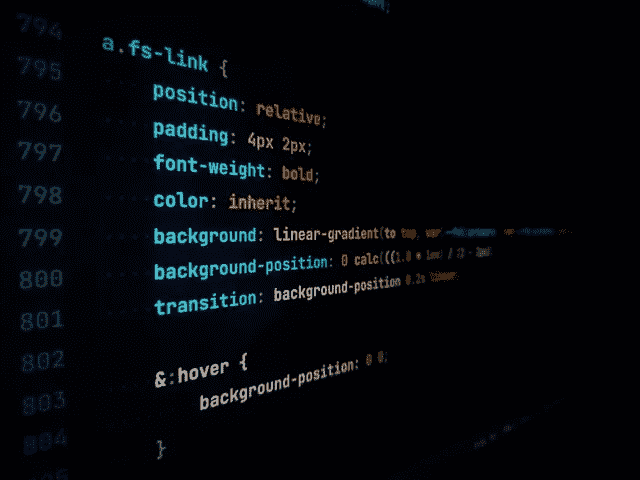
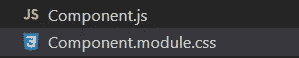

# 样式化 React-JS 应用程序的最佳方式

> 原文：<https://blog.devgenius.io/best-ways-to-style-a-react-js-application-c818b71f6341?source=collection_archive---------0----------------------->

每当我们开始一个 React-JS 项目时，我们通常会讨论在这个特定的项目中我们应该遵循哪种样式方法。为此，我将讨论以下造型选项，并解释每种选项的优缺点和我个人的最爱:

*   内嵌样式
*   全局样式文件
*   萨斯/SCSS
*   CSS 模块
*   CSS-in-JS



# TL；博士:

我个人最喜欢的是 [**风格的组件**](https://styled-components.com/) (这是一个 CSS-in-JS 库)，因为它非常用户友好，支持良好，性能良好，学习曲线平滑，具有动态风格，并且具有开箱即用的特性。也就是说，我建议通读这篇文章，因为每个项目都有自己的用例，有时使用样式化的组件可能会变得过分，或者有时您可能正在处理不支持样式化组件的遗留项目。

# 介绍

首先，在考虑造型选项时，我们需要考虑以下几个方面，我也将使用这些方面来比较造型选项:

*   可维护性
*   复用性
*   CSS 特性，如伪类等。
*   样式化时使用 JavaScript 逻辑
*   表演
*   排除故障
*   轻松编码
*   项目规模

# 内嵌样式

内联样式是当你在 JSX 元素中传递“样式”属性中的所有样式时。这些样式作为 JavaScript 对象传递，并接受我们在普通 JavaScript 中使用的任何变量。

```
const styles = {
    backgroundColor: 'red',
    color: 'blue'
}return (<div style={styles}>some text</div>)
```

请注意样式是如何以[骆驼案格式](https://www.theserverside.com/answer/Pascal-case-vs-camel-case-Whats-the-difference)呈现的。此外，样式是作为字符串传递的。

## 优点:

*   易于实施，尤其是在小型项目中
*   不需要外部样式表，这意味着少了一个要呈现的页面
*   在样式中轻松实现 JavaScript 逻辑
*   易于调试，只需从 chrome 开发工具中找到元素并实现样式。
*   如果您将 number 作为一个值，React 会自动将其转换为 px

## 缺点:

*   极难重用和维护
*   许多 CSS 功能不能在内联样式中实现，如伪类、伪元素、媒体查询、关键帧或其他高级功能，如嵌套样式等。
*   在 react 应用程序中，有许多文件被渲染，所以对于所有的内联样式，它会对性能产生负面影响

## 结论

在我的应用程序中，我不喜欢内联样式，除非我时间非常紧(如果这样的话，我会确保在生产之前迁移到其他样式选项)，或者我只是构建一个小组件或一个非常小的项目，但通常情况下不会这样。例如，如果我做了一个非常简单的计算器应用程序，我想展示我的技能，我不会花太多时间设计。

此外，由于内联样式是一个 JavaScript 对象，并且与 react 项目状态兼容，因此您可以使用状态来操作小型项目的样式。

# 全局 CSS 文件

全局样式是指 react 项目有一个 App.css 或 index.css 文件，您可以在其中为整个 React 项目构建一个样式文件。您将样式文件导入到 App.js 中

```
import React from 'react';
import './App.css';
import MyApp from './MyApp';const App = (props) => {
   return <div className="app">
            <MyApp />
          </div>
}
export default App
```

您可以在任何组件中使用任何类。例如，在 MyApp 组件中:

```
import React from 'react';const MyApp = (props) => {
   return(
    <div className="my-app">Hello</div>
   )}
```

最后，在 App.css 文件中，使用名为“my-App”和“app”的类来设置样式。

```
.my-app {
    background-color: red;
 }.app {
    font-size: 16px;
 }
```

一些重要的要点:

*   我们并没有在每个组件中专门导入样式表。我们只需要导入一次就可以了
*   我们只是在组件中使用“className”属性，我们可以从任何地方访问它，或者我们可以说 CSS 样式表的范围是全局的。我们可以从应用程序的任何地方访问 CSS 类。
*   这些样式不像内联 CSS 那样使用 JavaScript，但是它们使用了正确的 CSS 格式。

## 一些使用案例:

如果你想建立一个静态网页或一个小项目(例如:一个非常小的 POS 等。)并且你想让它在一天之内运行起来，你所做的就是使用简单的 HTML、CSS 和 SASS 来开发网页。对于类，使用带有 BEM 符号的实用类和 SASS 友好类。对基本样式使用实用程序类，对特定于组件的样式使用 BEM 符号样式

如你所知，SASS 只是一个 CSS 预处理器，它在最后构建一个 CSS 文件。因此，在构建网页之后，构建一个 React-JS 项目，将 CSS 文件复制粘贴为一个全局样式表，并将该项目分发到 React 组件中。

然而，值得注意的是，这些项目是低维护或零维护的网站，对于那些想要快速建立并运行网站的人来说非常有用

点击[此处](https://www.youtube.com/playlist?list=PLillGF-Rfqba3xeEvDzIcUCxwMlGiewfV)查看关于此用例的非常有用的教程。

## 优点:

*   这是一个非常好的策略，可以快速构建需要较少维护和低预算资源的小型项目
*   与许多 CSS 文件如 CSS 模块(稍后解释)相比，只需一个 CSS 文件即可呈现
*   在小项目中实现样式非常快
*   构建 **HTML CSS 模板**
*   在普通的 JavaScript 项目中，在 ReactJS 之外工作感觉很舒服
*   对提高前端开发技能有好处，不要太认真，因为你了解高级命名模式和没有花哨库的遗留编码模式是如何遵循模板指导原则的

## 缺点:

*   极难维护
*   添加新功能是一场噩梦
*   仅满足特定的用例
*   需要学习命名约定，否则会出现问题。特别是 BEM 符号和实用类。如果没有正确遵循，那么**的名字与**冲突是非常常见的。
*   没有 JavaScript 逻辑可以实现，因此动态样式是一个挑战。(我不支持在 reactjs 项目中使用 var()
*   主题化极其困难

## 结论:

如果您有一个客户希望在**极短的时间**内完成一个功能有限、页面数量非常少的小项目，并且经过讨论后，您发现该客户预算很少，不希望花钱维护应用程序，并且可能计划以后构建大项目，那么您可以使用这种方法。

例如，您有一个 figma 设计项目，您希望将它用作模板，并希望使用预制模板添加功能，那么这个选项很好。然而，新特性的文档指南是必须的。

如果你想要一个普通的网站(例如一个管理面板)并且不想花时间去设计它，你需要 html css 模板。

此外，如果您担心自己不精通实用程序类或 BEM 符号，并且担心项目规模可能会增加。另外，如果你想让你的风格和你的 React 组件连接起来，那么使用这种方法是一个**大忌**。

# 萨斯/SCSS

SASS 是一个 CSS 预处理器。简单来说，在生产之前，它将所有代码编译成一个全局 CSS 文件。说到 ReactJS，我们使用 npm 安装 SASS。

它处理 sass 文件并将它们转换成样式表。常被称为“拥有超能力的 CSS”。

SASS 在造型时给我们一种程序员般的感觉。例如，提供函数、混合、循环、变量、对象甚至简单的列表。它帮助我们在造型上创造一些动态逻辑。

**新开发人员**迷上了 SASS，因为 SASS 有助于抽象掉 CSS 中的许多复杂性。例如，用伪选择来选择大的子元素在 CSS 中是一个挑战，但是在 SASS 中要容易得多。同样，你可以使用变量、不同的文件、架构和多个样式表。

## 一个非常重要的用例:

遗留项目不支持更新的技术，并且大多数都是使用 SASS 完成的，因为新开发人员发现使用 SASS 很容易。因此，由于新的和没有经验的开发人员可以从事大型项目，包括那些每天有超过 50 到 6 万用户的项目，这在经济上是非常有效的，因为您不需要大量的资源来从事大型项目。

## 例子

例如，你有一个风格，你想适用于每一个图标，让我展示两种(CSS 以及 SASS)的方式。

**CSS:**

```
**.icon-mail** {
  **background-image**: url("/icons/mail.svg");
  **position**: absolute;
  **top**: 0;
  **left**: 0;
}
```

**萨斯:**

```
**@mixin** **corner-icon**($name**,** $top-or-bottom**,** $left-or-right) {
  **.icon-**#{$name} {
    **background-image**: url("/icons/#{$name}.svg");
    **position**: absolute;
    #{$top-or-bottom}**:** 0;
    #{$left-or-right}**:** 0;
  }
}

**@include** **corner-icon**("mail"**,** top**,** left);
```

## 优点:

*   非常平滑的学习曲线，学习 CSS 后非常容易
*   包括学习数组、对象、导出、项目文件夹结构、逻辑、混合、函数、嵌套样式，这反过来帮助我们了解编程和算法思想，而不是在学习原始 CSS 之后立即学习 JavaScript。
*   遗留项目和基于类的组件通常使用 SASS 进行样式化，因为 SASS 在语法上没有太多突破性的变化，甚至超过 5 年的项目也在使用 SASS 作为样式化解决方案。因此，学习 SASS 是一笔巨大的财富。此外，旧版本的 React 不支持像 emotion 或 styled components 这样的现代库。甚至有单独的 **Web Pack** 配置用于 CSS 模块。
*   由于许多遗留项目都是在 SASS 中完成的，另一个优势是巨大的社区支持和对许多已知问题的修复。
*   有了 CSS 上的常量和所有超级功能，如果处理得当，它甚至可以帮助你为大规模的项目构建主题。

## 缺点:

*   尽管 SASS 的样式中有逻辑，但它仍然无法将 JavaScript 包含在其样式中。因此，您依赖条件类名来应用动态样式。**你可以跟着** [**这个堆栈溢出线程**](https://stackoverflow.com/questions/57557271/how-to-use-clsx-in-react) **了解如何在 SASS** 中使用 CLSX 有条件渲染样式。
*   在理解基本结构之前，需要理解 SASS 完整的逻辑
*   尽管这是第一次，因为 SASS 依赖于使用实用类和 BEM 符号的主题构建，**调试**成为 SASS 中的一个挑战。
*   调试一个肮脏的架构是一场噩梦。想象一下，调试一个 React 应用程序，它构建在 SASS 之上，由一个尚不了解最佳实践和文件夹模式的人(甚至是您)开发。如上所述，由于 SASS 与浏览器开发工具不兼容，您会变得非常不便。
*   需要 BEM 和实用程序类的知识来有效地实现。
*   由于 SASS 是在遗留项目上编程的，所以您有可能调试一个用糟糕的编码实践实现的项目。尤其是因为 SASS 普遍受到初学者的喜爱。
*   SASS 非常注重性能，因为在生产之前，所有代码都必须编译成 CSS 样式表。
*   SASS 与其他 React 库不兼容
*   类名可能会冲突

## 结论:

尽管有我提到的所有缺点，但由于我提到的优点，学习 react SASS 是一项巨大的资产。这有助于我们在拥有大量用户的遗留项目中获得经验，因此有助于我们理解遗留 React 项目中使用的基于类的组件的编码模式，而不需要很多外部库。这些项目有经验丰富的开发人员在他们的团队中工作，所以你可以开始工作，并向他们学习。

我不希望在我的项目中使用 SASS，因为它缺乏与 React 组件的连接。我知道如何使用 clsx 有条件地将状态传递到样式中，使它们动态并与我的 react 状态兼容。然而，当我讨论 CSS-in-JS 库时，比如 emotion 或 styled components，你就会知道用它们动态地设计风格是多么容易。

# CSS 模块

所有 CSS 文件都有全局范围。这意味着错误地覆盖类名是很常见的。因此，使用 CSS 模块，本地 CSS 文件的作用范围仅限于所需的 JSX 组件。

例如，如果您有一个名为 Component.jsx 的文件，那么要构建它的样式文件，您需要将其重命名为. module . CSS . Like components . module . CSS



现在用一个变量名导入这个文件。例如:

```
import styles from './Component.module.css'
```

现在将类名作为变量传递。例如，在 Component.module.css 文件中，如果您有:

```
.button {
    background: red;
}
```

然后在 Component.js 中使用这个按钮类，如下所示:

```
import React from 'react'
import styles from './Component.module.css'const Component = (props) => {
     return (<div className={styles.button}>Hello</div>
}export default Component
```

现在在幕后，react 会给这个类一个唯一的名字，因此如果你在地图的其他地方使用这个按钮类，名字不会冲突。

由于局部类名，这是对全局 CSS 和 SASS 的一个重大改进。因此，如果您想要构建可重用的 UI 对象，只需构建对应于该组件的 module.css 文件。因此，这降低了组件可重用性的复杂性，因为它只附加到可重用的 React 组件，并且由于没有名称冲突而降低了可维护性。

## 优点:

*   支持可重用的 React 结构。如果其对应的组件是可重用的，那么样式将是可重用的
*   没有名称冲突，因此可维护性好
*   与 SASS 相比，项目规模更小，性能更好。
*   通过基于类名重写样式，新开发人员可以很容易地改进特定的组件

## 缺点:

*   与组件状态没有任何联系，因此内部没有逻辑模式。
*   涉及到遗留 react 项目的特定于 Web Pack 的配置，这对于新开发人员来说很难掌握。
*   不可能有 JavaScript
*   由于对象结构的原因，很难将多个类附加到单个组件。可以使用 Array.join()，[跟随这个堆栈溢出线程来学习](https://stackoverflow.com/questions/33949469/using-css-modules-how-do-i-define-more-than-one-style-name)。然而，这应该避免
*   由于高级开发人员选择其他风格选项，社区支持较少。(SASS 或 CSS-in-JS)。
*   与主题不兼容
*   不可扩展

如果你想把 CSS 模块和 SASS 结合起来，请阅读[这篇教程](https://blog.bitsrc.io/how-to-use-sass-and-css-modules-with-create-react-app-83fa8b805e5e)。

## **结论:**

如果我收到一个项目，我有一个非常小的期限，我想通过覆盖样式来快速修复小的设计错误，我会使用 CSS 模块。除此之外，我永远不会选择 CSS 模块，因为其他样式选项提供了更多的好处

# CSS-in-JS

CSS-in-JS 是一个样式选项，您可以在 JavaScript 文件中使用 CSS 并作为一个类传递。这个过程是使用 JavaScript 将样式传递给一个元素，然后编译器将它转换成 CSS 并相应地附加它。

有许多构建于 CSS-in-JS 框架之上的库(我已经附上了文档页面的名称),例如:

*   [*(反应例子)*](https://codesandbox.io/s/j3l06yyqpw?file=/index.js)
*   [情感](https://www.npmjs.com/package/@emotion/react)
*   [**样式组件**](https://styled-components.com/)

当我们谈论 CSS-in-JS 时，重要的是要注意到有许多库执行这个功能。**然而，我个人最喜欢的是样式组件**。应该注意的是，CSS-in-JS 都提供了几乎相同的功能，这是最需要的样式。唯一的区别是语法和数据传递的方式。因此，样式组件是我的最爱，因为它的语法是最简单的。然而，在风格化组件中，你给你的组件命名，而不是像 JSS 或情感那样把风格当作道具。因此，使用样式化组件的一个小缺点是，命名样式化组件可能会很困难。

## 一些值得思考的要点

材质-UI 版本 4 采用了 JSS 来覆盖样式。因此，如果你在一个不那么传统的项目中，其中有 Material-UI 版本 4，那么选择 JSS 库会更好。

此外，在他们最近的 MUI-5 更新中，他们突然从 JSS 转向了风格化组件。因此，如果你最近在用 MUI 做一个项目，那么对风格化组件的了解是一个**专业**加分项。

最后，在幕后，梅使用情感来建立其造型框架，因此情感的知识是非常有用的。

此外，在具有服务器端呈现的项目中，不处理样式化的组件，因此对于具有服务器端呈现的项目来说，要覆盖样式，最好使用 emotion。此处给出了该问题的链接[。](https://github.com/mui/material-ui/issues/29742)

## **优点:**

*   对 react 应用程序进行样式化的最现代的用例出现在 CSS-in-JS 方法中。
*   你可以在你的样式解决方案中直接使用主题和许多其他的状态和道具。
*   对于使用变量(甚至是主题)，您可以使用与 react 语法一致的 arrow 函数语法来传递它们。此外，这遵循现代功能范式，因此非常方便用户
*   支持服务器端呈现，甚至支持 typescript。
*   CSS-in-JS 方法中启用了惰性加载,因此只有在需要时才加载样式。这是性能的一大优势
*   与所有现代图书馆兼容
*   它拥有 SASS 和 JavaScript 的所有功能，因此提供了两个世界的精华。此外，所有的逻辑都是用 JavaScript 完成的，所以您不需要学习任何额外的语法(比如 SASS)来执行逻辑。
*   Styled components 拥有最流畅的学习曲线和最新的文档。
*   许多不同类型的架构都是可能的
*   极具可扩展性，非常易于维护
*   由于本地范围，没有名称冲突
*   良好而活跃的社区

## 缺点:

*   由于浏览器开发工具中的独特类名，调试起来有点困难
*   与旧的 ReactJS 版本不兼容，因此在遗留项目中不常见。甚至在 React v16 以下，你开始有一些主要的兼容性问题。
*   CSS-in-JS 将所有的样式定义解析成普通的 CSS，并将所有内容放入 index.html 文件的样式标签中。这将增加 html 文件的大小。
*   我们不能使用其他的 CSS 工具，如 SCSS、LESS 和 PostCSS。

## 结论

我通常在 90%的应用程序中使用 CSS-in-JS 方法(主要是样式化组件)。其余的 10%是非常小的，我需要快速开箱即用的解决方案，不要在我的 CSS 中涉及太多的 JavaScript。然而，在较老的 ReactJS 项目中，尤其是那些应用程序基于基于类的组件构建的项目中，我会选择 SASS。

人们会问的一个问题是 CSS-in-JS 和内联样式之间有什么区别。CSS-in-JS 为我们提供了类名，内联样式将样式直接注入到 HTML 元素的样式属性中。因此，内联样式对性能并不友好，并且具有非常差的[特异性指数。](https://www.w3schools.com/css/css_specificity.asp)