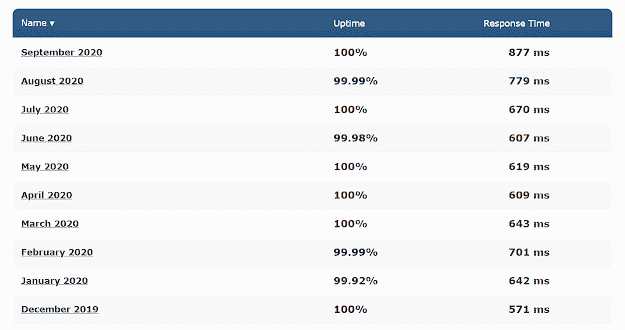
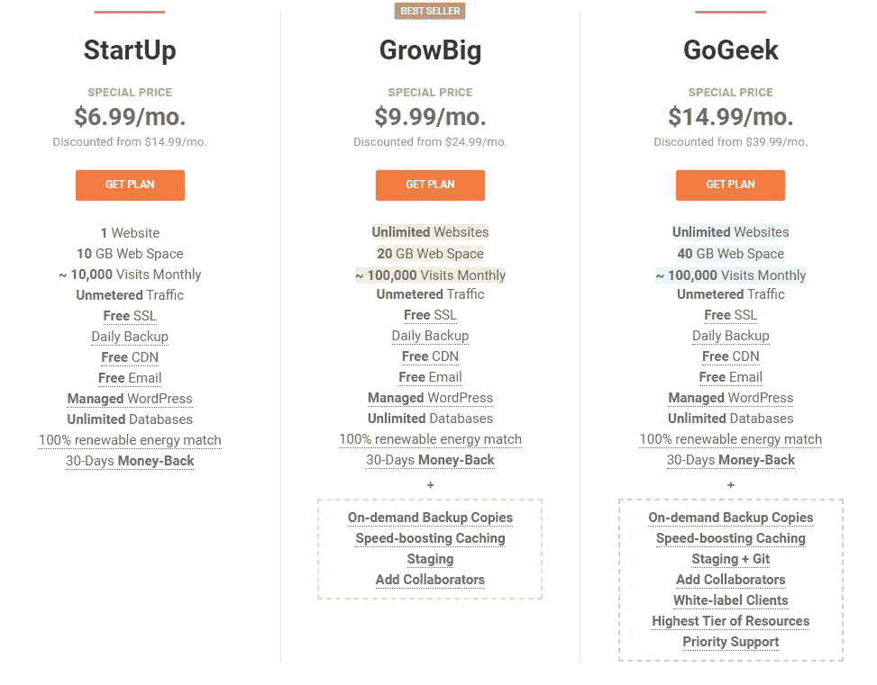
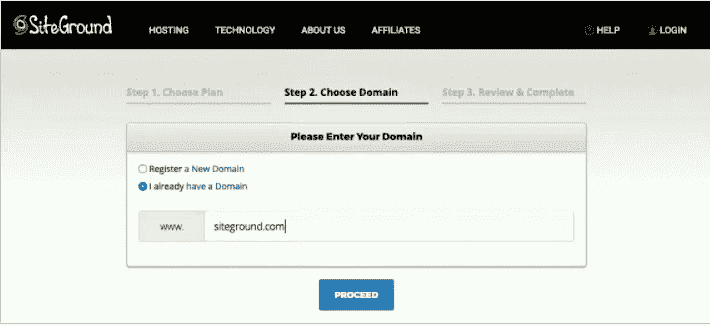
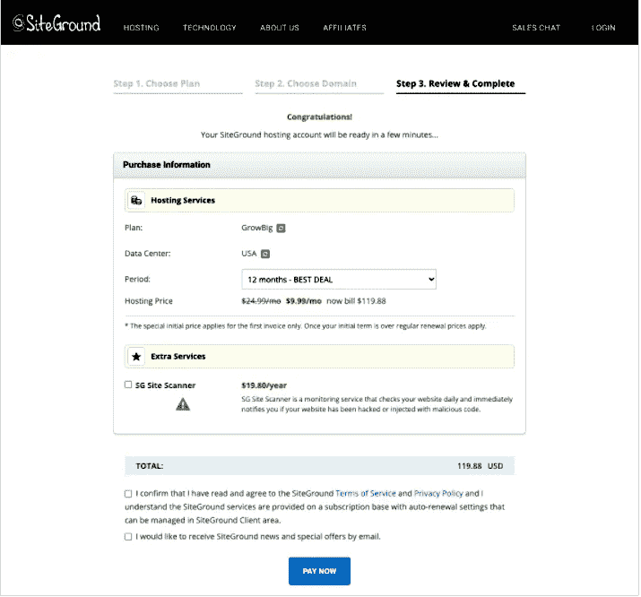

# 一个完整的网站托管审查。

> 原文：<https://blog.devgenius.io/best-web-hosting-for-your-website-a83a549b2971?source=collection_archive---------6----------------------->

## 虚拟主机可以提高或降低你的网站性能。

拉兹万·苏驰在 [Unsplash](https://unsplash.com?utm_source=medium&utm_medium=referral) 上的照片

如果你真的想在网上赚钱，你可能已经有一个网站了。如果没有，那么您必须创建一个。最好的方法是通过 WordPress 或 Webflow 或任何类似的平台。出现的主要问题是选择哪个托管平台是值得的。

第一次建立网站的用户可能会发现购买域名和托管很有挑战性，特别是如果他们以前没有这方面的经验或专业知识。你面临各种麻烦，为你的网站托管或转移到另一个；那么，这篇文章是给你的。

新手发现制作网站、购买域名和托管是令人望而生畏的。之后，它没有给我们一个压倒性的反应，因为你选择的主机是过时的。有大量的托管平台，要从中选择，有点令人困惑，尤其是对新的平台。

有各种各样的托管包，比如共享的、托管的 WordPress、Cloud 等等。对于初学者来说，共享服务器是首选，而且价格也不高。

# 使用虚拟主机服务时，你应该考虑什么因素。

**1。动机:**你背后的动机，例如，创建一个博客来赚取值得支付的主机费用，而不是你可以使用 netlify，GitHub，甚至是免费的主机服务。

**2。金钱:**考虑的基本因素之一。当你意识到其他公司也以低得多的价格提供同样的福利时。那你就是在浪费钱。或者甚至你采取了虚拟主机，它并没有很好地工作。

**3。可靠性和可用性:**虚拟主机提供商应该在速度和易于使用的界面方面是可靠的。

**4。支持服务:**虚拟主机服务为用户提供 24/7 的支持吗？就是有很高的满意率。

**5。经验:**虚拟主机服务商应该有相关领域的经验，所以他们为用户提供支持。

基于这个因素，我想开始自己的经历。

我用过 Godaddy，最后是 Siteground，因为很多博客和 YouTubers 都推荐它。但是在使用它之后，你会知道真实的面孔同样适用于我。经过大量的研究，我购买了上述主机。你无法预测未来，我的网站和 Godaddy 都很顺利，但过了一段时间，由于流量更多，网站就白搭了。然后我转到 Siteground，现在已经 3 年了，我被它的最新技术淹没了。

# 网站背景:(在黑色星期五或网络星期一提供高达 75%的折扣)

Siteground 快速、安全、经济实惠，并拥有出色的支持。该组织于 2004 年 3 月 22 日在保加利亚索非亚成立。11 年来，它一直保持着顶级竞争者的地位。

Siteground 在提供正常运行时间方面非常出色。基于来源，在 99%到 100%之间。正常运行时间是衡量虚拟主机性能的一个很好的标准。有时在一天中，用户网站在互联网上不可用，这是正常运行时间较少的主要原因。

来源:https://hostingfacts.com/hosting-reviews/siteground/

**site ground 的数据中心位于伦敦(英国)、伊姆斯黑文、法兰克福、康瑟尔布拉夫斯、爱荷华(美国)、新加坡(SG)、悉尼(AU)。**

# SiteGround 具有生动的特征，例如

1.**被广泛认可的无与伦比的支持:【SiteGround 区别于其他网络主机的一点是顶级的客户支持服务。SiteGround fast 和一个知识渊博的团队很乐意通过三种渠道(聊天、电话和门票)以 3 种语言全天候帮助客户解决托管问题。**

**2。WordPress 的专业知识和解决方案:**如今，超过 60%的网站是使用 WordPress 制作的，SiteGround 提供托管的 WordPress 服务。WordPress 和 WooCommerce 推荐 SiteGround 作为最好的 WordPress 托管提供商。

**3。为令人难以置信的速度而优化:** SiteGround 为其用户提供了令人难以置信的速度，这些用户构建在带有 SSD 磁盘的 Linux 容器上。为了进一步提高用户网站的速度，其名为超级缓存的网络缓存服务也提高了网站的加载速度。所有计划都支持免费的 Cloudflare CDN，这使得世界各地的用户网站速度更快。

**4。安全的主动方法:**安全是 SiteGround 以三种不同方式工作的最关键因素之一，如应用程序、服务器和网络。

SiteGround 还做了一个 AI 反 bot 系统，每天阻挡意想不到的攻击。

以及 SiteGround 工作的许多重要方面，并为其用户提供方便的方式。

# 现在开始如何从网站托管。

1.  **选择托管方案:**

SiteGround 主要有三个计划:StartUp、GrowBig 和 GoGeek。

a)启动计划非常适合刚开始做网站的人，或者你可以让它成为新网站。

B) GrowBig 计划是为那些希望发展和建立更多网站并获得更多流量的个人或公司制定的。

C) GoGeek 计划非常适合拥有电子商务和大型网站的个人或公司，因为大型网站需要更多的服务器资源和 GIT 集成。

**2。选择一个域:**

用户可以选择现有的域名，也可以根据自己的需要购买新的域名。SiteGround 提供了广泛领域扩展，例如。以实惠的价格获得更多优惠。

**3。查看并完成订单:**

现在是时候审查和订购您选择的域名了。SiteGround 直接适用于注册过程中选择的折扣优惠券。

**访问 SiteGround 了解更多详情。**

*最初发表于*[*https://www.shitus.com。*](http://shitus.com/a-complete-siteground-web-hosting-review/)