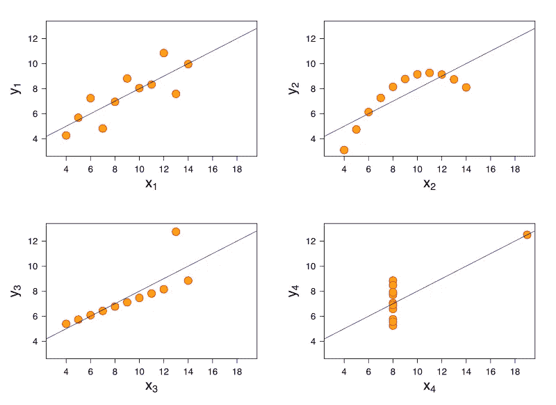

# 当心这些数据陷阱

> 原文：<https://blog.devgenius.io/beware-these-diabolical-data-traps-47a56593ae2c?source=collection_archive---------9----------------------->

“数据驱动”是过去几年一直流行的决策哲学，这个词对企业和人们的生活有着越来越大的影响。尽管这在很大程度上是一件好事，但鉴于个人经历不一定代表整体现实，人们对图表和指标的日益依赖为误导他们提供了肥沃的土壤。

您可能遇到过数据表示犯罪(有意或无意地)欺骗人们相信一个夸大的或替代的现实。正如你将看到的，这甚至不需要撒谎也是可能的。

**汇总统计**

像计数、总计和平均值这样的汇总统计是了解手头数据的一种便捷方式。然而，将数据集浓缩成有限的一组汇总值的做法可能会产生误导。虽然这对于精确理解的测量来说是正确的，但术语“平均值”尤其容易被误解，因为它可能指平均值、中间值或众数中的任何一个。

1.  算术平均值(有多种类型的平均值)是外行人在看到“平均值”这个词时通常想到的:所讨论的指标的总和除以观察次数。
2.  在以升序或降序对所讨论的度量值进行排序后，中位数是中间的观察值(或者是两个中间观察值的算术平均值，如果观察值的数量是偶数)。
3.  众数是指标中出现频率最高的值。

在实践中，我们可以看到人们使用任何“平均”适合他们的事业，甚至结合甜味剂(通常是最小或最大)。例如*“从这所大学毕业的学生平均年薪为 120 万印度卢比，最高可达 500 万印度卢比”*。

这种说法可能是正确的(平均值是指算术平均值)，事实上，大多数学生获得的工作报酬是平均值的一半或更低，少数例外情况(如最大值和接近最大值的值)推高了平均值。

平均 120 万，最高 500 万。这里没有谎言。

这就引出了这个问题——除了澄清人们提到“平均值”时所指的确切指标之外，最好还是看看指标的所有**值是如何分布的，因为汇总指标可能会隐藏重要的细微差别。例如，下面的分布都具有相同的 x 和 y 的均值和方差(参考:[安斯科姆的四重奏](https://en.wikipedia.org/wiki/Anscombe%27s_quartet))。**

在这里的每种情况下，x 的平均值是 9，y 的平均值是 7.5

这并不是说汇总统计数据会误导，只是说:

1.  我们不能把对汇总统计值的解释延伸到对单个数据点或数据分布的假设上
2.  人们必须质疑所选择的汇总统计数据是否适合这个关键问题(平均大学分班收入真的是决定加入哪所大学的最佳方式吗？)

**带头部起点的轴**

在考虑既得利益的情况下进行比较时，夸大差异的一个好方法是让图表上的纵轴从最适合夸大的地方开始，而不是从 0 开始。

例如，如果我们想让一个或两个球员看起来比其他人更有吸引力，我们可以这样做:

发现此处问题的 5 分

一个相关的扩展是在散点图中使用主观象限映射——人们可以决定什么使水平或垂直轴(或气泡大小)中的值“高”或“低”,以使他们最喜欢的数据点看起来更特别。

下面是一张图表，比较了各欧洲足球联赛每 90 分钟的进球数和每 90 分钟的冲刺数。它结合了本节中讨论的所有陷阱(数字仅用于说明):

英超是**更是**的身体对抗，我就知道！

并不是说看似很小的数字变化在上下文中没有意义(你将是最好的判断者)，但是每次你看到比较图表时，一定要注意轴范围和象限标记的选择，并询问它们是否有意义或者作者是否有所企图。

**当目的是迷惑人时，图片>数字**

意识到上述情况的侦探可能会成为令人讨厌的告密者，所以另一个夸大差异并逃脱惩罚的巧妙方法是用艺术代替图表

小字部分:*“印度人平均每小时挣 10 美元，而欧洲人每小时挣 20 美元”(数字仅供参考)*

右边袋子的长度是右边袋子的两倍，宽度也是右边袋子的两倍，所以它所占的面积实际上是右边袋子的 4 倍，这使得差异看起来比实际数字更明显。图片比文字更有力量，印象创造了棒子。

**在没有标准的情况下解释差异/使用错误的标准**

在相对和绝对指标都很重要的领域(如体育)，将一个实体(团队/运动员/公司等)的变化与该领域的其他实体进行对比是至关重要的。从个人角度来说，你的跑步速度比上一场比赛有所提高是值得高兴的事情，但是如果那些在你前面的人提高得更多，这不会增加你获胜的机会。

你可能从你的一些朋友那里听说过，某个特定的经济政策是伟大的，因为他们的收入和生活水平在接下来的 7 年里提高了。然而，人们的收入和生活水平**应该随着年龄的增长而提高**(此外，个人可能只是运气好)，所以在这种情况下测量的变化可能并不显著。一个更好的比较可能是针对替代政策的影响，或者比较今天与政策推出时年龄相同的人的收入和生活水平。

另一个巧妙的技巧是使用一个错误的标准——外行人称为“比较苹果和橘子”。在 COVID 疫情的鼎盛时期，有很多这样的事情发生——将数据准确性粗略的国家与测试和统计尽可能多的公民死亡人数的国家进行比较。

我也在网上看到一些帖子，这些帖子比较了人口差异很大的国家的绝对数字。淘气。

都是中国的错！

**让我告诉你该怎么想**

最后一个是误导的最简单的方法之一——提出你的解释，而不是停留在精确的数字上。

没错，64 比 57 高了一点，但据此将一个国家称为“热点”是一个飞跃

当谈到数据解释时，不要从表面上看形容词和副词(绝对或比较)——像“快(er)/慢(er)”、“大多数/少数”、“多于/少于”这样的短语是基于数字的观点。看这些数字，决定你是否同意说话者/作者的措辞。

*知道其他让你愤怒的数据犯罪吗？一定要留下评论！*