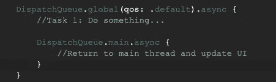
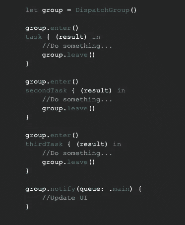
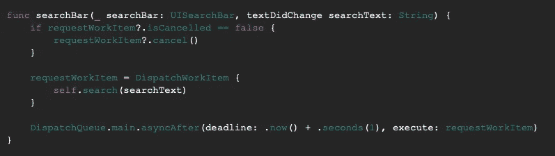

# 超越 GCD 的基础

> 原文：<https://blog.devgenius.io/beyond-the-basics-of-gcd-e65d70720260?source=collection_archive---------14----------------------->


我们都知道 iOS 中的多线程概念。这都是关于我们如何在不干扰主线程的情况下同时完成多项任务。正如我们所知，主线程在一个串行队列中运行，而 UI 只在主线程上运行。我们有不同的概念来实现多线程。它们是大中央调度(GCD)、操作队列和线程。

# 中央车站调度

GCD 是一个流行的基本概念。但是，这仅限于将任务分派到一个并发队列。



图 1:调度队列示例

除了 *DispatchQueue 之外，* GCD 还有很多被大多数开发者忽略的 API。让我们深入了解这些 API。它们是 DispatchGroup、DispatchWorkItem 和 DispatchSemaphore。

## 调度组

在开发一个 iOS 应用程序时，有时我们需要一些可以同时执行多项任务的架构。多个网络同时呼叫。在这种情况下，调度组起着至关重要的作用。我们可以同时进行多个网络调用，在所有网络调用完成后，我们可以在主线程上更新 UI。



图 2:调度组示例

正如您在上面的*图 2* 中看到的，我们需要创建 DispatchGroup 的一个*实例。*每个任务在执行前需要进入群体，执行后需要离开群体。所有任务执行完毕后，小组会通知我们。

根据苹果公司的文件，

> 组允许您聚合一组任务并同步组上的行为。您可以将多个工作项目附加到一个组中，并安排它们在同一队列或不同队列中异步执行。当所有工作项执行完毕时，该组执行其完成处理程序。您还可以同步等待组中的所有任务执行完毕。

## 分派工作项

让我们考虑一个例子，在我们的应用程序中有一个 UISearchBar。用户可以快速输入。但是，我们不想提出网络请求，在每个字符之后。我们能不能等一段时间，当用户几秒钟没有输入时，只发出一个网络请求？我们如何实现这一目标？或许，我们都会想到计时器和操作。

现在是时候了解 DispatchWorkItem 了。我们将看到 DispatchWorkItem 如何帮助我们实现这个目标。iOS 8 和 macOS 10.10 中引入了 DispatchWorkItem

> 当被问及 OperationQueue 和 GCD 的区别时，我看到许多开发人员说，OperationQueue 更好，因为我们可以取消一个操作。然而，在 GCD 中我们不能这样做。

当没有引入分派工作项时，上面的陈述是正确的。它封装了我们希望在 DispatchQueue 和 DispatchGroup 中执行的任务。我们可以在安排好工作项*之后取消它。*

我们可以创建工作项实例并附加 DispatchQueue。

```
let newWorkItem = DispatchWorkItem {
    //do something...}DispatchQueue.main.async(execute: newWorkItem)
```

现在让我们看看如何使用 DispatchWorkItem 实现这种情况。



图 3:分派工作项示例

## 调度信号量

当我们试图阻止一个线程访问一个资源时，调度信号量可以帮助我们。换句话说，我们可以说，一个任务可以同步等待其他任务完成执行。

```
let semaphore = DispatchSemaphore(value: 1)semaphore.wait()
task { (result) in
    semaphore.signal()
}
```

## 结论

GCD 是非常强大的框架。它为我们执行复杂的任务提供了更简单的方法。

希望我们已经涵盖了所有这些 API，我们应该在我们的 iOS 应用程序中使用。如果你发现其他有用的 GCD API，请在评论区告诉我。也让我知道在评论部分，你的反馈，如果你有任何问题。

感谢阅读。希望你喜欢它。随意评论。

如果你觉得这篇文章有帮助，请鼓掌，你知道每篇文章可以鼓掌 50 次😉，并鼓励我进一步写更多的文章。