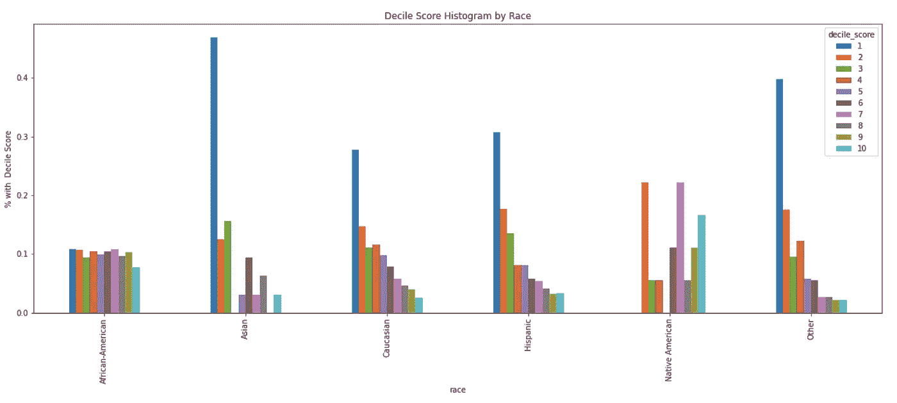
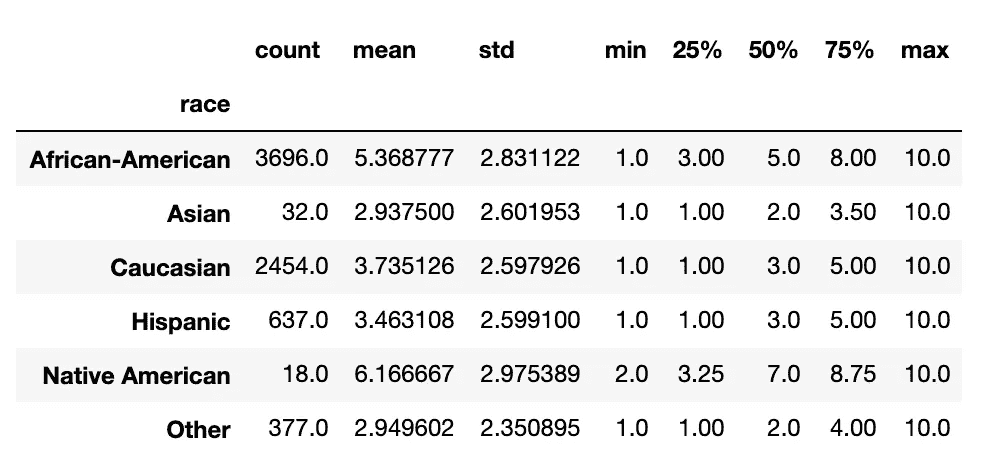
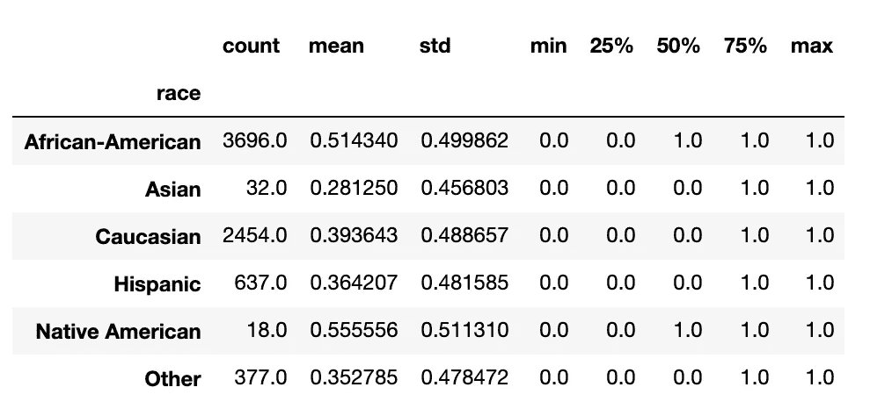
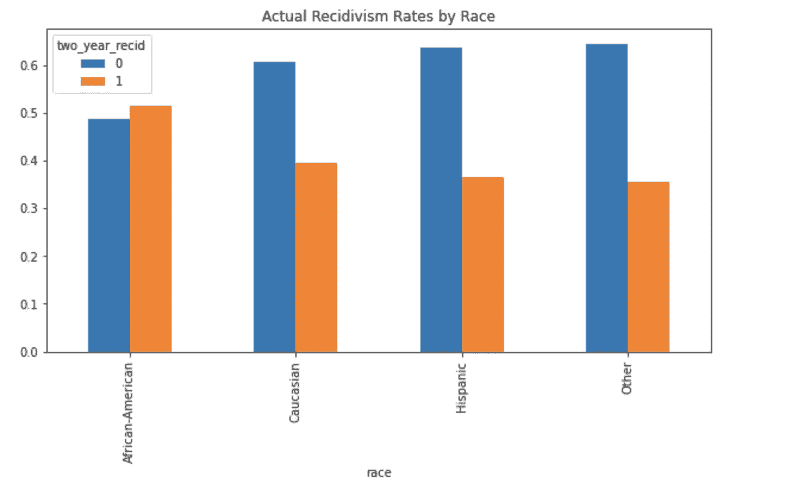
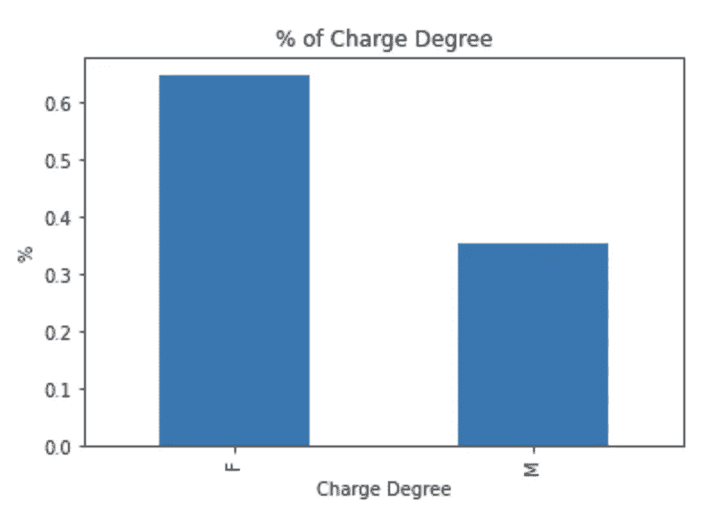

# 机器学习中的偏见和公平，第 1 部分:介绍我们的数据集和问题

> 原文：<https://blog.devgenius.io/bias-and-fairness-in-machine-learning-part-1-introducing-our-dataset-and-the-problem-24f5f15c4f23?source=collection_archive---------9----------------------->

## 文章

## *来自* [*特色工程图书营*](https://www.manning.com/books/feature-engineering-bookcamp?utm_source=medium&utm_medium=organic&utm_campaign=book_ozdemir_feature_11_11_21) *作者:思南·奥兹德米尔*

***本系列文章涵盖***

*●识别并减少我们的数据和模型中的偏差*

*●通过各种指标量化公平性*

*●应用特征工程技术，在不牺牲模型性能的情况下消除模型偏差*

在[manning.com](https://www.manning.com/?utm_source=medium&utm_medium=organic&utm_campaign=book_ozdemir_feature_11_11_21)结账时，在折扣代码框中输入 **fccozdemir** 即可享受 35%的折扣。

一般来说，机器学习问题的既定目标是建立一个特征工程管道，以最大限度地提高模型在数据集上的性能。然而，我们在这一系列文章中的目标不仅仅是监视和测量模型的性能，而且还要跟踪我们的模型是如何处理不同的数据组的，因为有时**数据就是人**。

在我们今天的案例研究中，数据是那些命悬一线的人。数据是那些只想拥有尽可能好的生活的人。当我们在偏见和歧视、系统特权和种族差异周围的水域中航行时，我们敦促您记住，当我们谈论行时，我们谈论的是人，当我们谈论功能时，我们谈论的是将几年甚至几十年的生活经历聚合到单个数字、类或布尔中。我们必须尊重我们的数据和我们的数据所代表的人们。

让我们开始吧。

## **COMPAS 数据集**

本案例研究的数据集是**用于替代制裁的惩教罪犯管理概况(COMPAS)** 数据集，它是 2013 年至 2014 年在佛罗里达州布劳沃德县筛选的刑事罪犯的集合。特别是，我们正在研究这些数据的一个子集，它对应于预测累犯(一个人是否会再次犯罪)的二元分类问题，给出了关于个人的某些特征。数据集的链接可以在这里找到:【https://www.kaggle.com/danofer/compass 

从表面上看，这个问题相当简单。二元分类，无缺失数据，走吧！当我们的 ML 模型对人们的生活和福祉产生非常真实的下游影响时，问题就出现了。作为 ML 工程师和数据科学家，这一负担的大部分落在我们身上，我们要创建不仅表现良好，而且还能生成被认为“公平”的预测的模型。

在本章中，我们将以多种方式定义和量化“公平”,最终必须做出决定，即什么样的公平标准最适合特定的问题领域。本章的目的是介绍公平的各种定义，并举例说明如何解释每一个定义。

**免责声明:本案例研究不代表统计研究，也不应用于对美国的刑事司法系统做出任何概括。我们的目标是强调数据中的偏差实例，并推广工具以最大限度地提高 ML 系统的公平性。**

让我们跳进去，从接受我们的数据开始，四处看看。

**清单 1。摄取数据**

```
import pandas as pd  #A
 import numpy as np  #A
 compas_df = pd.read_csv('../data/compas-scores-two-years.csv')  #B
 compas_df.head()  #B
```

**#A 导入包
#B 显示前五行**


图一。我们 COMPAS 数据集的前五行显示了一些关于被关押在佛罗里达州布劳沃德县的人的敏感信息。我们在这里的回答标签是“two_year_recid”，它代表了对二元问题“这个人在被释放后的两年内又回到监狱了吗？”

在 2016 年的原始 ProPublica 研究中，他们研究了 COMPAS 算法、软件和基础数据的公平性，重点关注了给予每个人的**十分位数**。十分制分数是从 1 到 10 的分数，将数据划分为 10%的区间。如果这个词看起来有些熟悉，那是因为它与百分位数的概念密切相关。这个想法是，可以给一个人一个 1 到 10 之间的分数，其中每个分数代表一个群体的一部分，在这个群体中，一定比例的高于和低于这个群体的人在一个指标中排名更高。例如，如果我们给某人的十分位数分数为 3，这意味着 70%的人应该有更高的再犯风险(分数为 4、5、6、7、8、9 和 10 的人)，20%的人有更低的再犯风险(分数为 1 和 2 的人)。同样，7 分意味着 30%的人有较高的累犯率(得分为 8、9、10 的人)，而 60%的人有较低的累犯率(得分为 1、2、3、4、5 和 6 的人)

这项研究进一步显示了十分制分数的使用方式和它们不总是看起来公平之间的差异。例如，如果我们看看分数是如何分布的，我们可以看到不同种族的分数是不同的。下面的片段将绘制一个按种族划分的十分位数的直方图，并强调一些事情:

1.  非裔美国人的十分位数分数分布相对均匀，大约 10%的人口居住在每个十分位数分数中。根据十分位数的定义，这在表面上是恰当的。理论上，10%的人口应该生活在每一个十分位数
2.  亚洲人、高加索人、西班牙人和其他类别似乎在十分位数分数上有右倾斜，其中该类别的大部分具有 1 或 2 的十分位数分数

```
compas_df.groupby('race')['decile_score'].value_counts(
     normalize=True
 ).unstack().plot(
     kind='bar', figsize=(20, 7),
     title='Decile Score Histogram by Race', ylabel='% with Decile Score'
 )
```



图二。当按种族划分时，我们可以看到十分位数分数分布的明显差异。

通过检查按种族划分的十分位数分数的一些基本统计数据，我们可以更清楚地看到这一点。

```
compas_df.groupby('race')['decile_score'].describe()
```



图 3。看看按种族划分的十分位数得分的平均值和中位数，我们可以看到，例如，非裔美国人的十分位数得分为 5(这是意料之中的)，但高加索人和西班牙人的十分位数得分为 3。

我们可以继续观察 ProPublica 研究如何解释这些数据，但我们对该数据集的方法不是试图重现这些结果，而是将重点放在用这些数据建立一个二元分类器上，忽略已经给人们的十分位数。

## **问题陈述/成功定义**

正如前面提到的，这里的最大似然问题是一个二进制分类问题。我们模型的目标可以概括为以下问题:

“考虑到一个人的某些方面，我们能准确而公正地预测他的累犯率**吗？”**

准确地说，这个术语应该很简单。我们有大量的指标来衡量模型性能，包括准确性、精确度和 AUC。然而，当谈到“公平”这个术语时，我们需要学习一些新的术语和度量标准。在我们进入如何量化偏见和公平之前，让我们先做一些 EDA 知道手头的问题。

## **探索性数据分析**

我们的目标是基于该数据集中关于人的特征直接对我们的响应标签`two_year_recid`建模。具体来说，我们有以下特点:

1.  性别——定性的二元“男性”或“女性”
2.  年龄——数量比率，以年为单位
3.  种族-定性名义
4.  juv _ fel _ count——定量，此人之前犯有少年重罪的次数
5.  juv _ misd _ count——定量，此人有少年犯罪前科的次数
6.  juv _ other _ count——定量，既不是重罪也不是轻罪的青少年定罪数量。
7.  priors _ count——定量，先前犯罪的次数
8.  c_charge_degree —定性，二进制，“F”代表重罪，“M”代表轻罪

我们的回应标签是:

1.  two_year_recid —定性，二进制，此人是否在 2 年内再次犯罪，是或否

请注意，我们有三个单独的列来计算青少年犯罪。我们应该注意，对于我们的模型，我们可能希望将这些合并到一个单独的列中，该列简单地计算此人的少年犯罪次数。

鉴于我们的问题陈述创建了一个准确和公平的模型，让我们来看看累犯按种族的分类。当我们将我们的数据集按种族分组并观察累犯率时，很明显累犯的“基础率”存在差异。没有进一步细分(按年龄、犯罪史等)。)不同种族之间的累犯率有很大差异。

```
compas_df.groupby('race')['two_year_recid'].describe()
```



图 4。按种族划分的累犯描述性统计。我们可以看到不同种族群体之间累犯率的明显差异

我们还应该注意，我们有两个种族类别(亚洲人和美洲土著人)，在我们的数据中代表性非常小。这是一个**样本偏差**的例子，人口可能没有得到适当的代表。这些数据来自佛罗里达州的布劳沃德县，根据美国人口普查，例如，亚裔人口约占总人口的 4%；而在数据集中，它们约占数据的 0.44%。

出于本书的目的，我们将把带有种族的数据点重新标记为“亚洲人”或“美洲原住民”，并将他们的种族重新标记为“其他”，以避免在我们的衡量标准中出现任何与两类种族代表性不足相关的误解。我们做这种重新标记的主要原因是为了使产生的类更加平衡。在我们最后的图中，很明显“亚洲人”和“美洲原住民”阶层的人数远远不足，因此尝试使用该数据集对他们做出有意义的预测是不合适的。

一旦我们重新标记了这些数据点，那么让我们为我们现在考虑的四个种族类别绘制实际的 2 年累犯率。

**清单 2。重新标记代表不足的种族**

```
# re-label two races as Other.
 # This is done purely for educational reasons and to avoid addressing issues with a skewed sample in our data
 compas_df.loc[compas_df['race'].isin(['Native American', 'Asian']), 'race'] = 'Other'  # A

 compas_df.groupby('race')['two_year_recid'].value_counts(
     normalize=True
 ).unstack().plot(
     kind='bar', figsize=(10, 5), title='Actual Recidivism Rates by Race'
 )  # B
```

**#A 将亚裔/美洲原住民种族的行重新标记为其他**

**#B 图我们正在考虑的四场比赛的累犯率**



图 5。显示各组累犯率的条形图

同样，我们可以看到我们的数据显示非裔美国人的复发率高于白种人、西班牙人或其他人种。出现这种情况的原因是许多不同的系统原因造成的，这些原因我们在本书中根本无法触及。现在，让我们注意到，即使各组之间的累犯率不同，非洲裔美国人接近 50/50 的比例和白种人 60/40 的比例之间的差异并不是根本不同的比率。

**性别差异:我们也可以选择查看性别偏见，因为在该数据集中，男性和女性之间肯定存在差异。出于本案例研究的目的，我们选择关注数据中存在的种族偏见。**

让我们继续深入了解我们的其他功能。我们有一个二进制电荷量特征，我们必须将其编码为布尔值，但在当前形式下看起来是可用的:

```
compas_df['c_charge_degree'].value_counts(normalize=True).plot(
     kind='bar', title='% of Charge Degree', ylabel='%', xlabel='Charge Degree'
 )
```



图 6。重罪和轻罪在我们数据集中的程度分布。我们有大约 65%的重罪指控为 F 级，其余为轻罪指控为 M 级。

让我们通过查看剩余定量特征的直方图来总结我们的 EDA:年龄和 priors_count。这两个变量都显示出非常明显的右偏，通过一些标准化可以减少一些异常值。

**清单 3。绘制我们的定量变量直方图**

```
# Right skew on Age
 compas_df['age'].plot(
     title='Histogram of Age', kind='hist', xlabel='Age', figsize=(10, 5)
 )

 # Right skew on Priors as well
 compas_df['priors_count'].plot(
     title='Histogram of Priors Count', kind='hist', xlabel='Priors', figsize=(10, 5)
 )
```


图 7。年龄和前科的统计显示了数据的右偏。它显示出我们数据集中的大多数人都很年轻，但是我们确实有一些异常值将平均值拉向右边。当我们研究模型公平性时，这将再次出现

我们的 EDA 给了我们一些初步的见解，让我们继续讨论和衡量我们的模型的偏见和公平性。

## **测量偏差&公平性**

当我们的任务是使模型预测尽可能公平和无偏见时，我们需要考虑一些不同的方式来制定和量化公平性，以便我们可以量化我们的 ML 模型做得有多好。

## 截然不同的待遇与截然不同的影响

一般来说，一个模型——或者实际上任何预测/决策过程——都会遭受两种形式的偏差:完全不同的处理和完全不同的影响。如果预测以某种方式基于敏感属性(如性别或种族)，则认为模型受到了不同的对待。如果预测/预测的下游结果不成比例地伤害或有利于具有特定敏感特征的人，看起来像预测一个种族比另一个种族的累犯率更高，则模型也可能具有不同的影响。

## **公平的定义**

在一个模型中，至少有几十种定义公平的方法，但现在让我们专注于三种，当我们建立基线模型时，我们会再次看到这些方法，甚至更多。

## 没认识到

无知可能是公平最简单的定义。它规定模型不应将敏感属性作为特征包含在训练数据中。这样，我们的模型在训练时将无法访问敏感值。这个定义与区别对待的思想非常一致，因为我们实际上不允许模型看到我们数据的敏感值。

使用无意识作为定义的表面支持是很容易向某人解释我们只是在我们的模型中没有使用一个特征，因此它怎么可能获得任何偏差？对这种说法的反驳和依赖不知晓来定义公平的主要缺陷是，模型往往能够通过依赖与我们试图不知晓的原始敏感特征高度相关的其他特征来重新构建敏感值。

例如，如果招聘人员正在决定是否雇用候选人，我们希望他们对候选人的性别敏感，我们可以简单地让招聘人员对候选人的性别视而不见；然而，如果招聘人员还注意到候选人将“兄弟会”列为先前的志愿者/领导经历，则招聘人员可以合理地推断该候选人很可能是男性。

## 统计平价

*统计均等，*也称为人口统计均等或不同影响，是公平的一个非常常见的定义。简而言之，它表明我们的模型对某个类别的预测(他们是否会复发)与敏感特征无关。放入公式中:

P(累犯|种族=非裔)= P(累犯|种族=白种人)= P(累犯|种族=西班牙裔)= P(累犯|种族=其他)

换句话说，为了达到良好的统计均等，我们的模型应该预测每个种族类别的累犯率相等。上面的公式非常严格，为了放松这一点，我们可以依靠*五分之四规则，*该规则规定，对于任何弱势群体，选择率(我们预测累犯的比率)，我们的预测率的比率可以落在范围(0.8，1 / 0.8)内，并被认为是公平的。作为一个公式，如下所示。

0.8【胡与陈】WWW2018 。

依赖统计奇偶性的一个警告是，它忽略了我们的标签和我们的敏感属性之间的任何可能的关系。在我们的案例中，这实际上是一件好事，因为我们希望忽略我们的反应(此人是否会再犯)和我们的敏感属性(种族)之间的任何相关性，因为这种相关性是由比我们的案例研究更大的因素驱动的。对于任何用例，我们的读者可能会在未来考虑，这可能是不可取的，所以请考虑这一点！

另一个单纯依赖统计奇偶性的警告是，我们的 ML 模型在理论上可能是“懒惰的”,从每个组中选择随机的人，我们仍然可以在技术上实现统计奇偶性。显然，我们的 ML 度量应该捕捉到我们的模型这样做，但它总是要注意的。

均等的赔率

## 也被称为正比率奇偶校验，公平的均衡赔率定义表明，我们的模型对我们的反应的预测应该独立于我们的敏感特征，取决于我们的响应值。在我们的示例中，均等的赔率意味着满足以下两个条件:

P(累犯|种族=西班牙裔，实际累犯=真)= P(累犯|种族=高加索人，实际累犯=真)= P(累犯|种族=非裔，实际累犯=真)= P(累犯|种族=其他，实际累犯=真)

**和**

P(累犯|种族=西班牙裔，实际累犯=假)= P(累犯|种族=高加索人，实际累犯=假)= P(累犯|种族=非裔，实际累犯=假)= P(累犯|种族=其他，实际累犯=假)

另一种看法是，我们的模型均衡了赔率，如果:

独立于种族，我们的模型同样预测了那些确实再犯的人的再犯率

1.  独立于种族，我们的模型同样预测了实际上没有累犯的人的累犯率。
2.  在我们的定义中使用均等优势的好处是，它惩罚了我们在统计均等中谈到的同样的“懒惰”。它鼓励模型在所有组中变得更加准确，而不是允许模型简单地随机预测累犯，以实现组之间相似的预测率。

最大的缺陷是，这些均衡的赔率对不同的基本反应率很敏感。在我们的数据中，我们看到非裔美国人的复发率高于其他三个种族类别。如果这是一个我们认为种族群体和累犯率之间存在一些自然差异的场景，那么均等的几率对我们来说就不是一个好的衡量标准。在我们的案例中，这将不是一个问题，因为我们拒绝接受这些与种族和累犯有关的基本比率反映自然累犯率的观点。

其他公平指标:有几十种既定的指标用于衡量公平和偏见。我们的案例研究将触及其中的一些，但我们建议查看专门关注偏见/公平的其他文本，以获得全面的处理

在[第 2 部分](https://manningbooks.medium.com/bias-and-fairness-in-machine-learning-part-2-building-a-baseline-model-and-features-358d13b39f1a)中了解更多关于构建基线模型的信息。

如果你想了解这本书的更多内容，可以在曼宁的 liveBook 平台上查看[这里](https://livebook.manning.com/book/feature-engineering-bookcamp?origin=product-look-inside&utm_source=medium&utm_medium=organic&utm_campaign=book_ozdemir_feature_11_11_21)。

If you want to learn more about the book, check it out on Manning’s liveBook platform [here](https://livebook.manning.com/book/feature-engineering-bookcamp?origin=product-look-inside&utm_source=medium&utm_medium=organic&utm_campaign=book_ozdemir_feature_11_11_21).