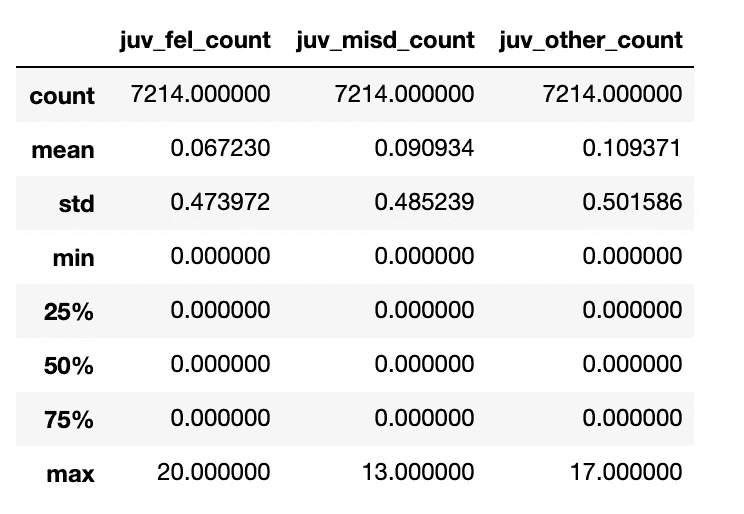
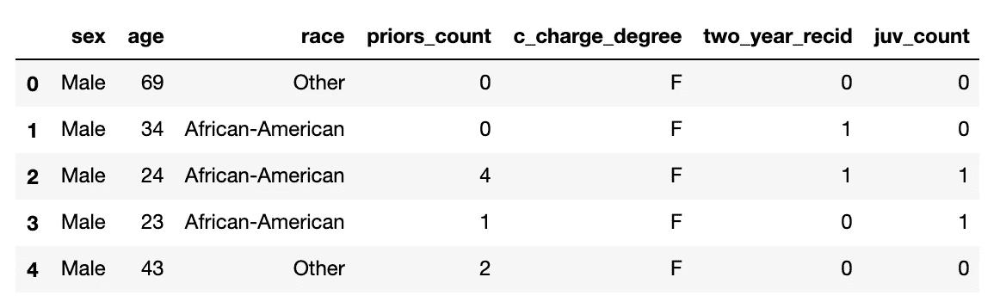
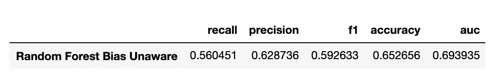
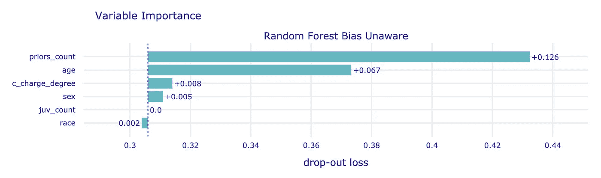
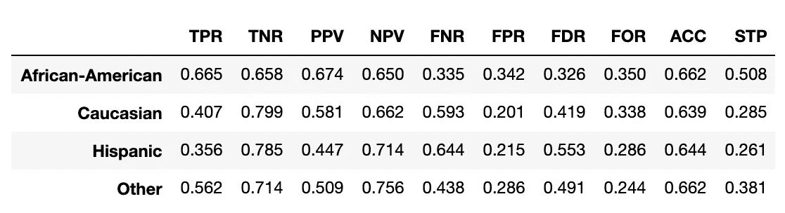
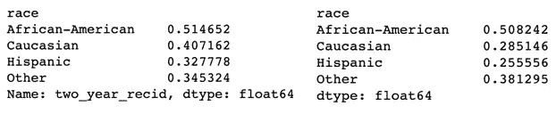
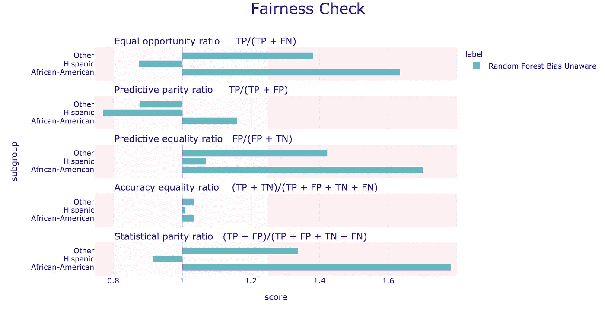
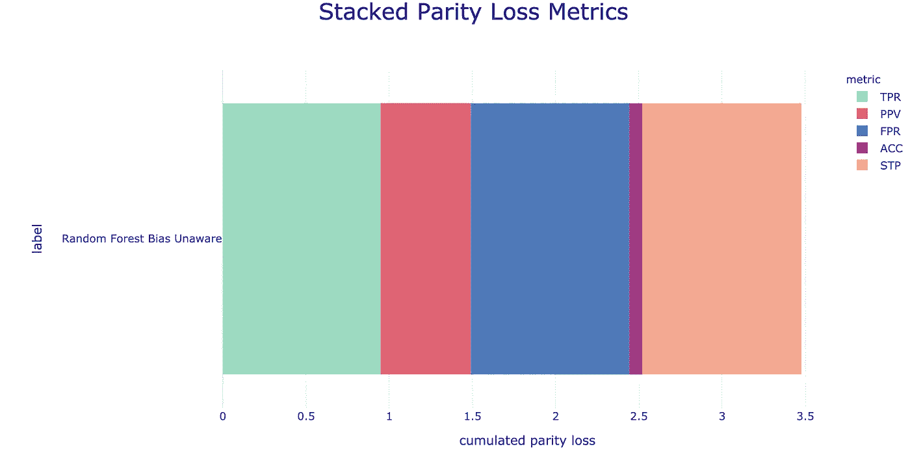

# 机器学习中的偏见和公平，第 2 部分:建立基线模型和特征

> 原文：<https://blog.devgenius.io/bias-and-fairness-in-machine-learning-part-2-building-a-baseline-model-and-features-358d13b39f1a?source=collection_archive---------19----------------------->

## 文章

## *来自* [*特色工程图书营*](https://www.manning.com/books/feature-engineering-bookcamp?utm_source=medium&utm_medium=organic&utm_campaign=book_ozdemir_feature_11_11_21) *作者:思南·奥兹德米尔*

***本系列文章涵盖***

*●识别并减少我们的数据和模型中的偏差*

*●通过各种指标量化公平性*

*●应用特征工程技术，在不牺牲模型性能的情况下消除模型偏差*

在[manning.com](https://www.manning.com/?utm_source=medium&utm_medium=organic&utm_campaign=book_ozdemir_feature_11_11_21)结账时，在折扣代码框中输入 **fccozdemir** 即可享受 35%的折扣。

## **建立基线模型**

请查看[第 1 部分](https://manningbooks.medium.com/bias-and-fairness-in-machine-learning-part-1-introducing-our-dataset-and-the-problem-24f5f15c4f23)了解数据集的介绍以及偏见如何影响机器学习模型，使得公平在处理数据时成为重要的考虑因素。

是时候建立我们的基线 ML 模型了。对于我们的模型的第一遍，我们将应用一点特征工程来确保我们的模型正确地解释我们的所有数据，并花时间分析我们的模型的公平性/性能结果。

## **特征构造**

正如我们在 EDA 中看到的那样，我们有三个特征，每个特征都可以计算相关人员的青少年犯罪数量。再来看看我们的三个少年特征。

```
compas_df[["juv_fel_count", "juv_misd_count", "juv_other_count"]].describe()
```



图一。我们有三个不同的特征，每一个都是少年犯罪的子集。我们的目标是将它们结合成一个功能

让我们将这些都添加到一个名为 juv_count 的新列中，这样应该更容易理解一些。

**清单 1。构建新的青少年犯罪计数功能**

```
# feature construction, add up our three juv columns and remove the original features
 compas_df['juv_count'] = compas_df[["juv_fel_count", "juv_misd_count", "juv_other_count"]].sum(axis=1)  # A
 compas_df = compas_df.drop(["juv_fel_count", "juv_misd_count", "juv_other_count"], axis=1)  # B
```

**#A 构建我们新的青少年犯罪总数**

**#B 去掉原来的少年特征**

我们现在有 1 个新功能，因此我们删除了 3 个功能。



图二。我们的训练数据的当前状态和我们的青少年犯罪总数

## **建立我们的基线管道**

让我们开始把我们的管道放在一起，创建我们的基线 ML 模型。首先，我们将数据分成训练集和测试集，并实例化一个静态随机森林分类器。我们在这里选择了随机森林模型，因为随机森林模型具有计算特征重要性的有用特性。这最终会对我们非常有用。我们可以选择决策树，甚至逻辑回归，因为它们都有特征重要性的表示，但现在，我们将选择随机森林。请记住，我们的目标是操纵我们的特征，而不是我们的模型，所以我们将在所有的迭代中使用相同的模型和相同的参数。除了分割我们的 X 和 y，我们还将分割 race 列，这样我们就有一个简单的方法来分割我们的测试集。

**清单 2。将我们的数据分成训练集和测试集**

```
from sklearn.model_selection import train_test_split
 from sklearn.ensemble import RandomForestClassifier

 # Split up our data
 X_train, X_test, y_train, y_test, race_train, race_test = train_test_split(compas_df.drop('two_year_recid', axis=1),
                                                     compas_df['two_year_recid'],
                                                     compas_df['race'],
                                                     stratify=compas_df['two_year_recid'],
                                                     test_size=0.3,
                                                     random_state=0)

 # our static classifier
 classifier = RandomForestClassifier(max_depth=10, n_estimators=20, random_state=0)
```

现在我们已经把数据分割好了，分类器也准备好了，让我们像上一章一样开始创建我们的特征管道。首先是我们的分类数据。让我们创建一个管道，它将对我们的分类列进行热编码，并且如果分类特征是二进制的，则只删除第二个伪列。

**清单 3。创建我们的定性渠道**

```
from sklearn.compose import ColumnTransformer
 from sklearn.pipeline import Pipeline, FeatureUnion
 from sklearn.preprocessing import OneHotEncoder, StandardScaler

 categorical_features = ['race', 'sex', 'c_charge_degree']
 categorical_transformer = Pipeline(steps=[
     ('onehot', OneHotEncoder(drop='if_binary'))
 ])
```

对于我们的数字数据，我们将调整我们的数据，以降低我们在 EDA 中看到的异常值。

**清单 4。创建我们的量化渠道**

```
numerical_features = ["age", "priors_count"]
 numerical_transformer = Pipeline(steps=[
     ('scale', StandardScaler())
 ])
```

让我们介绍来自 scikit-learn 的 ColumnTransformer 对象，它将帮助我们用最少的代码快速地将我们的两个管道应用到我们的特定列。

**清单 5。将我们的管道放在一起，创建我们的特征预处理器**

```
preprocessor = ColumnTransformer(transformers=[
         ('cat', categorical_transformer, categorical_features),
         ('num', numerical_transformer, numerical_features)
 ])

 clf_tree = Pipeline(steps=[
     ('preprocessor', preprocessor),
     ('classifier', classifier)
 ])
```

随着管道的建立，我们可以在我们的训练集上训练它，并在我们的测试集上运行它。

**清单 6。在我们的测试集上运行我们的无偏见模型**

```
clf_tree.fit(X_train, y_train)
 unaware_y_preds = clf_tree.predict(X_test)
```

*Unaware_y_preds* 将是一个由 0 和 1 组成的数组，其中 0 表示我们的模型预测此人不会再次成为好友，1 表示我们的模型预测此人会再次成为好友。

现在我们已经在测试集上预测了我们的模型，是时候开始研究我们的 ML 模型到底有多公平了。

## **基线模型中的测量偏差**

为了帮助我们深入了解我们的公平指标，我们将使用一个名为 *dalex* 的模块。Dalex 有一些优秀的特性，有助于可视化不同种类的偏见和公平指标。我们的基本对象是解释器对象，使用我们的解释器对象，我们可以获得一些基本的模型性能。

**清单 7。使用 Dalex 解释我们的模型**

```
import dalex as dx

 exp_tree = dx.Explainer(clf_tree, X_test, y_test, label='Random Forest Bias Unaware', verbose=True)
 exp_tree.model_performance()
```



图 3。我们的无偏见模型的基线模型性能

我们的指标并不惊人，但我们关心性能和公平性，所以让我们深入了解一下公平性。我们的第一个问题是“我们的模型在多大程度上依赖种族作为预测累犯的方式？”这个问题与我们模型的不同处理方式密切相关。Dalex 有一个非常方便的绘图，可以与基于树的模型和线性模型一起使用，以帮助可视化我们的模型从中学习最多的功能。

```
exp_tree.model_parts().plot()
```



图 4。dalex 报道的无偏见模型的特征重要性。该可视化直接从随机森林的要素重要性属性中获取要素重要性，并显示 priors_count 和 age 是我们最重要的要素。

Dalex 根据**退出损失**来报告重要性，这意味着如果完全删除特征问题，我们模型的整体“适合度”会降低多少。根据这个图表，如果我们丢失了 priors_count，我们的模型将丢失很多信息，但是理论上，如果我们放弃 race，情况会更好。看起来我们的模型根本没有从比赛中学习！这说明了模型对敏感特征的不了解。

在我们开始无偏见的舞蹈之前，我们应该再看几个指标。Dalex 也有一个 model_fairness 对象，我们可以查看它，它将为我们的每个种族类别计算几个指标。

**清单 8。输出模型公平性**

```
mf_tree = exp_tree.model_fairness(protected=race_test, privileged = "Caucasian")
 mf_tree.metric_scores
```



图 5。我们的无偏见模型的 10 个公平指标的分解

默认情况下，该软件包在这里为我们提供了 10 个指标，让我们根据真阳性(TP)、假阳性(FP)、假阴性(FN)、实际阳性(AP)、实际阴性(AN)、预测阳性(PP)和预测阴性(PN)来分解如何计算每个指标。请记住，我们可以按种族计算这些指标:

1.  TPR(r) = TP / AP(又称灵敏度)
2.  TNR = TN/AN(也称为特异性)
3.  PPV(r) = TP / (PP)(也称为精度)
4.  NPV(r) = TN / (PN)
5.  FNR(r) = FN / AP **或** 1 — TPR
6.  FPR(r) = FP / AN **或** 1 — TNR
7.  FDR(r) = FP / (PP) **或** 1 — PPV
8.  FOR(r) = FN / (PN) **或** 1 — NPV
9.  ACC(r) = TP + TN / (TP + TN + FP + FN)(按种族划分的整体准确度)
10.  STP(r) = TP + FP / (TP + FP + FP + FN)(又名 P[预测累犯| Race=r])

这些数字本身不会有很大帮助，所以让我们通过将我们的价值观与特权人群(白种人)进行比较来进行“公平检查”。为什么我们选择白种人作为我们的特权群体？嗯，在许多其他原因中，如果我们看看我们的基线模型预测我们组之间累犯的频率，我们会注意到，与我们测试集中的实际比率相比，该模型大大低估了白人累犯率。

出于我们的目的，我们将重点关注 **TPR、ACC、PPV、FPR、**和 **STP** 作为我们的主要指标。我们选择这些指标的原因是:

1.  TPR 与我们的模型捕捉实际累犯的程度有关。在人们反复争吵的所有时间里，我们的模型预测他们是积极的吗？我们希望这个值更高。
2.  ACC 是我们的整体准确度。这是一个相当全面的方法来判断我们的模型，但不会在真空中被考虑。我们希望这个值更高。
3.  PPV 是我们的精准。它衡量我们对模型的正面预测的信任程度。在我们的模型预测累犯的次数中，模型在积极预测中的正确率是多少？我们希望这个值更高。
4.  FPR 涉及到我们的模型预测累犯率时，有人不会真的累犯。我们希望这个更低。
5.  STP 是每组的统计奇偶校验。。我们希望这在种族上大致相等，这意味着我们的模型应该能够基于非人口统计信息可靠地预测累犯。

**清单 9。凸显白种人的特权**

```
# Recidivism by race in our test set
 y_test.groupby(race_test).mean()

 # Predicted Recidivism by race in our bias-unaware model
 pd.Series(unaware_y_preds, index=y_test.index).groupby(race_test).mean()
```



图 6。左边是我们测试集中各组的实际累犯率，右边是我们基线无偏差模型预测的累犯率。我们的模型大大低估了白人惯犯。将近 41%的白种人会复发，而我们的模型认为只有 28%会复发。这意味着我们的模型漏掉了近 30%的白种人复发。

非洲裔美国人的累犯率预测非常相似，而白种人似乎只有不到 29%的时间得到累犯预测，即使实际比率几乎是 41%。事实上，我们的模型低估了白种人群体，这表明白种人在我们的模型中享有特权。发生这种情况的部分原因是这些数据代表了不公平的司法系统。回想一下这样一个事实，即非裔美国人有更高的既往数，既往数是我们模型中最重要的特征，但它仍然无法准确预测高加索人的累犯，我们的模型显然无法基于原始数据可靠地预测累犯。

现在让我们运行公平性检查，看看我们的无偏见模型如何跨越我们的五个偏见指标。

```
mf_tree = exp_tree.model_fairness(protected=race_test, privileged = "Caucasian")
 mf_tree.fairness_check()
```

我们的输出列在下表中，乍一看，很多！我们强调了需要关注的主要领域。我们希望每个值都在(0.8 和 1.25)之间，粗体值是超出该范围的值，因此被称为偏差的证据。

```
Bias detected in 4 metrics: TPR, PPV, FPR, STP
 Conclusion: your model is not fair because 2 or more criteria exceeded acceptable limits set by epsilon.
 Ratios of metrics, based on 'Caucasian'. Parameter 'epsilon' was set to 0.8 and therefore metrics should be within (0.8, 1.25)
                        TPR       ACC       PPV       FPR       STP
 African-American  **1.633907**  1.035994  1.160069  **1.701493  1.782456**
 Hispanic          0.874693  1.007825  **0.769363**  1.069652  0.915789
 Other             **1.380835**  1.035994  0.876076  **1.422886**  **1.336842**
```

上表中的每个值都是 metric_scores 表中的值除以白种人值(我们的特权群体)。例如，非裔美国人的 TPR 值 1.633907 等于 TPR(非裔美国人)/ TPR(高加索人)，计算结果为 0.665 / 0.407。

然后对照五分之四的范围(0.8，1.25)检查这些比率，如果我们的指标超出该范围，我们认为该比率不公平。理想值是 1，表示该比赛的指定指标等于我们特权组的指标值。如果我们把超出这个范围的比率加起来，我们得到 7(它们是粗体的)。

我们也可以使用 dalex 绘制上表中的数字。

```
mf_tree.plot()  # Same numbers from the fairness_check in a plot
```



图 7。Dalex 提供了我们将重点关注的 5 个主要比率的直观细分，并按小组进行细分。我们希望所有的蓝色柱线都在图表的黄色部分，红色部分的柱线被认为有偏差的危险。我们可以看到我们有一些工作要做！

为了使事情变得简单一点，让我们把重点放在公平性检查的五个指标的奇偶损失上。*均等损失*代表我们弱势群体的总分。Dalex 将指标的奇偶校验损失计算为我们的公平性检查中指标比率对数的绝对值之和。


例如，如果我们看一下我们组的统计平价(STP ),我们有:

STP(非裔美国人)= 0.508

西班牙裔 STP = 0.261

STP(其他)= 0.381

STP(白种人)= 0.285

一个简短的代码片段显示，在我们的无偏见模型中，STP 的奇偶校验损失应该是 0.956

```
# STP metrics for unprivileged groups
 unpriv_stp = [0.508, 0.261, 0.381]

 # STP metrics for privileged group
 caucasian_stp = 0.285

 # 0.956 appears as light orange in the following figure
 sum([abs(np.log(u / caucasian_stp)) for u in unpriv_stp])
```

我们看到 STP 的奇偶损失是 0.956。幸运的是，dalex 为我们提供了一种更简单的方法来计算所有五个指标的奇偶校验损失，并为我们将它们堆叠在一个图表中。下图是我们将用于跨模型进行比较的图，5 个堆栈代表了我们五个偏差指标中每一个的值。它们堆叠在一起代表模型的整体偏差。我们希望看到总堆叠长度到**减少**，因为我们变得更有偏差意识。我们将把这个堆叠奇偶校验损失图与经典的 ML 指标配对，如准确度、精确度和召回率。

```
# Plot of parity loss of each metric
 mf_tree.plot(type = 'stacked')
```



图 8。累积奇偶校验损失。在这种情况下，越小越好，意味着偏差越小。例如，右手边的浅橙色部分代表我们之前手工计算的 0.956。总的来说，我们的无偏见模型得分约为 3.5，这是我们在偏见方面要击败的数字。

我们现在有了模型性能的基线(来自我们的模型性能总结)和由我们的堆叠奇偶损失图表给出的公平性基线。

现在让我们继续讨论如何积极利用特征工程来减少数据中的偏差。

## **减轻偏见**

当谈到在我们的模型中减少偏见和促进公平时，我们有三个主要的机会来做到这一点:

1.  预处理—应用于训练数据的偏差缓解，即在模型有机会对训练数据进行训练之前
2.  处理中-在训练阶段应用于模型的偏差缓解
3.  后处理-在模型拟合到训练数据后，应用于预测标注的偏差缓解

偏差缓解的每个阶段都有优点和缺点，预处理直接涉及特征工程技术。

## **预处理**

在建模发生之前，预处理偏差减轻发生在训练数据中。当我们无法访问模型本身或下游预测，但可以访问初始训练数据时，预处理非常有用。

我们将在本章中实现的预处理偏差缓解技术的两个示例是:

1.  **完全不同的影响消除** —编辑特征值以提高组的公平性
2.  **学习公平表示** —通过混淆关于受保护属性的原始信息来提取新的特征集

通过实现这两种技术，我们希望减少我们的模型所表现出的整体偏差，同时也试图提高我们的 ML 管道在这个过程中的性能。

## **进行中**

在训练期间应用处理中的技术。它们通常以某种正则项或替代目标函数的形式出现。只有当我们能够使用实际的学习算法时，内处理技术才是可能的。否则，我们将不得不依赖于预处理或后处理。

处理中偏差缓解技术的一些例子包括:

1.  元公平分类器—使用公平性作为输入来优化分类器的公平性
2.  偏见消除器——对我们的学习目标实施一个特权感知正则化术语

## **后处理**

顾名思义，后处理技术是在训练时间之后应用的，并且在我们需要将 ML 模型视为黑盒并且我们无法访问原始训练数据时最有用。

后处理偏差减轻技术的一些例子包括:

1.  均等赔率-使用单独的优化目标修改预测的标注，以使预测更加公平。
2.  校准均衡赔率-修改分类器的分数以获得更公平的结果。

目前就这些。在第 3 部分中，我们将了解如何构建一个偏差感知模型。

如果你想了解这本书的更多信息，可以在曼宁的 liveBook 平台上查看[这里](https://livebook.manning.com/book/feature-engineering-bookcamp?origin=product-look-inside&utm_source=medium&utm_medium=organic&utm_campaign=book_ozdemir_feature_11_11_21)。