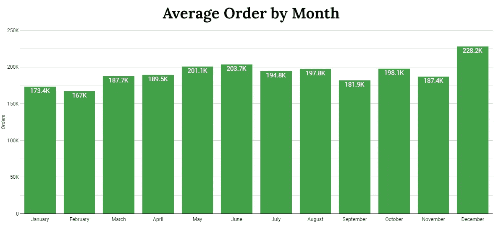

# 使用 BigQuery 和 Google Data Studio 的大数据分析:爱荷华州的白酒

> 原文：<https://blog.devgenius.io/big-data-analysis-using-bigquery-and-google-data-studio-liquor-in-iowa-525a31cd684f?source=collection_archive---------15----------------------->

## 爱荷华州自 2012 年以来的白酒发票数据集

约翰·卡法扎在 [Unsplash](https://unsplash.com?utm_source=medium&utm_medium=referral) 上的照片

Obig query 是分析或处理大数据最流行的工具之一。 [BigQuery](https://en.wikipedia.org/wiki/BigQuery) 是一种完全托管的无服务器数据，支持对数 Pb 数据进行可扩展的分析。在今天的文章中，我将展示如何使用 BigQuery 和 Google Data Studio 分析数据集。

## 数据集和工具

数据集是从 google 公共数据集获取的。该数据集包含 2012 年美国爱荷华州的酒类交易发票。数据集的大小为 6.4 GB，有 24，229，431 行。表格中有 24 列。用于此分析的列有:

*   `invoice_and_item_number`:与酒类订单相关的串联发票和行号。这为商店订单中包含的各个酒类产品提供了唯一的标识符。
*   `date`:订单日期
*   `store_name`:点酒的店名
*   `city`:点酒的店铺所在的城市
*   `vendor_name`:订购酒品牌的公司供应商名称
*   `item_description`:订购的单个酒类产品的描述
*   `sale_dollars`:酒水订单总成本(瓶数乘以国家瓶零售)
*   `volume_sold_liters`:订购酒的总体积，单位为升。(即(瓶容量(毫升)x 售出的瓶数)/1，000)”

使用的工具是用于查询的 BigQuery 和用于可视化的 Google Data Studio。

# 数据分析

## 哪个月的酒类订单最多？

与其他月份相比，12 月份的平均月订单量更高，达到 22.82 万份。这可能是因为十二月是人们庆祝圣诞节和新年的假期。大多数美国人在除夕夜聚会，许多酒吧、餐馆和夜总会也组织聚会，聚会时总会有酒。

查询代码和结果:

## 从 2012 年到现在，已经卖出了多少白酒，2022 年有什么可期待的？

除了 2013 年，2012 年以来一年卖出的白酒数量一直在增加。2022 年 6 月(最新数据更新)，已经销售的白酒有 1170 万升。这还不到去年的一半，但根据我们之前的分析，我们知道 12 月是高峰，因此我们可以预计今年的数字至少与去年相同。

查询代码和结果:

## 什么样的瓶子最受欢迎？

750 毫升是酒瓶的标准容量，足够 1 到 2 个人使用，这也是为什么它也是最受欢迎的容量。第二大订购量是 1750 毫升，这是适合 4-5 人的家庭聚会或餐厅订购的完美尺寸。

查询代码和结果:

## 2022 年哪个城市在白酒上花钱最多？

[得梅因](https://en.wikipedia.org/wiki/Des_Moines,_Iowa#Economy)是酒水消费最高的城市。它是爱荷华州的首府，也是爱荷华州人口最多的城市。这座城市还举办许多年度节日和活动，包括得梅因啤酒周、慕尼黑啤酒节、爱荷华州顶级啤酒、葡萄酒&食品展等等。这可能就是为什么在爱荷华州，得梅因在酒类上花费最多。

查询代码和结果:

## 2022 年最受欢迎的白酒是什么？

[蒂托手工伏特加](https://en.wikipedia.org/wiki/Tito%27s_Vodka)2022 年荣登酒类排行榜榜首。这种伏特加于 1997 年在德克萨斯州的奥斯汀诞生。它在旧金山世界烈酒大赛上赢得了伏特加的双料金奖，并在 2001 年和 2007 年获得了 Spirit Journal(一份介绍酒精饮料信息的时事通讯)的四星评级。第二喜欢的，[火球肉桂威士忌](https://en.wikipedia.org/wiki/Fireball_Cinnamon_Whisky)，以前也赢过几次比赛。

查询代码和结果:

## 哪家厂商在 2022 年获得的销售额最多？

到目前为止，帝亚吉欧美洲公司是 2022 年销售额最高的供应商。他们的投资组合中有 200 多个品牌，包括世界头号烈性黑啤酒吉尼斯。它在全球 180 个国家开展业务，其最大的市场是北美。他们是酒精饮料的全球领导者，这就是为什么他们在排行榜上名列前茅并不奇怪。第二大公司 Sazerac Company 也是一家大公司，从 17 世纪 30 年代就开始运营，旗下拥有 450 多个品牌。

查询代码和结果:

## 2022 年哪些厂商的销量增幅和销量降幅最大？

[全球饮料团队](https://gbtbrands.com/index)在 2022 年有着非凡的销售增长，比去年的销售额增长了 2，731%。他们是龙舌兰酒和墨西哥酒的主要进口商。[2020 年，他们获得了从墨西哥进口四种高端烈酒品牌的独家代理权](https://www.drinks-insight-network.com/news/global-beverage-team-tequila-mezcal-import-rights/)。为了支持这些品牌，他们使用社交媒体和战略零售发展，正如我们所见，他们在 2022 年取得了巨大的成果。

另一方面，Surville Enterprises Corp 在 2022 年的销售额下降幅度最大。这是因为，在 2022 年 2 月，他们更名为 BGPL 美国公司，这就是为什么 2 月以后的销售额不再计入 Surville Enterprise Corp。

查询代码和结果:

## 结论

*   12 月是平均订单数最高的月份
*   从 2013 年到 2021 年，白酒销售一直在增长，预计 2022 年将再次增长
*   750 毫升是订购最多的液体规格，占订单的 44.9%
*   得梅因是 2022 年爱荷华州白酒消费最高的城市
*   蒂托手工伏特加是 2022 年最受欢迎的白酒
*   2022 年，帝亚吉欧美洲销售额最高
*   全球饮料团队 2022 年销售额增长最快

这就是我从这个数据集中分析的全部，希望你喜欢我的分析。请随意评论和批评我的作品。谢谢！