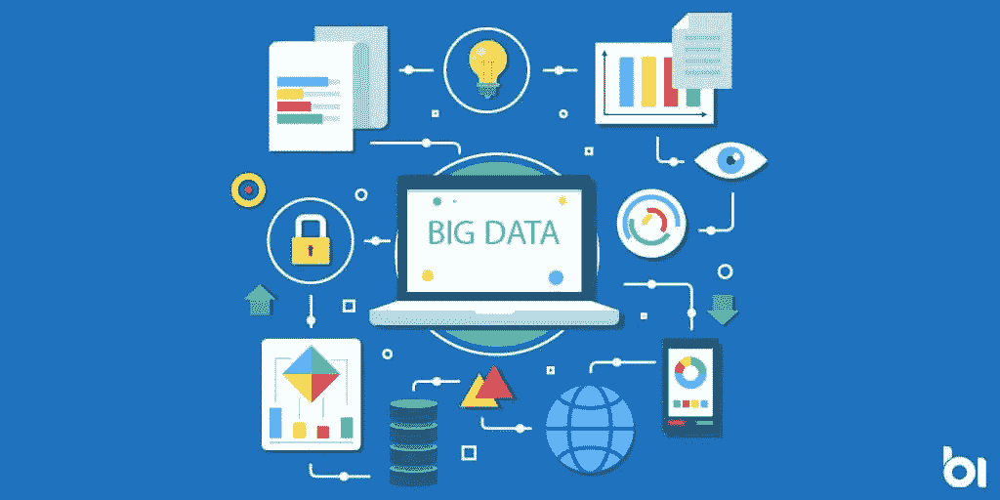

# 大数据和分析

> 原文：<https://blog.devgenius.io/big-data-and-analytics-22b5edaa89dc?source=collection_archive---------10----------------------->

近年来，技术已经打破了它的壁垒，以一种巨大的方式前进，这种技术的发展至今是不可想象的。大数据分析在这场全球增长之旅中获得了独特的地位。大数据的普及和使用似乎永无止境。自首次推出以来，大数据已经为我们世界的数字化转型做出了贡献，这有助于改善各个领域。

简而言之，数据可以定义为能够以电子信号的形式存储和传输的未处理数据。不幸的是，今天，由于每天存储和处理超过万亿字节的数据的必要性增加，我们不得不寻找数据以外的替代方案。如今，亚马逊、脸书、Spotify 和许多其他网站都采用大数据来解决这一问题。让我们深入研究大数据，以获得更好的图像。

使用传统方法无法处理、存储或分析的数据通常被称为**大数据**。美国国家标准与技术研究所的报告对大数据的定义如下:

> **“**大量数据集主要具有容量、速度和可变性等特征，需要可扩展的架构来实现高效存储、操作和分析。”

此外，体积，速度和多样性，或者换句话说，3V，是这个大概念的整个基础，这个概念在 20 年代初获得了动力。随着工业的快速发展，大数据变得很方便，因为它结合了所有 3 种数据类型:结构化、非结构化和半结构化。除了进一步定义的 3v，我们可以将大数据归类为具有价值和完整性的 5v。

假设我们将术语“大数据分析”以简单易懂的形式表达出来。在这种情况下，大数据分析针对大型、多样化的大数据集使用高级分析技术。用于分析的数据包括结构化、半结构化和非结构化数据，这些数据来自不同来源，大小各异，从万亿字节到万亿字节不等，以提取有意义的见解，如隐藏模式、未知相关性、市场趋势和客户偏好，并得出有意义的结论。

在早期阶段，这仅适用于以有组织的方式存储大量数据的大型组织。但是现在，随着云计算的发展，任何有需要的人都可以通过云计算技术使用大数据。供应商，如亚马逊网络服务(AWS)、谷歌和微软，使其更容易访问并使每个人受益。

如果我们利用大数据分析，可以将它们分为四个重要领域:分析和预测未来风险以及避免不确定性。另一方面，它将有助于产品开发和研究，我们可以了解不同的模式，并能够预测大致的产量，而无需在这些方面花费数百万美元。此外，在制定商业决策和形成战略时，大数据分析将派上用场，以得出最合适的结论。最后但同样重要的是，在这个人们更喜欢橱窗购物和在线购买的数字时代，大数据可以帮助我们采取额外的步骤，以确保客户永远满意，并为他们提供愉快的待遇。通过这种方式，大数据分析可以极大地支持行业和企业发展并规避风险。

由于能够分析海量数据集，大数据的兴起令人惊讶地成为数据分析历史上的一个关键转折点。希望大数据和人工智能将成为下一个工业时代。

*“数据是新的科学。大数据掌握着答案。”作者:帕特·基尔辛格。*