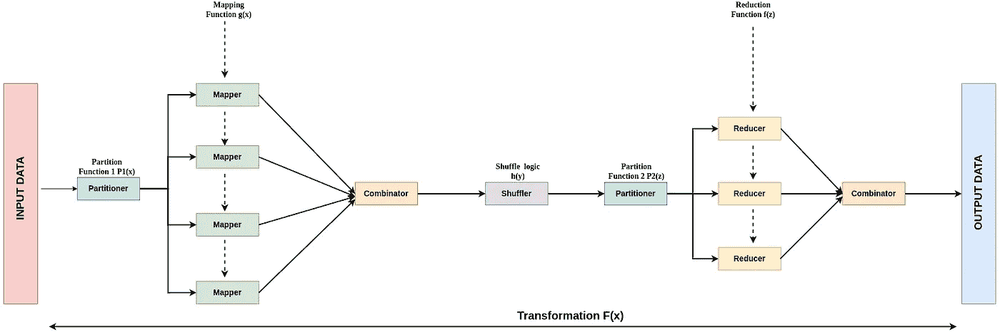
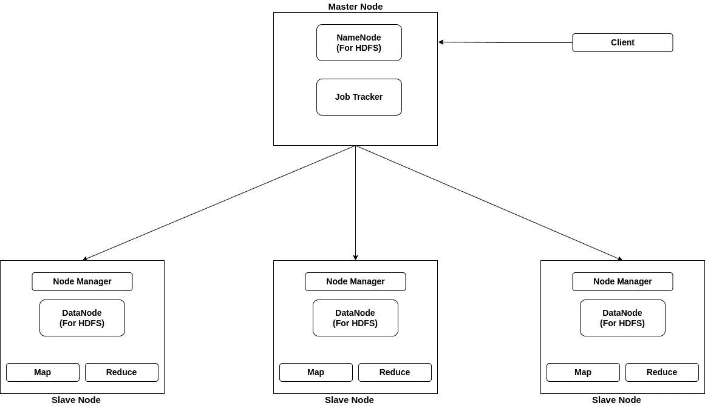

# 大数据和计算:初学者方法

> 原文：<https://blog.devgenius.io/big-data-and-computing-a-beginners-approach-63a10d259cd8?source=collection_archive---------8----------------------->


大卫·迪伯特的照片:[https://www . pexels . com/photo/time-lapse-photography-of-vehicles-passing-near-building-635609/](https://www.pexels.com/photo/time-lapse-photography-of-vehicles-passing-near-building-635609/)

## 地图简化算法

作为大数据和分布式计算领域的初学者，我们经常会遇到一种叫做 Map Reduce 的东西。在我的[上一篇文章](https://medium.com/@myac.abhijit/big-data-and-computing-a-beginners-approach-73461d389aba)中，我们也谈到了 Map Reduce 作为框架 Hadoop 的基本组件之一，用于处理和处理大数据。那么，什么是地图简化，为什么它如此重要？这是新进入这个领域的人们心中的疑问。在这篇文章中，让我们试着找到这个问题的答案。

## 什么是 Map Reduce？

Map Reduce 基本上是为了处理或存储大量数据而实现的编程范例，因为它实现了并行计算，从而加快了处理过程。基于 Java 的算法需要创建两个最关键的组件，其中一个被称为映射器和归约器，顾名思义，它们执行两个主要任务映射和归约。

输入数据被分解成一组文档，文档集中的每个文档被发送到一个单独的映射器，该映射器使用用户定义的映射函数执行映射，以生成一组**中间键值对。**一旦我们从所有映射器中获得了所有的键值对，它们就会被称为**组合器、洗牌器和分割器**的 map-reduce 算法的其他组件基于某种标准重新分组和洗牌，以创建中间键值对的新集合。最后，它们被喂给减速器。每个集合都被提供给一个缩减器，该缩减器再次使用用户定义的 Reduce 函数来缩减该集合，以生成最终的键值对。



地图简化工作

一旦所有的映射器产生了它们各自的中间对，组合器就开始组合所有的对，并把输出提供给洗牌机。洗牌机根据某种定义的基础，比如说，可能按字母顺序，对所有的对子进行排序或排列。一旦洗牌机完成，分割器接管并根据一些用户逻辑将洗牌后的配对分成组，并将它们交给归约器。

## Map 如何减少工作和 Hadoop，为什么？

众所周知，Hadoop 集群系统部署了多个节点或低成本硬件，从而提供了水平扩展能力。

现在，考虑一下，有一本 1000 页的书，我们需要按字母顺序计算每个单词在书中出现的次数。如果我们把这项工作交给一台没有并行处理能力的特定的单机，它将花费大量的时间和处理能力，因为它将是一个连续的过程。但是想象一下，如果集群的一些节点被编程来执行映射工作，并且类似地，一些节点被分配减少工作，那么我们可以将 1000 页的书分成 100 个集合，每个集合大约 10 页，并且将每个集合提供给映射器。一切都是并行发生的，也就是说，在处理 10 页的时间里，我们可以处理所有 1000 页。我们还划分了转换任务，因此对于第二部分，并行化也是通过并行运行的减速器来实现的。由于 Hadoop 集群可以非常顺利地扩展，我们可以通过部署更多资源来更轻松地处理任何数量的数据。

为了运行这些组件，Hadoop 上有一个驱动程序类，它设置环境、映射器和还原器并启动进程。

## 来自 Hadoop 的架构支持

为了支持 Map Reduce 任务，Hadoop 再次使用了主从架构。它创建并使用以下组件:

1.  **一个主作业跟踪器**:可以作为主节点处理。它负责资源管理、监控和任务调度。它从集群中选择节点来执行 map 或 reduce 任务并分配它们。
2.  **许多从任务跟踪器:**它们是从节点，由主作业跟踪器分配任务。它们执行任务并将结果返回给主节点。如果任务失败，它会将状态通知主服务器。为了保持可用性和可达性，从设备也向主设备发送心跳信号。没有信号表示从节点停机，主节点在其上分配新的资源。



地图简化架构

## 示例工作流程

让我们考虑同样的例子，我们有一本 1000 页的书，然后我们需要按字母顺序统计每个单词的出现次数。

步骤 1:我们决定分成 100 个集合，每个集合有 10 个连续的页面。现在，映射函数也接受键值对，所以我们为书中的每个单词创建键值对为<index word="">，即以单词的索引为键，单词为值，作为预处理。</index>

第二步:将 100 套中的每一套送入 100 台绘图机。制图者基本上计算每个单词在分配给它的 10 页中出现的次数。

步骤 3:一旦映射器完成，我们从所有 100 个映射器中获得一组键值对，因此有 100 组键值对。组合器接受所有这些，并创建一个键-值对的组合列表，其中单词是键，出现的次数是值。

第四步:根据要求，洗牌者接受组合列表，并按照字母顺序对键进行排序。

步骤 5:一旦混洗，我们使用分区器来创建 26 个分区，即 26 个分区，每个字母表一个分区，使得以该字母表开始的所有单词都进入该分区。

第 6 步:每个分区都被发送到一个缩减器，该缩减器只添加每个特定单词的出现值。

步骤 7:一旦 26 个归约者产生了他们各自的结果，一个合并器被用来得到最终的结果

## **如何编写 Map-Reduce 算法**

为了编写 Map-Reduce 算法，我们需要为 Mapper、Reducer 和 Driver 扩展预定义的 Java 类。

```
public static class Map extends Mapper<LongWritable,Text,Text,IntWritable> 
{
}
```

这是我们从 java 的 mapper 抽象类扩展而来的 Map 类的格式。尖括号中的前两种类型给出了输入<key value="">对的格式或数据类型，接下来的两种类型给出了输出<key value="">对的数据类型。</key></key>

在我们的例子中，映射器的输入键-值对，其中单词的索引是长数据类型的键，值是文本类型的单词。类似地，映射器返回一个<key value="">对，其中键是文本类型的单词，计数是 int 类型的值。一旦定义了这一点，我们就可以在 mapper 类中的 map 方法下编写我们的功能定义</key>

```
public static class Map extends MapReduceBase implements Mapper<LongWritable,Text,Text,IntWritable> 
{

   public void map(LongWritable key, Text value,
   OutputCollector <Text, IntWritable> output, Context context) 
   throws IOException {

    /// Logic 

   }
}
```

类似地，为了编写 reducer 代码，我们必须扩展 Reducer 类。对于缩减器，输入对数据类型将与映射器的输出类型相同，因为该输出被提供给缩减器<text intwritable="">。而 Reducer 的输出将是作为键的单词和整个 1000 页文档中单词的总计数，所以键-值对的数据类型将是<text intwritable="">。</text></text>

```
public static class Reduce extends MapReduceBase implements Reducer<Text,IntWritable,Text,IntWritable> 
{

  public void reduce(Text key, Iterable<IntWritable> values,
  OutputCollector <Text, IntWritable> output,Context context)
  throws IOException,InterruptedException {

    ///logic

  }
}
```

我们可以将我们的逻辑放在 reduce 类的 reduce 函数中。

接下来，我们需要定义驱动程序代码。这是将被调用的类，它将调用映射器和缩减器类。在这种情况下，我们需要使用 setter 功能定义 Mapper 和 Reducer 类名。我们还需要定义键的数据类型和输出对的值。

```
public static void main(String args[])
throws Exception {

      JobConf conf = new JobConf(WordCount.class); 

      conf.setJobName("WordCount");
      conf.setJarByClass(WordCount.class);    
      // the jar will be created from this class on extraction of executable
      conf.setMapperClass(Map.class);
      conf.setReducerClass(Reduce.class); 
      conf.setOutputKeyClass(Text.class);
      conf.setOutputValueClass(IntWritable.class);
      conf.setInputFormat(TextInputFormat.class); 
      // It sets the input type, as we are sending 1 line of text.
      conf.setOutputFormat(TextOutputFormat.class); 

      JobClient.runJob(conf); 
}
```

所有这些静态类都必须在包装类 WordCount 下声明，以使它成为一个完整的 MapReduce 类。

## 结论

在本文中，我们学习了 MapReduce 算法及其工作原理。在[即将到来的](https://medium.com/@myac.abhijit/big-data-and-computing-a-beginners-approach-1b5c8ca612d6)中，我们将了解大数据发展道路上的其他重要主题。

快乐阅读！！！