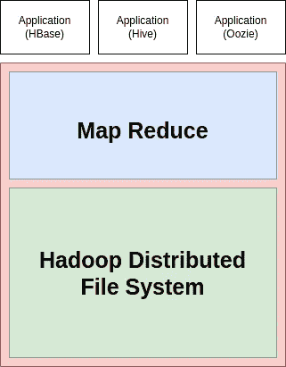
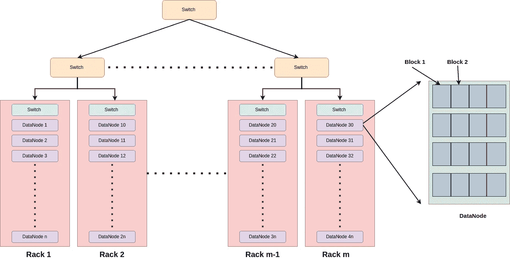
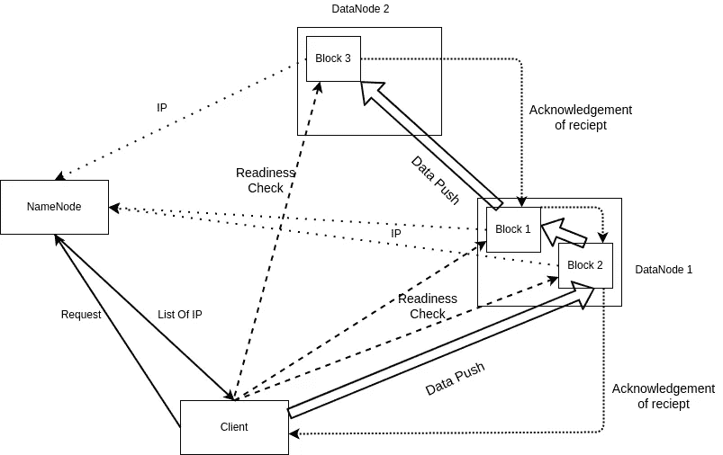

# 大数据和计算:初学者方法

> 原文：<https://blog.devgenius.io/big-data-and-computing-a-beginners-approach-73461d389aba?source=collection_archive---------10----------------------->

大卫·迪伯特的照片:[https://www . pexels . com/photo/time-lapse-photography-of-vehicles-passing-near-building-635609/](https://www.pexels.com/photo/time-lapse-photography-of-vehicles-passing-near-building-635609/)

## Hadoop 分布式文件系统

# 介绍

在过去的几十年里，在全球范围内，人们已经转向使用在线门户、框架和 web 服务来满足从购买必需品到娱乐的需求。像脸书这样的社交媒体平台和亚马逊这样的电子购物网站每天都有来自世界各地用户的数百万次点击。为了使应用程序更加用户友好和智能，这些公司存储从用户会话中生成的数据。例如，假设我们花了一些时间使用 youtube 上某个主题的视频。Youtube 将存储这些会话数据，以了解某些视频的有用程度，并将使用算法模型提取某些趋势，这将帮助我们以及其他进行类似内容测试的用户浏览 youtube。每个公司都有类似的技术需求，来处理如此大量的数据以满足统计需求，随着用户的日益增加，这一需求变得越来越重要，因为单机和垂直扩展(增加单台计算机上的硬件资源)不是解决方案。为了表示这种巨大的数据积累，我们使用术语“大数据”。

大数据可以解释为可以从任何来源以任何格式提取的数据，可以是结构化的(如 SQL 表)、半结构化的(如 JSON 和 XML)或非结构化的(如图像数据)。一般来说，大数据有三个属性:3 V

1.  卷:数据量有多大。
2.  多样性:集合中有多少种数据
3.  速度:数据生成和收集的速度是多少？

# 解决办法

为了解决这一挑战，Hadoop 最初是由 Apache 作为开源框架引入的，用于存储、处理和分析大量数据。Hadoop 支持数据的分布式存储和处理。它是用 Java 编程语言编写的。Hadoop 通过利用水平扩展来支持并行计算，即 Hadoop 实现了一个集群的概念，本质上是 CPU 资源系统的集合。这些独立的系统被称为集群中的节点。当一个任务被分配给一个 Hadoop 集群时，该任务被分成更小的工作负载，并作为任务分配给这些节点。Hadoop 采用批处理或离线处理方式，也就是说，它不会立即处理数据，而是等待并收集整个工作日的所有数据，然后将整个事情分解成批量数据，通过并行处理器发送这些数据以加快进程。

最初，Hadoop 有 3 个组件，

1.  Hadoop common，或者一些文件系统的包
2.  Hadoop 分布式文件系统
3.  Map Reduce 引擎。

我们将依次讨论 HDFS 和 Map Reduce，在本文中我们将讨论 HDFS。

Hadoop 是一种分布式设置，具有以下优势:

1.  **快速并行计算**
2.  **高可用性**
3.  **容错:**因为数据被复制并存储在不同的存储位置。

Hadoop 1.x 架构

# Hadoop 分布式文件系统

在我们开始研究这个问题之前，我们应该先了解一下分布式文件系统的概念和它的属性，这是整个事情的基础。分布式文件系统通过将存储分布在不同的文件服务器或不同的位置来维护存储。它们具有一些关键属性，包括:

1.  **位置透明性:**文件可以分布在几个系统中，但是它们将位于相同的名称空间下，也就是说，它们将位于相同的路径或扩展名下，这样，作为用户，我们可以像在本地系统上一样访问文件
2.  **冗余:**跨不同节点复制文件，使文件高度可用。
3.  **文件锁定:**如果一个文件存在于多个位置，并且有多个副本，则有可能同时修改该文件，这可能会导致一致性问题。这是由文件锁定属性阻止的。

HDFS 将这一想法扩展到基于 Hadoop 的集群，专注于数据访问的高吞吐量，并带来了在单个集群上水平扩展的能力。Hadoop 通过利用几个低成本硬件来支持高处理能力，而不是构建一个功能强大的硬件，这将是非常昂贵的，并且没有备份或可用性。

## HDFS 建筑

HDFS 在主/从架构上工作。正如我们已经看到的，Hadoop 集群有多个节点，其中一个被指定为主节点，称为 NameNode，其他节点称为 DataNodes。单个 NameNode 是主服务器，它管理存储的文件和元数据的名称空间，而 DataNodes 管理实际的存储。

HDFS 有一个“一次写入”策略，即文件一旦写入，只能在以后追加和截断，不能删除。HDFS 最小的存储单位叫做块。基本上，当我们试图存储一个文件时，文件被分解成称为**块的单元。**每个块的默认大小是 **128 MB。因此，如果我们发送一个 256 MB 的文件，它将被分解成 2 个块。块只不过是集群的 DataNode 上的连续内存分配。**

正如我们在集群上听到的那样，有几个 DataNodes。一组数据节点被称为**机架。**每个机架都有一个称为**的机架交换机**来连接该机架上的所有节点，同样，在外部，我们为每个机架提供了交换机来相互交互。

HDFS 建筑

## 存储系统的工作

我们之前讨论过，HDFS 具有容错能力，这是通过复制数据并将相同的数据分布在不同的节点和不同的机架上来实现的。默认情况下，复制因子为 3，但复制因子和块大小都是可配置的。

与分布式文件系统类似，HDFS 也具有存储为名称空间->目录->文件的层次结构，用户和 100% Namenode 使用它来保存数据节点上的块映射并执行多种操作。NameNode 仅充当资源管理器，并维护名称空间以及某个文件及其副本将保存到哪个 DataNode 的哪个块。

为了维护文件和副本，HDFS 部署了一个名为**机架感知算法的算法。**这由 NameNode 运行，以适当地分发副本，从而提高系统的可靠性和可用性。该算法防止过度复制或仅在单个节点或机架中复制。它规定复制因子为 3，一个副本应放在本地机架上，另一个副本应放在不同机架上的随机 datanode 上。如果超过 3 个，则应随机放置，这样不会有 2 个放置在同一个 Datanode 上，机架的上限为

**(#副本—1)/(#机架+2)**

在读取期间，从最近的副本访问数据。

## 阅读和写作

当用户请求在 HDFS 上书写时，书写基本上分为 4 个步骤:

1.  NameNode 接收请求，根据机架感知算法、可用性和复制因子(本例中为 3)，NameNode 向客户端提供 3 个不同 datanode 的 3 个 IP(因为每个 datanode 是一个系统，每个都有自己的 IP)。
2.  客户端连接到 DataNodes，并通过 TCP/IP 协议建立一个通过就绪确认检查的管道。
3.  成功建立管道后，客户端将文件上传到节点 1，节点 1 将数据的副本传递到节点 2，类似地，节点 2 将数据发送到节点 3。存储是顺序进行的。
4.  所有三个节点收到数据后，最后一个接收的节点向第二个节点发送确认，第二个节点发送两个确认，一个来自节点 3，另一个是自己发送给客户端连接的第一个节点。最后，第一个节点向客户端发送所有 3 个确认，并关闭管道。

HDFS 的书写机制

当客户端请求读取时，request 会转到 NameNode，它会检查文件的最近副本的元数据，并将该 DataNode 的 IP 发送到客户端，然后在建立连接后传输数据。

## 组件的内部工作和职责

为了保持 Hadoop 集群的平稳运行和可靠性，HDFS 的内部组件必须扮演一些额外的角色。除了主要的主 NameNode 之外，它还有一个辅助 NameNode，作为支持性守护进程，在某些角色中帮助主 NameNode。NameNode 在 EditLog 中维护所有事务日志，以记录系统的每次更改。除此之外，它还以 FSImage 的形式保存整个命名空间和文件块映射的快照，该快照由 NameNode 维护，用于标识块及其对应的 datanodes。该映像充当检查点，在特定的给定时间限制后保存。

每个 DataNode 负责向 NameNode 发送一个特殊的消息，该消息称为心跳，在固定的时间周期后持续发送。如果没有此消息，则通知 NameNode 某个 DataNode 已关闭，作为响应，NameNode 会立即将该节点上的所有数据复制到其他一些节点，并停止向该特定节点发送请求。

如果由于某种故障，DataNode 的数量保持相对较低，NameNode 将进入一种特殊状态，称为**安全**状态。在这种状态下，dataNode 的复制会停止，每个 dataNode 都会向 NameNode 提供一份报告，说明它们所托管的块数，等等。

# 结论

在本文中，我们看到了 Hadoop 分布式文件系统的结构和工作方式，以及大数据的基础知识。在[即将发布的文章中，](https://medium.com/@myac.abhijit/big-data-and-computing-a-beginners-approach-63a10d259cd8)我们将会看到像贴图减少和纱线这样的主题。

快乐阅读！！