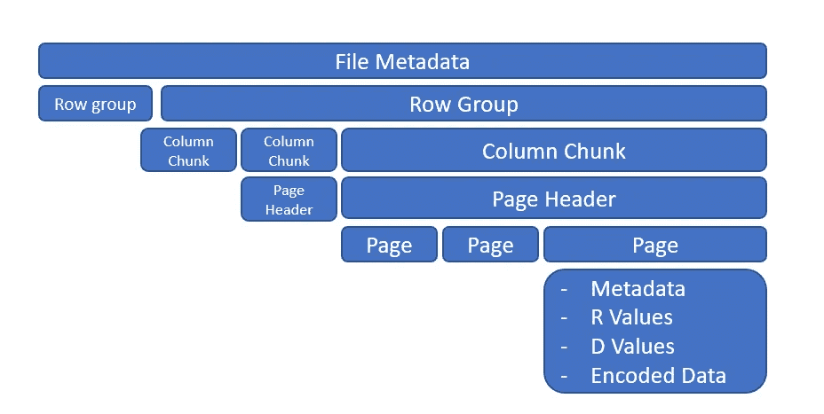

# 大数据文件格式

> 原文：<https://blog.devgenius.io/big-data-file-formats-d980f5d07e44?source=collection_archive---------3----------------------->


照片由[阿尔方斯·莫拉莱斯](https://unsplash.com/@alfonsmc10?utm_source=unsplash&utm_medium=referral&utm_content=creditCopyText)在 [Unsplash](https://unsplash.com/s/photos/library?utm_source=unsplash&utm_medium=referral&utm_content=creditCopyText) 拍摄

文件格式规定了如何记录信息，使用正确的格式可以很容易地找到相关数据。

> *文件格式是一种组织数据集文件的方式，将它们呈现为单个“表格”。*

多年来，新的文件格式不断发展，填补了旧格式的空白。下图显示了多年来新文件格式创建的进展。


不同的文件格式

对于数据工程师来说，选择正确的文件格式是至关重要的决定之一。主要关注的是减少从其位置找到相关数据所需的时间。做出此决定时，需要考虑以下各个方面:

> 读写吞吐量
> 压缩能力和因素
> 模式演变
> 文件的可分割性
> 互操作性
> ACID 支持
> 使用模式，如 OLAP 扫描
> 文本与二进制

根据数据在磁盘上的存储方式，文件格式分为两大类。

## 面向行

逐行写入数据**，即一行中所有列一个接一个。这些都是写**非常**高效的。它提供了水平分区，非常适合需要一整行增量更新的 OLTP 工作负载。**

## 面向列

数据被一列接一列地写入**。因此，如果我们需要选择某些列，这种文件格式在读取选择性数据时非常有效。但是，写得慢。由于相似的数据被写在一起，它提供了一个**更高的压缩级别**。提供数据的垂直分区。非常适合需要整列的 OLAP 工作负载。**


行和列文件格式中的数据组织

*注意:ORC 和 parquet 的较新实现通过使用行组概念使用磁盘存储的混合方法。因此，数据被垂直和水平分割。*

同样，基于文件上的数据格式，格式可以分为两类二进制或文本。机器读取的文件格式是以二进制格式编写的，而 JSON 和 CSV 等格式是以人类可读的文本形式存储的。

我们将看看流行的和相对较新的，即 Avro，ORC，拼花地板

## [AVRO](https://avro.apache.org/docs/1.2.0/#intro)

Avro 是一种基于行的存储格式，广泛用于序列化。它将模式作为 JSON 存储在文件头中。数据以二进制格式保存，从而最小化文件大小并优化性能。


AVRO 的文件结构

```
from fastavro import writer, reader, parse_schema
avro_records = []

with open('customers.avro', 'rb') as fa:
    avro_reader = reader(fa)
    for record in avro_reader:
        avro_records.append(record)

df_avro = pd.DataFrame(avro_records)
```

## [镶木地板](https://parquet.apache.org/docs/file-format/)

Parquet 是一种开源的、面向列的数据文件格式。拼花文件是自描述的。拼花文件由行组、页眉和页脚组成。每个行组包含来自相同列的数据。相同的列一起存储在每个行组中。拼花文件将模式存储在页脚中。页脚还包括每个行组的详细信息(总大小、行数、最小/最大统计信息、每列的空值数量)。



拼花地板的文件结构

> 行组— 128Mb
> 页面— 1Mb


拼花文件使用不同的编码技术(如游程编码、字典编码、位打包和增量编码)和压缩来优化存储。


```
import pyarrow.parquet as pq
df = pq.read_table('customers.parquet')
pq.write_table(df, 'customers.parquet')
```

## [优化的行柱状(ORC)](https://cwiki.apache.org/confluence/display/Hive/LanguageManual+ORC)

这种格式旨在克服其他 Hive 文件格式的限制。当 Hive 读取、写入和处理数据时，使用 ORC 文件可以提高性能。


ORC 的文件结构

在 ORC 文件格式中，我们有条带，它是行组的集合。条带大小为 250 MB，每个行组包含 10K 行。

这种格式也有多级索引。因此，它在读取时非常快，并跳过不必要的数据。

## 摘要


快乐阅读！！