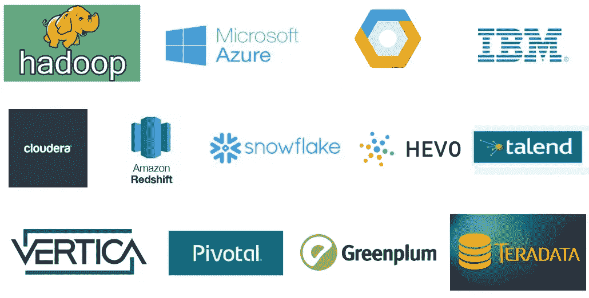

# 用于数据工程的大数据平台

> 原文：<https://blog.devgenius.io/big-data-platforms-for-data-engineering-5c9016638ef8?source=collection_archive---------2----------------------->

奇迹发生的地方。

我们在本系列的第一篇文章中讨论了什么是[大数据工程](https://medium.com/@guru.nie/big-data-engineering-b7de4f57e0e8)以及高级概念。在此，我们将讨论完成数据工程的平台、可用选项、任何大数据平台的功能/特性以及这些平台的一般使用情形。

# **1。什么是大数据平台？**

大数据平台是一个集成的计算解决方案，它结合了大量软件系统、工具和硬件来进行大数据管理。它是一种一站式架构，可以解决企业的所有数据需求，而不管手头数据的数量和大小如何。这些产品代表了组织获取、存储和处理数据方式的巨大转变。由于其在数据管理方面的效率，企业越来越多地采用大数据平台来收集大量数据，并将它们转换为结构化的、可操作的业务见解。

# **2。大数据平台的需求是什么？**

该平台由组织中的不同人员使用，例如但不限于数据工程师，以解析、清理、转换、聚合和准备用于分析的数据。业务用户使用它在平台上运行 SQL 和 NoSQL 查询。数据科学家使用机器学习算法来发现大型数据集中的模式和关系。组织在大数据平台上构建定制应用程序，以计算客户忠诚度、识别次优产品、发现流程瓶颈、预测机器故障、监控核心基础设施的健康状况等等。

# **3。最好的大数据平台有哪些？**

以下是一些顶级大数据平台:

**Apache Hadoop**

Hadoop 是一个开源的编程架构和服务器软件。在集群计算环境中，借助数千台商用服务器，它可以非常快速地存储和分析大型数据集

**谷歌云**

[谷歌云](https://builtin.com/company/google-cloud)提供大量[大数据管理工具](https://cloud.google.com/products/big-data/)，每一个都有自己的专业。BigQuery 以易于查询的格式存储了数 Pb 的数据。数据流并排分析正在进行的数据流和历史数据批次。借助 Google Data Studio，客户可以将各种数据转化为定制的图形。

**Cloudera**

Cloudera 是一个基于 Apache 的 Hadoop 系统的大数据平台。它可以处理大量的数据。企业通常在该平台的数据仓库中存储超过 50pb 的数据，该数据仓库处理文本、机器日志等数据。Cloudera 的数据流还支持实时数据处理。

**AWS 红移**

Amazon Redshift 是一种基于云的数据仓库服务，支持企业级的报告和分析查询。它通过其高性能的高级查询加速器(AQUA)支持无限数量的并发查询和用户。它可以根据需要进行扩展，通过大规模并行处理、列存储、压缩和复制来更快地检索信息。数据分析师和开发人员利用其机器学习属性来创建、训练和部署亚马逊 Sagemaker 模型。

**雪花**

这个大数据平台充当存储、处理和分析数据的数据仓库。它的设计类似于 SaaS 的产品。这是因为其框架的一切都在云中运行和管理。它完全运行在公共云托管框架之上，并集成了一个新的 SQL 查询引擎。

**微软 Azure**

用户可以利用广泛的开源 Apache 技术，包括 Hadoop 和 Spark，分析存储在微软云平台 Azure 上的数据。Azure 还提供了一个原生分析工具 HDInsight，它简化了数据集群分析，并与 Azure 的其他数据工具无缝集成。

**塔伦德**

Talend 是一个开源数据集成和管理平台，支持企业级的大数据接收、转换和映射。该供应商在一个统一的中心——数据结构中提供跨网络连接、数据质量和主数据管理。

**Teradata**

[Teradata](https://builtin.com/company/teradata) 的 Vantage 分析软件可以与各种公共云服务配合使用，但用户也可以将其与 Teradata 云存储结合使用。这种全 Teradata 体验最大限度地发挥了云硬件与 Vantage 的机器学习和 NewSQL 引擎功能之间的协同作用。Teradata 云用户还享受特殊待遇，比如灵活定价。

**Vertica**

这个纯软件的 SQL 数据仓库与存储系统无关。这意味着它可以分析来自云服务、本地服务器和任何其他数据存储空间的数据。得益于柱状存储，Vertica 的工作速度很快，这有助于只扫描相关数据。它为金融和营销等行业提供基于机器学习的预测分析。

**青梅**

该平台脱胎于开源的 [Greenplum Database 项目](https://greenplum.org/)，使用 PostgreSQL 来征服各种数据分析和操作项目，从商业智能到深度学习。Greenplum 可以解析存储在云和服务器以及容器协调系统中的数据。此外，它还带有一个内置的工具包，用于基于位置的分析、文档提取和多节点分析。

**IBM 云**

[IBM](https://builtin.com/company/ibm) 的全栈云平台带有 170 个内置工具，其中包括许多可定制的大数据管理工具。在其他数据库设计中，用户可以选择 NoSQL 或 SQL 数据库，或者将他们的数据存储为 JSON 文档。该平台还可以运行内存分析，并集成 Apache Spark 等开源工具。

**枢轴**

Pivotal 大数据套件是一个集成解决方案，可为企业提供大数据管理和分析。它包括 Greenplum(一个业务就绪型数据仓库)、GemFire(一个内存数据网格)和 Postgres(帮助部署 PostgreSQL 数据库集群)。借助为批处理和流分析构建的数据架构，它可以部署在内部和云中，并作为 Pivotal Cloud foundry 的一部分。

**Hevo**

Hevo 是一个全自动、无代码的数据管道平台，帮助组织轻松利用数据。Hevo 的端到端数据管道平台使您能够轻松地将所有来源的数据提取到数据仓库，并运行分析转换以生成实时数据驱动的业务洞察。该平台支持跨数据库、SaaS 应用、云存储、SDK 和流媒体服务的 150 多个现成可用的集成。

# **4。大数据平台的必备组件/特性是什么？**

*   能够根据不断发展的业务需求适应新的应用程序和工具。
*   支持多种数据格式。
*   能够容纳大量流数据或静态数据。
*   拥有多种转换工具，可以将数据转换为不同的首选格式。
*   以任何速度容纳数据的能力。
*   提供在海量数据集中搜索数据的工具。
*   支持线性缩放。
*   快速部署的能力。
*   具备数据分析和报告要求的工具。

# **有哪些大数据分析用例？**

*   日志分析
*   电子商务个性化。
*   推荐引擎。
*   欺诈检测。
*   金融和其他机构的监管报告。
*   招聘中的自动候选人安置。

现在，我们知道了什么是大数据工程，以及可以在什么平台上工作。接下来，我们将在接下来的文章中更详细地讨论在哪里以及如何使用它，原则和指导方针是什么等等。

参考资料:

[https://www.xenonstack.com/blog/big-data-platform](https://www.xenonstack.com/blog/big-data-platform)

【https://builtin.com/big-data/big-data-platform 号

【https://www.selecthub.com/big-data-platform-software/ 

[https://www . Accenture . com/us-en/blogs/search-and-content-analytics-blog/big-data-use-cases-business](https://www.accenture.com/us-en/blogs/search-and-content-analytics-blog/big-data-use-cases-business)

[https://www . project pro . io/article/5-big-data-use-cases-how-companies-use-big-data/155](https://www.projectpro.io/article/5-big-data-use-cases-how-companies-use-big-data/155)。

 [## 通过我的推荐链接加入媒体

### 阅读 Gururaj Kulkarni(以及媒体上成千上万的其他作家)的每一个故事。您的会员费直接…

medium.com](https://medium.com/membership/@guru.nie)