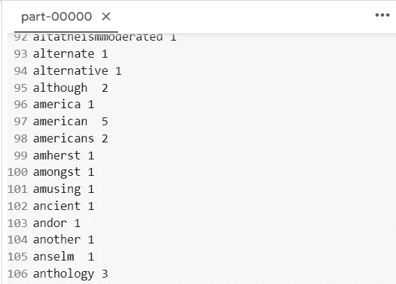

# 在 COLAB 上用 Python 中的 HADOOP 和 SPARK 处理大数据

> 原文：<https://blog.devgenius.io/big-data-processing-with-hadoop-and-spark-in-python-on-colab-bff24d85782f?source=collection_archive---------1----------------------->

## 通过简单的步骤处理大数据


照片由 [Geran de Klerk](https://unsplash.com/es/@gerandeklerk?utm_source=medium&utm_medium=referral) 在 [Unsplash](https://unsplash.com?utm_source=medium&utm_medium=referral) 上拍摄

`HADOOP`或**H**high**A**可用性 **D** 分布式 **O** 对象 **O** 定向 **P** latform，是一个基于 Java 的开源软件平台，负责管理大数据应用程序的数据处理和存储(参见 [DataBricks 词汇表-HADOOP](https://www.databricks.com/glossary/hadoop))。Hadoop 不使用一台大型计算机来存储和处理数据，而是允许将多台计算机集群起来，以便更快地并行分析海量数据集(参见[AWS-什么是 HADOOP](https://aws.amazon.com/emr/details/hadoop/what-is-hadoop/) )。`HADOOP`采用 MapReduce 编程范式；(1) Map 作业，它获取一组数据并将其转换为另一组数据，其中各个元素被分解为元组(键/值对)；(2)Reduce 作业，它将地图的输出作为输入，并将这些数据元组组合成更小的元组集(参见[IBM-什么是 Map Reduce](https://www.ibm.com/my-en/topics/mapreduce) )。尽管 HADOOP MapReduce 模型有许多优点，但它对于交互式查询和实时数据处理来说效率不高，因为它依赖于每个处理阶段之间的磁盘写入，因此`HADOOP`的子项目`SPARK`被提议通过使用内存中的数据存储来解决这个难题(参见[Talend-什么是 Hadoop](https://www.talend.com/resources/what-is-hadoop/) )。

有一些关于 COLAB 笔记本代码的帖子，演示了 HADOOP(版本 3.3.0)和 SPARK(版本 3.3.0)在 GOOGLE COLAB 上的运行(参考 [Neelu Tiwari 2021](https://www.analyticsvidhya.com/blog/2021/05/integration-of-python-with-hadoop-and-spark/) 和 [Aniruddha Bhandari 2020](https://www.analyticsvidhya.com/blog/2020/11/a-must-read-guide-on-how-to-work-with-pyspark-on-google-colab-for-data-scientists/) )。COLAB 代码的副本可以在这里找到，[https://COLAB . research . Google . com/drive/14l 6 ybecumszyscdisueibhhweprn 7329？usp =分享](https://colab.research.google.com/drive/14l6YBecumszYScDisUEIbHHWeprN7329?usp=sharing)。然而，随着时间的变化和新版本的引入，代码产生了如下 2 个错误。

```
--2022-11-27 01:59:09--  https://downloads.apache.org/hadoop/common/hadoop-3.3.0/hadoop-3.3.0.tar.gz
Resolving downloads.apache.org (downloads.apache.org)... 88.99.95.219, 135.181.214.104, 2a01:4f8:10a:201a::2, ...
Connecting to downloads.apache.org (downloads.apache.org)|88.99.95.219|:443... connected.
HTTP request sent, awaiting response... 404 Not Found
2022-11-27 01:59:10 ERROR 404: Not Found.
```

第一个错误(上图)与“缺少 HADOOP 安装文件问题”有关，第二个错误(下图)与“安装位置缺少软件包问题”有关。

```
---------------------------------------------------------------------------
Py4JError                                 Traceback (most recent call last)
<ipython-input-12-c3c22d90951e> in <module>
      1 #creating a sparksession object and providing appName
----> 2 spark=SparkSession.builder.appName("local[*]").getOrCreate()

4 frames
/usr/local/lib/python3.7/dist-packages/py4j/java_gateway.py in __getattr__(self, name)
   1546         else:
   1547             raise Py4JError(
-> 1548                 "{0}.{1} does not exist in the JVM".format(self._fqn, name))
   1549 
   1550     def _get_args(self, args):

Py4JError: org.apache.spark.api.python.PythonUtils.getPythonAuthSocketTimeout does not exist in the JVM
```

所以本帖提出基于 HADOOP 3 . 3 . 0 版和 SPARK 3 . 3 . 1 版的一些代码更新。

# (0)先决条件

```
# install java
!apt-get install openjdk-8-jdk-headless -qq > /dev/null
```

```
#create java home variable 
import os
os.environ["JAVA_HOME"] = "/usr/lib/jvm/java-8-openjdk-amd64"
```

# (1) HADOOP 安装

```
#download HADOOP (NEW DOWNLOAD LINK)
!wget https://archive.apache.org/dist/hadoop/common/hadoop-3.3.0/hadoop-3.3.0.tar.gz
```

```
#extract the file
!tar -xzvf hadoop-3.3.0.tar.gz
```

```
#copy the hadoop file to user/local
!cp -r hadoop-3.3.0/ /usr/local/
```

```
#find  the default Java path
!readlink -f /usr/bin/java | sed "s:bin/java::"
```

```
#run Hadoop
!/usr/local/hadoop-3.3.0/bin/hadoop
```

```
#create input folder for demonstration exercise
!mkdir ~/testin
```

```
#copy sample files to the input folder
!cp /usr/local/hadoop-3.3.0/etc/hadoop/*.xml ~/testin
```

```
#check that files have been successfully copied to the input folder
!ls ~/testin
```

```
#run the mapreduce example program
!/usr/local/hadoop-3.3.0/bin/hadoop jar /usr/local/hadoop-3.3.0/share/hadoop/mapreduce/hadoop-mapreduce-examples-3.3.0.jar grep ~/testin ~/testout 'allowed[.]*'
```

以下是 **Map-Reduce 框架报告部分**的输出:

```
 Map-Reduce Framework
  Map input records=2
  Map output records=2
  Map output bytes=33
  Map output materialized bytes=43
  Input split bytes=111
  Combine input records=0
  Combine output records=0
  Reduce input groups=2
  Reduce shuffle bytes=43
  Reduce input records=2
  Reduce output records=2
  Spilled Records=4
  Shuffled Maps =1
  Failed Shuffles=0
  Merged Map outputs=1
  GC time elapsed (ms)=0
  Total committed heap usage (bytes)=2624585728
 Shuffle Errors
  BAD_ID=0
  CONNECTION=0
  IO_ERROR=0
  WRONG_LENGTH=0
  WRONG_MAP=0
  WRONG_REDUCE=0
 File Input Format Counters 
  Bytes Read=147
 File Output Format Counters 
  Bytes Written=34
```

上述 MapReduce 任务基于 HADOOP 安装附带的示例文件。也可以用 Python 脚本编写 mapper 和 reducer。例如， [Anjalysam (2020)](https://github.com/anjalysam/Hadoop) 针对用 Python 脚本编写的 20 组新闻组数据集提供了一个 GitHub repo for MapReduce 任务。

以下是使用 Python 脚本运行 MapReduce 的步骤。

(a)下载并提取目标数据集

```
#download and extract 20 newsgroup dataset
!wget http://qwone.com/~jason/20Newsgroups/20news-18828.tar.gz
!tar -xzvf 20news-18828.tar.gz 
```

创建 mapper.py。

```
import sys
import io
import re
import nltk
nltk.download('stopwords',quiet=True)
from nltk.corpus import stopwords
punctuations = '''!()-[]{};:'"\,<>./?@#$%^&*_~'''

stop_words = set(stopwords.words('english'))
input_stream = io.TextIOWrapper(sys.stdin.buffer, encoding='latin1')
for line in input_stream:
  line = line.strip()
  line = re.sub(r'[^\w\s]', '',line)
  line = line.lower()
  for x in line:
    if x in punctuations:
      line=line.replace(x, " ") 

  words=line.split()
  for word in words: 
    if word not in stop_words:
      print('%s\t%s' % (word, 1))
```

创建 reducer.py。

```
from operator import itemgetter
import sys

current_word = None
current_count = 0
word = None

# input comes from STDIN
for line in sys.stdin:
    # remove leading and trailing whitespace
    line = line.strip()
    line=line.lower()

    # parse the input we got from mapper.py
    word, count = line.split('\t', 1)
    try:
      count = int(count)
    except ValueError:
      #count was not a number, so silently
      #ignore/discard this line
      continue

    # this IF-switch only works because Hadoop sorts map output
    # by key (here: word) before it is passed to the reducer
    if current_word == word:
        current_count += count
    else:
        if current_word:
            # write result to STDOUT
            print ('%s\t%s' % (current_word, current_count))
        current_count = count
        current_word = word

# do not forget to output the last word if needed!
if current_word == word:
    print( '%s\t%s' % (current_word, current_count))
```

(d)运行以下脚本，为上述脚本文件设置权限。

```
!chmod u+rwx /content/mapper.py
!chmod u+rwx /content/reducer.py
```

(e)运行以下脚本来执行 MapReduce 任务。

```
!/usr/local/hadoop-3.3.0/bin/hadoop jar /usr/local/hadoop-3.3.0/share/hadoop/tools/lib/hadoop-streaming-3.3.0.jar -input /content/20news-18828/alt.atheism/49960 -output ~/tryout -file /content/mapper.py  -file /content/reducer.py  -mapper 'python mapper.py'  -reducer 'python reducer.py'
```

以下是 **Map-Reduce 框架报告部分**的输出:

```
 Map-Reduce Framework
  Map input records=293
  Map output records=1120
  Map output bytes=10685
  Map output materialized bytes=12931
  Input split bytes=96
  Combine input records=0
  Combine output records=0
  Reduce input groups=787
  Reduce shuffle bytes=12931
  Reduce input records=1120
  Reduce output records=787
  Spilled Records=2240
  Shuffled Maps =1
  Failed Shuffles=0
  Merged Map outputs=1
  GC time elapsed (ms)=79
  Total committed heap usage (bytes)=605028352
 Shuffle Errors
  BAD_ID=0
  CONNECTION=0
  IO_ERROR=0
  WRONG_LENGTH=0
  WRONG_MAP=0
  WRONG_REDUCE=0
 File Input Format Counters 
  Bytes Read=11599
 File Output Format Counters 
  Bytes Written=7698
2022-12-07 12:07:59,136 INFO streaming.StreamJob: Output directory: /root/tryout
```

以下是包含字数统计 MapReduce 结果的输出文件的一部分:



在上面的例子中，HADOOP 使用了一个流实用程序`hadoop-streaming-3.3.0.jar`，它使用任何可执行文件或脚本作为映射器和/或缩减器来简化映射/缩减作业。

以上 **HADOOP 安装**的 COLAB 笔记本代码可以在这里找到，
[https://COLAB . research . Google . com/drive/1 fleb-lbbcljv 8 LX smrr 9 foohbflmvnc？usp =共享](https://colab.research.google.com/drive/1Fleb-LBbcLjPV8lxsmrr9foOhBFlmvNc?usp=sharing)

进一步阅读请访问:[https://www . Michael-noll . com/tutorials/writing-an-Hadoop-MapReduce-program-in-python/](https://www.michael-noll.com/tutorials/writing-an-hadoop-mapreduce-program-in-python/)

# (2)火花安装

```
#download SPARK (NEW DOWNLOAD LINK)
!wget -q http://apache.osuosl.org/spark/spark-3.3.1/spark-3.3.1-bin-hadoop3.tgz
```

```
#extract the spark file to the current folder
!tar xf spark-3.3.1-bin-hadoop3.tgz
```

```
#create spark home variable 
import os
os.environ["SPARK_HOME"] = "/content/spark-3.3.1-bin-hadoop3"
```

```
#install findspark
#findspark searches pyspark installation on the server 
#and adds pyspark installation path to sys.path at runtime 
#so that pyspark modules can be imported

!pip install -q findspark
```

```
#import findspark
import findspark
findspark.init()
```

```
#import pyspark (added by findspark during runtime)
import pyspark

#import sparksession
from pyspark.sql import SparkSession
```

```
#create sparksession object and provide appName 
spark=SparkSession.builder.appName("local[*]").getOrCreate()
```

```
#print spark version
print("Apache Spark version: ", spark.version)
```

以上 **SPARK 装置**的 COLAB 笔记本代码可以在这里找到，[https://COLAB . research . Google . com/drive/1e 0 rxk 8 vjdnlxcxkwjejgyg 0 tvaaocsdo？usp =分享。](https://colab.research.google.com/drive/1OS_TRKElENuS1mqYGjG_UeR7kyE1OKUl?usp=sharing)

# (3)使用 PIP 的火花安装

SPARK 也可以使用 PIP 安装；比上述方法更简单的方法。

```
#install pyspark
!pip install pyspark
```

```
#import sparksession
from pyspark.sql import SparkSession
```

```
#create sparksession object and provide appName 
spark=SparkSession.builder.appName("local[*]").getOrCreate()
```

```
#print spark version
print("Apache Spark version: ", spark.version)
```

上面使用 Pip 安装 **SPARK 的 COLAB 笔记本代码可以在这里找到，[https://COLAB . research . Google . com/drive/1 ybgrpac 5a 52 uk us 1 u 0-6 ahswsir 6 HBA？usp =分享](https://colab.research.google.com/drive/1yBGRPaC5A52ukus1u0-6AHHsWSir6hba?usp=sharing)**

# (4)火花代码演示

[SparkByExamples](https://sparkbyexamples.com/pyspark/pandas-vs-pyspark-dataframe-with-examples/) 提供了一些代码示例来演示 SPARK 数据帧的使用，如下所示。其工作原理类似于 Python 熊猫数据框。

```
#create sample data for spark
data = [("James","","Smith",30,"M",60000),
        ("Michael","Rose","",50,"M",70000),
        ("Robert","","Williams",42,"",400000),
        ("Maria","Anne","Jones",38,"F",500000),
        ("Jen","Mary","Brown",45,"F",0)]

columns = ["first_name","middle_name","last_name","Age","gender","salary"]
pysparkDF = spark.createDataFrame(data = data, schema = columns)
pysparkDF.printSchema()
pysparkDF.show(truncate=False)
```

```
root
 |-- first_name: string (nullable = true)
 |-- middle_name: string (nullable = true)
 |-- last_name: string (nullable = true)
 |-- Age: long (nullable = true)
 |-- gender: string (nullable = true)
 |-- salary: long (nullable = true)

+----------+-----------+---------+---+------+------+
|first_name|middle_name|last_name|Age|gender|salary|
+----------+-----------+---------+---+------+------+
|James     |           |Smith    |30 |M     |60000 |
|Michael   |Rose       |         |50 |M     |70000 |
|Robert    |           |Williams |42 |      |400000|
|Maria     |Anne       |Jones    |38 |F     |500000|
|Jen       |Mary       |Brown    |45 |F     |0     |
+----------+-----------+---------+---+------+------+
```

使用该数据框架，可以对大数据进行一些处理，如均值和平均值，如下所示(参见 [SparkByExamples](https://sparkbyexamples.com/pyspark/pandas-vs-pyspark-dataframe-with-examples/) )。

```
from pyspark.sql.functions import mean, col, max
#Example 1
df2=pysparkDF.select(mean("age"),mean("salary")).show()
#Example 2
pysparkDF.groupBy("gender") \
         .agg(mean("age"),mean("salary"),max("salary")) \
         .show()
```

```
+--------+-----------+
|avg(age)|avg(salary)|
+--------+-----------+
|    41.0|   206000.0|
+--------+-----------+

+------+--------+-----------+-----------+
|gender|avg(age)|avg(salary)|max(salary)|
+------+--------+-----------+-----------+
|     M|    40.0|    65000.0|      70000|
|     F|    41.5|   250000.0|     500000|
|      |    42.0|   400000.0|     400000|
+------+--------+-----------+-----------+
```

进一步阅读:[https://sparkbyexamples.com/](https://sparkbyexamples.com/)