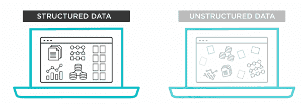
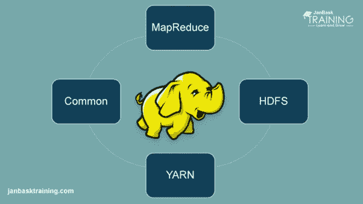
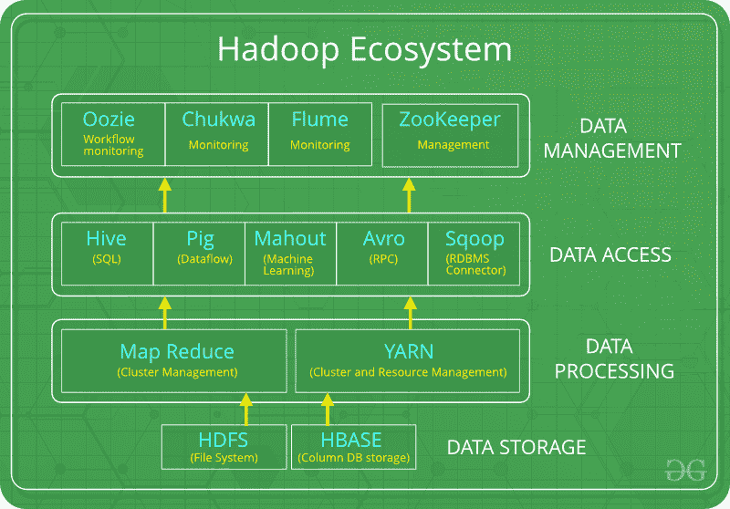
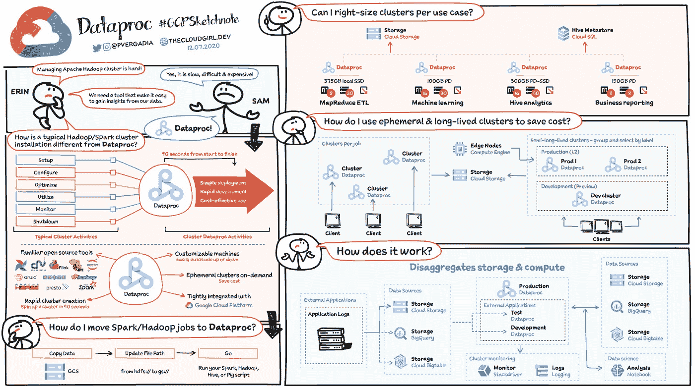

# 大数据解决方案？Hadoop(Hadoop 简介)

> 原文：<https://blog.devgenius.io/big-data-solutions-hadoop-introduction-to-hadoop-f66def725b44?source=collection_archive---------15----------------------->

处理如此大量的数据并理解它们对任何企业的成功都非常重要。Hadoop 能够处理大量数据，并且处理速度很快。Hadoop 使用许多节点来存储数据&分布式计算。在我们大量谈论 Hadoop 之前，如果我们讨论大数据会更好，什么是大数据？

# **什么是大数据**

[来源](https://www.minews.id/headline/mengenal-pemanfaatan-big-data-di-indonesia)

大数据是一个术语，用于表示庞大而复杂的数据集集合，这使得使用传统数据处理应用程序进行处理非常困难。大数据的定义还意味着数据包含更多种类，到达的数量越来越多，速度也越来越快。

## 大数据的类型

[来源](https://www.tibco.com/reference-center/what-is-unstructured-data)

大数据本质上分为三种类型:

*   **结构化数据
    业务用户可以使用关系数据库(SQL 数据库)或 RDBMS(关系数据库管理系统)来快速输入和搜索他们的结构化数据。SQL 是一种用于管理结构化数据的编程语言**
*   **非结构化数据** 非结构化数据不适合任何数据库结构，没有规则和格式，也不容易被程序使用。这个[非结构化数据](https://www.tibco.com/reference-center/what-is-unstructured-data)不符合任何其他模型，没有容易识别的结构
*   **半结构化数据** 半结构化数据是指不以常规方式捕获或格式化的数据。这些数据不在关系数据库中，不符合数据模型，但是具有结构的一些元素。半结构化数据包括 XML 语言数据、电子邮件、压缩文件、web 文件和二进制可执行文件。

## **大数据的特征**

大数据具有以下显著特征:

*   卷:卷是指您拥有的数据量。在大数据中，数据量会在以后的时间里增加，并产生大量的数据
*   多样性:多样性指的是异构数据源和数据的性质，包括结构化和非结构化数据。
*   速度:术语**‘速度’**是指数据生成的速度。生成和处理数据以满足需求的速度决定了数据的实际潜力。大数据速度是指数据从业务流程、应用程序日志、网络、社交媒体网站、传感器、[移动](https://www.guru99.com/mobile-testing.html)设备等来源流入的速度
*   价值:价值是指您的组织从数据中获得的好处。
*   准确性:准确性是指你的数据的准确性。这是最重要的大数据特征之一，因为低准确性会极大地损害结果的准确性。

在我们了解了大数据之后，那么 Hadoop 的定义是什么？而大数据和 Hadoop 有什么关联？大数据和 Hadoop 是相互关联的。大数据是海量数据，Hadoop 是用于存储、处理和分析这些数据的框架。

# **什么是 Hadoop？**

Apache Hadoop 是一个开源框架，用于高效地存储和处理从千兆字节到千兆字节大小的大型数据集。Hadoop 不使用一台大型计算机来存储和处理数据，而是允许多台计算机集群化，以更快地并行分析大量数据集。

**Hadoop 由四个主要模块组成:**

[来源](https://www.janbasktraining.com/blog/big-data-hadoop-tutorial-beginners/)

*   **Hadoop 分布式文件系统(HDFS)** —在标准或低端硬件上运行的分布式文件系统。除了高容错性和对大型数据集的本机支持之外，HDFS 还提供了比传统文件系统更好的数据吞吐量。
*   **又一个资源协商器(YARN)** —管理和监控集群节点和资源使用。它调度作业和任务。
*   **Map Reduce** —一个帮助程序对数据进行并行计算的框架。map 任务获取输入数据，并将其转换为可以通过键值对进行计算的数据集。通过减少任务来消耗映射任务的输出，从而聚合输出并提供所需的结果。
*   **Hadoop Common** —提供可以跨所有模块使用的公共 Java 库。

## **Hadoop 如何工作**

Hadoop 的工作原理

Hadoop 使得使用集群服务器中的所有存储和处理能力，以及针对大量数据执行分布式流程变得更加容易。Hadoop 提供了构建其他服务和应用的基础。

以各种格式收集数据的应用程序可以通过使用 API 操作连接到名称节点，将数据放入 Hadoop 集群。名称节点跟踪文件目录结构和每个文件“区块”的位置，并跨数据节点进行复制。要运行查询数据的作业，请提供一个由许多地图组成的地图化简作业，并对分布在数据节点上的 HDFS 数据执行化简任务。Map 任务根据提供的输入文件在每个节点上运行，reducers 运行以聚集和组织最终输出。

[来源](https://www.geeksforgeeks.org/hadoop-ecosystem/)

除了上述组件，还有许多其他组件也是 Hadoop 生态系统的一部分。由于其可扩展性，Hadoop 生态系统在过去几年中有了显著增长。如今，Hadoop 生态系统包括许多工具和应用程序来帮助收集、存储、处理、分析和管理大数据。一些最受欢迎的应用是:

*   [Spark](https://aws.amazon.com/big-data/what-is-spark/) —一种开源的分布式处理系统，常用于大数据工作负载。Apache Spark 使用内存缓存和优化执行来提高性能，它支持一般批处理、流分析、机器学习、图形数据库和即席查询。
*   [Presto](https://aws.amazon.com/big-data/what-is-presto/) —一个开源、分布式 SQL 查询引擎，针对低延迟、特定数据分析进行了优化。它支持 ANSI SQL 标准，包括复杂的查询、聚合、连接和窗口函数。Presto 可以处理来自多个数据源的数据，包括 Hadoop 分布式文件系统(HDFS)和亚马逊 S3。
*   [Hive](https://aws.amazon.com/big-data/what-is-hive/) —允许用户使用 SQL 接口利用 Hadoop MapReduce，除了分布式和容错数据仓库之外，还支持大规模分析。
*   [HBase](https://aws.amazon.com/big-data/what-is-hbase/) —一个开源、非关系、版本化的数据库，运行在亚马逊 S3(使用 EMRFS)或 Hadoop 分布式文件系统(HDFS)之上。HBase 是一个大规模可扩展的分布式大数据存储，专为具有数十亿行和数百万列的表的随机、严格一致的实时访问而构建。
*   zeppelin——支持交互式数据探索的交互式笔记本。

**Hadoop 在现实世界中是用来做什么的？**

世界各地的公司都在使用 Hadoop 大数据处理系统。Hadoop 的许多实际用途列举如下:

*   **了解客户需求** 如今，Hadoop 已被证明在了解客户需求方面非常有用。金融行业和社交媒体中的主要公司使用这种技术，通过分析有关其活动的大数据来了解客户需求。公司利用这些数据为顾客提供个性化的服务。根据我们的兴趣和互联网活动，您可能通过社交媒体和电子商务网站上显示的广告体验过这一点。
*   **优化业务流程** Hadoop 通过更好地分析交易和客户数据来帮助优化业务绩效。趋势分析和预测分析可以帮助公司定制他们的产品和股票，以增加销售。这种分析将有助于更好的决策，并带来更高的利润。
    此外，公司使用 Hadoop 来改善他们的工作环境，通过收集员工之间的互动数据来监控员工的行为。
*   **改善医疗保健服务** 医疗行业的机构可以使用 Hadoop 来监控有关健康问题和医疗结果的大量数据。研究人员可以分析这些数据，以确定健康问题，预测药物治疗，并决定治疗计划。这种改进将使各国能够迅速改善其卫生服务。
*   **金融交易
    金融公司可以通过 Hadoop 的强大功能来自动化其中的大部分操作。**
*   **将 Hadoop 用于物联网** 物联网设备依赖于数据的可用性来高效运行。制造商和发明家使用 Hadoop 作为数十亿次交易的数据仓库。由于物联网是一个数据流概念，Hadoop 是管理其包含的大量数据的合适且实用的解决方案。Hadoop 不断更新，使我们能够改进物联网平台使用的指令。Hadoop 的其他实际用途包括提高设备性能、改善个人量化和性能优化、改善体育和科学研究。

# **使用 Hadoop 的利弊**

**使用 Hadoop 的优点:**

*   **成本** Hadoop 是开源的，使用经济高效的商用硬件来提供经济高效的模型，不像传统的关系数据库需要昂贵的硬件和高端处理器来处理大数据。传统关系数据库的问题是存储大量数据不划算，所以该公司开始删除原始数据。这可能不会产生正确的业务场景。意味着 Hadoop 为我们提供了两个主要的成本优势，一个是它的开源意味着可以免费使用，另一个是它使用了廉价的商用硬件。
*   **可扩展性**
    Hadoop 是一个高度可扩展的模型。大量数据被分散到一个集群中的多台廉价机器上并行处理。这些机器或节点的数量可以根据企业的需求增加或减少。在传统的 [RDBMS](https://www.geeksforgeeks.org/rdbms-full-form/) (关系数据库管理系统)中，系统不能扩展到处理大量数据。
*   **灵活性** Hadoop 的设计能够非常高效地处理任何类型的数据集，如结构化(MySql 数据)、半结构化(XML、JSON)、非结构化(图像和视频)。这意味着它可以很容易地处理任何类型的数据，而与它的结构无关，这使得它非常灵活。这对企业非常有用，因为他们可以轻松处理大型数据集，因此企业可以使用 Hadoop 来分析来自社交媒体、电子邮件等来源的数据的宝贵见解。凭借这种灵活性，Hadoop 可以用于日志处理、数据仓库、欺诈检测等。
*   **速度** Hadoop 使用分布式文件系统管理其存储，即 HDFS(Hadoop 分布式文件系统)。在 DFS(分布式文件系统)中，大文件被分成小文件块，然后分布在 Hadoop 集群中的可用节点上，因为大量的文件块是并行处理的，这使得 Hadoop 更快，因此与传统的数据库管理系统相比，它提供了更高的性能。当您处理大量非结构化数据时，速度是一个重要因素，使用 Hadoop，您可以在几分钟内轻松访问数 TB 的数据。
*   **容错** Hadoop 使用的是随时可能崩溃的商品硬件(廉价系统)。在 Hadoop 中，数据在 Hadoop 集群中的各种数据节点上复制，这确保了在任何系统崩溃时数据的可用性。如果一台机器面临技术问题，您可以从该机器读取所有数据。也可以从 Hadoop 集群中的其他节点读取数据，因为默认情况下数据是拷贝或复制的。Hadoop 为每个文件块制作了 3 个副本，并将其存储在不同的节点中。
*   **高吞吐量
    吞吐量就是单位时间内完成的任务或工作。**
*   **最小网络流量** 在 Hadoop 中，每个任务被划分为多个小的子任务，然后这些子任务被分配给 Hadoop 集群中可用的每个数据节点。每个数据节点处理少量数据，这导致 Hadoop 集群中的低流量。

**缺点**

*   **小文件的问题** Hadoop 可以高效地处理少量的大文件。Hadoop 以文件块的形式存储文件，文件块的大小从 128MB(默认)到 256MB。Hadoop 在需要大量访问小文件时会失败。如此多的小文件使 Namenode 不堪重负，难以工作。
*   **漏洞** Hadoop 是一个用 Java 编写的框架，而 Java 是最常用的编程语言之一，这使得它更加不安全，因为它很容易被任何网络罪犯利用。
*   **围绕小数据的低性能** Hadoop 主要是为处理大数据集而设计的，因此它可以有效地用于正在生成大量数据的组织。在 sma **C** ll 数据环境中执行时，其效率降低。
*   **缺乏安全性** 数据是组织的一切，默认情况下，Hadoop 中的安全功能不可用。因此，数据驱动程序需要小心这个安全问题，并对其采取适当的措施。Hadoop 使用 Kerberos 作为安全特性，这不容易管理。Kerberos 中缺少存储和网络加密，这让我们更加担心。
*   **高级处理** Hadoop 中的读/写操作是过度的，因为我们处理的是 TB 或 PB 级的大数据。在 Hadoop 中，从磁盘读取或写入数据会使执行内存计算变得困难，并导致处理开销或高处理。
*   **仅支持批处理** 批处理就是在后台运行的进程，与用户没有任何交互。Hadoop 内核中用于这些进程的引擎效率并不高。用它不可能产生低延迟的输出。

# **使用 Google Cloud Dataproc 提高 Hadoop 集群的效率。**

Hadoop 的缺点是集群管理非常困难，因此为了提高效率和简化集群管理，我们可以使用 Dataproc。如果不使用 Dataproc，在内部或通过提供商创建 Spark 和 Hadoop 集群可能需要 5 到 30 分钟。相比之下，Dataproc 集群的启动、伸缩和关闭都很快，每个操作平均只需 90 秒或更短时间。这意味着您可以花更少的时间等待集群，并有更多的时间处理数据。

Cloud Dataproc 是一个托管的 Spark 和 Hadoop 服务，允许您利用开源数据工具进行批处理、查询、流和机器学习。Cloud Dataproc 自动化帮助您快速创建集群，轻松管理集群，并通过在不需要集群时关闭集群来节省资金。管理花费的时间和金钱更少，您可以专注于您的工作和数据。

Dataproc 构建在开源平台上，包括:

*   [Apache Hadoop](https://www.techtarget.com/searchdatamanagement/definition/Hadoop) —支持跨集群的大型数据集的分布式处理
*   [Apache Spark](https://www.techtarget.com/searchdatamanagement/definition/Apache-Spark) —作为快速、大规模数据处理的引擎
*   [Apache Pig](https://www.techtarget.com/searchdatamanagement/definition/Apache-Pig) —分析大型数据集
*   [Apache Hive](https://www.techtarget.com/searchdatamanagement/definition/Apache-Hive) —提供数据仓库和 [SQL](https://searchsqlserver.techtarget.com/definition/SQL) 数据库存储管理。

安装 cloud dataproc 的步骤可以在这个[链接](https://www.cloudskillsboost.google/focuses/672?parent=catalog)中看到。

# **结论**

Hadoop 是一个强大的系统，作为支持大量不同数据应用的平台而开发。它提供了处理结构化和复杂数据的接口，从而促进了异构数据的整合。Hadoop 的开源特性使其商用服务器使用起来更便宜，同时性能比也有所提高。Map/Reduce 框架为用户提供了操纵数据分析方法的灵活性。尽管 NameNode 故障对文件系统至关重要，但使用备份节点或协调服务(如 Zookeeper)有助于在整个服务周期中保持信息的可用性。诸如 NameNode 的可伸缩性之类的问题可以通过生成多个 NameNode 来解决，以便将名称空间分布在几个其他节点上。

在当今世界，数百万用户通过社交网络媒体或庞大的统计记录相互交流，大量的数据流入需要 Hadoop 等系统来分析和持久化它们。通过将 Hadoop 托管到云框架上，我们可以成功地将当前的数据管理水平带入一个更广泛的无缝全球维度。

**来源**

【https://intelli paat . com/blog/tutorial/Hadoop-tutorial/big-data-solutions/
[https://www.cloudskillsboost.google/focuses/672?parent = catalog](https://www.cloudskillsboost.google/focuses/672?parent=catalog)
[https://www.databricks.com/glossary/hadoop-ecosystem](https://www.databricks.com/glossary/hadoop-ecosystem)
[https://www.geeksforgeeks.org/hadoop-ecosystem/](https://www.geeksforgeeks.org/hadoop-ecosystem/)
[https://www.edureka.co/blog/hadoop-ecosystem](https://www.edureka.co/blog/hadoop-ecosystem)

**作者:**

1.  拉赫马德·古纳万
2.  苏哈迪曼·阿贡