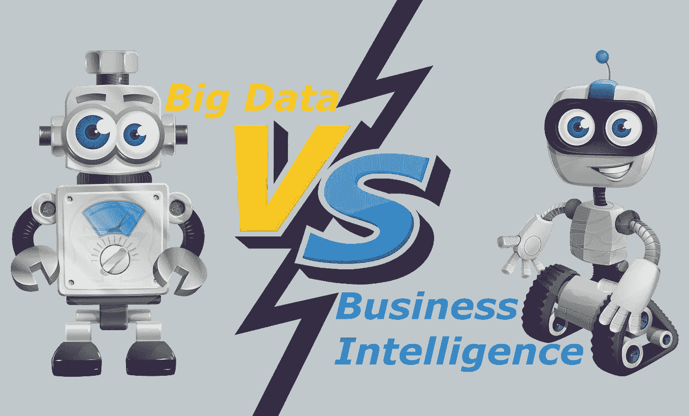
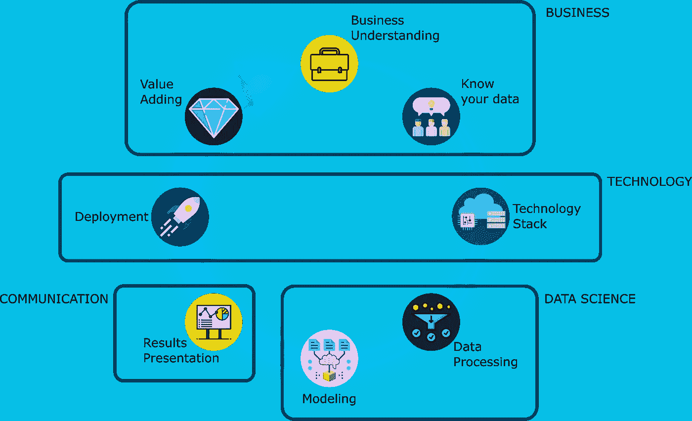

# 大数据与商业智能

> 原文：<https://blog.devgenius.io/big-data-vs-business-intelligence-13e173261ca3?source=collection_archive---------4----------------------->

在许多文章中，我们都可以找到大数据的定义。但现在让我们从正确的角度看待大数据。在大数据出现之前，我们所做的是实现业务智能模型。简而言之，商业智能允许我们创建概念模型，帮助我们分析历史和当前数据，它还可能创建统计模型来预测未来。另一方面，大数据不仅仅创建概念模型，它还专注于创建数学模型，能够更好地预测未来行为，回答已知和未知的问题，并实时做出决策。

在商业智能中，分析师使用查询从数据库中提取信息。相比之下，大数据则建议使用复杂的数据操作技术，例如—数据提取、数据分区、并行性、并发性、优化—并采用各种来源，不仅包括数据库(结构化数据)，还包括非结构化数据(图像、语音、视频、文档)和半结构化数据(分隔文件、日志、NoSQL 数据库)。

商业智能和大数据的另一个区别是我们在每个规程下处理的信息量。

从所有这些陈述中，我们可以推断出大数据的 V 值—容量、速度、多样性、可视化—以及最重要的 V 值。

# 每个学科的角色

商业智能分析师开发非常优化的查询来提取信息，而在大数据中，数据工程师开发复杂和优化的流程来提取信息。

在商业智能领域，分析师设计概念模型并撰写报告；在大数据领域，数据科学家使用高级分析、概率和统计模型，以及人工智能算法(如神经网络或遗传算法)。

最后，业务智能分析师必须具备一定的业务知识，才能呈现相关的战略仪表板和战术 KPI。但在大数据领域，我们有主题专家来解释报告和图形，并向数据工程师和数据科学家提供反馈。

# 对业务的影响

大数据允许我们将数据转化为知识，只要有可能就让应用程序做出实时决策；而业务智能的目的是创建一个基本的报告行，以便操作人员做出更好的决策。

大数据让我们能够将数据放在公司业务战略的中间，生成我们称之为数据湖的东西，它使所有组织都能够访问数据。如果要从 V 代表价值的角度来思考，我们就需要看看大数据的价值在哪里，也就是投资回报率。

我们可以为大数据、任何行业和任何行业设想的任何使用情形，它都将围绕三个主要轴心恢复:

1.  由于个性化，大数据让我们产生了新的收入来源。它让我们更好地了解我们的客户，根据他们的行为对他们进行细分，并开发更加个性化的新产品和服务；因此，它允许我们产生新的收入来源，推荐引擎，更多的细分产品。
2.  大数据使我们能够加强决策并提高运营效率。决策对于组织来说是非常重要的事情，到目前为止，这些决策是在商业智能等工具的帮助下做出的，在报告和仪表板的帮助下，我们可以看到公司的绩效和活动，并在此基础上为未来做出决策。但是现在的商业智能非常有限。从商业的角度来看，大数据有更强大的工具和方法来预测和进行决策(如机器学习或深度学习)，因此，大数据使我们能够在公司中做出更好的决策。
3.  最后，大数据使我们能够预测和预防欺诈和风险，如失败预测、客户流失预测、坏账预测、拖欠预测。

因此，这三个轴涵盖了任何业务的任何用例。

# 如何以大数据的方式做到这一点

该方法有四个高级组件:业务、技术、数据科学和通信。

该方法由八个阶段组成。

1.  业务理解:我们想知道问题是什么，目标是什么。
2.  了解您的数据:这里我们在高层次上识别数据源，但是我们也进行数据剖析以识别数据模式和详细特征。数据分析是在数据科学团队的帮助下完成的。我们还期望拥有数据的静态和动态模型。
3.  技术堆栈:我们定义技术、产品、框架、硬件要求、网络要求。
4.  数据处理:在这里，我们设计数据管道，并应用数据处理技术，如数据分割、过滤、数据转换、连接、排序、规范化、聚合、并行。
5.  建模:这里我们创建模型，允许我们从数据中提取知识。例如，如果我们使用神经网络，我们的模型将是纯数学的；这意味着对于每个输入数据集，数据科学家将需要找到数值矩阵表示以及多项式函数来处理矩阵(这就是我们所知的深度学习)。
6.  结果展示:无论我们发现了什么，我们都需要展示出来，并借助可视化工具与我们的利益相关者交流。
7.  部署:一旦我们得到主题专家的批准，我们就在生产中部署我们的模型。
8.  增值:一旦我们将模型投入生产，主题专家将开始挖掘模型。

在过去，处理大量数据所需的技术堆栈非常昂贵，只有大公司才能部署解决方案来处理大量数据，尽管没有数据科学组件。那些技术是大型机、Cobol、汇接、从头开始；毫无疑问，这些技术是强大的，能够处理非常大量的数据，但价格昂贵。

在过去，为了进行数据剖析，我们需要高度专业化的工具(任何人都无法使用)，但是现在我们可以使用像 r。

现在，大数据已经在改变行业和做生意的方式。