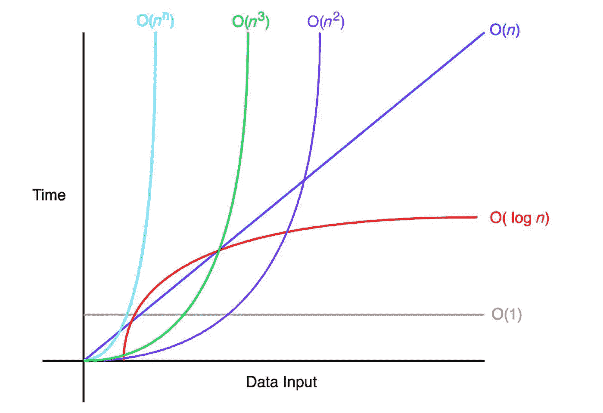

# 大 O 符号

> 原文：<https://blog.devgenius.io/big-o-notation-583adf20af1?source=collection_archive---------10----------------------->


关于使用大 O 符号的算法分析和分类的基础文章。

# 介绍

一般来说，算法的度量有点难以估计，因为它不仅涉及到度量它的执行时间，还涉及到它所使用的资源的效率。

当试图测量算法时，影响的一个基本因素是当前机器的处理器能力，这是因为在两台不同的机器上执行的相同算法将具有不同的结果，这取决于每台机器的能力。

# 大 O 符号

大 O 记法是一种基本的数学形式，用于评估算法的复杂性，并对其效率进行分级。

大 O 符号抽象地表达了算法的处理速度，关注于执行时间会增加多少，这取决于输入数据的大小。结果，这将给出一条增长曲线，将时间作为大小的函数进行评估。

要强调的另一个特征是，大 O 符号是一种渐近分析，它侧重于测量接近无穷大的极限，而不是小值，目的是方便一般分析。



# 关键概念

*   **大“O”**:字母 O 来源于对要分析的函数的数量级进行分类。
*   **O(1)** :恒定时间，表示执行时间不会随着输入数据大小的增加而变化。无论输入幅度如何，响应都需要相同的时间。这是最好的分类之一。
*   **O(log n)** :对数时间，意味着算法在开始时增长，但随着输入大小的增加而达到平台期。这对于算法来说是个好结果，因为它稳定了。
*   **O(n)** :线性时间，这意味着执行时间与输入数据成正比。
*   **O(n2):** 二次时间，算法的增长是多项式。随着输入大小的增加，时间会变得非常长，运行的机器可能会因为大量的输入数据而缺乏资源。这是现存最糟糕的分类之一。
*   **O(！n)** :阶乘时间，算法的增长将是阶乘类型，这趋向于无法管理的值，因此是一条垂直线。毫无疑问，这是最糟糕的分类。

# 一些基本代码分析的例子

为了更好地理解大 O 符号，我们将展示一些支持对任何类型的算法进行分类的基本示例，强调算法中的一切都是根据大 O 进行分类的，包括变量的赋值。

**注意** 🧐:需要注意的是，如果算法有多种分类，我们总是会得到最差的复杂度。

# O(1) —恒定复杂度

```
x = 1 + 1;  // **O(1)**
y = x + 1;  // **O(1)**
print(y);   // **O(1)**
```

在上面的代码中，变量赋值不依赖于输入大小，因此它具有简单的复杂度，用 O(1)表示。执行分组时，会产生以下结果:

```
O(1) **+** O(1) **+** O(1) **=** O(1)
```

# O(n) —线性复杂度

```
for (int i = 0; i < n; i++) {
  print(arr[i]); // **O(1)**
}
```

在前面的代码中，我们有一个已知复杂度为 O(1)的打印操作，但是，在这个操作中，我们不知道数组的大小，因此，我们可以得出结论，我们将打印值 O(1)N 次，也就是说，将产生以下结果:

```
O(1) ***** n **=** O(n)
```

# O(n2) —二次复杂度

```
for (int i = 0; i < n; i++) {
  for (int j = 0; j < k ; j++) {
    print(m[i][j]); // **O(1)**
  }
}
```

在前面的代码中，我们有两个嵌套循环，我们已经知道每个循环都是 O(n ),因此 print O(1)操作乘以 2 N，也就是说，将产生以下结果:

```
n * n * O(1) = O(n2)
```

感谢你远道而来，如果你觉得这很有用，别忘了鼓掌👏。订阅以接收更多内容🔔。

如果你需要额外的帮助，请联系我🤠。

*   ✉️ [**给我发邮件**](mailto:dcortes.net@gmail.com)
*   🤝 [**在 LinkedIn 上联系我**](https://www.linkedin.com/in/dcortesnet/)
*   📮 [**在推特上联系我**](https://twitter.com/dcortes_net)

非常感谢您的阅读，我感谢您的时间。