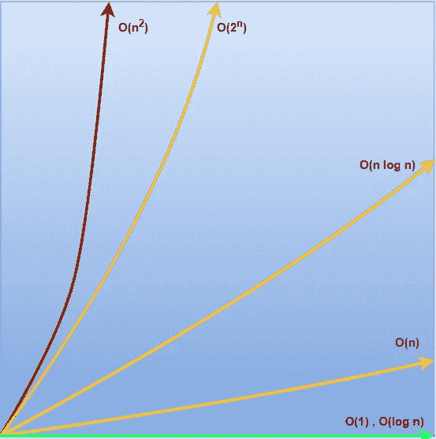

# 大 O 符号的时间复杂度

> 原文：<https://blog.devgenius.io/big-o-notation-f178bcbdaab0?source=collection_archive---------2----------------------->

表达每个算法的时间复杂度。


在这个故事中，我将深入浅出地解释*算法和数据结构*中最重要的概念之一。

**什么是时间复杂性？**

很‘简单’，***时间复杂度就是一个任务执行的次数。*** 非常明确的是，它不是一项任务完成所花费的时间。

我们举个例子来了解一下。假设你有 100 个房间，你需要找到其中一个房间里的人。那你是做什么的？

简单地说，你在每个房间里一个接一个地寻找，直到你找到那个人。在这种情况下，你可能要搜索所有的 100 个房间才能找到那个人。这意味着你需要执行 100 次搜索，这就是我们所说的这项任务的“时间复杂度”。再说一次，这和搜索那个人的时间没有任何关系。

***Big-O-notation***用于表示这个时间复杂度，所以在这种情况下，搜索人的时间复杂度将是 O(100)

**为什么大 O 符号很重要？**

它有助于了解你对问题的解决方案(算法)的效率。它帮助您比较解决方案的效率。并做出决定。

计算时间复杂度是非常容易的。只要遵循这些经验法则:

*   **增加个别发言的时间复杂性**

```
**for(0...n){...} // O(n)
for(0...m){...} // O(n+m)
for(0...i){...} // O(n+m+i)**
```

在这个例子中，我们有三个*用于*循环，这意味着第一个循环将执行某个东西 *n* 次，第二个循环 *m* 次，第三个循环 *i* 次，但它们都是单独的循环。因此，我们将增加时间复杂性。

*   **增加嵌套语句的时间复杂度**

```
**for(0...n){              // O(n)
   for(0...m){           // O(n*m)
       for(0...i){       // O(n*m*i)
          ......
       }
   }
}**
```

在本例中，我们为循环嵌套了*，这意味着第一个循环将执行第二个循环 *n 次*次，同样，第二个循环将执行第三个循环 *m 次*次，最后第三个循环将执行 *i* 次。所以，我们将分别乘以所有的时间复杂度。*

*   **移除系数**

```
**for(0...n){...} // O(n)
for(0...n){...} // O(n+n)
for(0...n){...} // O(n+n+n) = O(3n) = O(n)**
```

在这个例子中，我们有*用于具有相同迭代的*循环。我们可以简化这样的表达式。所以， *O(n+n+n)* 可以表示为 *O(3n)* 最后 *O(n)* 去掉系数。

*   **去除较小的时间复杂度**

```
**for(0...n){...} //                  O(n)
for(0...m){...} // note : m < n/2   O(n)
for(0...p){...} // note : p < m/2   O(n)**
```

在这个例子中，对于循环，我们有不同的*，但是对于某些关系，例如第二循环将迭代少于第一循环的一半时间(m < n/2)，第三循环将迭代少于第二循环的一半时间(p < m/2)。因此，在这种情况下，我们可以删除较小的复杂性，因为它们小于最大复杂性的一半。*

*注意:只有当你知道复杂度小于最大复杂度的一半时，才移除复杂度。*

*   **删除常量**

```
**for(0..10) {...} // O(10)
for(0...n) {     // O(10 + n)
   for(0...m) {  // O(10 + n*m) = O(n*m)
        ...
   }
}**
```

在这个例子中，我们有一个执行 10 次的循环的*,然后有一个执行 n * m 次的*循环的嵌套*。如果您有像本例中这样的非常量复杂性，您可以删除常量复杂性。你可能想知道为什么我们能做到这一点？*因为 n 和 m 都是变量。它们可以有从 0 到无穷大的值，考虑到这种开放的可能性，常量复杂性可以忽略。

**常见的复杂性**

尽管不同的问题和算法有不同的复杂性，但都有其独特的大 O 符号表达式。但是，几乎每个算法都有一定的复杂性。

*   **O(1) constant，**其中执行次数为常数且已知，类似于数组中的随机存取。

*注意:这里的* ***1*** *只代表一个常数，它可能是****O(2)****或****O(99)****取决于你的执行次数。*

*   **O(n)线性，**数组、链表中的线性搜索。
*   O(log n)对数，当你只需要遍历一半的元素就可以执行操作时，比如在二叉查找树中搜索，在有序数组中搜索等等，你就得到这个时间复杂度。
*   **O(n log n) linearithmic，**合并、快速排序等排序算法。在这些排序算法中，你每次都将列表分成两半，这是一个 *O(log n)复杂度*，但是然后你在合并时将数字相互比较，这是一个 *O(n)复杂度*。这就是为什么整体复杂度是 *O(n log n)*
*   **O(n)二次，**遍历矩阵(二维数组)，冒泡排序。让我们借助矩阵遍历来理解二次复杂度。考虑一个矩阵，每行有 *n 行*和 *n 列*。我必须访问矩阵的每个元素。对于每一行，我必须通过 n 列，总共有 n 行*。那么，*“访问一个元素”执行了多少次？*它的 *n*n* 那就是'*二次复杂度'*。*
*   ***O(2^n)指数，**识别给定集合中的所有组合。*

**

*最后，**您认为哪种解决方案更高效？公平地说，这要视情况而定，对于复杂的问题，你会有更复杂的解决方案；对于简单的问题，你会有简单的解决方案。知道它们的时间复杂性是好的，但是比较这两种解决方案来看哪一种更有效是没有意义的。当同一问题有多个不同时间复杂度的解决方案，而您想要选择其中一个时，确定效率是有意义的。***