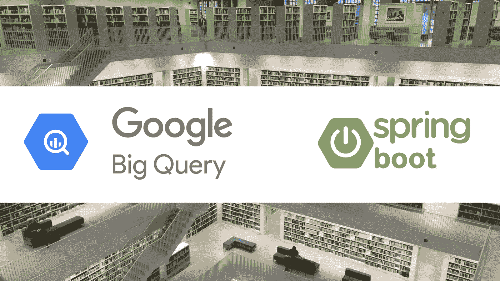
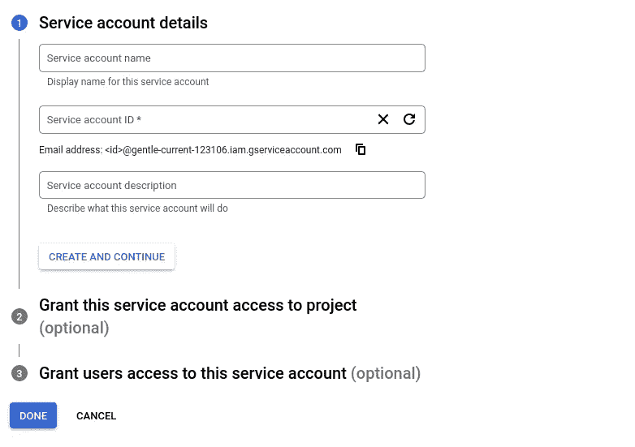
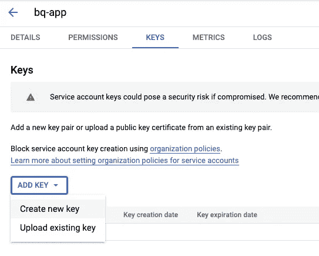

# Spring Boot 具有自定义查询的 BigQuery

> 原文：<https://blog.devgenius.io/bigquery-and-spring-boot-169a778776ea?source=collection_archive---------3----------------------->



BigQuery 是一个无服务器、高度可扩展且经济高效的多云数据仓库，旨在实现业务敏捷性。
它规定:

*   以最快的速度实时分析大型数据集
*   使用机器学习的商业分析
*   与可视化工具集成
*   高安全性、高可靠性、高可扩展性

> *在本主题中，我们将介绍使用 Maven 集成 BigQuery 和 spring boot。*

首先，我们需要一个来自谷歌云控制台的服务帐户来建立与应用程序的连接。每个应用程序都有自己的服务帐户。服务帐户让 BigQuery 知道应用程序是可信的，可以在其上运行作业。

> **创建服务账户:**

进入[服务账户页面](https://console.cloud.google.com/iam-admin/serviceaccounts)，点击“创建服务账户”。



现在，我们可以进入服务帐户的“Keys”选项卡来创建一个密钥。



在这之后，我们将能够以 JSON 文件的形式下载这个密钥。我们将在我们的 Spring boot 应用程序中使用它。

> **在应用中实施**

**a)添加 Maven 依赖关系**

```
<dependency>
    <groupId>com.google.cloud</groupId>
    <artifactId>google-cloud-bigquery</artifactId>
</dependency>
```

**b)使用 BigQuery 创建连接类**

在这个类中，我们将使用下面的云配置创建连接对象

a)在创建服务帐户时从 Google cloud 下载的 JSON 文件。

b) BigQuery 项目 Id。

```
[@Component](http://twitter.com/Component)
public class BigQueryUtil {public static GoogleCredentials getCreds(){
        GoogleCredentials credentials = null;File file = new File("<path>/<downloaded json file>"); // bigquery.json
        String absolutePath = file.getAbsolutePath();

        final File credentialsPath = new File(absolutePath);
        try (FileInputStream serviceAccountStream = new FileInputStream(credentialsPath)) {
            credentials = ServiceAccountCredentials.fromStream(serviceAccountStream);

        }catch(Exception e) {
        }
        return credentials;

    }

    public static BigQuery getConnection() {
        BigQuery bigquery = null;
        try {
            bigquery = BigQueryOptions.newBuilder().setProjectId(<Project id>).setCredentials(getCreds()).build().getService();
        } catch (Exception e) {

        }
        return bigquery;
    }}
```

**c)创建服务类以使用连接类**

在这堂课中，我们将使用下面的云配置

a)大查询数据集。

b)数据集内的 BigQuery 表。

```
[@Service](http://twitter.com/Service)
public class BigQueryServiceImpl {

    private static final String dataset = <data set>;
    private static final String table = <table>;public void run(List<String> records) {
        InsertAllRequest insertAllRequest = null;
        String datasetId = dataset;
        String tableId = table;
        Builder bld =  InsertAllRequest.newBuilder(datasetId, tableId);
        for(String record:records) {
            insertAllRequest = getInsertRequest(bld, record);
        }
        if(insertAllRequest!=null) {
            pushObBG(insertAllRequest);
        }
    }

    public void pushObBG(InsertAllRequest record) {
        try {
            BigQuery bigquery = BigQueryUtil.getConnection();
            InsertAllRequest insertAllRequest = record;
            InsertAllResponse bresponse = bigquery.insertAll(insertAllRequest);
        }catch(Exception e) {
        }
        return;
    }private static InsertAllRequest getInsertRequest(Builder bld, String record) {
        return bld.addRow(getRow(record))
        .build();
    }

    private static Map<String, Object> getRow(String record) {
       JSONObject respObject = new JSONObject(record);
        String msg = StringUtils.isNotBlank(respObject.get("msg").toString()) ? respObject.get("msg").toString() : "";
        String aptm = StringUtils.isNotBlank(respObject.get("aptm").toString()) ? respObject.get("aptm").toString() : "";
        String apv = StringUtils.isNotBlank(respObject.get("apv").toString()) ? respObject.get("apv").toString() : "";
        Map<String, Object> rowMap = new HashMap<String, Object>();
        Long aptmL = Long.parseLong(aptm);
        String time = DateUtil.convertLongToDateTime(aptmL*1000);
        rowMap.put("api_version", apv);
        rowMap.put("msg", msg);
        rowMap.put("app_time", time);
        return rowMap;
    }}
```

我们将上面的代码分为三个部分

1.  使用数据集和表创建构建器实例。
2.  在生成器实例上准备插入请求。
3.  使用 insertAll 保存 BigQuery 上的数据。

要检查不同类型的查询操作，我们可以去*https://cloud.google.com/bigquery/docs/samples/*

仅此而已。我们现在可以使用 BigQuery 快速保存和获取大量数据。