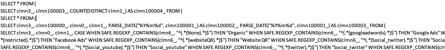

# BigQuery 成本监控和对经济高效的管道的洞察

> 原文：<https://blog.devgenius.io/bigquery-cost-monitoring-and-insights-for-cost-effective-pipelines-ca14f8715082?source=collection_archive---------6----------------------->

BigQuery 是一个完全托管的无服务器数据仓库解决方案，它是灵活的、分布式的，有数百个连接器，允许以最小的努力将数据传输到 BigQuery。尽管有不同的提供商，如 Snowflake、Amazon Redshift 和 SAP Business Warehouse，但选择 BigQuery 是一个架构决策，成千上万的企业更喜欢将 BigQuery 作为其数据管道的数据仓库。除了 BigQuery 的优势，BigQuery 数据传输服务还提供了各种各样的来源来集成到 BigQuery，如谷歌产品(YouTube、谷歌分析、云资源)、一些 AWS 产品(Redshift、S3)和数百个第三方传输工具。尽管这些集成服务是免费的，但是将数据流式传输到 BigQuery 会产生运行持续查询的成本。除了这些自动查询之外，数据分析师、BI 开发人员、数据科学家以及外部资源也在使用 BigQuery 并运行手动查询。受[网飞保持基础设施成本效益的方法](https://www.acceldata.io/blog/data-engineering-netflix-data-infrastructure)的启发，我们可以在 BigQuery 上做同样的事情。

# **故事情节**

作为一名数据工程师，您负责监控 Google 云基础设施的成本，并且您观察到 BigQuery 的成本呈指数级增长。如果您的数据也呈指数级增长，那么这可能不是最大的问题，但我们不喜欢成本呈指数级增长，对吗？

观察之后，你开始寻找降低成本的方法，并且你有了一些有用的想法。但是，我们如何确保我们的解决方案能够解决我们的问题呢？我们的成本高是因为手动查询还是自动化查询？有没有一个非优化视图，每次新数据来了，调用视图时，都要用千兆字节的处理量？每个表和视图对成本的贡献是多少？也许有些用户正在运行类似“SELECT * FROM x.t LIMIT 10”这样的查询正如我们所知，使用 LIMIT 并不能减少 BigQuery 中处理的总字节数。在采取任何行动之前，我们必须弄清楚每个查询运行的细节，并处理数据以选择最佳行动来优化我们的成本。谢天谢地，BigQuery 已经提供了一个 Python API，通过使用 BigQueryJobs 类，我们可以解决这个问题！我们将使用[我创建的 GitHub 库](https://github.com/egehanyorulmaz/BigQuery-Cost-Monitoring-and-Insights-with-Apache-airflow)。

通过利用 BigQuery 模块的 [Python 客户端，我们可以创建一个允许我们与 BigQuery 交互的客户端。使用这个客户机，您可以创建 ETL 管道，将数据提取或接收到 BigQuery。您在 BigQuery UI 中所做的一切，当然也可以在 Python 客户端中完成。](https://googleapis.dev/python/bigquery/latest/index.html)

**1- BigQuery 类**
用 JSON 文件的 google 凭证路径创建一个 BigQuery 客户端。

要使用这个存储库，我们必须做的就是在 SqlQueryManager.py 的 class 属性中替换我们的凭证，以便我们到 BigQuery 的连接得到正确的身份验证和授权。

**2- BigQueryJobs 类**
从 BigQuery 类继承而来，它使用客户端列出历史作业记录，并迭代作业以获得更多详细信息。

使用 **get_all_job_details** 函数，我们可以提取以下信息:

1.  作业类型(查询或加载)
2.  创建时间
3.  用户电子邮件
4.  询问
5.  查询运行时间
6.  查询运行的计费字节数

如果我们看到一个具有以下格式的查询，那么我们可以理解它是 Google Data Studio 请求的自动查询。

Google Data Studio 查询格式

作为最佳实践，任何自动化操作都必须获得[服务帐户](https://cloud.google.com/iam/docs/service-accounts)的授权。因此，在一个设计良好的 Google 云架构中，您可能能够通过使用用户电子邮件列来区分查询。如果您看到一封以@system.gserviceaccount.com 结尾的电子邮件，那么您可以找到并过滤每个服务帐户运行的查询。

**到目前为止的总结:**我们可以使用 BigQuery 的 Python 客户端获得 BigQuery 中运行的所有查询的详细信息。通过使用用户电子邮件列、连续创建时间之间的时间、查询结构或者相同的查询之前是否运行，可以很容易地理解是谁执行了这些查询。

## 计算每个表或视图的成本

现在，我们有了原始数据，我们可以进一步分析它。然而，我们还没有将计费字节用于查询运行。要想出由表引起的成本，我们必须了解 SQL 查询中使用了哪些表。幸运的是， [sql-metadata](https://pypi.org/project/sql-metadata/) 模块为我们做了这项工作！使用 sql 元数据库，我们可以提取 SQL 查询中提到和使用的列或表。一个例子:

**SQL 查询:**`SELECT * FROM table1 t1\ LEFT JOIN table2 t2\ ON t1.x=t2.x`
**SQL _ 元数据解析器输出:** `["table1", "table2"]`

在 **parse_query** 函数中，我们提取查询中的表，这个函数由 **get_all_job_details** 迭代调用。此时，假设我们有一个使用 3 个表和 2 个视图的长查询。我们还有这个长查询的总计费字节数。使用统一的方法(假设每个表贡献相同数量的计费字节)，并用[基于区域的分析成本](https://cloud.google.com/skus/?currency=USD&filter=bigquery+analysis)将字节转换成美元，我们可以得到每个表的粗略成本。更好的方法是使用 BigQuery 的模拟选项，并获得每个子查询的总计费字节数。然后，将总字节数除以子查询中的表数

对于分析的最后一部分，我们所要做的就是自动化这一过程，并可视化随时间推移和每张表的成本。在存储库中，我已经开发了生产就绪的气流 DAG。在末尾添加一个摄取节点或电子邮件节点后，就可以开始收集数据了。对于分析部分，通过简单的按表分组和按成本排序，我们可以看到哪些表和/或视图是成本的主要来源。有了这种认识，我们可以开始优化和优先考虑我们的成本降低策略，并在 BigQuery 中拥有一个经济高效的数据基础设施。

> 永远不要低估鼓掌激励作者的力量。:)

## **参考文献**

*   网飞文章:[https://www . Accel data . io/blog/data-engineering-网飞-数据-基础设施](https://www.acceldata.io/blog/data-engineering-netflix-data-infrastructure)
*   图片:[https://flowygo . com/en/blog/big query-performance-optimization/](https://flowygo.com/en/blog/bigquery-performance-optimization/)

[https://googleapis.dev/python/bigquery/latest/index.html](https://googleapis.dev/python/bigquery/latest/index.html)

[https://cloud.google.com/iam/docs/service-accounts](https://cloud.google.com/iam/docs/service-accounts)

[https://cloud.google.com/skus/?currency=USD&filter = big query % 20 analysis](https://cloud.google.com/skus/?currency=USD&filter=bigquery%20analysis)