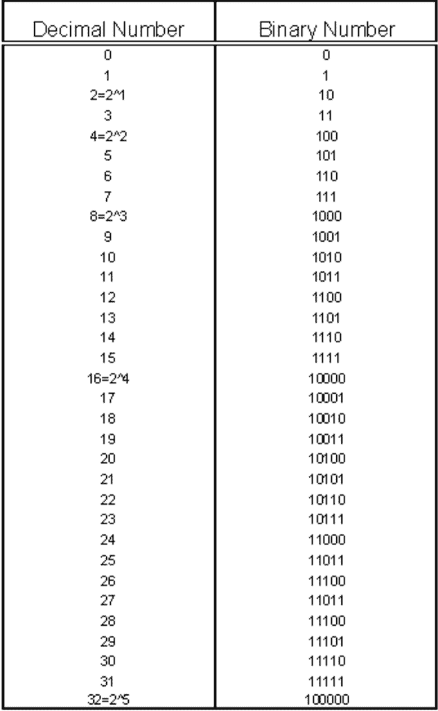
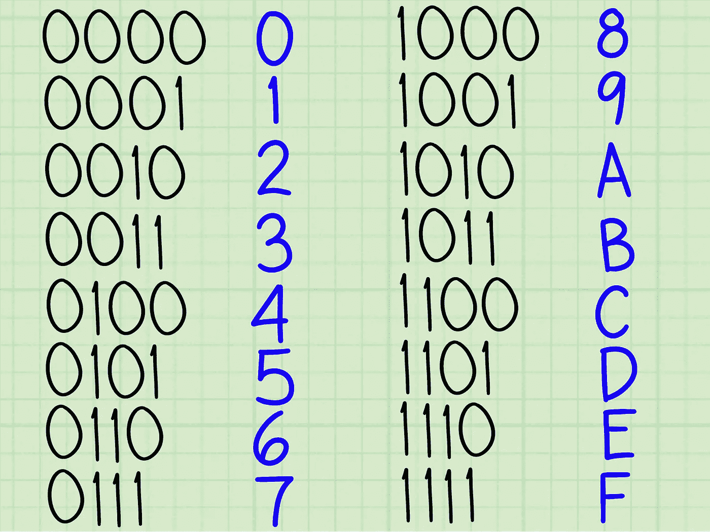

# 二进制和十六进制

> 原文：<https://blog.devgenius.io/binary-and-hexadecimal-ab5a4374a7dd?source=collection_archive---------2----------------------->

# 概观

通常我们使用从 0 到 9 的数字，这是一个十进制系统，称为十进制。二进制是一种使用二进制的数字系统。这意味着它只使用 2 个数字 0 和 1。计算机使用二进制来存储数据，每一位用 1 或 0 来表示。每一位被分成代表一个字节的 8 位。十六进制使用 16 进制，比二进制更容易用 2 位数表示 8 位。

马库斯·斯皮斯克在 [Unsplash](https://unsplash.com?utm_source=medium&utm_medium=referral) 上的照片

# 二进制和十进制

十进制中的每个数字代表 2 的幂。所以从右到左是 1，2，4，8，16 等等。当把二进制转换成十进制时，你要弄清楚哪个数字代表 2 的什么次方，如果它是 1，就把 2 的次方相加。比如:10101。从右到左，1 代表 1、4 和 16，因此要进行转换，我们将这些数字相加，得到 21。

[https://content . instructables . com/ORIG/FSA/kpp 7/ieidcyx 6/FSA kpp 7 ieidcyx 6 . png？auto = webp&frame = 1&height = 1024&fit = bounds&MD = 153 F2 DFC 1c 05437 C3 be 8e 88 b 39823 f](https://content.instructables.com/ORIG/FSA/KPP7/IEIDCYX6/FSAKPP7IEIDCYX6.png?auto=webp&frame=1&height=1024&fit=bounds&md=153f2dfc1c05437c3be8e88b2b39823f)

要把十进制转换成二进制，我们必须反过来做。我们需要找到等于或小于十进制数的 2 的最大幂，然后继续下去。因此，要将 12 转换成二进制，我们需要找到 2 的最大幂，它等于 12，也就是 8。所以我们做 12–8 = 4，4 是 2 的幂，所以我们完成了。接下来我们填入代表 12 和 4 的数字，这样我们就得到了 1100。

# 十六和十进制

除了 A=10，B=11，C=12，D=13，E=14 和 F=15 之外，你可以把十六进制想成和十进制一样。与二进制类似，我们可以用十六进制的每个数字代表的 16 的幂来将十六进制转换成十进制。所以 B1 是 177，因为 b 在十六进制中代表 11，第二个数字是 16，所以 11*16=176，最后一个数字是 16⁰，所以 176+1=177。

[https://www . wikihow . com/images/f/F8/Convert-Binary-to-十六进制-Step-12-Version-2.jpg](https://www.wikihow.com/images/f/f8/Convert-Binary-to-Hexadecimal-Step-12-Version-2.jpg)

为了把十进制转换成十六进制，我们做了和十进制转换成二进制一样的事情，但是使用的是 16 的幂。所以 100 变成 64，因为 16*6=96 代表第二个数字，剩下的变成第一个数字。

# 结论

计算机使用二进制和十六进制来计算和显示信息。计算机使用二进制的原因是因为基本上有两种状态开和关，基本上是二进制的。二进制是计算机的组成部分，用二进制思考也有助于解决逻辑问题。