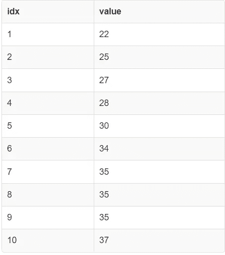
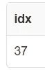
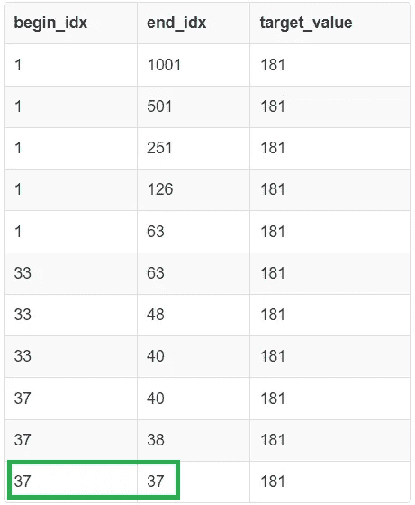

# SQL 中的二进制(下限)搜索

> 原文：<https://blog.devgenius.io/binary-lower-bound-search-in-sql-384cb0cc66fe?source=collection_archive---------9----------------------->

## 我们探索了使用递归 cte 在声明性 SQL 中实现二分搜索法

二分搜索法是一种在有序数组中定位数据的非常流行的(并且机器效率高的)技术。它通常用命令式编程语言来实现，如 C++、Java、Python 等。今天我们将探索二分搜索法在声明式 SQL 语法中的实现。


叶夫根尼·切尔卡斯基在 [Unsplash](https://unsplash.com?utm_source=medium&utm_medium=referral) 上拍摄的照片

更具体地说，我们将看看 SQL 中的 [lower_bound()](https://en.cppreference.com/w/cpp/algorithm/lower_bound) 函数的实现。 **lower_bound(value)** 返回排序输入范围中第一个元素的位置，在此之前可以插入**值**以保持数据的排序。

**上一篇文章:** [使用 SQL 的最大子数组和](https://medium.com/@dhruvbird/maximum-subarray-sum-using-sql-e1befa75d055)

# 一个 C++实现

这就是 lower_bound 在 C++中的实现方式(对于整数数组)。

```
// Returns a pointer into the array (begin, end) such that the pointer
// points to the first position where target_value can be safely
// inserted while preserving the sortedness of the range (begin, end+1).
int* lower_bound(int *begin, int *end, int target_value) {
  while (begin != end) {
    int *m = begin + (end - begin) / 2;
    if (target_value <= *m) {
      // Go Left
      end = m;
    } else {
      // Go Right
      begin = m + 1;
    }
  }
  return begin;
}
```

# 输入表模式

输入表有 2 列:

1.  **idx:** 数组元素索引(如果在 C++中使用数组，这就是你在数组中寻址元素的方式)。
2.  **值:**存储的值。

假设该表按**值**字段排序(非降序)。

```
CREATE TABLE array_data(idx SERIAL PRIMARY KEY, value INTEGER NOT NULL);

-- Insert 1000 randomly generated values in non-decreasing sorted order
-- into the table array_data.
INSERT INTO array_data(idx, value)

WITH RECURSIVE ins_query(value, n) AS (
  SELECT FLOOR(RANDOM() * 5000) + 1 AS value, 1000 AS n

  UNION ALL

  SELECT FLOOR(RANDOM() * 5000) + 1, n - 1
  FROM ins_query
  WHERE n - 1 > 0
)

SELECT
  ROW_NUMBER() OVER (ORDER BY value ASC) AS idx,
  value
FROM ins_query
ORDER BY idx ASC;
```

我们使用一个 [**递归 CTE**](https://www.postgresql.org/docs/current/queries-with.html) (通用表表达式)来生成 1000 个随机值，并按排序顺序添加到表中。

我们将在下面看到更多使用递归 cte 来模拟 SQL 中的循环。

```
SELECT * FROM array_data LIMIT 10;
```



来自输入表 array_data 的 10 行样本(图片由作者提供)

# 第一个解决方案:使用 ORDER BY 和 LIMIT 的简单 SQL

我们可以用 SQL 相当有效地解决这个问题，因为我们已经在 **idx** 列上有了一个**主键**索引。

```
SELECT
  idx
FROM array_data
WHERE value >= 181
ORDER BY value ASC, idx ASC
LIMIT 1;
```



第一个解决方案的查询结果(图片由作者提供)

**估计开销:**这个 1000 行的表的查询的估计开销是 [22](https://explain.depesz.com/s/MZ8O) 。

我们期望这个解决方案的预期复杂度是 **O(log n)** ，其中“n”是我们的表 **array_data** 中元素的数量。这是因为 PostgreSQL 的默认索引类型是 B 树。

# 第二个解决方案:显式的二分搜索法式执行

因为我们想看看我们能用 SQL 走多远，所以我们想显式地编写我们自己的搜索过程。

从上面基于 C++的解决方案中汲取灵感，这就是我们的 SQL 代码的样子。

```
WITH RECURSIVE lower_bound(begin_idx, end_idx, target_value) AS (
    VALUES (1, (SELECT 1 + COUNT(1) FROM array_data), 181)
  UNION ALL
    (
      -- First, locate the mid point of the sorted range, and the
      -- element at that location so that we can compare it with the
      -- value being searched for. Later, we shall see how to decide
      -- whether to go left or right in our search.
      WITH element_at_idx AS (
        SELECT
          idx, value, target_value, begin_idx, end_idx,
          -- is_complete is TRUE if the incoming range [begin, end) is empty.
          -- If it's empty, we can exit the search.
          CASE WHEN begin_idx = end_idx THEN TRUE ELSE FALSE END AS is_complete
        FROM lower_bound INNER JOIN array_data
        ON idx = (begin_idx + (end_idx - begin_idx) / 2)
        LIMIT 1
      ),

      -- Due to the nature of SQL, we need to compute both ranges
      -- as if the value was found either on the left half of the
      -- original range...
      go_left AS (
        SELECT
          begin_idx, idx AS end_idx, target_value, is_complete
        FROM element_at_idx
        WHERE target_value <= value
        LIMIT 1
      ),

      -- ... or on the right half of the original range.
      go_right AS (
        SELECT
          idx + 1 AS begin_idx, end_idx, target_value, is_complete
        FROM element_at_idx
        WHERE target_value > value
        LIMIT 1
      ),

      -- and then we need to pick the side on which the value
      -- *actually* may lie by ignoring the incorrect side.
      one_of_2 AS (
        SELECT * FROM go_left
        UNION ALL
        SELECT * FROM go_right
      )

      SELECT
        begin_idx,
        end_idx,
        target_value
      FROM one_of_2
      -- We need to check is_complete (the incoming range) and not the
      -- outgoing range since if we check the outgoing range and return
      -- an empty result set, it will not be recorded in the output by
      -- the recursive CTE, and we will be left with an ambiguous output
      -- range.
      WHERE is_complete = FALSE
    )
)

SELECT * FROM lower_bound;
```

这是查询输出的样子。其中 **begin_idx = end_idx** 的行的 **end_idx** 的值是我们的答案(与上面的查询相同)。



第二个解决方案的查询结果(图片由作者提供)

如您所见，结果集中有 11 行。为了找到答案，我们递归了 O(log n) 次。在传统的编程语言中，数组访问需要花费 **O(1)** 时间，但是在 SQL 中，通过主键列定位表中的元素需要花费 **O(log n)** (假设是 B 树索引)。下面的代码显示了数组访问在我们的代码中发生的位置。

```
WITH element_at_idx AS (
  SELECT
    idx, value, target_value, begin_idx, end_idx,
    -- is_complete is TRUE if the incoming range [begin, end) is empty.
    -- If it's empty, we can exit the search.
    CASE WHEN begin_idx = end_idx THEN TRUE ELSE FALSE END AS is_complete
  FROM lower_bound INNER JOIN array_data
  ON idx = (begin_idx + (end_idx - begin_idx) / 2)
  LIMIT 1
),
```

因此，我们解决方案的成本变成了 **O(log n)** 。

**估计开销:**这个 1000 行的表的查询的估计开销是 [62](https://explain.depesz.com/s/HUUw) 。

# SQL 小提琴

这篇文章中所有解决方案的 SQL 链接可以在这里找到[。](http://sqlfiddle.com/#!17/400b0c/4)

# 学问

以下是我在写这个解决方案时学到的东西:

1.  迭代有时可以被递归代替，就像 SQL 中的递归 cte 所支持的那样。
2.  处理条件逻辑和早期回报是困难的。一种方法是计算条件逻辑中两个代码(所有)路径的值，然后删除不需要的部分。这需要小心地完成，因为您需要确保不需要的部分不会抛出某种异常并使查询崩溃。CPU 处理器通常做一些类似的事情，作为特定指令执行的一部分。从某种意义上说，我们也是在投机，然后从实际路径中选择结果。
3.  当编写递归 cte 时，我们需要将中间表视为存储递归函数的所有参数，以及方法的中间变量和最终结果。

# 参考

1.  [使用 cte 对包含非索引相关数据的大型表进行二分搜索法](https://www.endpointdev.com/blog/2020/10/postgresql-binary-search-correlated-data-cte/)