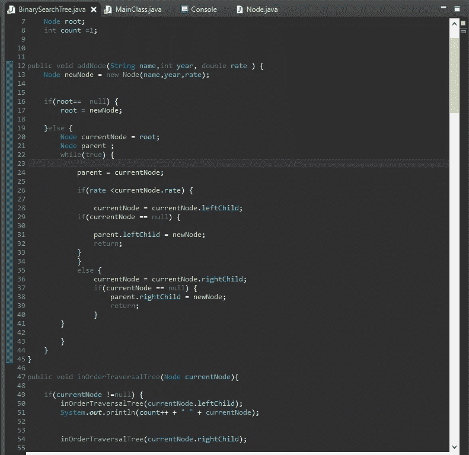
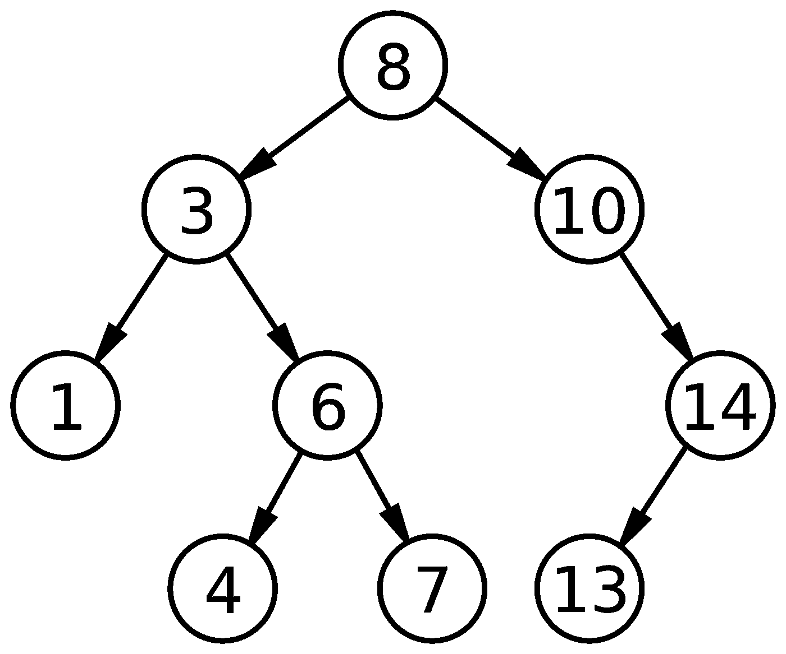
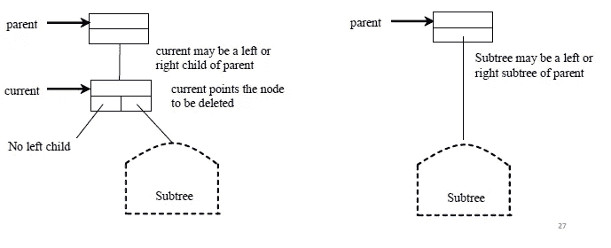
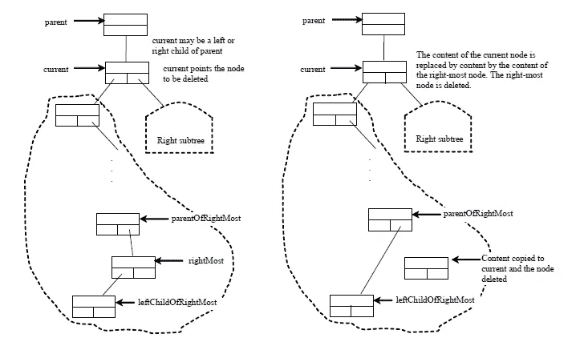

# 二叉查找树

> 原文：<https://blog.devgenius.io/binary-search-tree-3691726e8474?source=collection_archive---------0----------------------->

什么是二叉查找树？

我的一些代码 img 1

二叉查找树是数据结构之一。树有根，孩子的二叉树有两个孩子，因为它是一个二叉树:D，二叉查找树由节点而来。没有子节点的节点称为叶节点。

二叉查找树有两个孩子

二叉查找树由节点组成。每个节点保存树数据，左子地址和右子地址。

如何创造一个新的二叉查找树？

我们从根节点开始，将第一个数据保存在根节点中，如果新数据大于根节点，它将成为右子节点，如果新节点小于根节点，它将成为根节点的左子节点。

遍历树

4 种方法拯救所有的树

1.  Inorder 遍历:inorder 遍历是先递归访问当前节点的左子树，然后是当前节点本身，最后递归访问当前节点的右子树。
2.  前序:前序遍历是先访问当前节点，然后递归访问当前节点的左子树，最后递归访问当前节点的右子树。
3.  后序:后序遍历是先访问当前节点的左子树，再访问当前节点的右子树，最后访问当前节点本身。
4.  广度优先:广度优先遍历是逐层访问节点。首先访问根，然后从左到右访问根的所有子代，然后从左到右访问根的孙代，依此类推。

如何从二叉查找树中删除元素？

要从二叉树中删除一个元素，首先需要找到包含该元素的节点及其父节点。

让 current 指向包含二叉树中元素的节点，parent 指向当前节点的父节点。将当前节点中的元素值替换为最右节点中的元素值，将 parentOfRightMost 节点与最右节点的左子节点连接，删除最右节点，如图右所示。

有两种情况:

情况 1:当前节点没有左子节点，如图左侧所示。只需将父节点与当前节点的右子节点连接起来，如图右侧所示。

案例 1

案例 1:当前节点有一个左子节点。

让 right right 指向当前节点左子树中包含最大元素的节点，parentOfRightMost 指向最右边节点的父节点，如图左边所示。

请注意，最右边的节点不能有右子节点，但可以有左子节点。

将当前节点中的元素值替换为最右节点中的元素值，将 parentOfRightMost 节点与最右节点的左子节点连接，删除最右节点，如图右所示。

案例 2

二叉查找树时间复杂度

很明显，顺序、前顺序和后顺序的时间复杂度是 O(n ),因为每个节点只被遍历一次。

搜索、插入和删除的时间复杂度是树的高度。

在最坏的情况下，树的高度是 O(n)。

这是我的一些代码