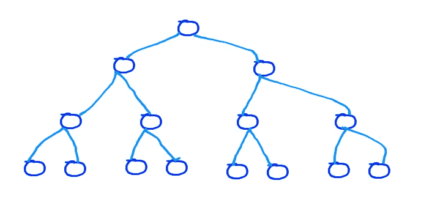
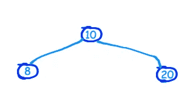

# 围棋中的二叉查找树遍历(按序、前序和后序)

> 原文：<https://blog.devgenius.io/binary-search-tree-traversal-in-order-pre-order-and-post-order-in-go-8bec81a7abd6?source=collection_archive---------5----------------------->

二叉树是一种数据结构，其中每个节点最多有两个子节点。下面是一个样本二叉树。最顶层的节点是根节点。

底部所有没有附加任何子节点的节点称为叶节点。



简单的二叉树

如果一棵二叉树的高度为 *h* ，那么可以有最多*个 2⁽ ʰ⁺ ⁾-1* 个节点。设 *n* 为节点数。然后:
=>*n =2⁽ʰ⁺⁾-1*
=>*n+1 =2⁽ʰ⁺⁾*
=>*log₂(n+1)=log₂(2⁽ʰ⁺⁾)*
=>*log₂(n+1)*=*(h+1)log₂2*
=>*log₂(n+1)-1*= h 或*h = log₂(n+1)-1*

*根节点位于第 0 层。在每个级别上可以有最大的 *2ˡ* 节点，其中 *l* 是级别。*

*数学够了！现在让我解释一下二叉查找树。二叉查找树是一种特殊的数据结构，左侧子节点中的数据小于其父节点，右侧子节点中的数据大于其父节点。下面是一个二叉查找树的例子:*

**

*这是一个简单的二叉查找树*

*在 Go 中，我们可以这样定义节点:*

```
*type Node struct{
 Data int
 Left *Node
 Right *Node
}*
```

*正如我们所知, *struct* 是一种聚合数据类型，它在一个保护伞下包含任何数据类型的值。这些值被称为*字段*。
在我们的例子中，有三个字段属于`Node`结构，即`Data`用于保存整数数据，`Left`指向左子节点，`Right`指向右子节点。*

*我的二叉查找树结构看起来更简单。大概是这样的:*

```
*type BinSearchTree struct{
 root *Node
}*
```

*`root`节点指向二叉查找树的第一个节点或*根*节点。让我们来看看插入逻辑。*

```
*func (t *BinSearchTree) Insert(data int){
  newNode := Node{data, nil, nil} if t.root == nil {
    t.root = &newNode
    return
  } iter, prev := t.root, t.root for iter != nil {
    prev = iter
    if data < iter.Data {
      iter = iter.Left
    } else {
      iter = iter.Right
    }
  } if data < prev.Data {
    prev.Left = &newNode
  } else {
    prev.Right = &newNode
  }
}*
```

*第一行`func (t *BinSearchTree) Insert(data int)`告诉我们函数`Insert`与`struct BinSearchTree`相关联。就 Go 而言，我们称这些函数为*方法*。`(t *BinSearchTree)`是一个*接收器*，它告诉我们`Insert`只能被`BinSearchTree`类型的文字调用。*

*正如你可能已经注意到的，我没有使用*递归*将数据插入合适的节点，而是使用`for`循环找到合适的位置来插入节点。*

*`newNode := Node{data, nil, nil}`创建一个新节点，其中`newNode.Data`是`data` , `newNode.Left`是`nil`,`newNode.Right`是`nil`。*

*开始时`root`节点将为*零*。因此对第一个节点的引用被分配给`root`，如下所示:*

```
*if t.root == nil {
  t.root = &newNode
  return
}*
```

*在继续前进之前，对`Insert`的后续调用将检查这个`if`条件(并且将被评估为假)。要插入另一个节点，我们需要检查数据是小于还是大于根节点。如果数据小于根节点，那么我们需要向左移动，否则向右移动，这应该反复检查，直到我们找到正确的位置，如下所示。*

```
*iter, prev := t.root, t.rootfor iter != nil {
    prev = iter
    if data < iter.Data {
      iter = iter.Left
    } else {
      iter = iter.Right
    }
}*
```

*一旦我们找到合适的位置，我们插入元素:*

```
*if data < prev.Data {
    prev.Left = &newNode
} else {
    prev.Right = &newNode
}*
```

*如果我们不能遍历树，那么创建树又有什么意义呢？二叉查找树可以按顺序、前序和后序方式遍历。*

*在*有序*遍历中，我们遍历左边的子节点，然后是父节点，然后是右边的子节点。
在*前序*遍历中，我们遍历父节点，然后是左子节点，然后是右子节点。
在*后序*遍历中，我们先遍历左侧子节点，然后是右侧子节点，最后是父节点。*

*用于*按顺序*遍历的方法看起来是这样的:*

```
*func (t *BinSearchTree) InOrder(node *Node){
 if node == nil {
  return
 }
 t.InOrder(node.Left)
 fmt.Println(node.Data)
 t.InOrder(node.Right)
}*
```

*正如您已经注意到的用于遍历二叉查找树的递归技术。完整的源代码可以在这里找到[https://gist . github . com/sandeep-sarkar/07 e 47 cdae 0 c 63 f 14 b 695370536 b 434 ab](https://gist.github.com/sandeep-sarkar/07e47cdae0c63f14b695370536b434ab)*

*我希望你喜欢阅读这篇文章。请通过评论分享您的反馈。*