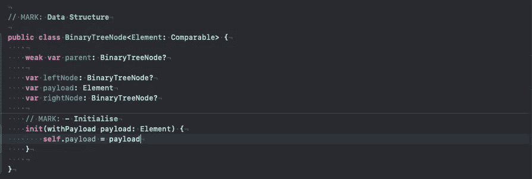
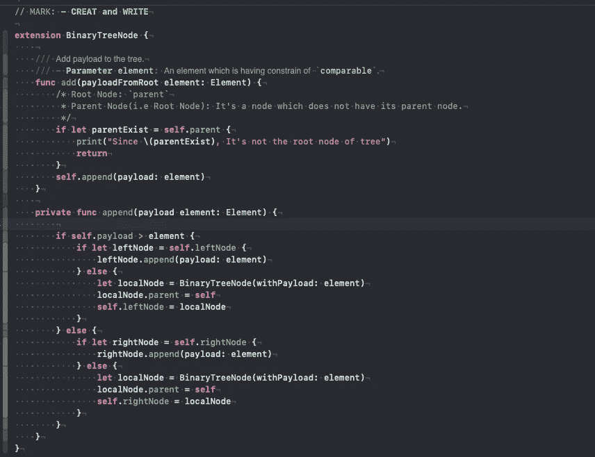
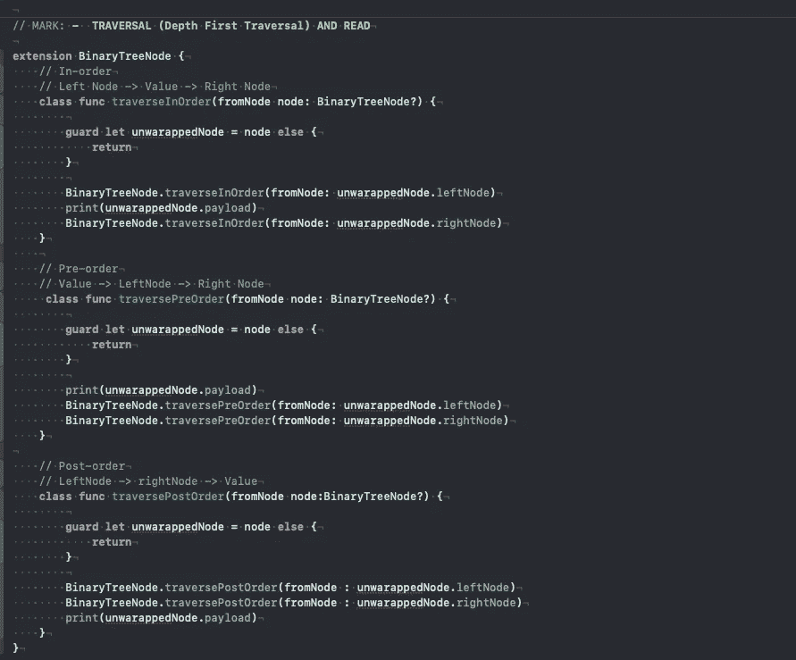
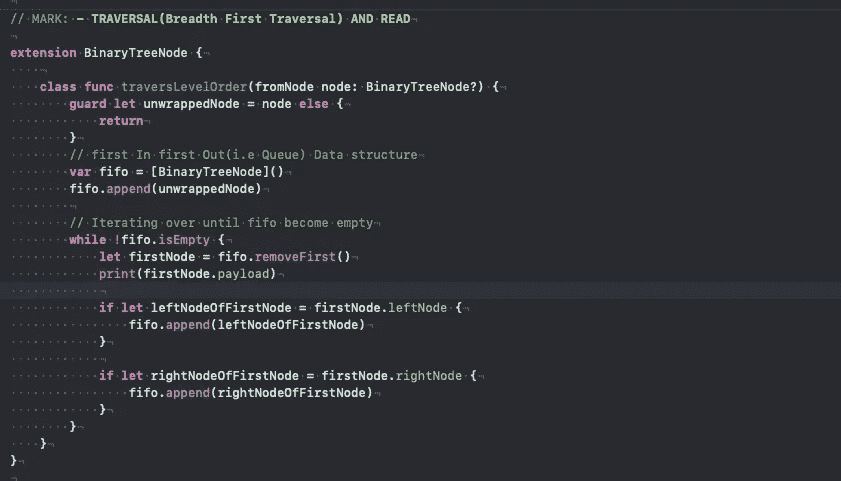
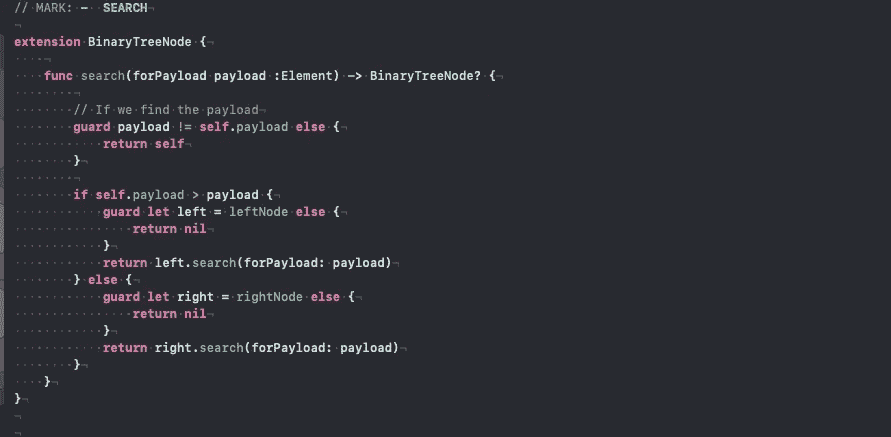
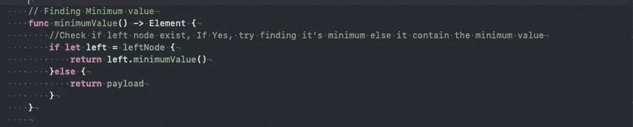
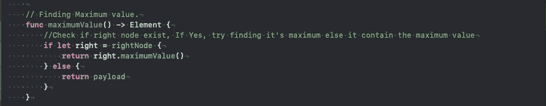
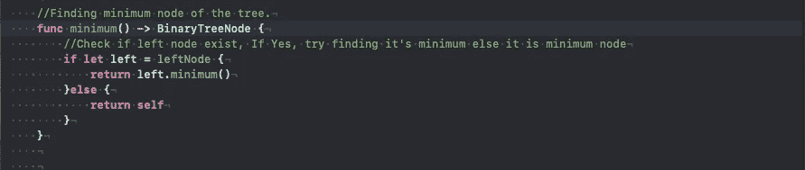
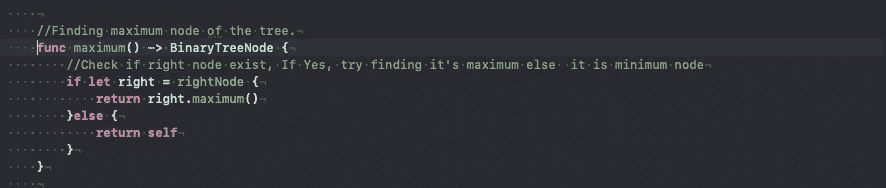
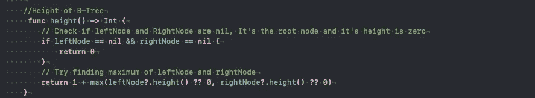

# 二叉树

> 原文：<https://blog.devgenius.io/binary-tree-78f880b199f1?source=collection_archive---------4----------------------->

[在计算机科学中，**二叉树**是一种树形数据结构，其中每个节点最多有两个子节点，分别称为*左子节点*和*右子节点*。](https://en.wikipedia.org/wiki/Binary_tree)

**定义的结构**。
我们在这里创建一个二叉树节点，它是比
**父节点**更通用的节点:它将检查它是否是一个根节点。
**LeftNode** :与其父节点左侧对齐的节点。
**RightNode** :与其父节点右侧对齐的节点。

二叉树

**写**:根据输入元素添加新节点。如果它大于当前有效载荷，它将被附加在当前节点的左边或右边。

创作和写作

**阅读:**遍历有两种方式。
**1。深度优先遍历:**
a .顺序:左节点— — —(值)———右节点
b .前序:(值)———左节点——右节点
c .后序:左节点———右节点——(值)

深度优先遍历

**2。广度优先遍历**和
a .级别顺序

广度优先遍历

**搜索:**在 B 树中搜索一个元素。

搜索

**删除:** 我们稍后会谈到删除操作，因为删除需要某种 B 树的重排。(希望在下一篇文章中)

**一些常见问题。**
在 B 树中寻找最小值:
最小值是 B 树中最左边节点的值。

最小值

在 B 树中寻找最大值:
最大值是 B 树中最右边节点的值。

最小值

在 B 树中寻找最小节点:
最小节点是指将位于 B 树最左边节点的节点。

最小节点。

在 B 树中寻找最大节点:
最大节点是将在 B 树中最右边节点的节点。

最大节点

求 B 树的高度:
二叉树的高度。

树的高度

对于源代码:
[https://gist . github . com/roshankumar 350/8d 9 CBC 490391 b 11 AFA 042 af 3105 b 9600](https://gist.github.com/Roshankumar350/8d9cbc490391b11afa042af3105b9600)

继续读..
继续阅读..如果您有任何疑问、建议和反馈，请联系我。
Roshankumar350@gmail.com