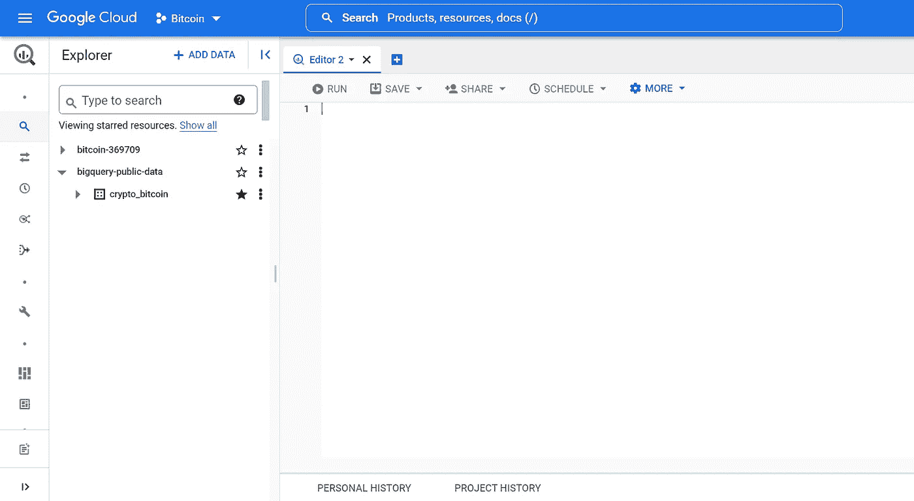

# 比特币:如何在 BigQuery 中查询收发地址

> 原文：<https://blog.devgenius.io/bitcoin-how-to-query-for-sending-and-receiving-addresses-in-bigquery-3d930cb64dc3?source=collection_archive---------12----------------------->

继[上一篇文章](https://medium.com/@vivbellavita/query-bitcoin-blockchain-for-active-addresses-in-bigquery-be440f362dd9)之后，我们将探讨如何使用 BigQuery 在比特币区块链上查询收发地址。通过本文，您将更好地了解如何使用 BigQuery 分析比特币交易数据，并深入了解可用于各种目的的发送和接收地址活动，包括投资分析和欺诈检测。

发送地址计数是指作为资金发送方处于活动状态的唯一地址的数量。只有在成功的非零传输中作为发件人处于活动状态的地址才被计算在内。

接收地址计数是指作为资金接收方处于活动状态的唯一地址的数量。只有在成功的非零传输中作为接收方活动的地址才被计算在内。


比特币发送和接收

# 第一步

转到 BigQuery 上的**编辑器**字段。



# 第二步

在**编辑器**字段中，复制以下发送地址的查询。

该查询计算每天比特币交易中使用的唯一发送地址的数量。

首先，我们创建一个公共表表达式(CTE) `sending_addresses`，它为来自`bigquery-public-data.crypto_bitcoin.inputs`的每笔比特币交易选择日期和输入地址。

接下来，我们创建一个 CTE `sending_addresses_grouped_by_date`，它按日期对来自`sending_addresses`的结果进行分组，并计算每个日期的唯一发送地址的数量。

```
WITH sending_addresses AS (
   -- input addresses
   SELECT DATE(block_timestamp) AS date,
    array_to_string(inputs.addresses, ",") as address FROM `bigquery-public-data.crypto_bitcoin.inputs` as inputs
    WHERE DATE(block_timestamp) > "2009-01-01" AND DATE(block_timestamp) <= DATE_SUB(CURRENT_DATE(), INTERVAL 1 DAY)
),

sending_addresses_grouped_by_date as (
  SELECT date, COUNT(DISTINCT address) as sending_addresses_count
  FROM sending_addresses
  GROUP BY date
  ORDER BY date
 )

SELECT date, sending_addresses_count FROM sending_addresses_grouped_by_date
```

# 第三步

在**编辑器**字段中，复制以下接收地址的查询。

该查询计算每天比特币交易中使用的唯一接收地址的数量。

在这个查询中，区块链的数据是从`bigquery-public-data.crypto_bitcoin.outputs`获得的。此表包含有关比特币交易输出的信息。

```
WITH receiving_addresses AS (
  -- credits
   SELECT DATE(block_timestamp) AS date,
    array_to_string(outputs.addresses, ",") as address FROM `bigquery-public-data.crypto_bitcoin.outputs` as outputs
   WHERE date > "2015-01-01" AND date <= DATE_SUB(CURRENT_DATE(), INTERVAL 1 DAY)
),

receiving_addresses_grouped_by_date as (
  SELECT date, COUNT(DISTINCT address) as receiving_addresses_count
  FROM receiving_addresses
  GROUP BY date
  ORDER BY date
 )

SELECT date, receiving_addresses_count FROM receiving_addresses_grouped_by_date
```

你可以参考 BigQuery 中的[查询比特币区块链活动地址，了解这段源代码中用到的函数的解释。](https://medium.com/@vivbellavita/query-bitcoin-blockchain-for-active-addresses-in-bigquery-be440f362dd9)

# 最后的想法

这里显示的查询提供了每天比特币交易中使用的唯一发送和接收地址的数量信息。这种分析让我们能够深入了解比特币网络上的资金流动。我们还能够跟踪比特币的增长和采用，以及分析网络上的交易活动。总的来说，对于任何有兴趣了解比特币网络的人来说，这是一个无价的资源。

**也读作:**

*   [使用 BigQuery 查询比特币余额指南](https://medium.com/coinmonks/guide-to-query-bitcoin-balances-using-bigquery-a4b52ec2466a)
*   [持有比特币的储备证明——如何在 BigQuery 中计算](https://medium.com/coinmonks/proof-of-reserves-for-bitcoin-holdings-how-to-compute-in-bigquery-6f6c5bc8648d)
*   [使用 BigQuery 访问比特币块数据的简单方法](/an-easy-way-to-access-bitcoin-block-data-using-bigquery-2f5d9be6ae63)

***感谢阅读！***

*如果您喜欢这篇文章并想了解更多，请考虑关注我。我定期发布与链上分析、机器学习和 BigQuery 相关的主题。我尽量让我的文章简单而精确，尽可能提供代码、例子和模拟。*