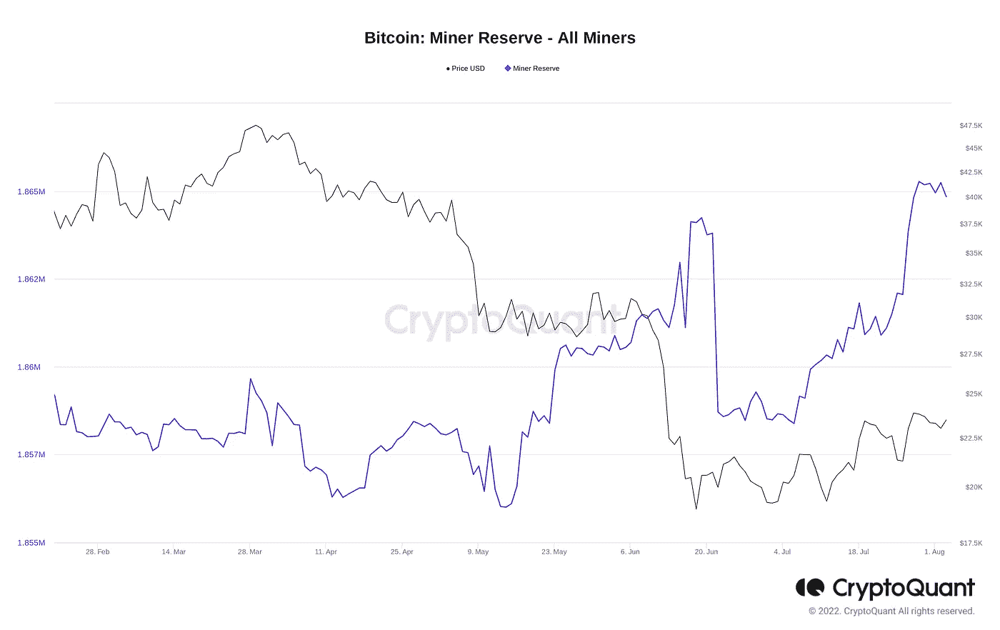
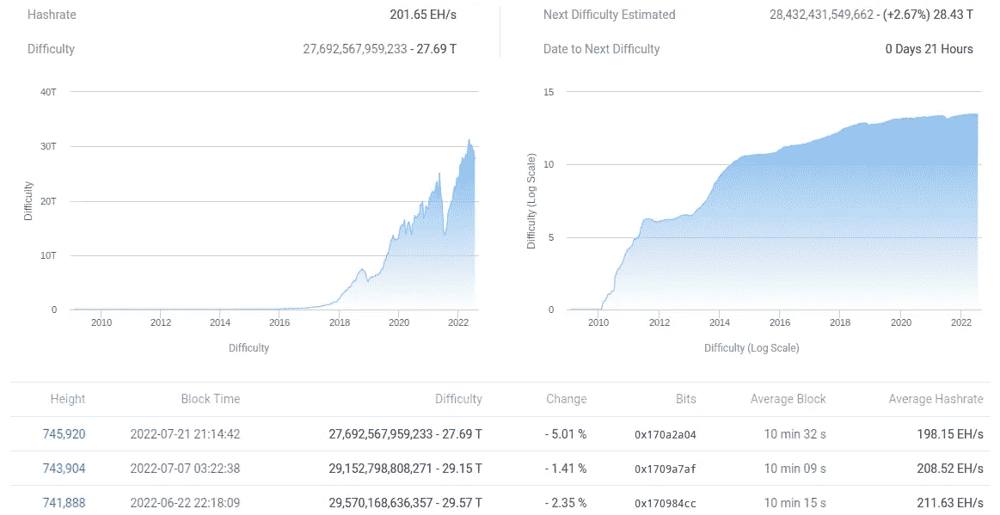
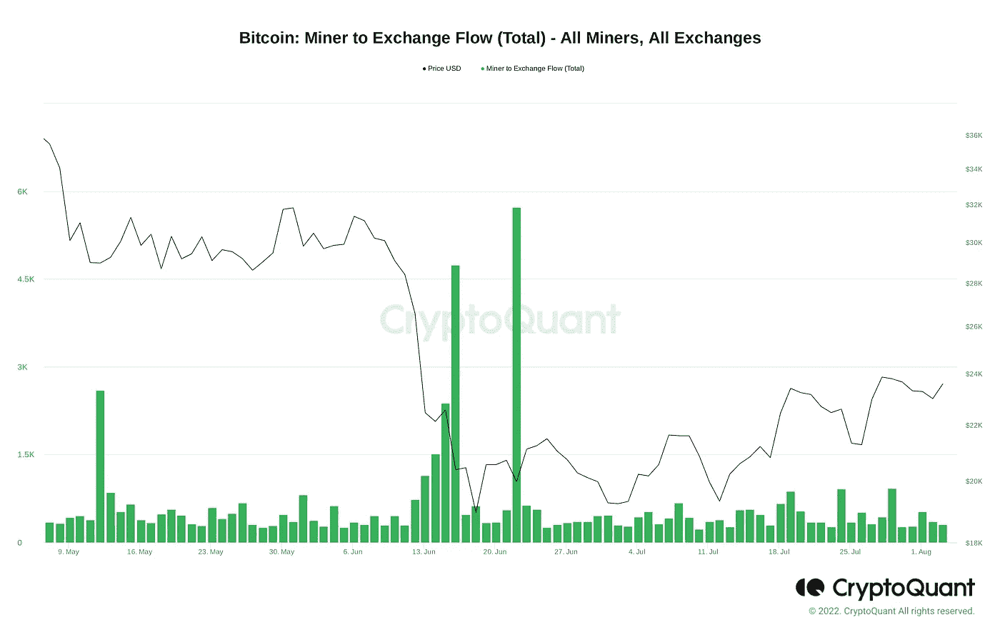

# 比特币矿工拥有 185.6 万个比特币，创 2 年新高

> 原文：<https://blog.devgenius.io/bitcoin-miners-have-1-856-million-bitcoin-a-2-year-high-257e47227fe?source=collection_archive---------15----------------------->

## 随着 6 月份最糟糕的投降阶段似乎已经过去，矿商们开始从卖家转向卖家。

照片由 [Unsplash](https://unsplash.com/photos/ErewpTR4gl0) 上的 GuerrillaBuzz Crypto PR 拍摄

随着最近波动的影响消退，比特币(BTC)矿工目前拥有的 BTC 比 2020 年以来的任何时候都多。

CryptoQuant 的链上分析服务发现，矿业公司的 BTC 持有量在 7 月份大幅上升。

矿工钱包中的比特币数量升至多年来的新高，这是他们正从最近的市场低迷中复苏的最新迹象。

正如 CryptoQuant 分析师兼撰稿人 Jan Wuestenfeld 之前所指出的，截至 7 月 29 日，他们的总余额为 1，865，272 BTC。截至 8 月 3 日，总数为 1，864，842 BTC，比本月初略有减少。

在 7 月 6 日储备的当地低点和 7 月 29 日的高点之间，矿工钱包中的余额上升了 0.37%，或 6，885 BTC。

***来源(截图):CryptoQuant***

随着 BTC/美元跌至 2020 年 12 月以来的最低水平，矿工们开始战斗，然后从 17，600 美元的底部反弹了约 38%。

网络的基本面使他们的问题相当明显，散列率和难度都降低，以反映矿工活动的下降。

Cointelegraph 透露，这一困难将在本周出现数月来的首次上升，但 Wuestenfeld 指出，杂凑率尚未明显回升。

***来源(截图):BTC.com***

## 交易所每天卖出不到 1000 BTC

其他措施也表明，矿工在隧道的尽头还有希望。根据上周发布的数据，如果价格继续稳步走高，矿商们经历的“投降”期可能最早于 8 月结束。

根据前一周的数据，如果价格继续稳步走高，矿商的“投降”阶段可能最早于 8 月结束。

根据 CryptoQuant 的数据，自 6 月份的事件以来，矿工们每天最多只向交易所传输了 927 BTC。

***来源(截图):CryptoQuant***

8 月 2 日(有数据可查的最近一个全天)，矿工兑换钱包的资金总额仅为 359 BTC。