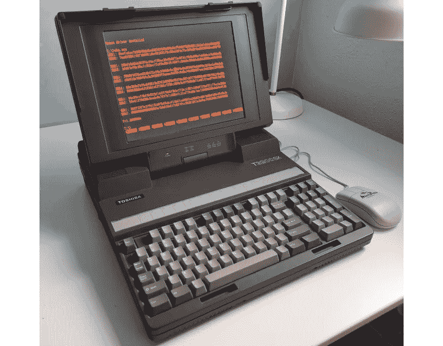
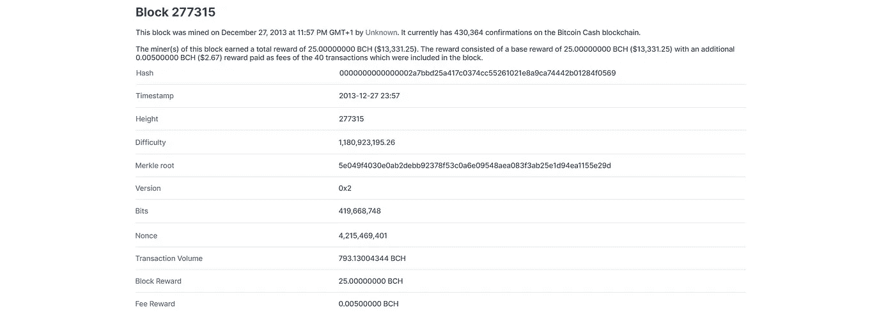
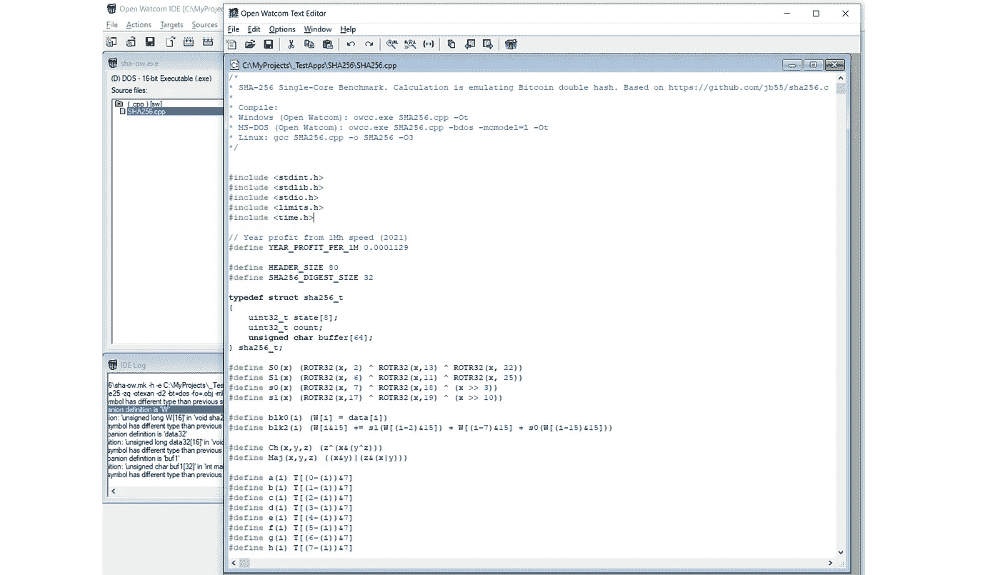
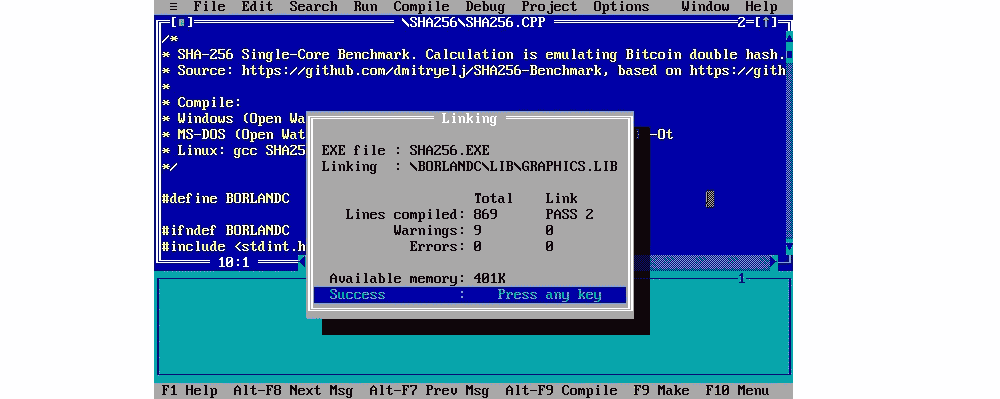
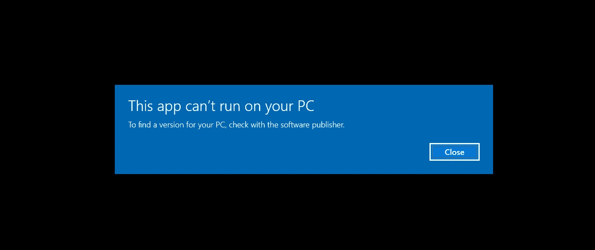
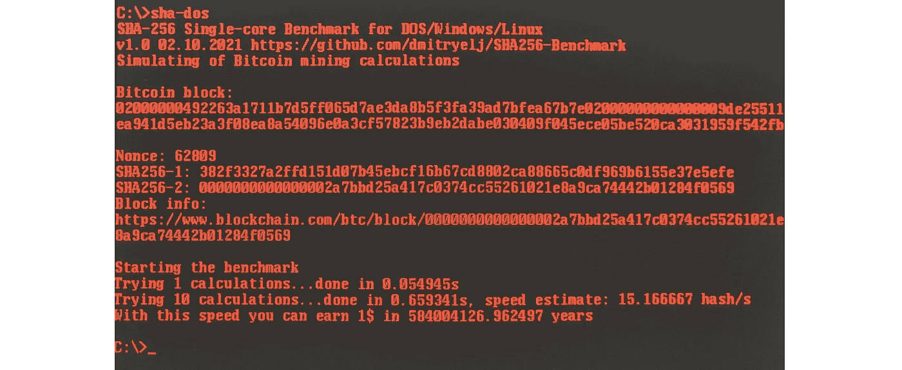
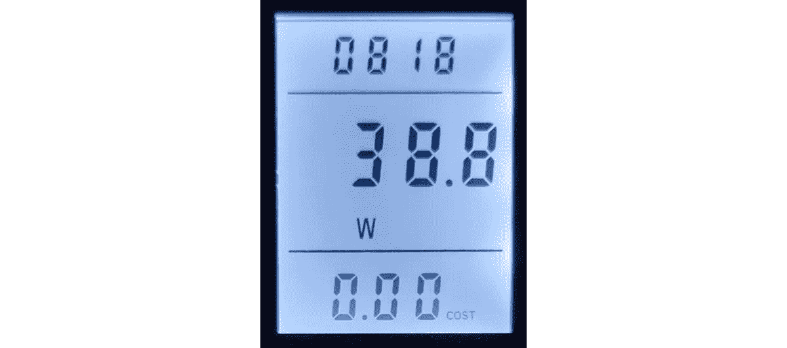
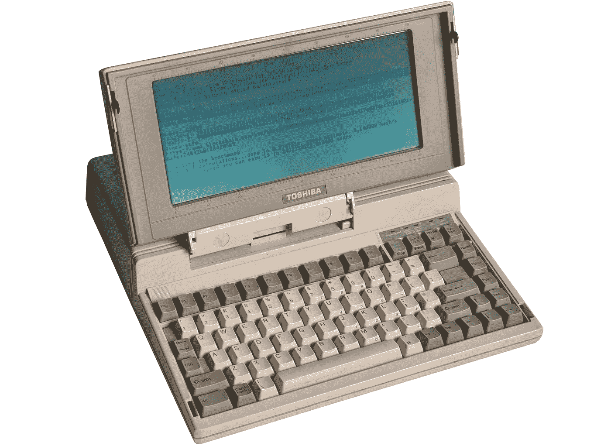

# 使用 MS-DOS 笔记本电脑进行比特币挖掘

> 原文：<https://blog.devgenius.io/bitcoin-mining-using-the-ms-dos-laptop-7720b884c85c?source=collection_archive---------0----------------------->

从 ASIC 或 GPU 卡到 Raspberry Pi，许多设备都可以用于比特币挖矿。为什么不试试真正有异国情调的东西呢？比如 32 年前的笔记本电脑？为什么？因为我们可以。

研究任何技术的最好方法就是去尝试。我想读者已经可以猜到，在 30 年前的 PC 上进行比特币挖矿不会让你变得富有。但这是一个很好的尝试，可以理解它在“引擎盖下”是如何工作的，也可以比较计算机的性能在这段时间内是如何增长的。

这是一台 32 岁的东芝 T3200SX 笔记本电脑，产于 1989 年，其原始成本为 6299 美元(2021 年为 13896 美元):

1989 年的东芝 T3200SX

它有一个 16 MHz 的 80386SX CPU，是当时的尖端技术。可以在上面挖掘比特币吗？我们开始想办法吧。

# 采矿是如何工作的

首先，让我们大致了解一下，比特币挖矿是如何进行的。有足够多的好文章解释细节，我只展示基本的想法。每笔比特币交易都有两个关键部分。首先是区块链的想法。每个事务包含与前一个事务组合的数据的散列数，因此如果链中的任何字节将被改变，校验和将失败。第二个组成部分——区块链中的每个新事务都应该有一个双 SHA256 哈希，该哈希与特定的“困难”条件相匹配。而这实际上是所有比特币操作的“秘密成分”——对于每一笔交易，矿工都应该找到一个合适的值(它被称为“nonce”)，这使得哈希小于一个特定的值，由系统确定。这个过程可能需要数百万次的尝试，发现并上传了正确值的矿工群体获得奖励。

让我们考虑一个实际的例子。比特币块头有几个参数:

*   版本号:02
*   前一个块的哈希:000000000 000000002 7e 7 ba 6 Fe 7 bad 39 fa F3 b5 a83d aed 765 f 0 5f 7 D1 b 71 a 1632249
*   Merkle root(块中所有事务的哈希):5e 049 f 40 30 E0 ab 2d ebb 92378 f 53 c0a 6 e 09548 AEA 083 F3 ab 2 5e 1d 94 ea 1155 e 29d
*   时间戳:52be05ce (1388185038 Unix 时间，或 2013 年 12 月 27 日 22:57:18)
*   难度位:1903a30c
*   nonce——这个参数实际上是挖掘者需要找到的。

矿工们究竟在做什么？首先，难度位决定了符合难度标准的最小散列。对于我们的值 1903a30c，哈希阈值将是 000000000000003 a30c 000000000000000000000000000000000000000000。矿工正试图改变“nonce”参数，直到数据块的 double SHA256 值小于该标准。

为了说明这个想法，我将使用 Python，因为它允许以非常紧凑的方式编写代码。“nonce”变量位于数据块的最后 4 个字节(“01000000”、“02000000”等):

这是人们为之支付数千美元的过程吗？很容易看出，第一个散列值比系统要求的“0000000000000000003 a30…”值大得多。矿工只能改变“nonce”变量，并且只有在 4215469400 (0xfb42f558)次尝试后，我们才能获得正确的哈希:“000000000000002 a7 bbd 25 a 417 c 0374 cc 552610 21e 8 a9 ca 74442 b 01 284 f 0569”。这个哈希对这个数据块有效，矿工会得到一些比特币和一笔交易费奖励。这个交易实际上是真实的，因为所有交易都存储在一个区块链中，所以很容易看到[交易细节](https://www.blockchain.com/bch/block/0000000000000002a7bbd25a417c0374cc55261021e8a9ca74442b01284f0569):

正如我们所看到的，找到的哈希值“00000000000002a7bb…f0569”实际上被指定为事务 id。难度一直在增加，哈希 id 不能重复。顺便说一下，奖励是在矿工之间分摊的，所以最终的金额不会像截图上显示的那么大。

现在我们可以理解为什么比特币的计算速度是以每秒的哈希数来衡量的了——这个参数对于寻找和上传合适的数据块至关重要。让我们试着在 MS-DOS 机上做。

# 编码

显然没有 MS-DOS 的比特币挖矿软件。但它仍然很有趣，首先是为了好玩，其次是作为一个比较不同机器计算速度的很好的基准——比特币挖矿近年来变得很流行，几乎每个平台都很容易找到基准。

计算的关键部分是 SHA256 算法。我尝试了几种 C 实现，但其中一些在 16 位平台上无法正常工作——16 位和 32 位 C 编译器上的变量大小不同，代码中的一些基于位的算法可能会被破坏。最后，我创建了自己的代码，可以从 [GitHub 页面](https://github.com/dmitryelj/SHA256-Benchmark/releases)下载。

有两种方法可以为 MS-DOS 编译 C++项目。我们可以在 Windows 上使用免费的 [Open Watcom](https://github.com/open-watcom/open-watcom-v2/releases) 编译器来实现:

第二种，也是更“本土”的方式，是使用 MS-DOS 编译器来编译项目，比如 Borland C++:

可以使用 DOSBox 模拟器完成，编译后的文件可以使用 CF 卡或串口电缆传输到 DOS 机器上。显然，如果没有像 DOSBox 这样的模拟器，我们就无法在现代的 Windows PC 上运行 MS-DOS 应用程序，我们会得到一条错误消息:

但是 C++代码可以在任何地方编译，所以标准的 Visual C++或任何其他 IDE 都可以很容易地用于调试。

# 结果

最后，我们来看看它是如何工作的。我在笔记本电脑上运行编译后的应用程序，得到了以下结果:

最终判决是什么？可以在 MS-DOS 机上运行比特币计算吗？从技术上来说，80386 CPU 可以以每秒 15 个双散列的“不可思议”速度计算 SHA256 个散列。而且说不定连 8086 或者 Z80 都能做到这一点。我们可以用这台笔记本电脑参与任何加密货币挖掘池吗？理论上，如果在这台笔记本电脑上配置以太网卡和 IP 地址，这是可能的，但对于 MS-DOS 来说，这并不容易。这样做有实际的理由吗？好吧，仅仅过了 5.84 亿年，你就可以得到 1 美元，如果有些历史学家还记得“笔记本电脑”、“比特币”和“1 美元”这些词的意思，这可能会很有趣，而且思考我们人类在这段时间里将如何进化和发展肯定很有趣。

最后但同样重要的是，功耗呢？令人惊讶的是，它并没有那么大:

它肯定比 Raspberry Pi 4 好得多(顺便说一下，它的哈希/秒性能约为 200K)，但无论如何，它都低于我对一台 7.9 千克、配有气体等离子屏幕的机器的预期。

作为对读者的小小奖励，我在 1986 年发布的老式笔记本电脑东芝 T1100 Plus 上测试了相同的代码:

T1100 Plus 型号有一个 7.1MHz 的 8086 CPU，计算速度明显较慢——我只获得了 3.6 hash/s 的性能，比相同代码上的 80386SX 慢 4 倍左右。

无论如何，测试 MS-DOS 笔记本电脑的性能并与现代笔记本电脑进行比较是很有趣的。关于东芝 T3200SX 的更多信息可以在[另一篇文章](https://medium.com/geekculture/the-luggable-laptop-how-does-it-look-today-part-ii-toshiba-t3200-from-1989-6d15ce56eadd)中找到。那些想在自己的硬件上做同样测试的人可以从 GitHub 下载一个基准[。](https://github.com/dmitryelj/SHA256-Benchmark/releases)

感谢阅读。