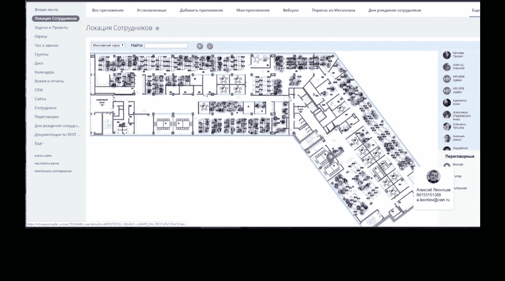
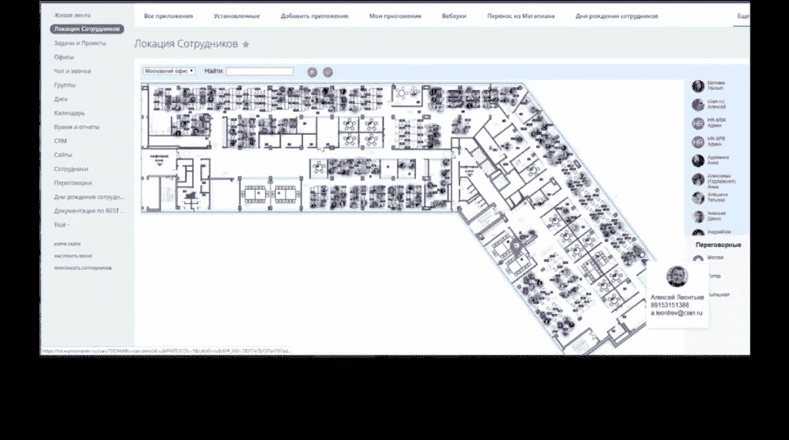
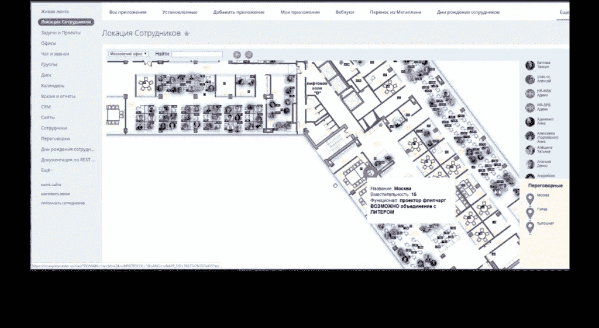
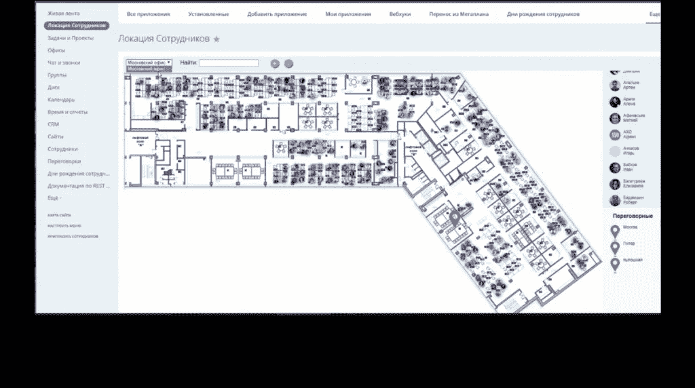
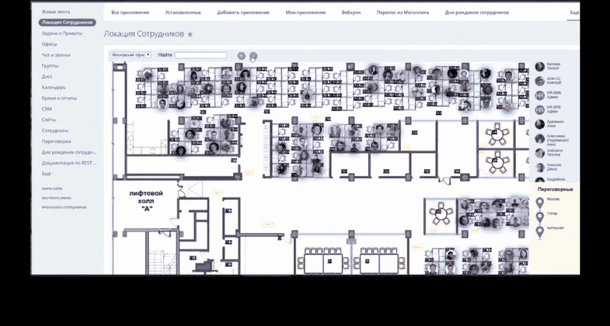

# Bitrix24 和 Office Mapping

> 原文：<https://blog.devgenius.io/bitrix24-and-office-mapping-1b07259359ca?source=collection_archive---------6----------------------->

在所有生物中，人类是最难控制和组织的。这种困难尤其存在，因为每个人都拥有意志，能够主动决定自己的行动和反应。因此，根据您的业务政策控制/监督成年员工的意愿可能会很有挑战性。当你有几个，或者说几百个员工要管理时，会发生什么呢？

控制员工的要求如此之高，以至于大多数组织都为此专门成立了一个人力资源团队。但是，即使是人力资源团队(由其他员工组成)在管理组织内的人员时也会遇到障碍。

幸运的是，你可以利用你的[bitrix 24](https://it-sputnik.pro/)CRM——除了你的人力资源部门之外，并且不需要再发生成本——来改善员工管理。此功能将整个办公室/工作区的地图与每个员工的位置同步，如果您与大量人员一起工作，此功能尤其有用。

对于这种集成，我们使用 JavaScript 应用程序来更新 REST API 的标准 Bitrix24 特性，以便您可以随时了解每个员工的详细信息和座位位置。如果您的办公室很大，并且有成百上千的员工，此功能将在以下方面为您的企业带来好处:

# 轻松找到每个员工

在商业中，时间就是金钱，每损失一秒钟就相当于损失了金钱和资源。每当需要某个特定员工的服务时，没有必要在找到他们之前经历打开十几扇门的麻烦。CRM 中的办公室地图将帮助您毫无压力地找到他们。

# 流畅的工作流程

当您能够使用集成了 CRM 的办公地图来节省时间时，您的业务项目和任务可以顺利进行，不会出现不必要的中断。当需要员工输入时，没有必要暂停任务，因为您可以很容易地找到他们。

# 游客参与度

当有客人、客户或顾问来访时，这种实时员工定位系统非常方便。这有助于他们轻松找到您的员工或办公室，并及时完成交易。本质上，你节省了他们的时间，改善了他们对你的业务的体验。

# 提高效率和生产力

当您的员工不必花费一半的工作时间去寻找一个或另一个办公室时，您的业务生产率就会提高。当参与您日常项目的每个人都能毫不费力地相互联系时，您就提高了每个人的效率，也提高了您的业务成果。

以下是我们在 Bitrix24 上的地图集成:

管理员可以在办公室的特定职位上安排或删除员工。

因此，团队的其他成员可以通过搜索他们的姓名或照片来轻松找到他们的同事。

用户还可以放大和缩小地图以获得更好的视图。

想要更多吗？

[联系我们](https://it-sputnik.pro/new/contacts/)了解其他 Bitrix24 集成。

[今天联系我们](https://it-sputnik.pro/new/contacts)！

邮箱:[导演@it-sputnik.pro](mailto:director@it-sputnik.pro)

网址: [www.it-sputnik.pro](http://www.it-sputnik.pro/)

www.facebook.com/Itsputnik.bitrix24 页面:[脸书](https://www.facebook.com/Itsputnik.bitrix24)

YouTube 频道:[www.youtube.com/channel/UCXf8483CbMOiB2RT0uld2iA](https://www.youtube.com/channel/UCXf8483CbMOiB2RT0uld2iA)

领英简介:[https://www.linkedin.com/company/69762422/](https://www.linkedin.com/company/69762422/admin/)